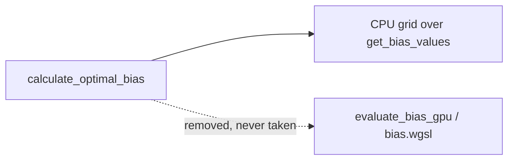

# PR Summary — Issue #2316: remove the unreachable GPU bias grid search

## Summary

Closes #2316

Every `calculate_optimal_bias` caller passed `analyzer: None`, so the GPU bias
grid search could never run, yet `GpuAnalyzer::new` still compiled its shader
and built its pipeline on every construction. Following the Dead Levers rule,
this PR deletes the component and every surface it had:

- `src/analysis/gpu/bias_evaluation.rs` (`evaluate_bias_gpu`, `build_bias_pipeline`)
- `src/shaders/bias.wgsl`, `BIAS_SHADER` and its `ALL_SHADERS` entry
- the `bias_layout` / `bias_pipeline` fields of `GpuAnalyzer` and their build
- `BIAS_BINDINGS` in `pipeline_builder.rs`
- the `BiasResult` / `BiasUniforms` GPU structs, which only that path used
- `get_bias_range` (read only by the GPU path) and its unit test
- the dead `analyzer: Option<&GpuAnalyzer>` parameter of
  `calculate_optimal_bias`, removed at all 18 call sites

The CPU grid search is unchanged, so candidate output does not change. The
version goes from 0.74.265 to 0.74.266.

## Evidence

- A repo-wide grep for `bias_layout`, `bias_pipeline`, `BIAS_SHADER`,
  `BIAS_BINDINGS`, `build_bias_pipeline`, `evaluate_bias_gpu`, `get_bias_range`,
  `bias_evaluation`, `BiasResult` and `BiasUniforms` now returns no live hits.
  The only matches left are historical: `CHANGELOG.md`, `docs/archive/`, and a
  bug note in `tests/gpu/gpu_activation_shaders.rs`, which now records the
  removal.
- The issue named `tests/issue_2289_gpu_struct_layout.rs`,
  `tests/issue_2112_gpu_dispatch_bounds.rs` and
  `docs/audits/security-sweep-chunk-9-gpu-wgsl.md` as pinned surfaces. None of
  them exists on `Develop`, so there were no pins to update.
- `cargo clippy --all-targets --all-features -- -D warnings` is clean.

## Test Plan

- [x] `cargo clippy --all-targets --all-features -- -D warnings`
- [x] `cargo test --lib`
- [x] `./quality.sh`
