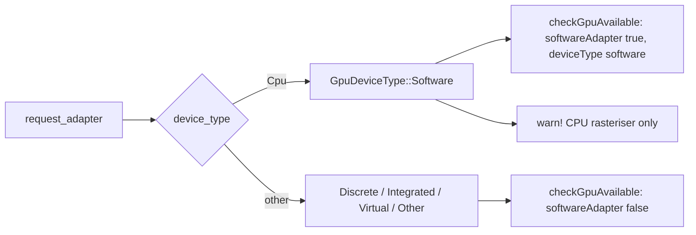

## Summary

A software (CPU) wgpu adapter — Mesa lavapipe/llvmpipe, `wgpu::DeviceType::Cpu`
— passed the Issue #1419 GPU capability gate as a plain `gpuAvailable: true`,
and its device type was dropped at the FFI boundary, so the host had no typed
way to tell a CPU rasteriser from real GPU hardware. Closes #2318.

- `GpuDeviceType` now serialises (lowercase: `discrete`, `integrated`,
  `software`, `virtual`, `other`) and gains the pure classification helper
  `is_software()`.
- `check_gpu_availability` records the probed adapter's type in
  `GpuAvailabilityResult::device_type`; `checkGpuAvailable` now answers
  `deviceType` and `softwareAdapter` on every `gpuAvailable: true` verdict
  (both keys absent otherwise).
- `gpuInfo` on analysis responses (`GpuAdapterInfoJson`) now carries
  `deviceType`.
- `log_gpu_info_once` raises a `warn!` when the only adapter is a CPU
  rasteriser.
- `docs/FFI_API.md` documents the new fields and tells controllers to gate on
  `softwareAdapter` when they need real GPU hardware.
- Version bumped to `0.74.271`.

**Policy chosen: surface and warn, not reject.** Rejecting CPU adapters would
silently remove discovery from hosts and CI runners that rely on lavapipe, and
would need a new opt-in env var. Carrying the typed classification lets the
host decide before a pass, as the issue's suggested fix offers. No new
configuration surface was added.

## Evidence

Backend / FFI change only — no UI to screenshot. Verified by the regression
tests below and a clean `./quality.sh` run.

### Security-fix evidence

- **Regression test:** added
  `tests/issue_2318_software_adapter_classification.rs::software_cpu_adapter_is_classified_as_software`,
  which reproduces the flaw. It fails against the unfixed code, where
  `GpuDeviceType` has no `is_software()` classification and `GpuAdapterInfoJson`
  has no `device_type` field, so the test does not compile. It passes after
  the fix. Companion tests in the same file:
  `hardware_adapters_are_not_classified_as_software` and
  `gpu_info_json_carries_device_type`.
- **FFI verdict test:**
  `src/ffi_internal/gpu.rs::software_adapter_verdict_is_classified` asserts
  that a `DeviceType::Cpu` probe result reaches the JSON verdict as
  `"softwareAdapter": true` and `"deviceType": "software"`, and that a
  discrete GPU reports `false`.
- **Original trigger closed:** on a lavapipe-only host, `check_gpu_available()`
  can no longer return an unclassified `gpuAvailable: true`. The only branch
  of `build_check_gpu_output` that sets `gpuAvailable: true` also sets
  `deviceType`/`softwareAdapter` from `GpuAvailabilityResult::device_type`.
  The only producer of an available result, `check_gpu_availability`, fills
  that field from the probed adapter's own `get_info().device_type`. It is not
  derived from the free-text name, so no adapter name or configuration can
  mask a CPU adapter. `gpuInfo.deviceType` is copied straight from the same
  `wgpu::DeviceType`, and the operator log is a `warn!`.

## Test Plan

- Added `tests/issue_2318_software_adapter_classification.rs`:
  - `software_cpu_adapter_is_classified_as_software`
  - `hardware_adapters_are_not_classified_as_software`
  - `gpu_info_json_carries_device_type`
- Added unit tests:
  - `src/analysis/shared/gpu_info.rs`: `cpu_device_type_is_software`,
    `non_cpu_device_types_are_not_software`, `software_serialises_lowercase`
  - `src/ffi_types/responses/gpu.rs`:
    `software_adapter_serialises_device_type_lowercase`
  - `src/ffi_internal/gpu.rs`: `software_adapter_verdict_is_classified`
- Updated `available_gpu_yields_clean_success` to assert
  `softwareAdapter: false` for a discrete GPU.
- Added the new fields to the existing `CheckGpuOutput` literals in
  `tests/infrastructure/issue_874_module_split_backward_compat.rs` and
  `tests/issue_1937_ffi_api_doc_contract.rs`.
- `cargo clippy --all-targets --all-features -- -D warnings` is clean.
- `./quality.sh` passes.
