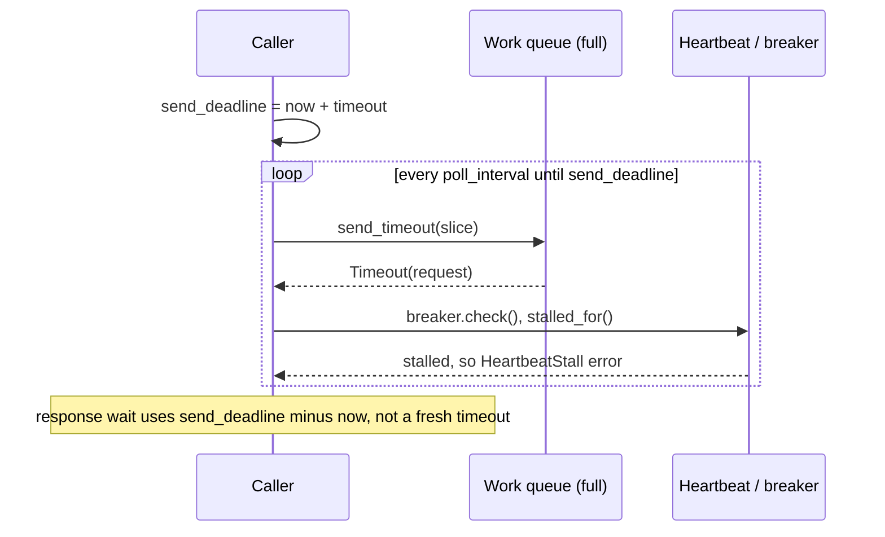

# PR Summary — Issue #2339

## Summary

GPU work submission now uses **one absolute deadline per call** across both the
send phase and the response wait. While blocked on a full work queue it
re-checks the circuit breaker and the GPU heartbeat between short polls.
Before this change:

- `send_timeout(request, 60–300 s)` sat blind on a full queue: no breaker
  check and no heartbeat stall check.
- `await_gpu_response` / `GpuFuture::collect` then started a fresh timeout, so
  a caller could wait up to 2× the configured batch timeout.

Closes #2339

- [x] Add `send_until_deadline()`, which polls `send_timeout` in
  `HeartbeatWatch::poll_interval` slices and re-checks `breaker.check()` and
  `stalled_for()` between slices.
- [x] Switch all six entry points (helpful async/blocking, harmful, ReLU,
  activation, batched activation) to the shared deadline.
- [x] `GpuFuture` stores an absolute `deadline`, and `collect()` waits only for
  the time that remains.
- [x] Regression tests in `src/analysis/gpu/queue/send_phase_test.rs`.
- [x] Update `docs/GPU_GUIDE.md` and bump the version to 0.74.273.

## Spec

**Intent and Rationale**

- A submitter stuck behind a wedged GPU must give up within the heartbeat stall
  window (default 30 s), not after the 60–300 s send timeout (CWE-400, finding
  SEC-1124ca631044).
- A caller's total wall-clock wait is bounded by **one** configured timeout,
  not two.

**Essential Design Decisions**

- One `send_deadline = Instant::now() + timeout` per call. The response wait
  receives `deadline − now`, not a fresh `timeout`.
- Error messages still report the originally configured `timeout_secs`, so
  operator-facing wording ("timed out after 30s") is unchanged.
- The send loop reuses `HeartbeatWatch` and the existing
  `queue_full_error` / `heartbeat_stall_error` helpers. The breaker trips with
  the same `BatchTimeout` / `HeartbeatStall` reasons as the response-wait path.
- The request is recovered from `SendTimeoutError::Timeout` and resent, so no
  work is dropped between polls.

**Undiscoverable Facts**

- None.

## Evidence

Backend-only change: no visual surface, so no screenshot.

**Security-fix evidence.** Each regression test below **reproduces** the
original trigger, a send blocked on a full GPU work queue behind a device that
never answers. Each one fails against the unfixed code and passes after the
fix:

- `src/analysis/gpu/queue/send_phase_test.rs::a_third_submitter_behind_a_wedged_gpu_returns_within_the_detection_cap`.
  This is the issue's own scenario:
  - a capacity-1 queue;
  - a `NeverAnswers` fake device behind the real `run_work_loop`;
  - a third submitter with a 30 s deadline.

  The submitter must return a `HeartbeatStall` error within `DETECTION_CAP`
  (2 s).
- `src/analysis/gpu/queue/send_phase_test.rs::a_full_queue_with_a_silent_gpu_is_declared_wedged_within_the_stall_window`
- `src/analysis/gpu/queue/send_phase_test.rs::a_breaker_tripped_mid_send_ends_the_send_promptly`
- `src/analysis/gpu/queue/send_phase_test.rs::a_full_queue_past_the_deadline_trips_the_breaker_as_a_batch_timeout`
- `src/analysis/gpu/queue/send_phase_test.rs::a_closed_queue_is_reported_as_channel_closed`
- `src/analysis/gpu/queue/send_phase_test.rs::a_queue_that_drains_accepts_the_request`
- `src/analysis/gpu/queue/send_phase_test.rs::collect_honours_the_shared_deadline_rather_than_restarting_it`.
  This one reproduces the 2× wait: a `GpuFuture` with 150 ms left of a 30 s
  timeout must fail in under 2 s.

The original trigger is closed with no trivial bypass:

- All six entry points route their send through `send_until_deadline`. No
  work-submission `send_timeout` call with a fixed timeout remains. The only other production call is the 2 s best-effort `Shutdown` send in `scheduling.rs:124`, which is not a work submission.
- Every response wait takes its remaining time from the same deadline.

**Docs sweep:** grep for `send_timeout|queue_full|await_gpu_response|GpuFuture`
across `docs/`, `README.md` and `src/`.

- `docs/GPU_GUIDE.md:328` — updated: describes `send_until_deadline()` and the
  shared deadline.
- `docs/GPU_GUIDE.md:368` — still true because the `queue_full_error` message
  "GPU work queue full - send timed out" is unchanged.
- `docs/archive/pr-summaries/pr-summary-1932.md:83` — still true because it is
  a historical archive record.
- `docs/archive/pr-summaries/pr-summary-807.md:15` — still true because it is a
  historical archive record.

## Test Plan

- `./quality.sh < /dev/null` passed (fmt, clippy `-D warnings`, tests, release
  build). All 7 `send_phase_test` tests passed.
- `cargo test --lib analysis::gpu::queue`: 80/80 passed.

Branch outcomes (every flip was made deliberately, went red, and was then
reverted):

- `src/analysis/gpu/queue/submission.rs:99`:
  - **Outcome:** deadline exhausted on a full queue → `queue_full_error`, which
    trips the breaker with `BatchTimeout`.
  - **Test:** `a_full_queue_past_the_deadline_trips_the_breaker_as_a_batch_timeout`.
  - **Flip:** an untyped `anyhow!` instead → went red.
- `src/analysis/gpu/queue/submission.rs:103`:
  - **Outcome:** the send is accepted → `Ok(())`.
  - **Test:** `a_queue_that_drains_accepts_the_request`.
  - **Flip:** treating acceptance as a failure → went red.
- `src/analysis/gpu/queue/submission.rs:105`:
  - **Outcome:** the breaker was tripped mid-send → the error is returned
    promptly.
  - **Test:** `a_breaker_tripped_mid_send_ends_the_send_promptly`.
  - **Flip:** removing `breaker.check()?` → went red.
- `src/analysis/gpu/queue/submission.rs:106`:
  - **Outcome:** the heartbeat stalled → `heartbeat_stall_error`.
  - **Tests:** `a_full_queue_with_a_silent_gpu_is_declared_wedged_within_the_stall_window`
    and `a_third_submitter_behind_a_wedged_gpu_returns_within_the_detection_cap`.
  - **Flip:** removing the `stalled_for` check → both went red.
- `src/analysis/gpu/queue/submission.rs:116`:
  - **Outcome:** the queue disconnected → "GPU work queue channel closed".
  - **Test:** `a_closed_queue_is_reported_as_channel_closed`.
  - **Flip:** returning `queue_full_error` instead → went red.
- `src/analysis/gpu/queue/submission.rs:223`:
  - **Outcome:** the response wait uses the time remaining on the shared
    deadline.
  - **Test:** `collect_honours_the_shared_deadline_rather_than_restarting_it`.
  - **Flip:** a fresh `Duration::from_secs(timeout_secs)` → went red.

**Guards on the new path:**

- **Kept:**
  - the up-front `breaker.check()?` in every entry point;
  - the trip reasons (`BatchTimeout`, `HeartbeatStall`);
  - the inflight registration in `await_gpu_response`.
- **Excluded:** none.

**Removed assertions:** none. The one existing test that called
`await_gpu_response` was updated to the new `(deadline, timeout_secs)`
signature with the same assertions.

## Pre-PR Security Self-Check

- [x] **Input validation:** no new external input.
- [x] **Secrets:** none staged.
- [x] **Injection surface:** no new shell, SQL or HTTP calls.
- [x] **Output encoding:** error strings are unchanged.
- [x] **Error handling:** errors are typed `gpu_wedged`; no internal state is
  leaked.
- [x] **Dependencies:** none added.
