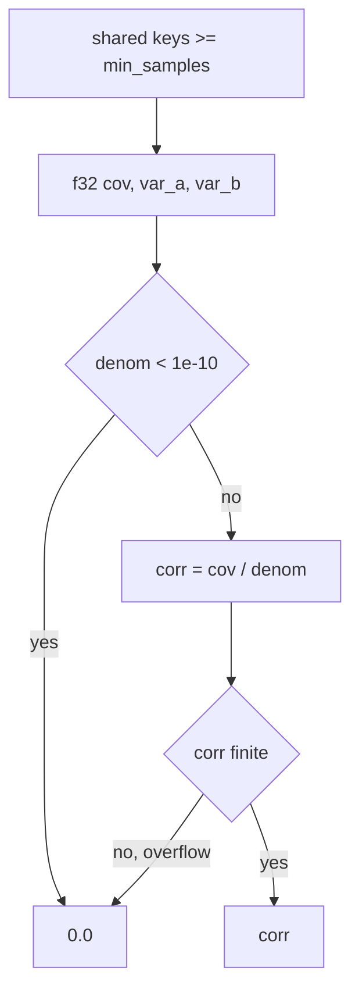

# PR Summary — Issue #2343

## Summary

`pearson_correlation_hashmaps` (`src/analysis/detection/stats.rs`) adds up its
values in `f32`. When finite inputs have squared deviations that overflow
`f32`, both `cov` and `denom` become infinite. The `denom < 1e-10` guard is
false for `+inf`, so `cov / denom` returned `inf / inf = NaN`. A NaN correlation
fails every `>=` threshold in the callers in `correlated_error.rs`,
`weight_coherence.rs` and `multi_hop.rs`, so a real candidate was silently
missed (CWE-682).

The function now returns `0.0` whenever the quotient is not finite. This matches
`pearson_correlation` (Issue #2304). The doc comment now states that the result
is never non-finite. The version is bumped 0.74.274 → 0.74.275.

Closes #2343

## Spec

### Intent and Rationale

- An overflowed correlation must read as "no usable correlation" (`0.0`), never
  as NaN that drops out of every comparison without notice.
- The fix follows the #2304 contract already used by `pearson_correlation` in
  the same file, so both `f32` Pearson helpers fail the same way.

### Essential Design Decisions

- There is a single `corr.is_finite()` check on the quotient. There is no
  separate `!denom.is_finite()` check like the one in #2304. A NaN or `+inf`
  `denom` with an overflowed `cov` already makes the quotient non-finite. A
  finite `cov` over an infinite `denom` gives `0.0` without help. A separate
  `denom` branch would add little and would need its own test.
- The existing `denom < 1e-10` near-zero guard and the `min_samples` early
  return are unchanged. No clamp is added, because that is out of scope.
- The `f32` accumulation is kept. Widening it to `f64` would change the results
  every caller sees for finite data, which is beyond what this issue asks for.

### Undiscoverable Facts

- `multi_hop.rs::compute_activation_activation_correlation` was already guarded
  by `is_finite` (#2182). That guard stays as defence in depth.

## Evidence

This is a backend-only change, with no visual surface and so no screenshots.

**Security fix evidence.** The regression test
`tests/scoring/issue_2343_pearson_hashmaps_overflow_test.rs::hashmaps_f32_overflow_returns_zero`
reproduces the issue's original trigger: ten shared keys, `a` alternating
`±2e30`, `b` alternating `1e10` / `-5e9`, and `min_samples = 3`. The test
asserts that every input is finite and that the result is `0.0`. It fails
against the unfixed code and passes after the fix. On the unfixed code it
failed with `assertion left == right failed: an overflowed correlation must be
0.0, got NaN`. The original trigger is closed with no trivial bypass. Every
non-finite quotient (NaN or ±inf) from any overflow in `cov`, `var_a` or
`var_b` now returns `0.0`. A finite quotient passes through unchanged.

**Docs sweep** — grep: `pearson_correlation_hashmaps`, `Pearson`, "never non-finite", `NaN`, `overflow`, `Issue #2182`; section: `docs/discoveries/correlated-error.md#-how-we-detect-it`, `docs/discoveries/multi-hop.md#-how-we-detect-it`, `docs/discoveries/weight-coherence.md#-how-we-detect-it`; updated: none — every manual hit was read through and is still true (no manual describes NaN or overflow behaviour), the only stale text was the function's own doc comment at `src/analysis/detection/stats.rs:117-122`, updated in this diff

- The grep scope was `README.md`, `CONTRIBUTING.md`, every `*/README.md`, and
  `docs/` excluding `docs/archive/`, plus `src/` and `tests/`.
- The manual hits in `docs/discoveries/*.md`, `docs/DISCOVERY_TYPES.md` and
  `docs/ANALYSIS_DEEP_DIVE.md` only state Pearson thresholds (≥ 0.3, 0.4,
  0.7, 0.8, 0.85, 0.9, 0.999). An overflow now reads as `0.0`, which is below
  every threshold. Before the fix NaN also failed every threshold, so each
  sentence stays true.
- These code hits are still true:
  - `src/analysis/detection/correlated_error.rs:245` and `:415`, still true
    because they only say "Compute Pearson correlation…", with no claim about
    non-finite results.
  - `src/analysis/detection/weight_coherence.rs:611`, still true because the
    caller makes no claim about the return value's finiteness.
  - `src/analysis/recommendation/multi_hop.rs:315`, still true because the
    #2182 NaN guard remains a valid defensive check.
  - `src/analysis/recommendation/multi_hop.rs:220`, `:376` and `:432`, still
    true because they describe other #2182 sums that this change does not
    touch.
  - `docs/archive/pr-summaries/pr-summary-767.md` and `pr-summary-2304.md`,
    still true because they are archived historical records.

## Test Plan

- `cargo test --test scoring < /dev/null`: all 245 tests pass.
- `timeout 900 ./quality.sh < /dev/null`: `✅ All quality checks passed!`
- Red before the fix: the new test failed on the unfixed code with
  `got NaN`.

Branch outcomes:
- `src/analysis/detection/stats.rs:160`, a non-finite quotient returns `0.0`:
  - reached by `tests/scoring/issue_2343_pearson_hashmaps_overflow_test.rs::hashmaps_f32_overflow_returns_zero`;
  - flipping it to return `corr` went red (`got NaN`).
- `src/analysis/detection/stats.rs:160`, a finite quotient returns `corr`:
  - reached by `tests/scoring/issue_767_stats_pearson_correlation.rs::hashmaps_perfect_positive`
    and `::hashmaps_only_uses_shared_keys`;
  - flipping it to return `0.0` went red in both (`expected ~1.0, got 0`).

Removed assertions: none.

## Pre-PR Security Self-Check

- [x] Input validation: no new external input. The numeric result is now
      bounded to finite values.
- [x] Secrets: none staged. Only source, test, manifest and this summary are
      staged.
- [x] Injection surface: there are no new SQL, shell, filesystem or HTTP calls.
- [x] Output encoding: not applicable.
- [x] Authentication and authorisation: not applicable.
- [x] Error handling: no internals are leaked. The overflow is mapped to `0.0`.
- [x] Dependencies: none added.
- [x] Path confinement: not applicable.

🤖 Generated with [Claude Code](https://claude.com/claude-code)
