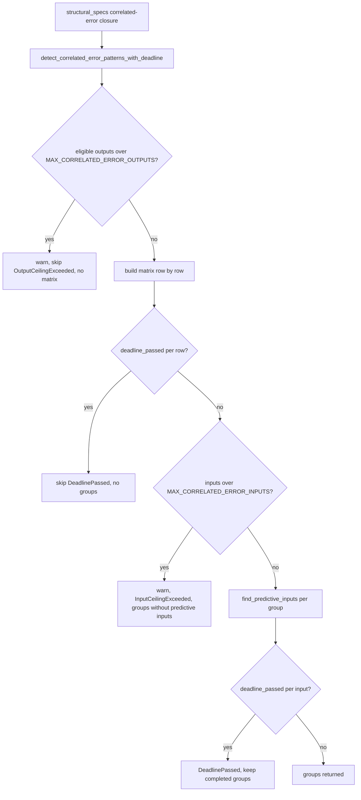

# PR Summary — Issue #2346

## Summary

Closes #2346

`detect_correlated_error_patterns` used to allocate an `n_outputs × n_outputs`
correlation matrix with no ceiling (CWE-789), and nothing could cancel its pair
scan or the per-group `find_predictive_inputs` search once they had started.
This change adds plain constant ceilings (`MAX_CORRELATED_ERROR_OUTPUTS = 1_000`,
`MAX_CORRELATED_ERROR_INPUTS = 10_000`) and checks the analysis deadline in both
loops. The deadline check also covers global cancellation. Every skip is logged
and returned as a typed `CorrelatedErrorSkip`.

- [x] Output ceiling checked before the matrix is allocated
- [x] Deadline checked once per matrix row
- [x] Input ceiling plus a per-input deadline check in `find_predictive_inputs` (the scope extension in the trusted comment)
- [x] Wired into the real dispatch caller (`structural_specs.rs`)
- [x] Regression test, docs, version bump (0.74.274 → 0.74.275)

## Spec

### Intent and Rationale

- An untrusted `CreatureJson` with a very large number of error-carrying outputs could make the analysis allocate n² `f32`s. The allocation is now refused before it happens.
- The scan was O(n²·S) and could not be cancelled, so it held a dispatch worker past the analysis deadline.
- A trusted comment on the issue says the fix must cover both loops: the pair scan and `find_predictive_inputs`.

### Essential Design Decisions

- The ceilings are plain `pub const`s, not env vars, because of the dead-levers rule in AGENTS.md.
- A new `detect_correlated_error_patterns_with_deadline` returns `CorrelatedErrorScan { groups, skip }`. The old function stays as a thin wrapper that passes `&None`, so existing callers and tests are unchanged.
- The deadline is checked per matrix row and per candidate input, reusing `deadline_passed`. There is no hand-rolled clock check.
- If the deadline passes during the matrix build, the function returns no groups. If it passes during the group search, the groups already completed are kept.

### Undiscoverable Facts

- `detect_discovery_modules_parallel` (`src/analysis/discovery_dispatch.rs:668`) already skips a module whose deadline passed before the module started. The new checks only matter once the scan is running.
- `deadline_passed` returns true on global cancellation as well as on a wall-clock deadline.

## Evidence

**Docs sweep:**

- `docs/discoveries/correlated-error.md` and `docs/DISCOVERY_TYPES.md` each gain a new Bounds section.
- `docs/ANALYSIS_DEEP_DIVE.md:276` — still true, because the matrix description holds below the ceiling.
- `docs/DISCOVERY_TYPES.md:1096` — still true, because the step description is unchanged.
- `docs/COST_FUNCTION_NOTES.md:124,125,331` — still true, because how errors are consumed is unchanged.
- `docs/discoveries/README.md:188` — still true, because it only names the module.
- `tests/issue_940_unwrap_removal.rs` and `tests/detection/issue_344_correlated_error_detection.rs` — still true, because the legacy wrapper's signature is unchanged.

## Acceptance Criteria

The issue has no explicit Acceptance Criteria heading. The spec-reviewer derived the criteria below from the requested fix and the required test.

Provenance: independent `spec-reviewer` subagent, given `/tmp/review-2346.diff` and the issue body with its comments.

- Output ceiling checked before the matrix allocation, and the skip is recorded — reviewer: met
- Deadline threaded into the pair loop — reviewer: met
- Fix wired into the real dispatch caller — reviewer: met
- `find_predictive_inputs` gets an input ceiling and a deadline check (trusted comment) — reviewer: met
- Regression test `rejects_output_count_above_ceiling_without_building_the_matrix` — reviewer: met
- Fails loud, not silent — reviewer: met
- Docs updated — reviewer: met
- Version bump (AGENTS.md rule) — reviewer: met

Reviewer found no scope creep. It judged the in-module unit test to be traceable to the scope extension.

## Standards Review

This repo has no `CODING-STANDARDS.md`, so the review was done against `CONTRIBUTING.md` and `AGENTS.md`.

Provenance: independent `standards-reviewer` subagent, given the same diff.

- **Missing PR summary file** (CONTRIBUTING.md "PR Summary File") — fixed. This file adds it.
- **`MAX_CORRELATED_ERROR_OUTPUTS` / `MAX_CORRELATED_ERROR_INPUTS` are `pub` but only an integration test uses them** ("Do not make APIs public just for testing") — declined, for two reasons:
  - Each ceiling is part of the module's reported contract. `CorrelatedErrorSkip::OutputCeilingExceeded { ceiling }` / `InputCeilingExceeded { ceiling }` returns the value to production callers.
  - The repo already publishes ceilings this way for tests to import, e.g. `analysis::scoring::weights::MAX_OUTGOING_WEIGHT` in `tests/scoring/issue_888_weight_constraints.rs`.
- **Optional, not adopted:**
  - Taking the deadline by value instead of `&Option<SystemTime>` — kept, to match `deadline_passed` and the existing call sites.
  - Doc wording repeated across three places — kept, because each surface stands alone.

Checked with no violation: version bump, Key Invariants, dependency discipline, CI untouched, Australian English, test style, no timing assertions.

## Test Plan

**Regression test:** `tests/issue_2346_correlated_error_matrix_guard_test.rs::rejects_output_count_above_ceiling_without_building_the_matrix`

- The test reproduces the original trigger: `MAX_CORRELATED_ERROR_OUTPUTS + 1` error-carrying outputs.
- It asserts that no groups are returned and that `skip == OutputCeilingExceeded`.
- It fails against the unfixed code and passes after the fix. The original trigger — an unbounded n_outputs² allocation and an uncancellable scan — is closed with no trivial bypass:
  - the ceiling counts eligible outputs before any allocation;
  - both loops check `deadline_passed`;
  - the only production caller uses the deadline-aware entry point.

**Other tests:** the same file holds five more tests, plus one in-module unit test, `find_predictive_inputs_returns_none_when_deadline_elapsed`.

**Branch outcomes:**

| Location | Outcome | Test that reaches it | Flip went red? |
|---|---|---|---|
| `src/analysis/detection/correlated_error.rs:194` | output ceiling exceeded | `rejects_output_count_above_ceiling_without_building_the_matrix` | Yes. Flipped to `usize::MAX - 1`. |
| `src/analysis/detection/correlated_error.rs:194` | under the ceiling | `small_correlated_output_set_is_not_skipped` | n/a |
| `src/analysis/detection/correlated_error.rs:230` | deadline passed per row | `elapsed_deadline_stops_matrix_build_with_no_input_neurons` | Yes. Flipped to `if false`. |
| `src/analysis/detection/correlated_error.rs:266` | input ceiling exceeded | `input_count_above_ceiling_skips_predictive_search` | Yes. Forced `false`. |
| `src/analysis/detection/correlated_error.rs:266` | under the input ceiling | `predictive_input_found_below_input_ceiling` | n/a |
| `src/analysis/detection/correlated_error.rs:517` | deadline passed per input, returns `None` | `analysis::detection::correlated_error::tests::find_predictive_inputs_returns_none_when_deadline_elapsed` | Yes. Flipped to `if false`. |
| `src/analysis/detection/correlated_error.rs:333` | caller maps `None` to `DeadlinePassed` and keeps completed groups | none | Accepted gap, see below. |

**Accepted gaps:**

- `correlated_error.rs:333` can only be reached if the deadline expires between the matrix build and the group search. A deadline that has already passed trips the per-row check first, so a deterministic test needs a clock seam. That seam is not added here.
- The `&deadline` wiring in `structural_specs.rs:43` has no test that goes red when it is reverted. The dispatch gate pre-checks the deadline before the closure starts, so this wiring only matters mid-scan, which needs the same clock seam.

**Removed assertions:** none. One earlier draft test was dropped before commit because it masked other flips. It never reached the base branch.

**Commands:**

- `cargo clippy --all-targets -- -D warnings`: clean.
- `cargo test --test issue_2346_correlated_error_matrix_guard_test`: 6 passed.
- `cargo test --lib correlated_error`: 1 passed.
- `cargo test --test detection correlated`: 16 passed.
- `./quality.sh`: QUALITY_PLACEHOLDER

## Guards kept and call sites checked

- **Guards kept:** the dispatch-level deadline gate, `MIN_SAMPLES_FOR_CORRELATION`, and the `validate_creature` gate at the FFI entry point. All are untouched.
- **`structural_specs.rs:43`:** now calls the deadline-aware function. This is the accepted gap above.
- **Legacy `detect_correlated_error_patterns` callers:** these are tests only. They behave the same through the wrapper.

## Security self-check

- [x] Input validation: the output and input counts from an untrusted creature are bounded before allocation.
- [x] No secrets staged. No new shell, SQL or filesystem surface.
- [x] No new dependencies.
- [x] Errors are logged through `tracing::warn!` without leaking internal state to FFI callers.
