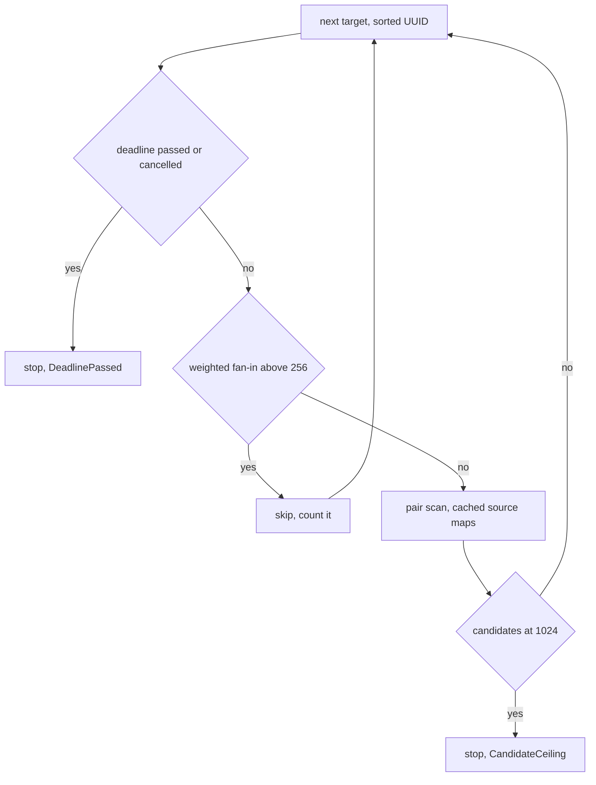

# PR Summary — Issue #2347

## Summary

`weight_coherence.rs::detect_symmetric_cancellation` ran an `i < j` pair loop
over every target's fan-in. For each opposite-sign, similar-magnitude pair it
called `calculate_correlation`, which rebuilt two `obs_index → activation`
`HashMap`s from both sources' full record slices. The cost was
`O(Σ_targets k² · S)`. Nothing capped the fan-in `k` or the number of emitted
candidates, and the scan never checked the deadline. A hostile creature with
one wide-fan-in target and alternating `+w` / `-w` weights could pin a core for
as long as it liked (CWE-834).

The scan is now bounded in three ways, and the per-pair rebuild is gone:

- **Fan-in cap.** A target whose weighted fan-in exceeds
  `MAX_FANIN_FOR_CANCELLATION_SCAN` (256) is skipped before any pair work and
  counted in `skipped_high_fanin_targets`.
- **Candidate ceiling.** The scan stops after
  `MAX_SYMMETRIC_CANCELLATION_CANDIDATES` (1024) candidates with
  `ScanTruncation::CandidateCeiling`.
- **Deadline.** `deadline_passed` (which also reports host cancellation) is
  checked before each target. An elapsed deadline stops the scan with
  `ScanTruncation::DeadlinePassed`.
- **Map cache.** Each source's activation map is built at most once per scan
  and cached across pairs and targets.

The new `detect_symmetric_cancellation_with_deadline` returns a
`SymmetricCancellationScan` holding the candidates, the truncation reason and
deterministic work counters. The old `detect_symmetric_cancellation` is now a
thin no-deadline wrapper. Production dispatch (`synapse_specs.rs`) forwards the
discovery deadline and logs a `warn!` when the scan was truncated or skipped
targets, so a partial result is never shown as complete. The version is bumped
0.74.275 → 0.74.276.

Closes #2347

## Spec

### Intent and Rationale

- The pair scan must finish in bounded time and memory whatever the creature
  looks like, and must stop when the analysis deadline passes or the host
  cancels.
- The fix follows the earlier pairwise fixes (#2161 / #2169 / #2190) and reuses
  the existing `ScanTruncation` enum and `deadline_passed` helper.

### Essential Design Decisions

- Wide targets are skipped outright, not truncated to their first 256 sources.
  A partial pair set would depend on fan-in order and look complete when it is
  not.
- Targets are visited in sorted UUID order, so candidate-ceiling truncation is
  deterministic.
- Work is measured with counters (`pairs_correlated`, `activation_maps_built`),
  not wall-clock time, so the tests are deterministic (precedent: #2320).
- `correlation_from_maps` keeps the exact semantics of the old
  `calculate_correlation`. Non-finite activations are still filtered, and the
  shared-sample minimum is still enforced.

### Undiscoverable Facts

- Before this change, cancellation was module-level only.
  `discovery_dispatch.rs` checks the deadline before a module's closure starts,
  and `max_candidates` truncates its output afterwards. Neither bounds the work
  while the closure is running.

## Evidence

This is a backend-only change, with no visual surface and so no screenshots.

**Security fix evidence.** I added the regression test
`tests/issue_2347_symmetric_cancellation_growth_test.rs::symmetric_cancellation_work_grows_no_faster_than_the_cap_allows`.
It reproduces the original trigger: one target fed by N and then 4N sources
(N = 128) with alternating `+5.0` / `-5.0` weights and perfectly correlated
activations, so every cross-parity pair reaches the correlation step. The test
asserts that the over-cap target is skipped and that `pairs_correlated` grows
no more than 4× when fan-in grows 4×. It fails against the unfixed code and
passes after the fix:

- Against the unfixed code it does not compile, because the bounded scan entry
  point does not exist there.
- With the fan-in cap disabled on the fixed code, it fails with
  `the over-cap target must be skipped entirely, not partially scanned`
  (`left: 0, right: 1`), because the work grows quadratically.

These tests cover the other bounds:

- `tests/issue_2347_symmetric_cancellation_growth_test.rs::activation_maps_are_cached_across_pairs_not_rebuilt_per_pair`
  reproduces the per-pair map rebuild. With the rebuild still in place it
  failed with `200 maps for 20 sources`, and it passes after the fix.
- `tests/issue_2347_symmetric_cancellation_growth_test.rs::fanin_at_the_cap_is_scanned_fanin_over_the_cap_is_skipped`
  pins the cap boundary.
- `tests/issue_2347_symmetric_cancellation_growth_test.rs::elapsed_deadline_stops_the_scan_before_any_pair_work`
  pins the deadline check.
- `tests/issue_2347_symmetric_cancellation_growth_test.rs::symmetric_cancellation_stops_at_the_candidate_ceiling_and_reports_it`
  pins the candidate ceiling.

**The original trigger is closed, with no trivial bypass.** There is one pair
loop. Every way into it passes the per-target deadline check and then the
fan-in cap, which runs before any pair work or map build. So per-target pair
work is at most `256²/2` correlations, and map builds are at most one per
distinct source. The candidate ceiling bounds the emitted `Vec`. The legacy
wrapper calls the same bounded function, so it applies the same fan-in and
candidate ceilings. Spreading fan-in over many targets just under the cap
leaves every target bounded, the total bounded by the deadline, and the output
bounded by the ceiling.

**Docs sweep** — grep: `symmetric cancellation`, `detect_symmetric_cancellation`, `calculate_correlation`, `fan-in`, `MAX_FANIN_FOR_CANCELLATION_SCAN`; section: `docs/discoveries/weight-coherence.md#-3-symmetric-cancellation`, `docs/DISCOVERY_TYPES.md` (Detection criteria — Symmetric cancellation), `docs/ANALYSIS_DEEP_DIVE.md` (Symmetric cancellation); updated: `docs/discoveries/weight-coherence.md`, `docs/DISCOVERY_TYPES.md`, `docs/ANALYSIS_DEEP_DIVE.md`

## Test Plan

- No assertion was removed from an existing test. The test file
  `tests/issue_2347_symmetric_cancellation_growth_test.rs` is new in this
  diff. The three unit tests in `src/analysis/detection/weight_coherence.rs`
  that called the removed `calculate_correlation` now call
  `correlation_from_maps(&build_activation_map(..), &build_activation_map(..), 10)`.
  Only the call site changed, and every assertion in them is kept unchanged.
- `cargo test --test issue_2347_symmetric_cancellation_growth_test` passes
  all 9 tests at the head.

**Branch outcomes:**
- `src/analysis/detection/weight_coherence.rs:489` — deadline elapsed (stop, `DeadlinePassed`) — `tests/issue_2347_symmetric_cancellation_growth_test.rs::elapsed_deadline_stops_the_scan_before_any_pair_work` — flipped to never stop, test went red
- `src/analysis/detection/weight_coherence.rs:489` — no deadline / deadline not reached (scan continues, no truncation) — `tests/issue_2347_symmetric_cancellation_growth_test.rs::no_deadline_does_not_truncate_and_finds_candidates`, `tests/issue_2347_symmetric_cancellation_growth_test.rs::far_future_deadline_behaves_like_no_deadline` — flipped to always stop, both tests went red
- `src/analysis/detection/weight_coherence.rs:507` — fan-in over the cap (target skipped and counted) — `tests/issue_2347_symmetric_cancellation_growth_test.rs::fanin_at_the_cap_is_scanned_fanin_over_the_cap_is_skipped`, `tests/issue_2347_symmetric_cancellation_growth_test.rs::symmetric_cancellation_work_grows_no_faster_than_the_cap_allows` — flipped to never skip, both tests went red
- `src/analysis/detection/weight_coherence.rs:507` — fan-in exactly at the cap (target scanned) — `tests/issue_2347_symmetric_cancellation_growth_test.rs::fanin_at_the_cap_is_scanned_fanin_over_the_cap_is_skipped` — flipped `>` to `>=`, test went red
- `src/analysis/detection/weight_coherence.rs:541` — source map not yet cached (build once and count it) vs. already cached (reuse) — `tests/issue_2347_symmetric_cancellation_growth_test.rs::activation_maps_are_cached_across_pairs_not_rebuilt_per_pair` — flipped to rebuild every pair, test went red
- `src/analysis/detection/weight_coherence.rs:577` — candidate ceiling reached (stop, `CandidateCeiling`) — `tests/issue_2347_symmetric_cancellation_growth_test.rs::symmetric_cancellation_stops_at_the_candidate_ceiling_and_reports_it` — flipped to never stop, test went red
- `src/analysis/detection/weight_coherence.rs:577` — below the ceiling (scan completes, no truncation) — `tests/issue_2347_symmetric_cancellation_growth_test.rs::candidate_ceiling_not_reported_when_the_scan_completes` — flipped to always stop, test went red
- `src/analysis/module_dispatch_specs/synapse_specs.rs:85` — truncated or skipping scan (`warn!` logged, partial candidates returned) vs. complete scan (no log) — not reached by any test. The branch only emits a log line, and the returned `scan.candidates` is the same on both sides, so no test can observe a flip without capturing tracing output. Not flipped.

🤖 Generated with [Claude Code](https://claude.com/claude-code)
