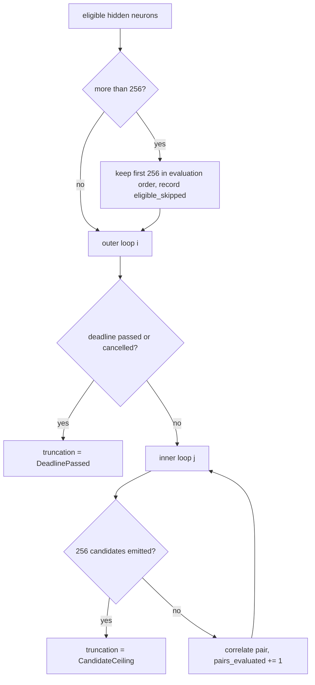

# PR Summary — Issue #2348: Bound the co-adaptation pair scan

## Summary

Closes #2348.

`detect_co_adapted_neurons` compared every pair of eligible hidden neurons
across every sample (O(E²·S)). Nothing capped it and it could not be cancelled
(CWE-834). The scan now has three bounds:

- at most 256 eligible neurons are compared, and the skip is recorded;
- it stops at 256 emitted pairs;
- it checks `deadline_passed` (which also honours global cancellation) on
  every outer iteration.

## Changes

- `src/analysis/detection/co_adaptation.rs`:
  - adds `MAX_CO_ADAPTATION_ELIGIBLE_NEURONS` and
    `MAX_CO_ADAPTED_PAIR_CANDIDATES` (both 256);
  - adds the `CoAdaptationScan` result (`candidates`, `truncation`,
    `pairs_evaluated`, `eligible_skipped`);
  - adds `detect_co_adapted_neurons_with_deadline`. The old entry point
    delegates to it with no deadline.
- `src/analysis/module_dispatch_specs/neuron_specs.rs`: the co-adaptation spec
  now passes the dispatch deadline through. It logs `warn!` when the scan is
  truncated or neurons are skipped, and keeps the old `guard_min` semantics:
  fewer than 2 hidden neurons → `None`, an empty result → `None`.
- `src/analysis/module_dispatch_specs/mod.rs`: `build_discovery_module_specs`
  threads `deadline` into `append_neuron_specs`.
- Docs:
  - `docs/discoveries/co-adaptation.md` gains a Scan Bounds table;
  - `docs/DISCOVERY_TYPES.md` gains a Scan bounds paragraph;
  - `docs/ANALYSIS_DEEP_DIVE.md`'s algorithm steps now describe the caps and
    the deadline.
- Tests:
  - `tests/issue_2348_co_adaptation_growth.rs`;
  - `tests/issue_2348_co_adaptation_scan_bounds.rs`;
  - two co-adaptation spec tests in `src/analysis/module_dispatch_specs/mod.rs`.
- `Cargo.toml` / `Cargo.lock`: 0.74.275 → 0.74.276.

## Spec

### Intent and Rationale

- Discovery must not spend unbounded, uncancellable CPU on one creature. A
  wide hidden layer made this scan the dominant cost, and nothing could stop
  it.
- The fix follows the existing `_with_deadline` and `ScanTruncation` pattern
  (#2236, output competition), so operators see the same truncation signals.

### Essential Design Decisions

- The eligible cap keeps the **first** 256 neurons in creature evaluation
  order. The result is deterministic and reproducible. It is not ranked by
  variance.
- The pair ceiling stops the scan at 256 emitted pairs. Emitted candidates
  are still sorted by |correlation| descending.
- The deadline check sits at the top of the outer loop. One check covers at
  most 255 inner correlations, so cancellation latency stays bounded.
- The legacy `detect_co_adapted_neurons` signature is kept, so existing
  callers are unaffected. It gets the caps but no deadline.

### Undiscoverable Facts

- `utils::deadline_passed` also returns true when the global cancellation
  flag is set, so a single check covers both timeout and cancel.

## Evidence

**Security regression test:**
`tests/issue_2348_co_adaptation_growth.rs::co_adaptation_pairs_evaluated_grow_no_faster_than_the_cap_allows`
(declared in this diff).

- **Fails on the unfixed code.** On `origin/Develop` with only the test copied
  in, it fails with `got 276 candidates at E=24 and 4560 candidates at 4E=96`:
  quadratic growth.
- **Passes after the fix.** It gets 256 vs 256.
- **The original trigger is closed, with no trivial bypass:**
  - A wide hidden layer can no longer drive more than C(256,2) = 32,640
    pair correlations. The eligible cap sets that bound and
    `eligible_neurons_beyond_the_cap_are_skipped_and_recorded` asserts it.
  - The emitted output is capped at 256 pairs.
  - The scan stops at the dispatch deadline or on cancellation.
  - The legacy entry point shares the same capped implementation, so no
    caller path skips the bounds.

**Guards kept from the old spec path:**

- the `guard_min: hidden 2` guard, now `hidden.len() < 2` → `None`;
- the empty-detection → `None` rule.

Both are covered by the existing lib test
`src/analysis/module_dispatch_specs/mod.rs::test_discovery_specs_with_empty_hidden_return_none`.
No guard was excluded.

**Call sites checked:** `build_discovery_module_specs` →
`append_neuron_specs(…, deadline)` is the only caller. The co-adaptation spec
closure is covered by
`src/analysis/module_dispatch_specs/mod.rs::co_adaptation_spec_honours_an_elapsed_deadline`.
That test goes through `build_discovery_module_specs` with an elapsed deadline
and expects `None`. Reverting the closure to pass `&None` instead of
`&deadline` turned it red. Its companion,
`co_adaptation_spec_detects_pairs_before_the_deadline`, proves the same inputs
yield pairs when the deadline is still in the future.

**Docs sweep** — grep: `co-adaptation`, `co_adaptation`, `co-adapted`, `append_neuron_specs`, `detect_co_adapted_neurons`; section: `docs/discoveries/co-adaptation.md#-scan-bounds`, `docs/DISCOVERY_TYPES.md#co-adaptation-detection`, `docs/ANALYSIS_DEEP_DIVE.md` (Co-Adaptation Detection algorithm steps); updated: `docs/discoveries/co-adaptation.md`, `docs/DISCOVERY_TYPES.md`, `docs/ANALYSIS_DEEP_DIVE.md`

Docs sweep details:

- Grep terms: `co-adaptation|co_adaptation|co-adapted`,
  `append_neuron_specs`, `detect_co_adapted_neurons`.
- Sections updated: `docs/discoveries/co-adaptation.md`
  (section: 🚧 Scan Bounds), `docs/DISCOVERY_TYPES.md` (section:
  Co-Adaptation → Scan bounds), `docs/ANALYSIS_DEEP_DIVE.md`
  (section: co-adaptation algorithm steps).
- Hits outside the diff, and why each is still true:
  - `README.md:273` — still true because it is a feature-list entry only.
  - `docs/DROUGHT_PLAYBOOK.md:400` — still true because the dispatch-level
    skip for creatures with more than 1000 hidden neurons is orthogonal to
    the in-scan caps.
  - `docs/analysis/snapshot-mining-1631.md:50` — still true because it is a
    generator list.
  - `docs/PRIOR_ART.md:148,216` — still true because they are a prior-art
    table row and the Hinton 2012 citation.
  - `docs/DISCOVERY_TYPES.md:50,199,1327` — still true because they are the
    table of contents, a summary row and a source link.
  - `docs/DISCOVERY_TYPES.md:1330,1332,1352,1367` — still true because they
    are concept prose, the remove-neuron strategy and a symmetry-breaking
    cross-reference, none of which describe scan size.
  - `docs/discoveries/co-adaptation.md:3,38,86,132,157` — still true because
    they are header links, the complexity-cost note, strategies and a source
    link.
  - `docs/discoveries/symmetry-breaking.md:14,126` — still true because they
    only contrast it with co-adaptation.
  - `docs/discoveries/README.md:109` — still true because it is an index
    entry.
  - `docs/analysis/candidate-rate-diagnosis-1777.md:72` — still true because
    it is a historical point-in-time citation of `co_adaptation.rs:82`,
    deliberately left unedited.

**Security self-check:**

- [x] **Input validation:** the creature still passes through the existing
  FFI validation, and the scan input is bounded by the new caps.
- [x] **Secrets:** none staged.
- [x] **Injection surface:** no new shell, SQL or HTTP calls.
- [x] **Logging:** the `warn!` lines log counts and enum reasons only.
- [x] **Dependencies:** no new dependencies.

## Test Plan

- `cargo test --test issue_2348_co_adaptation_growth`: 1/1.
- `cargo test --test issue_2348_co_adaptation_scan_bounds`: 5/5.
- `cargo test --lib detection`: 503 passed.
- `cargo test --lib module_dispatch_specs`: 8 passed, including the new
  `co_adaptation_spec_detects_pairs_before_the_deadline` and
  `co_adaptation_spec_honours_an_elapsed_deadline`.
- `./quality.sh`: full gate passed.

Branch outcomes:

- `src/analysis/detection/co_adaptation.rs:199` — deadline passed →
  `DeadlinePassed`. Reached by
  `tests/issue_2348_co_adaptation_scan_bounds.rs::elapsed_deadline_stops_co_adaptation_scan_before_any_pair`.
  Deleting the check went red.
- `src/analysis/detection/co_adaptation.rs:199` — deadline in the future →
  the scan continues. Reached by
  `tests/issue_2348_co_adaptation_scan_bounds.rs::future_deadline_yields_every_pair_the_unbounded_scan_yields`.
- `src/analysis/detection/co_adaptation.rs:180` — more than 256 eligible →
  truncate. Reached by
  `tests/issue_2348_co_adaptation_scan_bounds.rs::eligible_neurons_beyond_the_cap_are_skipped_and_recorded`
  (296 neurons → `eligible_skipped == 40`, `pairs_evaluated == 32640`).
  Dropping the truncate went red.
- `src/analysis/detection/co_adaptation.rs:177` — `eligible_skipped` is
  recorded. Reached by the same test. Forcing it to 0 went red.
- `src/analysis/detection/co_adaptation.rs:177` — under the cap →
  `eligible_skipped == 0`. Reached by
  `tests/issue_2348_co_adaptation_scan_bounds.rs::under_cap_scan_records_no_skip`.
- `src/analysis/detection/co_adaptation.rs:205` — 256 candidates emitted →
  `CandidateCeiling`. Reached by
  `tests/issue_2348_co_adaptation_growth.rs::co_adaptation_pairs_evaluated_grow_no_faster_than_the_cap_allows`
  and
  `tests/issue_2348_co_adaptation_scan_bounds.rs::identical_neurons_stop_at_the_candidate_ceiling`.
  Dropping the ceiling went red.
- `src/analysis/detection/co_adaptation.rs:143,166` — fewer than 2 hidden or
  eligible neurons → empty scan. Both returns already exist on base and are
  only re-shaped to return `CoAdaptationScan`. Removing them stays green
  because they are equivalent mutants: with fewer than 2 neurons the pair loop
  has no iterations, so the result is the same empty scan.
- `src/analysis/module_dispatch_specs/neuron_specs.rs:201,222` — hidden < 2 or
  empty result → `None`. Reached by
  `src/analysis/module_dispatch_specs/mod.rs::test_discovery_specs_with_empty_hidden_return_none`.
- `src/analysis/module_dispatch_specs/neuron_specs.rs:205` — the dispatch
  deadline is threaded into the scan. With an elapsed deadline the result is
  `None`, reached by
  `src/analysis/module_dispatch_specs/mod.rs::co_adaptation_spec_honours_an_elapsed_deadline`.
  With a future deadline the result is `Some`, reached by
  `src/analysis/module_dispatch_specs/mod.rs::co_adaptation_spec_detects_pairs_before_the_deadline`.
  Passing `&None` went red.
- `src/analysis/module_dispatch_specs/neuron_specs.rs:206,214` — the `warn!`
  branches. These are logging only, with no behavioural outcome, and no test
  reaches them.
