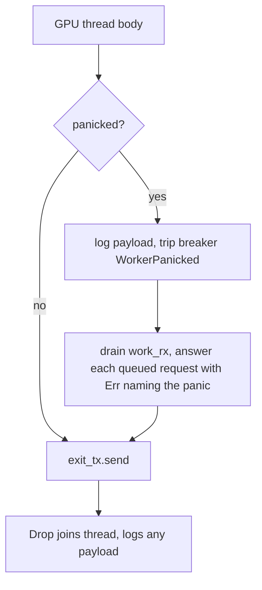

# PR Summary — Issue #2361: A GPU-thread panic no longer strands queued requests

## Summary

Closes #2361.

When the dedicated GPU thread panicked, the request it was running failed at
once. The requests still **queued** behind it were stranded. crossbeam's
bounded channel keeps buffered messages while a sender lives, and
`GpuWorkQueue` holds `work_tx` for its whole lifetime, so each queued
`response_tx` stayed alive. Each caller waited out the heartbeat stall window
(or the full batch timeout) and was then reported as a **wedged GPU**. The
breaker recorded a stall instead of the panic, and `Drop` discarded the panic
payload (CWE-755).

The GPU thread body now runs inside a panic guard. On panic the guard:

- logs the payload at `error!`;
- trips the breaker with a new `GpuTripReason::WorkerPanicked`;
- drains the work channel and answers every queued request with
  `Err("GPU thread panicked: <payload>")`;
- then falls through to `exit_tx.send(())`, so the "always signal exit"
  comment is now true.

`Drop` logs a joined panic payload instead of discarding it.

## Changes

- `src/analysis/gpu/queue/scheduling.rs`:
  - adds `run_guarded_gpu_thread`, `fail_queued_request` (exhaustive over
    `GpuWorkRequest`, no wildcard) and `panic_payload_message`;
  - wraps the spawned thread's body in `run_guarded_gpu_thread`;
  - adds `join_gpu_thread`, used by both `Drop` join sites, which logs an
    `Err(payload)` instead of `let _ = handle.join()`;
  - adds unit tests for the payload extraction and the guard.
- `src/analysis/gpu/breaker.rs`: adds `GpuTripReason::WorkerPanicked`
  (code 5) and its `as_str`. The round-trip test now covers `HeartbeatStall`
  and `WorkerPanicked`.
- `src/analysis/gpu/queue/fake_evaluator.rs`: adds `WedgeBehaviour::Panics`.
- `src/analysis/gpu/queue/worker_panic_test.rs`: the regression tests (new).
- `src/analysis/gpu/queue/mod.rs`: registers `worker_panic_test`.
- `docs/GPU_GUIDE.md`: adds the panic guard to the breaker trip-condition
  table and the breaker state diagram, adds `Panics` to the fake-GPU behaviour
  table, and lists `worker_panic_test.rs` among the wedge tests.

**Docs sweep** — grep (on the head, `git grep -nE` over `*.md` excluding `docs/archive/**`): `WorkerPanicked`, `run_guarded_gpu_thread`, `join_gpu_thread`, `GpuTripReason`, `InitTimeout`, `HeartbeatStall`, `handle\.join`, `WedgeBehaviour`, `worker_panic_test`, `always signal exit`; section: `docs/GPU_GUIDE.md#️-gpu-timeout-errors` (breaker trip-condition table and state diagram) and `docs/GPU_GUIDE.md#how-the-wedged-gpu-defences-are-tested-issue-1935` (fake-GPU behaviour table and test-file list); updated: `docs/GPU_GUIDE.md`; remaining hits:

- `docs/GPU_GUIDE.md:405` — still true because it is the trip-condition row this change added, and it describes `run_guarded_gpu_thread` as shipped.
- `docs/GPU_GUIDE.md:568` — still true because it names `worker_panic_test.rs`, the test file this change added.

No doc lists the `GpuTripReason` variants by name, and `docs/FFI_API.md` and `docs/CONFIGURATION.md` have no hits, so neither needs a change. The module doc in `src/analysis/gpu/breaker.rs` that lists the explicit trip sites now names the panic guard.

## Spec

### Intent and Rationale

- A dead GPU thread must be reported as dead, promptly, and with its cause.
  It must not be reported as a slow or wedged GPU after a 30–300 s wait.
- The breaker reason must name the panic, so the operator is not sent to
  look at the driver.

### Essential Design Decisions

- The guard is a free function that takes the receiver, the breaker and the
  body. This lets the regression test drive the real guard against the fake
  evaluator without a real GPU.
- The drain uses a cloned `Receiver`. The original `work_rx` moves into the
  body and drops during unwind, and the clone keeps the channel readable.
- Queued requests get an explicit `Err` naming the panic, not just a dropped
  sender. Their callers then see `Answered(Err)` carrying the payload.
- `fail_queued_request` has no `_` arm, so a new request variant has to be
  handled here.

### Undiscoverable Facts

- crossbeam-channel's bounded flavour only marks the channel disconnected
  when its last receiver drops. It does not free buffered messages while a
  `Sender` lives, which is why the queued `response_tx` values were stranded.

## Evidence

**Security regression test:** I added the regression test
`src/analysis/gpu/queue/worker_panic_test.rs::queued_request_fails_promptly_when_the_gpu_thread_panics`,
which reproduces the flaw, fails against the unfixed code and passes after the
fix.

- **Fails on the unfixed code.** I replaced `run_guarded_gpu_thread`'s body
  with a bare `body()` call, which is the pre-fix behaviour with no
  `catch_unwind` and no drain. The test failed with
  `expected a prompt typed-error answer for the queued request, got … Stalled { idle: 331.791542ms, window: 300ms }`.
  That is the reported flaw: the queued caller rode out the stall window and
  was reported as a wedge.
- **Passes after the fix.** The queued caller gets
  `Answered(Err("GPU thread panicked: fake GPU panicked"))` well inside the
  stall window. The panicking request's own channel disconnects, the breaker
  reason is `WorkerPanicked`, and the wrapper thread joins without panicking.
- Companion test:
  `src/analysis/gpu/queue/worker_panic_test.rs::panicking_worker_with_empty_queue_still_trips_the_breaker`
  shows the breaker still trips, and the thread still joins cleanly, when
  nothing is queued behind the panicking request.

**The original trigger is closed, with no trivial bypass:**

- The original trigger was a panic anywhere in the GPU thread (initialisation
  or `gpu_thread_loop`) while requests were queued. The whole spawned body,
  including `GpuAnalyzer::new()` and the main loop, now runs inside
  `catch_unwind`, so no panic in that body can skip the drain or the
  `exit_tx` signal.
- Every request still in the channel when the guard runs gets an explicit
  `Err`. Later submitters already fail at once on the disconnected channel.
  The in-flight request's sender is dropped by the unwind.
- `fail_queued_request` matches every `GpuWorkRequest` variant with no
  wildcard, so no request type is left unanswered.
- The only remaining path is a panic outside the guard, for example inside the
  guard's own logging. That is not reachable from request data, and
  `join_gpu_thread` now logs it instead of discarding it.

**Security self-check:**

- [x] **Input validation:** unchanged. The FFI validation still runs before
  any GPU work.
- [x] **Secrets:** none staged.
- [x] **Injection surface:** no new shell, SQL or HTTP calls.
- [x] **Logging:** the panic payload is logged at `error!`. Payloads come from
  crate panics (`panic!`/`.expect`) and carry no request data.
- [x] **Dependencies:** no new dependencies.

## Test Plan

- `cargo test --lib -- worker_panic_test gpu::queue::scheduling`: 7/7 passed.
  I ran it locally with `--ignore-rust-version` because this host has rustc
  1.98 and the crate pins 1.99. CI builds on the pinned toolchain.
- The unfixed-guard experiment above was run and then reverted. It is not
  committed.

**Branch outcomes:**

Each flip was applied alone, run with the targeted command above (`cargo test --lib -- <test>`), then reverted.

- `src/analysis/gpu/queue/scheduling.rs:34` — panic caught → log, trip, drain, answer. Reached by `src/analysis/gpu/queue/worker_panic_test.rs::queued_request_fails_promptly_when_the_gpu_thread_panics`, `src/analysis/gpu/queue/worker_panic_test.rs::panicking_worker_with_empty_queue_still_trips_the_breaker` and `src/analysis/gpu/queue/scheduling.rs::tests::run_guarded_gpu_thread_drains_shutdown_without_panicking`. Flipping it (bare `body()`, no `catch_unwind`) went red: all three failed, the regression test with `Stalled { idle: 319ms, window: 300ms }`.
- `src/analysis/gpu/queue/scheduling.rs:34` — clean body → no trip, no drain. Reached by `src/analysis/gpu/queue/scheduling.rs::tests::run_guarded_gpu_thread_ok_body_leaves_queue_and_breaker_untouched`. Flipping it (trip unconditionally) went red: "a clean body must not trip the breaker".
- `src/analysis/gpu/queue/scheduling.rs:41` — each drained request is answered. Reached by the regression test. Flipping it (`drop(request)` instead of `fail_queued_request`) went red: the outcome became `Disconnected`.
- `src/analysis/gpu/queue/scheduling.rs:60` — `HelpfulBatch` arm sends `Err` naming the panic. Reached by the regression test. Flipping it (`drop(response_tx)`) went red: the outcome became `Disconnected`.
- `src/analysis/gpu/queue/scheduling.rs:68`–`:99` — `HarmfulBatch`, `ReluEval`, `ActivationEval`, `ActivationBatchEval` arms. Identical send-an-`Err` bodies; no test reaches them, so no flip was claimed.
- `src/analysis/gpu/queue/scheduling.rs:100` — `Shutdown` arm, a no-op. Reached by `run_guarded_gpu_thread_drains_shutdown_without_panicking`; it has no observable effect to flip.
- `src/analysis/gpu/queue/scheduling.rs:44` — `failed > 0` summary log. Logging only; no test asserts on it, so no flip was claimed.
- `src/analysis/gpu/queue/scheduling.rs:110` — `&str` payload. Reached by `src/analysis/gpu/queue/scheduling.rs::tests::panic_payload_message_handles_str_payload` and the regression test. Flipping it (return `"x"`) went red in both.
- `src/analysis/gpu/queue/scheduling.rs:112` — `String` payload. Reached by `src/analysis/gpu/queue/scheduling.rs::tests::panic_payload_message_handles_string_payload`. Flipping it went red.
- `src/analysis/gpu/queue/scheduling.rs:115` — non-string fallback. Reached by `src/analysis/gpu/queue/scheduling.rs::tests::panic_payload_message_handles_non_string_payload`. Flipping the literal went red.
- `src/analysis/gpu/queue/scheduling.rs:293` — `join_gpu_thread` `Err(payload)` arm. Logging only, and unreachable from the guarded body because the guard catches every panic it raises; no test reaches it, so no flip was claimed.
- `src/analysis/gpu/queue/scheduling.rs:61` — error (caller already gone, `send` fails) → `trace!` and carry on. Same shape in every request arm. Logging only; no test drops a queued caller's receiver before the drain, so no flip was claimed.
- `src/analysis/gpu/breaker.rs:84` — success (`WorkerPanicked` → code 5). Reached by `src/analysis/gpu/breaker.rs::tests::reason_codes_round_trip`. Flipping it (return `REASON_HEARTBEAT_STALL`) went red: the round-trip assertion at `breaker.rs:463` failed.
- `src/analysis/gpu/breaker.rs:95` — success (code 5 → `Some(WorkerPanicked)`). Reached by `src/analysis/gpu/breaker.rs::tests::reason_codes_round_trip`. Flipping it (return `None`, the unknown-code fallback) went red at `breaker.rs:463`.
- `src/analysis/gpu/breaker.rs:111` — success (`WorkerPanicked` description). Reached by `src/analysis/gpu/breaker.rs::tests::reason_codes_round_trip`. Flipping it (empty string) went red at the non-empty assertion, `breaker.rs:464`.
- `src/analysis/gpu/queue/fake_evaluator.rs:224` — `WedgeBehaviour::Panics` arm panics on the first request. Reached by `src/analysis/gpu/queue/worker_panic_test.rs::queued_request_fails_promptly_when_the_gpu_thread_panics` and `src/analysis/gpu/queue/worker_panic_test.rs::panicking_worker_with_empty_queue_still_trips_the_breaker`. Flipping it (return `Err` instead of panicking) went red: both tests failed.
- `src/analysis/gpu/queue/mod.rs:70` — `#[cfg(test)] mod worker_panic_test;` registration. It adds no branch.
