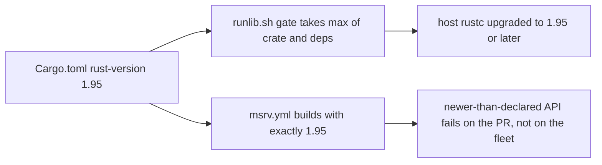

# PR Summary — Issue #2395: declare `rust-version = "1.95"` and add an MSRV CI job

Closes #2395

- [x] Declare `rust-version = "1.95"` in `Cargo.toml` `[package]`
- [x] Add an MSRV CI job (`.github/workflows/msrv.yml`)
- [x] Regression test pinning the two together (`tests/issue_2395_msrv_declared.rs`)
- [x] Extend the per-workflow validators (timeouts, concurrency, toolchain install) to cover `msrv.yml`
- [x] Docs: README requirements row, CONTRIBUTING CI bullet, setup-rust action header
- [ ] Fleet node-log line showing a successful build after the gate upgraded (missing; reason below)

## Spec

### Intent and Rationale

#2387 introduced `AtomicUsize::try_update` in `src/cancellation.rs`, and that
API is stable only from Rust 1.95. `Cargo.toml` declared no `rust-version`, so
the `scripts/runlib.sh` toolchain gate had only the dependency graph's highest
`rust_version` (1.93.1, from serial_test) to work with. It therefore never
upgraded hosts, and the build broke on every consuming host. Declaring 1.95 fixes
both sides: the gate now takes it as the max, and cargo itself refuses an older
rustc with a clear message rather than an `E0658` deep inside the build.

### Essential Design Decisions

- **A separate `msrv.yml`, not a job in `ci.yml`.** AGENTS.md forbids changing
  `ci.yml` without explicit approval. The new workflow follows the sibling
  workflows: SHA-pinned checkout with `persist-credentials: false`,
  `contents: read`, the canonical concurrency group, a `timeout-minutes`, and
  a `milestone/*` branch filter.
- **`cargo check --locked --all-targets --all-features` on 1.95.** Type
  checking is enough to catch an API that is not yet stable, and it is cheaper
  than a full build. `--locked` makes it check the lockfile that ships.
- **Lockstep test.** The workflow's `toolchain:` must equal `Cargo.toml`'s
  `rust-version`. Raising one without the other fails the test suite.
- **`scripts/runlib.sh` is untouched.** It is family-synced, and it already
  reads the crate's own `rust-version`.

### Undiscoverable Facts

- The container has rustc 1.98.0 and no rustup, so `cargo +1.95` cannot run
  here. The real 1.95 build is proven by the new CI job.
- Clippy's `incompatible_msrv` lint, which runs under `-D warnings`, now flags
  any API newer than the declared MSRV. Clippy ran clean with 1.95 declared.

## Reproduction

Status: **partial**. The failure needs a host on rustc older than 1.95, and
this container has 1.98 and no rustup. The regression test
`tests/issue_2395_msrv_declared.rs` reproduces the root cause, the missing
declaration: it fails against the base `Cargo.toml` and passes with the fix.

**Definition-of-done item missing: the fleet node-log line.** A node log line
showing a successful build after the gate upgraded can only come from a fleet
host after this merges and is released. The sandboxed container cannot reach
fleet nodes, so a human needs to capture it after rollout.

## Evidence

- **Docs sweep:** these hits (grep `rust-version|toolchain|MSRV|rustup`) are
  still true after this change:
  - `README.md:75` — still true because it describes the generic rustup-init bootstrap, not a version.
  - `README.md:422,464,466,472,475` — still true because they cover the nightly toolchain for cargo-fuzz, which is unrelated to the MSRV.
  - `CONTRIBUTING.md:63,64,82` — still true because they describe the generic `$CARGO_HOME`/rustup-init bootstrap.
  - `CONTRIBUTING.md:280,282` — still true because they describe `install-rust-toolchain.sh` arguments and the dtolnay history.
  - `CONTRIBUTING.md:512` — still true because it describes which scripts own the toolchain bootstrap.
  - `scripts/runlib.sh:677-680` — still true because they say the crate's `rust-version` alone "is not the requirement", and the gate still takes the max of the crate and the dependency graph.
  - `docs/audits/security-sweep-chunk-16-build-scripts.md` (multiple lines) — still true because it is a point-in-time audit that asserts no MSRV value.
- **Related existing rules checked:**
  - AGENTS.md "Do Not Modify CI Without Approval": `ci.yml` is untouched and the MSRV job lives in a new workflow.
  - AGENTS.md "Version Bumps": the bump is left to CI's `version-increment` job.
  - AGENTS.md "Dependency Bumps": no dependency was bumped and `Cargo.lock` is unchanged.

## Test Plan

- Five targeted suites (`issue_2395_msrv_declared`, `issue_1891_rust_toolchain_install`, `issue_1288_workflow_concurrency`, `issue_1287_workflow_timeouts`, `issue_1992_ci_doc_accuracy`): 46 passed, 0 failed.
- `cargo clippy --all-targets --all-features -- -D warnings`: clean, with no `incompatible_msrv` findings.
- `npx markdownlint-cli2`: 0 issues.
- Red run 1: removing `rust-version` from `Cargo.toml` makes `cargo_toml_declares_rust_version_at_or_above_the_try_update_floor` and `msrv_workflow_toolchain_matches_cargo_toml_rust_version` fail. Restored, and the suite is 10/10.
- Red run 2: setting the `msrv.yml` toolchain to `"1.94"` makes `msrv_workflow_toolchain_matches_cargo_toml_rust_version` fail (left `1.94`, right `1.95`). Restored, and the suite passes again.
- `./quality.sh`: see the PR comment and CI for the full-gate result.

**Branch outcomes:** none added in production code. The diff changes only the
manifest, a workflow, docs and tests. The test helpers' own branches are
reached by their unit tests in `tests/issue_2395_msrv_declared.rs`:

- `package_rust_version` absent → `package_rust_version_returns_none_when_absent`
- next table header stops the scan → `package_rust_version_ignores_dependency_table_rust_version` and `package_rust_version_ignores_workspace_package_rust_version`
- value found → `package_rust_version_reads_the_package_table_value`
- `version_at_least` below, equal and numeric-not-lexical → `version_1_94_is_below_1_95`, `version_1_95_0_equals_1_95` and `version_1_100_is_above_1_95_numerically_not_lexically`

## Pre-PR Security Self-Check

- [x] Input validation: no new external input.
- [x] Secrets: no hidden or secret files staged. `.github/` is on the allowlist.
- [x] Injection surface: the workflow `run:` is a fixed command with no `${{ github.* }}` interpolation.
- [x] Authorisation: `permissions: contents: read`, and the checkout does not persist credentials.
- [x] Dependencies: none added. The checkout action is pinned to a commit SHA.
