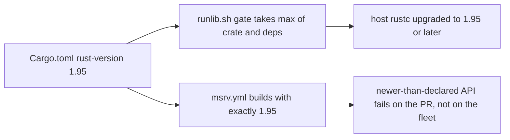

# PR Summary — Issue #2395: declare `rust-version = "1.95"` and add an MSRV CI job

Closes #2395

- [x] Declare `rust-version = "1.95"` in `Cargo.toml` `[package]`
- [x] Add an MSRV CI job (`.github/workflows/msrv.yml`)
- [x] Regression test pinning the two together (`tests/issue_2395_msrv_declared.rs`)
- [x] Extend the per-workflow validators (timeouts, concurrency, toolchain install) to cover `msrv.yml`
- [x] Docs: README requirements row, CONTRIBUTING CI bullet, setup-rust action header
- [ ] Fleet node-log line showing a successful build after the gate upgraded (missing; reason below)

## Spec

### Intent and Rationale

#2387 introduced `AtomicUsize::try_update` in `src/cancellation.rs`, and that
API is stable only from Rust 1.95. `Cargo.toml` declared no `rust-version`, so
the `scripts/runlib.sh` toolchain gate had only the dependency graph's highest
`rust_version` (1.93.1, from serial_test) to work with. It therefore never
upgraded hosts, and the build broke on every consuming host. Declaring 1.95 fixes
both sides: the gate now takes it as the max, and cargo itself refuses an older
rustc with a clear message rather than an `E0658` deep inside the build.

### Essential Design Decisions

- **A separate `msrv.yml`, not a job in `ci.yml`.** AGENTS.md forbids changing
  `ci.yml` without explicit approval. The new workflow follows the sibling
  workflows: SHA-pinned checkout with `persist-credentials: false`,
  `contents: read`, the canonical concurrency group, a `timeout-minutes`, and
  a `milestone/*` branch filter.
- **`cargo check --locked --all-targets --all-features` on 1.95.** Type
  checking is enough to catch an API that is not yet stable, and it is cheaper
  than a full build. `--locked` makes it check the lockfile that ships.
- **Lockstep test.** The workflow's `toolchain:` must equal `Cargo.toml`'s
  `rust-version`. Raising one without the other fails the test suite.
- **`scripts/runlib.sh` is untouched.** It is family-synced, and it already
  reads the crate's own `rust-version`.
- **No `rust-toolchain.toml` (a maintainer suggested `channel = "1.98.0"`).**
  The issue's Fix section asks for `rust-version = "1.95"`, and the same
  comment agrees that this alone unblocks the fleet. A toolchain file would
  change the toolchain of every job in `ci.yml`, and AGENTS.md requires
  approval for that. The family-wide pin is tracked in NEAT-AI-core#747.

### Undiscoverable Facts

- The container has rustc 1.98.0 and no rustup, so `cargo +1.95` cannot run
  here. The real 1.95 build is proven by the new CI job.
- Clippy's `incompatible_msrv` lint, which runs under `-D warnings`, now flags
  any API newer than the declared MSRV. Clippy ran clean with 1.95 declared.

## Reproduction

- **symptom** — on a host whose rustc is older than 1.95, `./scripts/runlib.sh`
  never upgrades the toolchain (the gate only sees the dependency graph's 1.93.1
  floor because `Cargo.toml` declares no `rust-version`), so the build fails
  with `E0658` on `AtomicUsize::try_update` in `src/cancellation.rs`
- **status** — `partial` — reason: this container has rustc 1.98 and no rustup,
  so the `E0658` build failure on an older rustc could not be run here; the
  regression test reproduces the root cause (the missing declaration) instead,
  and was observed failing against the base `Cargo.toml` and passing with the fix
- **regression test** — `tests/issue_2395_msrv_declared.rs::cargo_toml_declares_rust_version_at_or_above_the_try_update_floor`

**Definition-of-done item missing: the fleet node-log line.** A node log line
showing a successful build after the gate upgraded can only come from a fleet
host after this merges and is released. The sandboxed container cannot reach
fleet nodes, so a human needs to capture it after rollout.

## Acceptance Criteria

<!-- vibe-spec-review inputs="diff+issue-body" -->

- "`rust-version` declared" — reviewer: met
- "an MSRV CI job that would have failed on #2387" — reviewer: met
- "A quoted node-log line from one previously failing production host showing
  `neat_ai_discovery` compiled after the gate updated the toolchain, followed
  by a sampler run that passes `ensure_neat_ai_discovery`" — reviewer: missing
  — reason: the sandboxed container cannot reach fleet nodes, so a human
  captures the line after release and rollout

## Standards Review

<!-- vibe-standards-review inputs="diff+CODING-STANDARDS.md" -->

This repository has no `CODING-STANDARDS.md`, so the review used its
canonical standards in `CONTRIBUTING.md` and `AGENTS.md`.

- violations: none
- optional: the comment above `rust-version` at `Cargo.toml:5` is long. This
  is stylistic only and was left as it is.

## Evidence

**Docs sweep** — grep: `rust-version`, `MSRV`; section: `README.md#minimum-system-requirements`, `CONTRIBUTING.md#ci-pipeline`; updated: `README.md`, `CONTRIBUTING.md`, `.github/actions/setup-rust/action.yml`; still true: docs/audits/security-sweep-chunk-16-build-scripts.md:274 — still true because it is a point-in-time audit of how `_runlib_version_ge` zeroes a non-numeric `rust-version` component, which this change does not touch; scripts/runlib.sh:63 — still true because `scripts/runlib.sh` is unchanged and family-synced, and the gate still takes the highest `rust-version` across the graph including the crate's own (now 1.95); scripts/runlib.sh:283 — still true because `scripts/runlib.sh` is unchanged and family-synced, and `_runlib_version_ge` still zeroes a non-numeric component; scripts/runlib.sh:592 — still true because `scripts/runlib.sh` is unchanged and family-synced, and a `rust-version` from `cargo metadata` is still validated before rustup runs; scripts/runlib.sh:674 — still true because `scripts/runlib.sh` is unchanged and family-synced, and `_runlib_required_rust_version` still returns the graph maximum including the crate's own; scripts/runlib.sh:677 — still true because `scripts/runlib.sh` is unchanged and family-synced, and a dependency can still demand a newer rustc than the crate declares; scripts/runlib.sh:680 — still true because `scripts/runlib.sh` is unchanged and family-synced, and it is a historical account of the serial_test 1.93.1 failure, which remains accurate as history; scripts/runlib.sh:686 — still true because `scripts/runlib.sh` is unchanged and family-synced, and the `--filter-platform` host filter is unchanged; scripts/runlib.sh:737 — still true because `scripts/runlib.sh` is unchanged and family-synced, and `_runlib_check_msrv` still gates on the graph maximum; scripts/runlib.sh:923 — still true because `scripts/runlib.sh` is unchanged and family-synced, and the toolchain-only mode still reads the crate's own `rust-version` from the build manifest; tests/test_cargo_toml_validation.sh:6 — still true because it describes the validator's exact-field matching (`version` vs `rust-version`), unrelated to the declared MSRV

- **Docs sweep detail:** the sweep used
  `git grep -n -i -E 'rust-version|msrv' -- . ':!docs/archive'` on the final
  head. The Minimum System Requirements table gains the Rust toolchain row, and
  the CI Pipeline list gains the `MSRV` bullet. These hits outside the diff are
  still true:
  - `docs/audits/security-sweep-chunk-16-build-scripts.md:274` — still true because it is a point-in-time audit of how non-numeric `rust-version` values are parsed, and asserts no MSRV value.
  - `scripts/runlib.sh:63,283,592,674,677,680,686,702,713,737,746,923,965,1023` — still true because the gate still takes the max of the crate's own `rust-version` and the dependency graph's, still reads the crate field, and `_runlib_check_msrv` is unchanged.
  - `tests/issue_2072_canonical_runlib.rs:78` — still true because it is a `1.92` fixture value in a runlib test, unrelated to this crate's declared MSRV.
  - `tests/test_cargo_toml_validation.sh:6,74,75,117,118` — still true because they are field-matching fixtures (`1.70`) for the Cargo.toml validator, unrelated to the declared MSRV.
- **Related existing rules checked:**
  - AGENTS.md "Do Not Modify CI Without Approval": `ci.yml` is untouched and the MSRV job lives in a new workflow.
  - AGENTS.md "Version Bumps": the bump is left to CI's `version-increment` job.
  - AGENTS.md "Dependency Bumps": no dependency was bumped and `Cargo.lock` is unchanged.

## Test Plan

- Five targeted suites (`issue_2395_msrv_declared`, `issue_1891_rust_toolchain_install`, `issue_1288_workflow_concurrency`, `issue_1287_workflow_timeouts`, `issue_1992_ci_doc_accuracy`): 46 passed, 0 failed.
- `cargo clippy --all-targets --all-features -- -D warnings`: clean, with no `incompatible_msrv` findings.
- `npx markdownlint-cli2`: 0 issues.
- Red run 1: removing `rust-version` from `Cargo.toml` makes `cargo_toml_declares_rust_version_at_or_above_the_try_update_floor` and `msrv_workflow_toolchain_matches_cargo_toml_rust_version` fail. Restored, and the suite is 10/10.
- Red run 2: setting the `msrv.yml` toolchain to `"1.94"` makes `msrv_workflow_toolchain_matches_cargo_toml_rust_version` fail (left `1.94`, right `1.95`). Restored, and the suite passes again.
- `timeout 900 ./quality.sh < /dev/null`: exit 0, "✅ All quality checks passed!".
- Named tests checked with `git ls-files` from the repository root: all five suites above are tracked.

**Branch outcomes:** none added in production code. The diff changes only the
manifest, a workflow, docs and tests. The test helpers' own branches are
reached by their unit tests in `tests/issue_2395_msrv_declared.rs`:

- `package_rust_version` absent → `package_rust_version_returns_none_when_absent`
- next table header stops the scan → `package_rust_version_ignores_dependency_table_rust_version` and `package_rust_version_ignores_workspace_package_rust_version`
- value found → `package_rust_version_reads_the_package_table_value`
- `version_at_least` below, equal and numeric-not-lexical → `version_1_94_is_below_1_95`, `version_1_95_0_equals_1_95` and `version_1_100_is_above_1_95_numerically_not_lexically`

## Pre-PR Security Self-Check

- [x] Input validation: no new external input.
- [x] Secrets: no hidden or secret files staged. `.github/` is on the allowlist.
- [x] Injection surface: the workflow `run:` is a fixed command with no `${{ github.* }}` interpolation.
- [x] Authorisation: `permissions: contents: read`, and the checkout does not persist credentials.
- [x] Dependencies: none added. The checkout action is pinned to a commit SHA.
