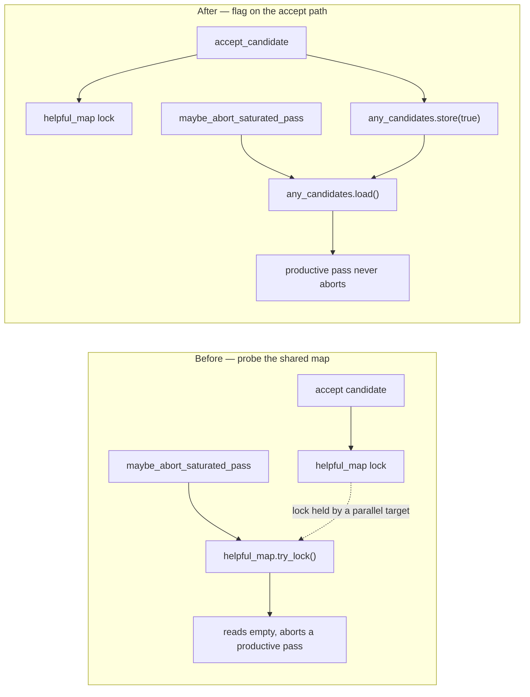

# Saturation early exit must not abort a productive neuron pass (Issue #4140)

## Summary

The `target_saturated` early exit merged in #2023 decided *"did this pass keep
anything?"* by probing `helpful_map.try_lock()`. Neuron targets are analysed in
parallel and every accept takes that same map lock, so the probe routinely found
the lock held by another target, read a **productive** pass as empty, and
aborted it — losing candidates on runs that were not saturated at all. That is
precisely the over-aggressive abort the early exit was required never to cause.

The productivity signal is now an `AtomicBool` raised on the accept path itself
(`accept_candidate`), mirroring the synapse surface's existing `any_candidates`
flag. Everything else about the trip is unchanged: the threshold still derives
from `RejectionDiagnostics::target_saturated_drop_count()`, and
`within_batch_target_short_circuit` skips remain excluded from the rejection
sample.

Also simplifies a pre-existing `!(x == 0)` retain predicate in
`dominated_branch_collapse.rs` tests that current clippy rejects under
`-D warnings`, so the gate runs clean.

Raised on behalf of the downstream caller that reported the 40-minute
zero-candidate pass; follow-up to #2023.

## Evidence

Backend-only change — no web interface to screenshot. Verified by the upstream
gate: `./quality.sh` green (bash syntax, ShellCheck, cargo-install pinning, PR
summary layout, `cargo deny`, debug build, `cargo fmt`, clippy `-D warnings`,
`cargo check --all-targets --all-features`, full test suite, docs with
`RUSTDOCFLAGS=-D warnings`, release library build).

Signal path before and after:

## Test Plan

New tests in `src/analysis/neuron/evaluation.rs`
(`mod saturation_early_exit_tests`):

- `accepting_a_candidate_marks_the_pass_productive` — the accept path both
  admits the candidate to `helpful_map` and raises the flag.
- `productive_pass_does_not_abort_while_helpful_map_is_locked` — the
  regression: with the map lock held by a contending thread (asserted via a
  failed `try_lock` precondition), a pass that kept a candidate does not abort
  under the recorded 3080 saturated-drop shape.
- `saturation_dominant_pass_with_no_candidates_aborts` — the intended trip
  still fires when nothing was ever admitted.
- `within_batch_skips_are_excluded_from_the_sample` — 100 formed proposals that
  are all within-batch skips do not trip the abort.

Existing early-exit tests are unchanged and still pass.
