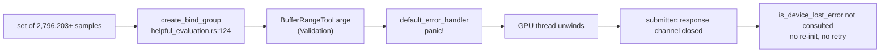
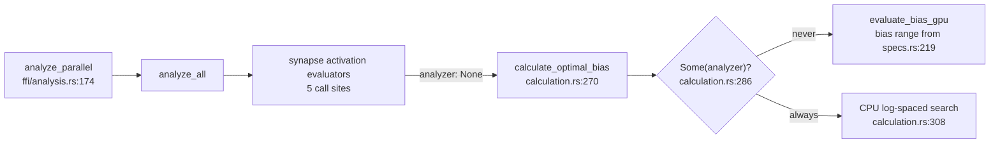

# Security sweep — chunk `9`: GPU dispatch + WGSL shaders

Ledger rules: [`README.md`](README.md). Index entry:
[`lib-sweep-coverage.json`](lib-sweep-coverage.json).

## Record

- **Chunk id:** `9` — matches the `id` in the index.
- **Human name:** GPU dispatch + WGSL shaders — `src/analysis/gpu/**/*.rs`
  (including `queue/`) and `src/shaders/*.wgsl`.
- **Sweep date:** `2026-09-28`
- **Baseline commit:** `a7c3f65108023b93c50e9ac23e6561e0c803e22e`
- **Exposure:** `internal`
- **Swept by:** Issue #2094 (chunk 9 of the #2083 overflow tracker), planned
  under #2231 and split across its slices: shader layer #2232, evaluation
  #2237/#2238, device #2240–#2242, queue core #2243/#2244, queue lifecycle
  #2245/#2246, completeness #2249; scaffolded by Issue #2288.
- **Tracker issue:** `#2094`

### Sweep status — IN PROGRESS

This record is a scaffold. Every file row below reads `pending — <owner>` until
its owning slice sweeps it; the index's `last_swept` date marks when the
scaffold was cut, not a finished sweep. Each slice edits only its own `###`
group in `## Files swept`, its own region under `## Audit sections`, and its own
marked region of the `## Ledger` and `## Refuted / not findings` tables, so
concurrent PRs do not conflict.

### Methodology

Each slice reads its files in full at the baseline commit above and checks them
against the defect classes below, pairing every host-side buffer layout,
binding list and dispatch size with the WGSL declaration it feeds. A finding is
filed in house format (`<!-- finding-id: SEC-… -->`, `<!-- cwe: … -->`) and gets
a `## Ledger` row in the slice's region; a refuted candidate gets a
`## Refuted / not findings` row naming the code that refutes it. Line numbers
are re-verified at the baseline before they are cited.

The filename is `chunk-9`, not the zero-padded `chunk-09` the ledger README
prescribes: the chunk-9 slices already cite this path, and the ledger
contract's `normalise_id` accepts both spellings.

## Defect classes probed

- Host/shader layout mismatch — a Rust struct or buffer whose size, alignment
  or field order disagrees with the WGSL declaration it is bound to, letting a
  shader read or write past the data it was given (CWE-125 / CWE-787).
- Out-of-range invocations — a `global_invocation_id` that is not bounds-checked
  against the real element count before it indexes a storage buffer.
- Barrier divergence — `workgroupBarrier` / `storageBarrier` reached under
  non-uniform control flow.
- NaN / Inf / divide-by-zero — non-finite values produced in a kernel or its
  host-side reduction, and divisors that can be zero.
- Binding-order mismatch — a `build_compute_pipeline` caller whose buffer order
  disagrees with its shader's `@binding(n)`.
- Dispatch-size overflow — workgroup-count arithmetic that can overflow or
  exceed the device's dispatch limit.
- Timeout / availability — a GPU wait, queue or device-loss path that can hang,
  silently fall back, or report an empty result as success.

## Files swept

Line counts as at the baseline commit (`git show <baseline>:<path> | wc -l`):
24 Rust files (9,658 lines) and 10 WGSL shaders (1,338 lines), 34 in total.

Three files are not named in the #2288 owner list and are assigned to the
group of the module they test or support: `queue/fake_evaluator.rs` (the
`RequestEvaluator` test double for `executor.rs`, driven through
`execution.rs::run_work_loop`) and `queue/wedge_tests.rs` (drives that loop and
the `submission.rs` bounded wait) go to **queue-core**;
`queue/stale_skip_tests.rs` (tests `staleness.rs`) goes to **queue-lifecycle**.

### shaders

| Path | Lines | Outcome |
| --- | --- | --- |
| `src/analysis/gpu/mod.rs` | 168 | audited, no finding — 56 `pub use` re-exports: 15 used outside `gpu/` through the module root, 41 reached only through a submodule path or not at all (redundant surface, refuted; per-name table in the shaders audit section) |
| `src/analysis/gpu/pipeline_builder.rs` | 157 | audited, no finding — `binding: i as u32` (L36) assigns slots by position and every `STANDARD_BINDINGS`/`BIAS_BINDINGS` slice matches its shader's `@binding` order and access at all 8 call sites; `create_shader_module` (L26, not `_trusted`) keeps runtime bounds checks on; `min_binding_size: None` (L41) defers buffer-size validation to draw time (the size limits themselves are #2237/#2238's) |
| `src/analysis/gpu/shaders.rs` | 392 | finding filed — #2311 (`GPU_INIT_TIMEOUT_SECS` L143 duplicates `device.rs:54` as an independent literal with no equality pin); `WORKGROUP_SIZE` pinned to the 9 embedded kernels by the naga test (L280, `matching.wgsl` is never embedded), the other constants bounded by const asserts |
| `src/shaders/activation.wgsl` | 232 | finding filed — #2308 (`is_finite_value` at L35 is a float self-comparison fast-math may fold, so the L223 output guard can pass an overflowed Inf/NaN as `valid`); `sample_count` guard L195, no barrier, unused `epsilon` refuted |
| `src/shaders/activation_reduce.wgsl` | 101 | audited, no finding — zero-padded load L76–L80 keeps every read in bounds and adds a neutral element; barriers L83/L94 sit under uniform control flow |
| `src/shaders/bias.wgsl` | 303 | finding filed — #2308 (the `is_finite_value` skips at L253/L264/L273 are its only non-finite handling); `in_range` L216 guards every `bias_idx` access, barriers L244/L283 are uniform, unused `epsilon` L22 and the L228 ceil-div refuted |
| `src/shaders/harmful.wgsl` | 64 | audited, no finding — `length` guard L40 before any access, no barrier, `epsilon` comparisons at L50 reject NaN, no division |
| `src/shaders/harmful_reduce.wgsl` | 92 | audited, no finding — zero-padded load L67–L71; barriers L74/L85 sit under uniform control flow |
| `src/shaders/helpful.wgsl` | 96 | audited, no finding — `length` guard L48 before any access, no barrier, `epsilon` comparisons at L67/L74/L79 reject NaN, no division |
| `src/shaders/helpful_reduce.wgsl` | 116 | audited, no finding — zero-padded load L91–L95; barriers L98/L109 sit under uniform control flow |
| `src/shaders/matching.wgsl` | 135 | dead — no `include_str!` in `shaders.rs`, absent from `ALL_SHADERS`, no pipeline builds it; removal tracked by #2309, file kept |
| `src/shaders/relu.wgsl` | 89 | finding filed — #2308 (the L63 `is_finite_value` input skip); `length` guard L45, no barrier, `epsilon` guards L73/L81, unused `threshold` refuted |
| `src/shaders/relu_reduce.wgsl` | 110 | unused — registered as `RELU_REDUCE_SHADER` (`shaders.rs:91`) and in `ALL_SHADERS` (`shaders.rs:214`) but no `build_compute_pipeline` call builds it; kernel itself is sound (zero-padded load, barriers L92/L103 uniform); removal tracked by #2309, file kept |

### evaluation

| Path | Lines | Outcome |
| --- | --- | --- |
| `src/analysis/gpu/activation_evaluation.rs` | 718 | finding filed — #2313 (the `map_async` callback `.expect` at L297 and L666 panics when a timed-out wait drops its receivers, and the batched path aborts when two or more configs are still mapping), #2314 (a set of 4,793,491+ samples exceeds the 128 MiB binding limit at `create_bind_group` L160 and L495, and wgpu 30 panics instead of returning `Err`); the casts at L146/L179/L224/L456/L480/L583, the staging buffers at L266/L278/L528/L540 and the map-wait propagation at L302/L674 are refuted |
| `src/analysis/gpu/bias_evaluation.rs` | 225 | unreachable — every production caller of `calculate_optimal_bias` passes `analyzer: None`, so the `evaluate_bias_gpu` branch at `calculation.rs:286`–`:290` never runs (removal tracked by #2316, file kept); latent #2313 site at L195; `num_steps` (L87) ≤ 41 from `get_bias_range` (`specs.rs:219`), the dispatch at L183 is one workgroup, and the casts at L125/L126/L182 and the staging buffer at L164 are refuted |
| `src/analysis/gpu/harmful_evaluation.rs` | 453 | finding filed — #2313 (the `map_async` callback `.expect` at L376 panics when a timed-out wait drops its receivers, and aborts when two or more maps are still outstanding), #2314 (a set of 8,388,609+ samples exceeds the 128 MiB binding limit at `create_bind_group` L217, and wgpu 30 panics instead of returning `Err`); the casts at L206/L245/L255/L274, the staging buffers at L320/L334 and the map-wait propagation at L383 are refuted |
| `src/analysis/gpu/helpful_evaluation.rs` | 591 | finding filed — #2313 (the `map_async` callback `.expect` at L446 panics when a timed-out wait drops its receivers, and aborts when two or more maps are still outstanding), #2314 (a set of 2,796,203+ samples exceeds the 128 MiB binding limit at `create_bind_group` L124, and wgpu 30 panics instead of returning `Err`); the casts at L295/L349/L365/L374/L382, the `copy_size` readback chain L374→L405→L426→L441/L461 and the map-wait propagation at L455 are refuted |
| `src/analysis/gpu/relu_evaluation.rs` | 242 | finding filed — #2313 (the `map_async` callback `.expect` at L185 panics when a timed-out wait drops its receiver), #2314 (a set of 3,355,444+ samples exceeds the 128 MiB binding limit at `create_bind_group` L128, and wgpu 30 panics instead of returning `Err`); the casts at L117/L166, the staging buffer at L148 and the map-wait propagation at L190 are refuted |

### device

| Path | Lines | Outcome |
| --- | --- | --- |
| `src/analysis/gpu/analyzer.rs` | 498 | pending — #2113 |
| `src/analysis/gpu/budget.rs` | 245 | pending — #2113 |
| `src/analysis/gpu/breaker.rs` | 511 | pending — #2113 |
| `src/analysis/gpu/device.rs` | 638 | pending — #2113 |

### queue-core

| Path | Lines | Outcome |
| --- | --- | --- |
| `src/analysis/gpu/queue/mod.rs` | 423 | pending — #2114 |
| `src/analysis/gpu/queue/submission.rs` | 1048 | pending — #2114 |
| `src/analysis/gpu/queue/execution.rs` | 928 | pending — #2114 |
| `src/analysis/gpu/queue/executor.rs` | 137 | pending — #2114 |
| `src/analysis/gpu/queue/scheduling.rs` | 171 | pending — #2114 |
| `src/analysis/gpu/queue/fake_evaluator.rs` | 308 | pending — #2114 |
| `src/analysis/gpu/queue/wedge_tests.rs` | 489 | pending — #2114 |

### queue-lifecycle

| Path | Lines | Outcome |
| --- | --- | --- |
| `src/analysis/gpu/queue/recovery.rs` | 248 | pending — #2115 |
| `src/analysis/gpu/queue/staleness.rs` | 266 | pending — #2115 |
| `src/analysis/gpu/heartbeat.rs` | 274 | pending — #2115 |
| `src/analysis/gpu/inflight.rs` | 166 | pending — #2115 |
| `src/analysis/gpu/queue/stale_skip_tests.rs` | 362 | pending — #2115 |

## Audit sections

Each slice writes its audit prose only between its own marker and the next.

### shaders

<!-- section: shaders -->

#### Host ↔ WGSL struct parity (Issue #2289)

The 12 `#[repr(C)] bytemuck::Pod` structs in
`src/analysis/samples/gpu_types.rs` against every WGSL struct that mirrors them
(23 declarations across 9 shaders; `matching.wgsl` is out of scope here and
is covered by #2232). Field order, scalar types and per-field offsets were
compared member by member; the WGSL size/alignment column is naga 30's `Layouter` output, the
same layout wgpu validates against. No struct uses a `vec3` (or any vector or
nested struct) — every member is a 4-byte `f32`/`u32`, so every WGSL struct
aligns to 4 and its size is `4 × members`, exactly as `repr(C)` lays it out.
Pinned by `tests/issue_2289_gpu_struct_layout.rs`, which fails CI if either
side drifts.

| Struct | Rust file:line | WGSL file:line | Rust size/align | WGSL size/align | Verdict |
| --- | --- | --- | --- | --- | --- |
| `GpuHelpfulSample` | `src/analysis/samples/gpu_types.rs:13` | `helpful.wgsl:1`, `relu.wgsl:1`, `activation.wgsl:1`, `bias.wgsl:4` (`HelpfulSample`); `harmful.wgsl:1` (`HarmfulSample`) | 8 / 4 | 8 / 4 | parity |
| `HelpfulContribution` | `src/analysis/samples/gpu_types.rs:30` | `helpful.wgsl:6`, `helpful_reduce.wgsl:11` | 48 / 4 | 48 / 4 | parity |
| `HelpfulUniforms` | `src/analysis/samples/gpu_types.rs:48` | `helpful.wgsl:21` | 16 / 4 | 16 / 4 | parity |
| `HarmfulContribution` | `src/analysis/samples/gpu_types.rs:58` | `harmful.wgsl:6`, `harmful_reduce.wgsl:11` | 16 / 4 | 16 / 4 | parity |
| `HarmfulUniforms` | `src/analysis/samples/gpu_types.rs:68` | `harmful.wgsl:13` | 16 / 4 | 16 / 4 | parity |
| `ReluContribution` | `src/analysis/samples/gpu_types.rs:78` | `relu.wgsl:6`, `relu_reduce.wgsl:11` | 40 / 4 | 40 / 4 | parity |
| `ReluUniforms` | `src/analysis/samples/gpu_types.rs:94` | `relu.wgsl:19` | 16 / 4 | 16 / 4 | parity |
| `BiasResult` | `src/analysis/samples/gpu_types.rs:104` | `bias.wgsl:9` | 16 / 4 | 16 / 4 | parity |
| `BiasUniforms` | `src/analysis/samples/gpu_types.rs:126` | `bias.wgsl:16` | 32 / 4 | 32 / 4 | parity |
| `ActivationOutput` | `src/analysis/samples/gpu_types.rs:140` | `activation.wgsl:6`, `activation_reduce.wgsl:11` | 28 / 4 | 28 / 4 | parity (see decision) |
| `ActivationUniforms` | `src/analysis/samples/gpu_types.rs:153` | `activation.wgsl:16` | 28 / 4 | 28 / 4 | parity (see decision) |
| `ReductionUniforms` | `src/analysis/samples/gpu_types.rs:166` | `helpful_reduce.wgsl:26`, `harmful_reduce.wgsl:18`, `relu_reduce.wgsl:24`, `activation_reduce.wgsl:21` | 16 / 4 | 16 / 4 | parity |

WGSL paths are under `src/shaders/`. Every struct-typed `array<T>` global
(`samples`, `contributions`, `outputs`, `partial_sums`, `results`, the
`var<workgroup> shared_data` arrays and `bias.wgsl`'s `shared_samples`) has a
naga stride equal to the Rust `size_of::<T>()` the host multiplies by the
element count.

**Decision — the 28-byte `ActivationUniforms` and `ActivationOutput` are
valid.** WGSL's 16-byte rule for the `uniform` address space
(`RequiredAlignOf(S, uniform) = roundUp(16, AlignOf(S))`, and the uniform
array-stride rule) constrains a struct *nested* inside a uniform buffer and an
array *element* stored there; it does not round up the top-level struct a
`var<uniform>` binds. `activation.wgsl:31` binds `ActivationUniforms` directly
(`var<uniform> uniforms: ActivationUniforms`), and the host uploads exactly
`bytemuck::bytes_of(&uniforms)` — 28 bytes — at
`src/analysis/gpu/activation_evaluation.rs:156` and `:490`, with
`min_binding_size: None` (`src/analysis/gpu/pipeline_builder.rs:41`), so wgpu
checks the 28-byte buffer against naga's 28-byte span. `ActivationOutput` is
only ever an element of `storage`/`workgroup` arrays
(`activation.wgsl:29`, `activation_reduce.wgsl:30`, `:33`, `:39`), where the
stride is `roundUp(AlignOf(T), SizeOf(T)) = roundUp(4, 28) = 28`; the host
sizes those buffers as `size_of::<ActivationOutput>() * n`
(`activation_evaluation.rs:211`, `:277`, `:517`, `:539`, `:596`, `:646`).
naga's validator (`ValidationFlags::all()`) accepts both shaders — it would
report `Disalignment::ArrayStride` or `MemberOffsetAfterStruct` if either rule
were broken — and `uniform_bindings_accept_28_byte_activation_uniforms` pins
that. No padding change is needed.

**Outcome: negative result** — parity holds on all 12 structs; no ledger row
and no issue filed for struct layout.

#### Kernel bounds and arithmetic (Issue #2290)

All 10 `src/shaders/*.wgsl` kernels, read in full at the baseline. Line
numbers are unchanged at the #2289 head (`abd698d`). Every kernel declares
`@compute @workgroup_size(256)`, matching `WORKGROUP_SIZE`
(`src/analysis/gpu/shaders.rs`). Three guard shapes are used:

- **element-wise** (`activation`, `harmful`, `helpful`, `relu`, `matching`):
  `if idx >= uniforms.<count> { return; }` before the first buffer access;
- **reduction** (the four `*_reduce.wgsl`): a lane past `contribution_count`
  loads a zero struct into `shared_data` instead of reading the input, so the
  tree reduction reads only `shared_data[local_idx + stride]` with
  `local_idx < stride <= 128` (max index 255) and never returns early;
- **tiled** (`bias.wgsl`): `in_range = bias_idx < uniforms.bias_count` (L216)
  gates the per-candidate reads and writes, while every lane stays in the tile
  loop to reach both barriers.

Defence in depth: `pipeline_builder.rs:26` uses `create_shader_module`, not the
`_trusted` variant, so wgpu keeps runtime bounds checks on: naga's `Restrict`
policy for storage-buffer access on Metal (`wgpu-hal-30.0.1/src/metal/device.rs:186`)
and on Vulkan without `robustBufferAccess2`, which otherwise supplies the same
guarantee in hardware (`src/vulkan/adapter.rs:2839`–`:2844`). A missed guard
would clamp or read zero rather than read out of bounds.

| Kernel (lines) | `@workgroup_size` line | Bounds guard (`file:line`) | Barrier-safe? | NaN/Inf/div-by-zero handling | Verdict |
| --- | --- | --- | --- | --- | --- |
| `activation.wgsl` (232) | L192 | `activation.wgsl:195` (`idx >= uniforms.sample_count`) | n/a — no barrier, so the early `return` is safe | `is_finite_value` (L35) skips non-finite input (L210) and gates `valid = 1u` on the output (L223); the non-constant divisions are in `logistic`/`swish`/`softsign` with denominators `1 + exp(..)` / `1 + abs(x)` ≥ 1 (`bent_identity` divides by the constant `2.0`); `epsilon` (L21) unread (refuted) | finding — #2308 (the self-comparison guard is foldable under fast-math) |
| `activation_reduce.wgsl` (101) | L67 | zero-padding `activation_reduce.wgsl:76`–`:80` | yes — L83 at function scope, L94 in a constant-bound loop after the non-uniform `if` closes | sums only; the zero pad is the additive identity; `valid` sums ≤ 256 per workgroup, no u32 overflow; no division | clean |
| `bias.wgsl` (303) | L207 | `in_range` `bias.wgsl:216` (gates L224, L247, L287); sample load `bias.wgsl:233`; `tile_end` `bias.wgsl:248` | yes — L244/L283 sit in the tile-loop body outside `if (in_range)`; the loop bound `tile_count` (L228) derives only from a uniform | `is_finite_value` (L38) skips at L253, L264, L273; the NaN pad (L239) is never read because `tile_end` stops the inner loop at the real sample count; `epsilon` (L22) unread (refuted); L228 ceil-div cannot wrap (refuted) | finding — #2308 |
| `harmful.wgsl` (64) | L37 | `harmful.wgsl:40` (`idx >= uniforms.length`) | n/a — no barrier | `abs(..) > uniforms.epsilon` on activation and error (L50) is false for NaN, so a NaN sample contributes zeros; inputs pre-filtered finite on the host; no division | clean |
| `harmful_reduce.wgsl` (92) | L58 | zero-padding `harmful_reduce.wgsl:67`–`:71` | yes — L74 at function scope, L85 in a constant-bound loop | sums only; flag sums ≤ 256 per workgroup; no division | clean |
| `helpful.wgsl` (96) | L45 | `helpful.wgsl:48` (`idx >= uniforms.length`) | n/a — no barrier | `epsilon` comparisons at L67, L74 and L79 are false for NaN; inputs pre-filtered finite on the host; no division | clean |
| `helpful_reduce.wgsl` (116) | L82 | zero-padding `helpful_reduce.wgsl:91`–`:95` | yes — L98 at function scope, L109 in a constant-bound loop | sums only; flag sums ≤ 256 per workgroup; no division | clean |
| `matching.wgsl` (135) | L79 | `matching.wgsl:82` (`idx >= uniforms.from_count`); error reads gated by `error_idx < total_errors` (L106) | n/a — no barrier | `avg_error` division L118 guarded by `error_count > 0u` (L117); non-finite skips via `is_finite_value` (L47) | dead — never compiled into a pipeline; removal #2309 |
| `relu.wgsl` (89) | L42 | `relu.wgsl:45` (`idx >= uniforms.length`) | n/a — no barrier | `is_finite_value` (L35) input skip at L63; `relu_positive`/`relu_negative > uniforms.epsilon` at L73/L81; no division (the host's `error_activation / activation` in `relu_evaluation.rs` is guarded by `activation > EPSILON`); `threshold` (L21) unread (refuted) | finding — #2308 |
| `relu_reduce.wgsl` (110) | L76 | zero-padding `relu_reduce.wgsl:85`–`:89` | yes — L92 at function scope, L103 in a constant-bound loop | sums only; count sums ≤ 256 per workgroup; no division | unused — no pipeline builds it; removal #2309 |

**Barrier sites.** A barrier reachable only after a thread-dependent early
`return`, or inside a non-uniform branch, would be a finding. None is:

| Barrier | Control flow reaching it | Verdict |
| --- | --- | --- |
| `activation_reduce.wgsl:83` | function scope; no preceding `return`; the L76 `if/else` closes before it | uniform |
| `activation_reduce.wgsl:94` | `for` loop with constant bounds (`stride` 128 → 1); the `local_idx < stride` branch closes at L93 | uniform |
| `harmful_reduce.wgsl:74` | function scope; no preceding `return` | uniform |
| `harmful_reduce.wgsl:85` | constant-bound loop; the branch closes at L84 | uniform |
| `helpful_reduce.wgsl:98` | function scope; no preceding `return` | uniform |
| `helpful_reduce.wgsl:109` | constant-bound loop; the branch closes at L108 | uniform |
| `relu_reduce.wgsl:92` | function scope; no preceding `return` | uniform |
| `relu_reduce.wgsl:103` | constant-bound loop; the branch closes at L102 | uniform |
| `bias.wgsl:244` | tile-loop body, outside `if (in_range)`; loop bound from `uniforms.sample_count` only; `main` has no `return` | uniform |
| `bias.wgsl:283` | same loop body, after `if (in_range)` closes at L280 | uniform |

These verdicts rest on reading the code, not on a tool. naga 30 does not
enforce barrier uniformity: `test_shaders_are_valid_wgsl`
(`src/analysis/gpu/shaders.rs`) validates with `ValidationFlags::all()`, but
naga's `CONTROL_FLOW_UNIFORMITY` check raises `NonUniformControlFlow` only for
expressions that carry a requirement, such as derivatives
(`naga-30.0.1/src/valid/analyzer.rs:915`–`:927`). A barrier statement records
`WORK_GROUP_BARRIER` (`:960`) without being checked against the enclosing
control flow. A future barrier moved under a non-uniform branch would
therefore pass CI, so the table above is the record.

**Arithmetic decisions.**

- *`uniforms.epsilon` guards* — `harmful.wgsl:50` and `relu.wgsl:73`/`:81`
  (also `helpful.wgsl:67`/`:74`/`:79`) compare `>` against a host constant
  `EPSILON = 1e-8` (`src/analysis/samples/mod.rs:29`). A `>` comparison is
  false for NaN, so NaN samples fall through to the zeroed contribution.
- *`bias.wgsl` non-finite handling* — the real mechanism is the
  `is_finite_value` skip at L253 (input), L264 (activated output, charged the
  baseline error) and L273 (corrected error, charged the baseline error). The
  `epsilon` field it declares at L22 is never read (refuted below). The skips
  share the fast-math weakness filed as #2308.
- *`bias.wgsl:228` ceil-div* — `(sample_count + 255u) / 256u` would wrap for
  `sample_count > u32::MAX - 255`. It cannot: the device is requested with
  `wgpu::Limits::default()` (`src/analysis/gpu/analyzer.rs:291`, `:394`),
  whose `max_storage_buffer_binding_size` is 128 MiB
  (`wgpu-types-30.0.1/src/limits.rs:441`). At 8 bytes per
  `GpuHelpfulSample` the `samples` binding holds at most 2^24 samples, and
  `sample_count` is that buffer's own length (`bias_evaluation.rs:125`), so a
  wrapping value never reaches a dispatch. Were it reached, `tile_count`
  would be 0, no sample is read, and every candidate fails
  `min_sample_count` (L292) — fail-safe, not out of bounds.

**Dead shaders.** `matching.wgsl` is dead: `shaders.rs` has no
`include_str!` for it and it is absent from `ALL_SHADERS`, so it is not even
naga-validated. `relu_reduce.wgsl` is unused: it is registered as
`RELU_REDUCE_SHADER` (`shaders.rs:91`) and validated through `ALL_SHADERS`
(`shaders.rs:214`), but no `build_compute_pipeline` call builds it —
`relu_evaluation.rs:33` builds only `RELU_SHADER` — and only `shaders.rs` and
the #2289 layout test reference it. AGENTS.md: "Delete a never-constructed
component unless a concrete writer can be named". No writer is named, so one
removal follow-up covering both is filed as #2309; neither file is deleted
here.

**Outcome: one finding** — #2308 (`SEC-e8e1dd84a447`, CWE-754, low). Bounds
guards and barrier placement are sound in all 10 kernels.

#### Pipeline binding order

Issue #2291.

`build_compute_pipeline` (`pipeline_builder.rs:18`) builds one bind group
layout from the caller's `BufferBindingSpec` slice, assigning each entry
`binding: i as u32` (L36) — slot order is the slice order. `STANDARD_BINDINGS`
(L73) is `[storage read, storage read_write, uniform]`; `BIAS_BINDINGS` (L86) is
`[storage read, storage read, storage read_write, uniform]`. Each row checks the
slice against the kernel's `@binding` declarations and against the
`create_bind_group` entries that feed that pipeline's layout.

| Call site | Shader | Bindings slice | Shader `@binding` (index, type, access) | Matching `create_bind_group` entries | Verdict |
| --- | --- | --- | --- | --- | --- |
| `bias_evaluation.rs:30` | `bias.wgsl` | `BIAS_BINDINGS` (L35) | `@binding(0)` storage read (L27), `@binding(1)` storage read (L29), `@binding(2)` storage read_write (L31), `@binding(3)` uniform (L33) | `bias_evaluation.rs:140` — 0 `sample_buffer`, 1 `bias_buffer`, 2 `results_buffer`, 3 `uniform_buffer` | match |
| `activation_evaluation.rs:35` | `activation.wgsl` | `STANDARD_BINDINGS` (L40) | `@binding(0)` storage read (L26), `@binding(1)` storage read_write (L28), `@binding(2)` uniform (L30) | `activation_evaluation.rs:160` and `:495` — 0 `sample_buffer`, 1 `outputs_buffer`, 2 `uniform_buffer` | match |
| `activation_evaluation.rs:53` | `activation_reduce.wgsl` | `STANDARD_BINDINGS` (L58) | `@binding(0)` storage read (L29), `@binding(1)` storage read_write (L32), `@binding(2)` uniform (L35) | `activation_evaluation.rs:236` and `:603` — 0 outputs, 1 `partial_sums_buffer`, 2 `reduction_uniform_buffer` | match |
| `harmful_evaluation.rs:38` | `harmful.wgsl` | `STANDARD_BINDINGS` (L43) | `@binding(0)` storage read (L20), `@binding(1)` storage read_write (L22), `@binding(2)` uniform (L24) | `harmful_evaluation.rs:217` — 0 `sample_buffer`, 1 `contributions_buffer`, 2 `uniform_buffer` | match |
| `harmful_evaluation.rs:56` | `harmful_reduce.wgsl` | `STANDARD_BINDINGS` (L61) | `@binding(0)` storage read (L26), `@binding(1)` storage read_write (L29), `@binding(2)` uniform (L32) | `harmful_evaluation.rs:288` — 0 `contributions_buffer`, 1 `partial_sums_buffer`, 2 `reduction_uniform_buffer` | match |
| `helpful_evaluation.rs:36` | `helpful.wgsl` | `STANDARD_BINDINGS` (L41) | `@binding(0)` storage read (L28), `@binding(1)` storage read_write (L30), `@binding(2)` uniform (L32) | `helpful_evaluation.rs:124` — 0 `sample_buffer`, 1 `contributions_buffer`, 2 `uniform_buffer` | match |
| `helpful_evaluation.rs:54` | `helpful_reduce.wgsl` | `STANDARD_BINDINGS` (L59) | `@binding(0)` storage read (L34), `@binding(1)` storage read_write (L37), `@binding(2)` uniform (L40) | `helpful_evaluation.rs:157` — 0 `contributions_buffer`, 1 `partial_sums_buffer`, 2 `reduction_uniform_buffer` | match |
| `relu_evaluation.rs:33` | `relu.wgsl` | `STANDARD_BINDINGS` (L38) | `@binding(0)` storage read (L26), `@binding(1)` storage read_write (L28), `@binding(2)` uniform (L30) | `relu_evaluation.rs:128` — 0 `sample_buffer`, 1 `contributions_buffer`, 2 `uniform_buffer` | match |

All call sites are in `src/analysis/gpu/`. Every kernel uses `@group(0)` and
entry point `main`, matching the single layout and the `entry_point:
Some("main")` the builder passes. wgpu validates the layout against the shader
module when the pipeline is created, so a drifted slice would fail pipeline
creation rather than bind the wrong buffer. `min_binding_size: None` (L41)
leaves buffer-size checks to draw time. Those size limits belong to issues #2237
and #2238 and are not repeated here.

#### GPU constants

| Constant | Defined at | Value | Checked against | Verdict |
| --- | --- | --- | --- | --- |
| `WORKGROUP_SIZE` | `shaders.rs:122` | `256` | naga test `test_compute_entry_points_declare_workgroup_size` (`shaders.rs:280`) asserts `[WORKGROUP_SIZE, 1, 1]` for every entry point in `ALL_SHADERS`; the 10 `@workgroup_size(256)` kernels agree (`tests/issue_2291_chunk_09a_2b_shader_layer_sweep.rs`); const asserts L313–L316 (64..=1024, power of two) | pinned — refuted |
| `GPU_REDUCTION_THRESHOLD` | `shaders.rs:195` | `10_000` | const asserts `shaders.rs:369` (`>= 256`, one workgroup) and `:373` (`<= 100_000`) | bounded — refuted |
| `GPU_SHUTDOWN_TIMEOUT_SECS` | `shaders.rs:156` | `10` | const asserts `shaders.rs:326`–`:327` (5..=30) | bounded — refuted |
| `GPU_BUFFER_MAP_TIMEOUT_MARGIN_SECS` | `device.rs:44` | `5` | const assert `device.rs:621` (`> 0`) | bounded — refuted |
| `GPU_BUFFER_MAP_TIMEOUT_SECS` | `device.rs:49`–`:50` | `295` (`GPU_QUEUE_TIMEOUT_MAX_SECS` 300 at `utils/deadline.rs:46`, minus the 5 s margin) | derived, not a literal; const asserts `device.rs:622` (`> 0`) and `:624` (`< GPU_QUEUE_TIMEOUT_MAX_SECS`) | derived and bounded — refuted |
| `GPU_INIT_TIMEOUT_SECS` | `shaders.rs:143` and `device.rs:54` (two independent literals) | `30` | `shaders.rs:324`–`:325` bound only the shaders copy (5..=60); `device.rs:623`, `mod.rs:134` and `mod.rs:162` assert each copy `> 0`; nothing asserts the two are equal. The live init waits (`analyzer.rs:433`, `queue/scheduling.rs:80`) read the shaders copy; the device copy is re-exported at the module root (`mod.rs:54`) | finding — #2311 (`SEC-4b2140a0cd91`, CWE-1041, low) |

The issue body cites `shaders.rs:324`–`:325` as `WORKGROUP_SIZE` asserts; they
are the `GPU_INIT_TIMEOUT_SECS` bounds. The `WORKGROUP_SIZE` asserts are
L313–L316.

#### Module surface

"Used" means a file outside `src/analysis/gpu/` names the re-export through
the `analysis::gpu` root. `tests/unit/` is not compiled (no `main.rs`), so a use
there does not count.

| Re-export | mod.rs line | Verdict | Evidence |
| --- | --- | --- | --- |
| `GPU_BUFFER_MAP_TIMEOUT_MARGIN_SECS` | L54 | unused | no reference outside `src/analysis/gpu/` |
| `GPU_BUFFER_MAP_TIMEOUT_SECS` | L54 | unused | no reference outside `src/analysis/gpu/` |
| `GPU_INIT_TIMEOUT_SECS` | L54 | unused | device copy; no reference outside `src/analysis/gpu/` (the #2311 duplicate) |
| `GpuAvailabilityResult` | L55 | used | src/ffi_internal/gpu.rs |
| `GpuPerformanceTier` | L55 | unused | only `tests/unit/analysis_implementation.rs` (not compiled); `src/analysis/system.rs` reaches the tier API through `gpu::device` |
| `create_wgpu_instance_safely` | L55 | unused | reached through `gpu::device` only |
| `detect_gpu_tier` | L55 | unused | only `tests/unit/analysis_implementation.rs` (not compiled); `src/analysis/system.rs` uses the `gpu::device` path |
| `detect_unified_memory` | L56 | unused | `src/analysis/system.rs` uses the `gpu::device` path |
| `get_adapter_info_internal` | L56 | unused | no reference outside `src/analysis/gpu/` |
| `no_gpu_result` | L56 | unused | no reference outside `src/analysis/gpu/` |
| `poll_device_until_idle` | L56 | unused | no reference outside `src/analysis/gpu/` |
| `wait_for_buffer_map` | L57 | unused | no reference outside `src/analysis/gpu/` |
| `wait_for_buffer_maps_batch` | L57 | unused | no reference outside `src/analysis/gpu/` |
| `GPU_QUEUE_TIMEOUT_MAX_SECS` | L61 | unused | callers use `analysis::utils` directly |
| `GpuTimeBudget` | L64 | unused | no reference outside `src/analysis/gpu/` |
| `GpuCircuitBreaker` | L68 | used | tests/issue_1991_pr_summary_retention_contract.rs |
| `GpuTripReason` | L68 | used | tests/issue_1991_pr_summary_retention_contract.rs |
| `abandoned_gpu_thread_count` | L68 | unused | callers use the `gpu::breaker` path |
| `check_gpu_breaker` | L68 | unused | callers use the `gpu::breaker` path |
| `global_gpu_breaker` | L69 | used | tests/issue_1991_pr_summary_retention_contract.rs |
| `gpu_breaker_trip_reason` | L69 | unused | callers use the `gpu::breaker` path |
| `is_gpu_breaker_tripped` | L69 | unused | callers (e.g. `src/debug/process_state.rs`) use the `gpu::breaker` path |
| `record_abandoned_gpu_thread` | L70 | unused | callers use the `gpu::breaker` path |
| `reset_gpu_breaker` | L70 | unused | callers use the `gpu::breaker` path |
| `trip_gpu_breaker` | L70 | unused | callers use the `gpu::breaker` path |
| `DEFAULT_GPU_STALL_WINDOW_SECS` | L75 | unused | `src/config/user_facing.rs` uses the `gpu::heartbeat` path |
| `GPU_STALL_WINDOW_ENV` | L75 | unused | `src/config/user_facing.rs` uses the `gpu::heartbeat` path |
| `GpuHeartbeat` | L75 | unused | tests use the `gpu::heartbeat` path |
| `HeartbeatWatch` | L75 | unused | no reference outside `src/analysis/gpu/` |
| `MAX_GPU_STALL_WINDOW_SECS` | L76 | unused | `src/config/user_facing.rs` uses the `gpu::heartbeat` path |
| `MIN_GPU_STALL_WINDOW_SECS` | L76 | unused | `src/config/user_facing.rs` uses the `gpu::heartbeat` path |
| `global_gpu_heartbeat` | L76 | unused | callers use the `gpu::heartbeat` path |
| `GPU_MAX_BATCH_ALLOC_BYTES` | L80 | unused | only `tests/unit/analysis_implementation.rs` (not compiled) |
| `GpuAnalyzer` | L80 | used | src/analysis/synapse/orchestration.rs |
| `GpuEvaluator` | L80 | used | src/analysis/synapse/gpu_evaluation.rs |
| `GpuWorkQueue` | L83 | used | src/analysis/neuron/mod.rs |
| `DEFAULT_BACKOFF_INITIAL_MS` | L85 | used | tests/gpu/issue_647_gpu_device_lost_recovery.rs |
| `DEFAULT_BACKOFF_MAX_MS` | L85 | used | tests/gpu/issue_647_gpu_device_lost_recovery.rs |
| `DEFAULT_GPU_RETRY_LIMIT` | L85 | used | tests/gpu/issue_647_gpu_device_lost_recovery.rs |
| `GPU_RETRY_LIMIT_ENV` | L86 | used | tests/gpu/issue_647_gpu_device_lost_recovery.rs |
| `MINIMUM_GPU_BATCH_SIZE` | L86 | used | tests/gpu/issue_1083_gpu_batch_size_reduction.rs |
| `backoff_delay_ms` | L86 | used | tests/gpu/issue_647_gpu_device_lost_recovery.rs |
| `get_gpu_retry_limit` | L86 | unused | no reference outside `src/analysis/gpu/` |
| `is_device_lost_error` | L87 | used | tests/gpu/issue_647_gpu_device_lost_recovery.rs |
| `is_memory_exhaustion_error` | L87 | used | tests/gpu/issue_1083_gpu_batch_size_reduction.rs |
| `ACTIVATION_REDUCE_SHADER` | L92 | unused | tests use the `gpu::shaders` path |
| `ACTIVATION_SHADER` | L92 | unused | tests use the `gpu::shaders` path |
| `BIAS_SHADER` | L92 | unused | tests use the `gpu::shaders` path |
| `SHADER_GPU_INIT_TIMEOUT_SECS` | L93 | unused | alias of the shaders copy; only the `mod.rs:162` self-assert names it |
| `GPU_SHUTDOWN_TIMEOUT_SECS` | L93 | unused | `queue/scheduling.rs` imports the `gpu::shaders` path |
| `HARMFUL_SHADER` | L94 | unused | tests use the `gpu::shaders` path |
| `HELPFUL_SHADER` | L94 | unused | tests use the `gpu::shaders` path |
| `MIN_NEURON_SAMPLE_COUNT` | L94 | unused | callers use `analysis::constants` |
| `RELU_SHADER` | L94 | unused | tests use the `gpu::shaders` path |
| `WORKGROUP_SIZE` | L94 | unused | callers use the `gpu::shaders` path |
| `get_batch_size_for_tier` | L99 | unused | `#[cfg(test)]`; only `tests/unit/analysis_implementation.rs` (not compiled) |

15 of 56 re-exports are used through the root. The other 41 are redundant
paths to items that stay reachable through their submodule, so they add no C-ABI
or operator surface (refuted below). Pruning them is tidy-up, not security, and
is out of scope here.

**Outcome (#2291): one finding** — #2311 (`SEC-4b2140a0cd91`, CWE-1041, low):
`GPU_INIT_TIMEOUT_SECS` is defined twice with no equality pin. Binding order,
the other five constants and the module surface are sound.

### evaluation

<!-- section: evaluation -->

`src/analysis/gpu/helpful_evaluation.rs` (591 lines) and
`src/analysis/gpu/harmful_evaluation.rs` (453 lines) were read in full at the
baseline (Issue #2237). `src/analysis/gpu/bias_evaluation.rs` (225 lines),
`src/analysis/gpu/relu_evaluation.rs` (242 lines) and
`src/analysis/gpu/activation_evaluation.rs` (718 lines) were read in full at
the baseline (Issue #2238), and their sub-sections cite the shared
dispatch/binding-limit verdict below. Kernel-side tail handling is #2232's verdict, which is linked here rather
than re-derived: the shaders region above records the zero-padded loads at
`helpful_reduce.wgsl:91`–`:95` and `harmful_reduce.wgsl:67`–`:71`.

#### Dispatch and binding limits — shared verdict (Issue #2237)

**Premise correction.** `cap_gpu_batch_size_by_bytes`
(`src/analysis/utils/memory.rs:633`) caps the **number of sample sets** in a
chunk: `(max_batch_bytes / bytes_per_op).max(1)` at `memory.rs:648`, which is
never below 1. It never caps the length of a single set. The helpful module
(L262) and the harmful module (L137) are the only callers. Nothing upstream caps
a set either. `build_samples_from` (`src/analysis/diagnostics/target_data.rs:67`)
yields one sample per matched `obs_index`, and `record_discovery_data` accepts
any number of training rows (`src/record/mod.rs:51`–`:56`).

**Device limits.** Both `request_device` calls pass `wgpu::Limits::default()`
(`src/analysis/gpu/analyzer.rs:291`, `:394`). wgpu-core adopts the requested
limits as they are (`wgpu-core-30.0.1/src/device/resource.rs:553`):

- `max_storage_buffer_binding_size`: 134,217,728 B
- `max_buffer_size`: 268,435,456 B
- `max_compute_workgroups_per_dimension`: 65,535

**Which limit trips first.** The #2112 premise used the 8-byte
`GpuHelpfulSample` binding, which trips at 16,777,217 samples. The contribution
buffers have a wider stride, so they trip much earlier. Each module reaches the
contribution buffer's allocation or binding before it reaches any dispatch:

| Module | Buffer / call | Stride | Limit | First failing set length | Site (program order) |
| --- | --- | --- | --- | --- | --- |
| helpful | contributions, bound at `@binding(1)` | 48 B `HelpfulContribution` | `max_storage_buffer_binding_size` | 2,796,203 | `create_bind_group` `helpful_evaluation.rs:124`, reached through `HelpfulSlotBuffers::new` (L299) — **trips first** |
| helpful | contributions buffer | 48 B | `max_buffer_size` | 5,592,406 | `create_buffer` `helpful_evaluation.rs:110`, which runs before `:124` |
| helpful | samples, bound at `@binding(0)` | 8 B `GpuHelpfulSample` | `max_storage_buffer_binding_size` | 16,777,217 | never first, because `:110`/`:124` have already fired |
| helpful | `dispatch_workgroups` L366 (main), L402 (reduce) | 256 per workgroup | `max_compute_workgroups_per_dimension` | 16,776,961 | never reached |
| harmful | contributions, bound at `@binding(1)` | 16 B `HarmfulContribution` | `max_storage_buffer_binding_size` | 8,388,609 | `create_bind_group` `harmful_evaluation.rs:217` — **trips first** |
| harmful | contributions buffer | 16 B | `max_buffer_size` | 16,777,217 | `create_buffer_init` `harmful_evaluation.rs:196`, which runs before `:217` |
| harmful | `dispatch_workgroups` L246 (main), L316 (reduce) | 256 per workgroup | `max_compute_workgroups_per_dimension` | 16,776,961 | never reached, because `:217` has already fired at every length ≥ 8,388,609 |

**How wgpu 30 reports it: as a panic, not an `Err`.** `CreateBindGroupError::BufferRangeTooLarge`
("Buffer binding {binding} range {given} exceeds `max_*_buffer_binding_size`
limit {limit}", `wgpu-core-30.0.1/src/binding_model.rs:185`) and
`CreateBufferError::MaxBufferSize` (`resource.rs:1146`, classed `Validation` at
`:1174`) both reach `handle_error`. `src` installs no `push_error_scope` and no
`on_uncaptured_error`, so `handle_error_or_return_handler` finds neither a scope
nor a custom handler. It calls `default_error_handler`, which panics with
`"wgpu error: Validation Error …"` (`wgpu-30.0.1/src/backend/wgpu_core.rs:678`,
`:692`–`:694`).

**Queue classification.** The panic unwinds the dedicated GPU thread
(`queue/scheduling.rs:51`). `is_device_lost_error` (`queue/recovery.rs:56`) is
only consulted on an `Err` that `evaluate_*_batch` returns
(`queue/execution.rs:97`–`:101`), so it is **never reached**. The submitter
instead gets `"GPU response channel closed unexpectedly — the GPU thread may
have exited or panicked"` (`queue/submission.rs:143`–`:146`), and later
submissions get `"GPU work queue channel closed"` (`submission.rs:230`).

None of the patterns at `recovery.rs:60`–`:71` matches either message, or the
validation text itself. In particular, `"internal error"` (`:64`) does not
match: wgpu's `Internal` error type is a different filter from `Validation`
(`wgpu_core.rs:660`–`:661`). So there is no device re-initialisation, no retry
and no breaker trip. The request fails, and the analysis call that shares the
queue (`orchestration.rs:872`–`:876`) loses every other GPU request. The same
data fails the same way on the next call.



**Verdict: finding — #2314** (`SEC-1a9af762e205`, CWE-1284, low). The
dispatch-limit overflow itself is refuted as a separate defect: for both
modules, the dispatch limit is never the limit that trips first.

#### `helpful_evaluation.rs` (Issue #2237)

| Check | Verdict | Evidence |
| --- | --- | --- |
| 1 — dispatch / binding limits | finding — #2314 | The dispatches at L366 and L402 are never reached for an oversized set, because the pool's `create_bind_group` (`helpful_evaluation.rs:124`) panics once a set reaches 2,796,203 samples (shared verdict above) |
| 2 — `bias_evaluation.rs` `num_steps` | n/a — bias only, #2238 | This file has no step or range arithmetic |
| 3 — `usize as u32` truncations | refuted — `helpful_evaluation.rs:124` | The five length casts are L295 `max_sample_len as u32`, L349 `length`, L365 `workgroups`, L374 `num_workgroups` and L382 `contribution_count`. Each would wrap only above 4,294,967,295 samples, which is about 103 GB of 24-byte `HelpfulSample`s on the host. L295 runs first, but its wrapped value only sizes `partial_buf_size` (L296). The pool's `create_buffer` at L104/L110 and `create_bind_group` at L124 panic long before that, at 2,796,203. L349–L382 run only after the pool exists, so no truncated value ever reaches a buffer or a dispatch |
| 4 — uninitialised pool / staging buffers | refuted — `helpful_evaluation.rs:441`, `:461` | See the chain below. Each map and read covers only `[0, copy_size)`, and `copy_size` comes from the **current** set's length. The kernels write every element in that range: `helpful.wgsl:95` for `idx < length`, and `helpful_reduce.wgsl:113`–`:114` for each of the `num_workgroups` groups dispatched at L402. Kernel side: the #2232 zero-pad verdict |
| 5 — zeroed vs uninitialised outputs | refuted — `helpful.wgsl:95`, `helpful_reduce.wgsl:114` | Every pool buffer is `create_buffer`, so its contents are not initialised: samples L104, contributions L110, uniforms L118, partial sums L143, reduction uniforms L151 and staging L176. The inputs are rewritten before each dispatch: `write_buffer` samples at L346 and uniforms at L354 and L387. Each output element that is read back is written by its kernel first. As defence in depth, wgpu-core zero-fills any range that was never written before its first use (`wgpu-core-30.0.1/src/command/memory_init.rs:161`, `:250`) |
| 6 — map wait | finding — #2313 (callback panic); `Err` propagation refuted — `helpful_evaluation.rs:455` | The wait itself fails loud. `wait_for_buffer_maps_batch(...).context(...)?` at L455–L456 propagates every `Err`: map error `device.rs:372`, disconnect `:362` and timeout `:382`. `get_mapped_range()` is also propagated with `?` at L462–L464, and no zero-result fallback exists. However, the `map_async` callback's `.expect` (L446) panics when that `?` drops `map_receivers` (L439) before `pool` (L288), because dropping a pending map fires its callback inline (#2313) |

**`copy_size` chain (check 4).**

1. `num_workgroups = (samples.len() as u32).div_ceil(WORKGROUP_SIZE)` (L374) is
   computed for the set being dispatched **now**.
2. `partial_sums_size = size_of::<HelpfulContribution>() * num_workgroups`
   (L375–L377).
3. `used.push((slot_idx, partial_sums_size, num_workgroups as usize, true))`
   (L405). On the non-reduction path, `contribution_size = 48 * samples.len()`
   is pushed instead (L408–L410).
4. `encoder.copy_buffer_to_buffer(source, 0, &pool[slot].staging_buffer, 0, copy_size)`
   (L426). The source is `partial_sums_buffer` or `contributions_buffer`
   (L421–L425).
5. `pool[slot].staging_buffer.slice(0..copy_size)` is mapped at L441 and read at
   L461.

The copy stays inside both of its buffers. The pool is sized from
`max_sample_len` (L293–L296): `partial_buf_size = ceil(max/256) × 48` and
`contrib_buf_size = max × 48`, and the staging buffer is also sized
`contrib_buf_size` (L178). Any set in the batch has `N ≤ max`, so
`ceil(N/256) × 48 ≤ partial_buf_size` and `N × 48 ≤ contrib_buf_size`.

**Verdict: refuted.** A slot sized for a longer set and reused for a shorter one
keeps its stale bytes only past `copy_size`, and those bytes are never copied
or mapped.

Within a chunk, `slot_idx` gives each set its own slot (L335, L413). Across
chunks, the previous chunk has finished before a slot is rewritten: every map
was awaited (L455) and the device was polled idle (L504). `pool[slot_idx]`
cannot go out of range: a chunk holds at most `effective_batch_size` sets
(L311), and `pool_size = effective_batch_size.min(samples_batch.len())` (L287).

#### `harmful_evaluation.rs` (Issue #2237)

| Check | Verdict | Evidence |
| --- | --- | --- |
| 1 — dispatch / binding limits | finding — #2314 | The dispatches at L246 and L316 are never reached for an oversized set, because `create_bind_group` (`harmful_evaluation.rs:217`) panics once a set reaches 8,388,609 samples, and `create_buffer_init` (`:196`) panics once it reaches 16,777,217 (shared verdict above) |
| 2 — `bias_evaluation.rs` `num_steps` | n/a — bias only, #2238 | This file has no step or range arithmetic |
| 3 — `usize as u32` truncations | refuted — `harmful_evaluation.rs:196`, `:217` | The four length casts are L206 `length`, L245 `workgroups`, L255 `num_workgroups` and L274 `contribution_count`; L262 and L257 only widen `u32` to `usize`. Each would wrap only above 4,294,967,295 samples. In program order, all four run after `create_buffer_init` L190/L196. A wrap needs more than 4,294,967,295 samples, far past the point where L196 panics (16,777,217), so no truncated value reaches the GPU. L245, L255 and L274 also run after `create_bind_group` L217, which panics even earlier, at 8,388,609 |
| 4 — uninitialised staging buffers | refuted — `harmful_evaluation.rs:350`–`:356` | Each staging buffer is created fresh for one set and one chunk and is never reused. The reduction path creates it at L320 with `size: partial_sums_size`, and the full path at L334 with `size: contribution_size`. It is pushed together with its source and size (L327–L329 or L341–L343), then filled over its whole length by `copy_buffer_to_buffer(..., contribution_size)` at L350–L356. The whole buffer is mapped at L371 and read at L403 with `slice(..)`, and those are exactly the copied bytes. The zeroed `partial_sums` init (L261–L270) is overwritten by `harmful_reduce.wgsl:90` for each of the `num_workgroups` groups dispatched at L316. Kernel side: the #2232 zero-pad verdict |
| 5 — zeroed vs uninitialised outputs | refuted — `harmful.wgsl:62`, `harmful_reduce.wgsl:90` | These outputs are `create_buffer_init`, so they start zeroed: contributions L196 (from `HarmfulContribution::zeroed()`, L188) and partial sums L263. The inputs are also `create_buffer_init` with their contents: samples L190, uniforms L211 and reduction uniforms L280. The only uninitialised buffers are the staging buffers at L320 and L334, and they are fully overwritten by the copy before they are mapped (check 4). The kernels also write every element that is read back |
| 6 — map wait | finding — #2313 (callback panic); `Err` propagation refuted — `harmful_evaluation.rs:383` | The wait itself fails loud. `wait_for_buffer_maps_batch(...).context(...)?` at L383–L384 propagates map errors, disconnects and timeouts (`device.rs:362`, `:372`, `:382`). `get_mapped_range()` is also propagated with `?` at L404–L406, and no zero-result fallback exists. However, the callback's `.expect` (L376) panics when that `?` drops `map_receivers` (L369) before `batch_staging_buffers` (L163) (#2313) |

**Outcome (#2237): two findings.**

- #2313 (`SEC-d3bf886bc1d3`, CWE-248, medium): after a timed-out map wait, the
  `map_async` callback panics, and with two or more pending maps the process
  aborts.
- #2314 (`SEC-1a9af762e205`, CWE-1284, low): a sample set that is too long
  triggers a wgpu validation panic in place of a typed `Err`.

The `usize as u32` casts, the pool and staging readback ranges, the output
initialisation and the error propagation of the map wait are all sound.

#### Dispatch and binding limits — bias, relu and activation (Issue #2238)

**No byte cap.** None of the three modules calls `cap_gpu_batch_size_by_bytes`
or reads `GPU_MAX_BATCH_ALLOC_BYTES` (268,435,456 B, `analyzer.rs:28`). Each one
sizes every sample-indexed buffer and dispatch directly from `samples.len()`:
`gpu_samples` at bias L97, and `gpu_samples` and the zeroed output `Vec` at
relu L95/L100 and activation L124/L129/L434/L455. The bias results `Vec` (L102)
is the exception: it is sized from `bias_candidates.len()`. Even if they did call it, the cap bounds only
the number of sets per chunk, never the length of one set (shared verdict
above). The device limits are the same `wgpu::Limits::default()` values quoted
there.

**Per-dispatch element ceiling.** `WORKGROUP_SIZE` (256) ×
`max_compute_workgroups_per_dimension` (65,535) = 16,776,960 elements. This is
the largest `N` whose `div_ceil(N, 256)` still dispatches. The #2238 brief
quotes 16,777,215 (2^24 − 1), but that is not the product, and the first
failing length stays 16,776,961 as the shared table above records.

| Module | Buffer / call | Stride | Limit | First failing set length | Site (program order) |
| --- | --- | --- | --- | --- | --- |
| relu | contributions, bound at `@binding(1)` | 40 B `ReluContribution` | `max_storage_buffer_binding_size` | 3,355,444 | `create_bind_group` `relu_evaluation.rs:128` — first to trip |
| relu | contributions buffer / staging buffer | 40 B | `max_buffer_size` | 6,710,887 | `create_buffer_init` L108 and `create_buffer` L148, never first: L108 is still under 256 MiB when L128 fires |
| relu | samples, bound at `@binding(0)` | 8 B `GpuHelpfulSample` | `max_storage_buffer_binding_size` | 16,777,217 | never first, because L128 has already fired |
| relu | `dispatch_workgroups` L167 | 256 per workgroup | `max_compute_workgroups_per_dimension` | 16,776,961 | never reached |
| activation | outputs, bound at `@binding(1)` | 28 B `ActivationOutput` | `max_storage_buffer_binding_size` | 4,793,491 | `create_bind_group` `activation_evaluation.rs:160` (single) and `:495` (batched, per config) — first to trip |
| activation | outputs buffer / direct staging buffer | 28 B | `max_buffer_size` | 9,586,981 | `create_buffer_init` L137/L470 and `create_buffer` L278/L540, never first: L137/L470 are still under 256 MiB when L160/L495 fire |
| activation | samples buffer | 8 B | `max_buffer_size` | 33,554,433 | `create_buffer_init` L131/L448, never first |
| activation | `dispatch_workgroups` L193/L568 (main), L263/L632 (reduce) | 256 per workgroup | `max_compute_workgroups_per_dimension` | 16,776,961 | never reached; the reduce passes dispatch the same `workgroups` value as the main pass |
| bias | samples, bound at `@binding(0)` | 8 B | `max_storage_buffer_binding_size` | 16,777,217 | `create_bind_group` `bias_evaluation.rs:140` — would be first, but `evaluate_bias_gpu` is unreachable (check 2) |
| bias | candidates / results, dispatch L183 | 4 B / 16 B, 256 per workgroup | none reachable | never | sized from `bias_candidates.len()` ≤ 41 (L182): 164 B, 656 B and one workgroup |

**Queue classification.** relu and activation run on the dedicated GPU thread
through the queue (`queue/execution.rs:157`, `:191`, `:231`), so the #2237
verdict above applies unchanged. The binding error is a panic from
`default_error_handler`, not an `Err`. `is_device_lost_error` is never
consulted, and there is no re-initialisation. That verdict is cited here and not
re-derived.

**Verdict: finding — #2314** for relu and activation. #2314 is widened to name
`relu_evaluation.rs:128` and `activation_evaluation.rs:160`/`:495` as further
sites of the same root cause: a single set's length is never checked against
the device limits. The dispatch-limit overflow is refuted as a separate defect
for all three modules. For bias it is also refuted, because its dispatch is one
workgroup.

#### `bias_evaluation.rs` (Issue #2238)

| Check | Verdict | Evidence |
| --- | --- | --- |
| 1 — dispatch / binding limits | refuted — `bias_evaluation.rs:182`–`:183`, `calculation.rs:286` | The dispatch is sized from `bias_candidates.len()` (L182), which is at most 41 (check 2), so it is one workgroup. The only length-driven limit is the 8-byte samples binding at `create_bind_group` L140 (16,777,217 samples, the #2314 pattern). The function is unreachable (check 2), and the latent site is recorded in #2316 |
| 2 — `num_steps` (L87) | refuted — `specs.rs:219`, `calculation.rs:283`, `calculation.rs:290` | L82 rejects only `step < f32::EPSILON`. The sole caller is `calculate_optimal_bias` (`calculation.rs:290`), which passes `get_bias_range(squash)` (`calculation.rs:283`). That function returns only the constants (−10, 10, 1.0) for `BIPOLAR` and (−10, 10, 0.5) otherwise (`specs.rs:219`–`:226`), so `num_steps` is 21 or 41. FFI trace (below): no entry point supplies its own range, and none reaches the GPU branch at all. Latent risk: `evaluate_bias_gpu` is a `pub fn` on the `pub` `GpuAnalyzer` (`gpu/mod.rs:80`). A Rust caller passing, for example, (−1e30, 1e30, 1e-6) would saturate the `as i32` at `i32::MAX` and allocate about 8 GiB of `f32` candidates at L88 (CWE-770). #2316 removes the function |
| 3 — truncations | refuted — `bias_evaluation.rs:104`; bound ≤ 41 | L125 `samples.len() as u32` runs after `create_buffer_init` L104, which exceeds `max_buffer_size` at 33,554,433 samples. A wrap needs more than 4,294,967,295. L126 and L182 `bias_candidates.len() as u32` are at most 41 |
| 4 — uninitialised staging buffer | refuted — `bias_evaluation.rs:186`, `:190` | The staging buffer `create_buffer` L164 is created fresh per call with `size: output_size` (L163, 16 B × current `bias_candidates.len()`). `copy_buffer_to_buffer` L186 fills all `output_size` bytes, `slice(..)` L190 maps exactly those bytes, and L202–L205 reads them. Kernel side: the #2232 verdict (`in_range` guard at `bias.wgsl:216`) |
| 5 — zeroed vs uninitialised outputs | refuted — `bias.wgsl:300` | results is `create_buffer_init` from `BiasResult::zeroed()` (L102, L116). The kernel writes `results[bias_idx]` for every `bias_idx < bias_count` (`bias.wgsl:216`, `:300`), and L183 dispatches `ceil(bias_count / 256) × 256 ≥ bias_count` invocations. An unwritten zeroed element would carry `valid_sample_count = 0` and be skipped by L212 anyway |
| 6 — map wait | finding — #2313 (latent, L195); `Err` propagation refuted — `bias_evaluation.rs:199` | `wait_for_buffer_map(device, &receiver, GPU_BUFFER_MAP_TIMEOUT_SECS).context("Bias buffer mapping failed")?` (L199–L200) propagates every `Err`: map error `device.rs:300`, disconnect `:301` and timeout `:320` (the function starts at `:284`). `get_mapped_range()` is propagated at L202–L204. The callback `.expect` (L195) panics when that `?` drops `receiver` (L191) before `staging_buffer` (L164). There is one pending map, so this is one panic and not an abort. The caller would swallow any `Err` with `if let Ok` (`calculation.rs:290`) and fall back to the CPU search (`calculation.rs:303`), which computes a real result, not zeros. The whole path is unreachable today (#2316) |

**FFI reachability trace (check 2).** `graft_trace_calls evaluate_bias_gpu`
(depth `all`) finds exactly one direct caller, `calculate_optimal_bias`, and
reaches the FFI through `analyze_parallel` (`src/ffi/analysis.rs:174`) →
`analyze_parallel_internal` (`src/ffi_internal/analysis.rs:26`) → `analyze_all`
→ the neuron and synapse activation evaluators → `calculate_optimal_bias`.
Every one of those production call sites passes `analyzer: None`:
`synapse/activation_evaluation.rs:274`, `:338` and `:388`,
`synapse/activation_subset_evaluation.rs:118`, and
`synapse/gpu_evaluation.rs:133`. So the `if let Some(gpu_analyzer) = analyzer`
guard (`calculation.rs:286`) is never taken, and the GPU grid search never runs.
Even if it did run, the range is chosen by `get_bias_range(squash)`
(`calculation.rs:283`), and no FFI field carries a range. This is not a CWE-770
finding, and the dead component is recorded in #2316.



#### `relu_evaluation.rs` (Issue #2238)

| Check | Verdict | Evidence |
| --- | --- | --- |
| 1 — dispatch / binding limits | finding — #2314 | The dispatch at L167 is never reached for an oversized set, because `create_bind_group` (`relu_evaluation.rs:128`) panics once a set reaches 3,355,444 samples (table above) |
| 2 — `bias_evaluation.rs` `num_steps` | n/a — bias only, #2238 | This file has no step or range arithmetic |
| 3 — truncations | refuted — `relu_evaluation.rs:108` | L117 `length` and L166 `workgroups` are the two length casts. Both run after `create_buffer_init` L108, which exceeds `max_buffer_size` at 6,710,887 samples, and L166 also runs after L128 (3,355,444). A wrap needs more than 4,294,967,295 |
| 4 — uninitialised staging buffer | refuted — `relu_evaluation.rs:170`–`:176`, `:180` | The staging buffer `create_buffer` L148 is created fresh per call with `size: contribution_size` (L147, 40 B × the **current** `samples.len()`). `copy_buffer_to_buffer(..., contribution_size)` L170–L176 fills it completely, `slice(..)` L180 maps exactly those bytes, L193–L196 reads them, and L204 stops at `samples.len()`. Kernel side: the #2232 verdict (`relu.wgsl:45` guard) |
| 5 — zeroed vs uninitialised outputs | refuted — `relu.wgsl:64`, `:87` | contributions is `create_buffer_init` from `ReluContribution::zeroed()` (L100, L108). The kernel writes `contributions[idx]` for every `idx < length`, on the skip path (L64) and the normal path (L87) |
| 6 — map wait | finding — #2313 (callback panic); `Err` propagation refuted — `relu_evaluation.rs:190` | `wait_for_buffer_map(device, &receiver, budget.remaining_secs()).context(...)?` (L190–L191) propagates map error, disconnect and timeout (`device.rs:300`, `:301`, `:320`). `get_mapped_range()` is propagated at L193–L195, and no zero-result fallback exists. However, the callback `.expect` (L185) panics when that `?` drops `receiver` (L181) before `staging_buffer` (L148). That kills the GPU thread (`queue/execution.rs:157`), so the timeout never reaches the recovery path |

#### `activation_evaluation.rs` (Issue #2238)

| Check | Verdict | Evidence |
| --- | --- | --- |
| 1 — dispatch / binding limits | finding — #2314 | The dispatches at L193 and L263 (single) and L568 and L632 (batched) are never reached for an oversized set, because `create_bind_group` (`activation_evaluation.rs:160`, `:495`) panics once a set reaches 4,793,491 samples (table above). The batched path also allocates one 28 B × N output buffer per config (L470), so its device footprint is configs × 28 × N, and nothing bounds it (#2314) |
| 2 — `bias_evaluation.rs` `num_steps` | n/a — bias only, #2238 | This file has no step or range arithmetic |
| 3 — truncations | refuted — `activation_evaluation.rs:137`, `:448`, `:470` | L146 `sample_count` runs after `create_buffer_init` L137 (9,586,981). L179 `workgroups` and L224 `contribution_count` also run after L160 (4,793,491). L456 `workgroups` runs after the samples buffer L448 (33,554,433). L480 `sample_count` runs after L470 (9,586,981). L583 `contribution_count` runs after L495 (4,793,491). A wrap needs more than 4,294,967,295 |
| 4 — uninitialised staging buffers | refuted — `activation_evaluation.rs:273`, `:285`, `:636`–`:642`, `:649` | Every staging buffer is created fresh per call (single) or per config (batched) and is never reused. The reduced path (L266, L528) uses `size: partial_sums_size` = 28 B × `workgroups` (L210–L211, L516–L517), and `workgroups` comes from the **current** `samples.len()` (L179, L456). It is filled by `copy_buffer_to_buffer` with the same size at L273, or L636–L642 using the identical L595–L596 formula. The direct path (L278, L540) uses `size: output_size` (L277, L539), filled at L285 and L649 (L646). `slice(..)` at L292, L661 and L680 maps exactly the copied bytes. Kernel side: the #2232 zero-pad verdict (`activation_reduce.wgsl:76`–`:80`) |
| 5 — zeroed vs uninitialised outputs | refuted — `activation.wgsl:211`, `:230`, `activation_reduce.wgsl:99` | The outputs (L137, L470) and partial sums (L215, L520) are `create_buffer_init` from `ActivationOutput::zeroed()` (L129, L213, L455, L518). The kernel writes `outputs[idx]` for every `idx < sample_count` (L211 skip path, L230). The reduce kernel writes `partial_sums[group_id.x]` for each of the `workgroups` groups dispatched at L263/L632, and that is the partial-sums length. The reduction host loops (L315, L691) sum without a `valid` check. That is sound, because an invalid output is written with `output_sq = error_output = 0` (`activation.wgsl:200`–`:203`) |
| 6 — map wait | finding — #2313 (callback panic); `Err` propagation refuted — `activation_evaluation.rs:302`, `:674` | `wait_for_buffer_map(...).context(...)?` (L302–L303) and `wait_for_buffer_maps_batch(...).context(...)?` (L674–L675) propagate map error, disconnect and timeout (`device.rs:300`/`:301`/`:320`, `:361`/`:372`/`:382`). `get_mapped_range()` is propagated at L305–L307 and L681–L683. However, the single path's callback `.expect` (L297) panics when `?` drops `receiver` (L293) before `staging_buffer` (L199). The batched path's (L666) panics when `?` drops `receivers` (L658) before `staging_buffers` (L460), and with two or more configs still mapping, the second panic during unwind aborts the process |

**Outcome (#2238): no new security finding.** relu and activation are further
sites of #2313 and #2314, and both issues are widened to name them. The bias
GPU grid search is unreachable, and its removal is tracked by #2316 (not a
security finding). Its `num_steps` is bounded to 41 today. The `usize as u32`
casts, the staging readback ranges, the output initialisation and the error
propagation of the map wait are all sound. The CPU-only pin test
`tests/issue_2112_gpu_dispatch_bounds.rs` recomputes each numeric bound these
verdicts rest on.

### device

<!-- section: device -->

This slice (Issue #2240, first of #2113) re-verifies two named asks at the
baseline: the disposition of **SEC-fe0b268a3799** (#1871: `env::set_var` in
`GpuAnalyzer::new`'s `unsafe` block racing a concurrent `getenv`, because
`new()` runs on the spawned GPU thread and again during device recovery), and
whether a GPU-unavailable run can fall back to CPU without saying so. The
per-file sweep of `analyzer.rs`, `budget.rs`, `breaker.rs` and `device.rs`
belongs to #2241/#2242, so their `## Files swept` rows stay `pending — #2113`. The wider
`env::set_var` sweep outside the GPU path belongs to chunk 13 (#2096). This
slice cross-references it and does not repeat it.

#### SEC-fe0b268a3799 — `setup_gpu_environment` sites (Issue #2240)

Every `setup_gpu_environment` site in `src/` (`grep -rn setup_gpu_environment
src`). None discharges an `unsafe` precondition. The three calls are safe calls
into the guarded entry point.

| Site | Kind | Thread context | Verdict |
| --- | --- | --- | --- |
| `src/analysis/gpu/analyzer.rs:23` | `use` import | — | no write here |
| `src/analysis/gpu/analyzer.rs:270` | call in `check_gpu_availability` | lazy: the `gpu_is_available` `OnceLock` (`analyzer.rs:255`) on the first analysis call, and `check_gpu_available_internal` (`src/ffi_internal/gpu.rs:25`) on a host FFI thread | guarded — writes only if `/proc/self/task` counts one thread |
| `src/analysis/gpu/analyzer.rs:352` | call in `GpuAnalyzer::new` (also reached by `new_with_batch_size`, `analyzer.rs:466`) | the spawned GPU thread (`queue/scheduling.rs:51`–`:54`) and the recovery factory (`queue/executor.rs:134`), so at least two threads are always live | guarded — always `Skipped` on these paths. This is the original SEC-fe0b268a3799 trigger, and it is now refused |
| `src/analysis/gpu/device.rs:31` | `use` import | — | no write here |
| `src/analysis/gpu/device.rs:442` | call in `get_adapter_info_internal` | lazy: the `supports_unified_memory` / `get_adapter_info` `OnceLock`s (`analyzer.rs:311`, `:326`) in post-processing | guarded |
| `src/analysis/system.rs:46` | module doc line | — | no write here |
| `src/analysis/system.rs:88` | `pub use` re-export, alongside the two `unsafe fn`s | — | re-export only; see the refuted row on the `unsafe` re-exports |
| `src/analysis/utils/mod.rs:60` | `pub use` re-export, alongside the two `unsafe fn`s | — | re-export only |

#### SEC-fe0b268a3799 — write path (Issue #2240)

The `set_var` was **moved, not removed**. It now has one site,
`platform.rs:62`, and that is the only non-test `env::set_var` in `src/`. Every
other `set_var`/`remove_var` hit is inside a `#[cfg(test)]` module or a
`*_tests.rs` file.

| Symbol | Cited at | Role |
| --- | --- | --- |
| `set_env_if_unset` | `src/analysis/utils/platform.rs:52` | `unsafe fn`, and the sole `env::set_var` (L62). Its `# Safety` contract passes "no concurrent environment access" to every caller |
| `apply_mesa_suppression` | `src/analysis/utils/platform.rs:104` | `unsafe fn`. Calls `set_env_if_unset` at L109, L111 and L113 (the `EGL_LOG_LEVEL`, `MESA_GLSL_CACHE_DISABLE` and `MESA_DEBUG` writes) |
| `apply_xdg_runtime_dir` | `src/analysis/utils/platform.rs:287` | `unsafe fn`. Calls `set_env_if_unset` at L303, only after `prepare_runtime_dir` (L176) returns a trusted 0700 directory (#1904) |
| `suppress_mesa_warnings_if_requested` | `src/analysis/utils/platform.rs:82` | `pub unsafe fn`, `Once`-guarded (L85–L86). The `Once` ensures a single write, not an exclusive one |
| `ensure_xdg_runtime_dir` | `src/analysis/utils/platform.rs:147` | `pub unsafe fn`, `Once`-guarded (L150–L153) |
| `may_mutate_environment` | `src/analysis/utils/platform.rs:345` | the guard: `thread_count == Some(1)`. An unknown count (`None`) is unsafe. Pinned by `test_may_mutate_environment_requires_single_thread` (L698) |
| `live_thread_count` | `src/analysis/utils/platform.rs:351` | counts `/proc/self/task`. A read error at any point returns `None` |
| `setup_gpu_environment` | `src/analysis/utils/platform.rs:405` | the only safe entry point. `NotRequired` when nothing is pending (L406–L408). Counts threads (L410) and returns `Skipped`, with a one-time `warn!` (L377), unless exactly one is live (L411–L413). Only then does it call the two `unsafe fn`s (L421–L422). Non-Linux stub at L429 |

**Verdict: remediated** (by #1873, recorded in
`docs/archive/pr-summaries/pr-summary-1873.md`). Every production path to
`platform.rs:62` passes through `setup_gpu_environment`'s check that exactly one
thread is live. When that check passes, no second thread can exist during the
write, because only an existing thread can spawn one, and nothing between the
count and the write spawns a thread. That code is `quiet_gpu`'s `env::var`
read (`src/config/user_facing.rs:410`), `temp_dir`/`canonicalize` and the
`DirBuilder`/`symlink_metadata` calls. The `tracing::warn!` calls in that window
(`platform.rs:196`, `:213`, `:231`, `:241`, `:251`, `:263`) are all on refusal
paths that return before any write. The original trigger, `GpuAnalyzer::new`
on the spawned GPU thread or in recovery, now always sees at least two threads
and skips the write. `tests/gpu/issue_1873_gpu_env_setup_thread_guard.rs:38`
(`setup_gpu_environment_never_writes_while_threads_live`) and the unit test
`test_setup_gpu_environment_skips_when_other_threads_live`
(`platform.rs:771`) pin that at run time. **No finding.**

#### CPU-fallback cross-check (Issue #2240)

The crate has no CPU analysis path. A missing GPU becomes a typed, logged
refusal at every hop below. `analysis_outcome.rs` and `ffi_internal/gpu.rs` were
read, not changed.

| Symbol | Cited at | Hop |
| --- | --- | --- |
| `no_gpu_result` | `src/analysis/gpu/device.rs:396` | 1 — builds `available: false` with a reason. `is_error: true` on macOS (L397–L408), `false` on Linux and other platforms (L411–L433). `check_gpu_availability` returns it at `analyzer.rs:274`, `:285` and `:301` |
| `GpuAnalyzer::gpu_is_available` | `src/analysis/gpu/analyzer.rs:252` | 2 — caches `check_gpu_availability().available` in a `OnceLock` (L255) |
| `DiscoveryError::GpuUnavailable` | `src/analysis/orchestration.rs:563` | 3 — `analyze_all` returns this typed `Err` before any parquet I/O (L562–L566). There are defence-in-depth copies at `src/analysis/synapse/orchestration.rs:81` and `src/analysis/neuron/mod.rs:195`. `error_kind` maps it to `GpuPermanent` (`src/ffi_types/error_classification.rs:125`) |
| `AnalysisOutcome::gpu_unavailable` | `src/analysis/analysis_outcome.rs:130` | 4 — `analyze_parallel_internal` downcasts the `Err` (`src/ffi_internal/analysis.rs:421`–`:430`), logs a `warn!` (L425), sets `environmentallyDisabled: "gpu_unavailable"` on the `success: false` failure shape, and `errorKind` becomes `gpu_permanent` |
| `AnalysisOutcome::is_environmentally_disabled` | `src/analysis/analysis_outcome.rs:148` | 5 — is `true` for `gpu_unavailable` (test at L238), so `record_failure_unless_disabled` (`src/analysis/target_failure_tracker.rs:192`) keeps the pass out of drought and failure accounting |
| `classify_gpu_unavailable_reason` | `src/ffi_internal/gpu.rs:95` | 6 — the capability probe `check_gpu_available_internal` (L24) → `build_check_gpu_output` (L48, L68) classifies the reason. The default is `GpuPermanent` (L95–L103). A macOS `is_error` result returns `success: false` (L49–L61) |

**Verdict: the no-GPU path is loud and typed. Operators see it** (a `warn!`,
`success: false` and a reason string), **and the FFI caller can tell it apart
from a result** (`errorKind: gpu_permanent`,
`environmentallyDisabled: "gpu_unavailable"`, `gpuAvailable: false`).
**One finding survives: #2318** (`SEC-2b0c59cc73d5`, CWE-754, low). A software
wgpu adapter (`DeviceType::Cpu`, such as Mesa lavapipe) is not treated as
unavailable. `request_adapter` runs with `force_fallback_adapter: false`
(`analyzer.rs:279`, `:364`, `device.rs:448`). In `wgpu-core-30.0.1`
(`src/instance.rs:511`–`:520`, `:596`–`:602`) that flag does not exclude a CPU
adapter; it only ranks one last. `check_gpu_availability` then reports
`available: true` (`analyzer.rs:296`–`:300`). The only sign of that CPU run is
an `info!` line (`analyzer.rs:227`, `:231`) and the free-text adapter name,
because `gpu_info_to_json` (`src/ffi_types/responses/gpu.rs:106`–`:112`) drops
the typed `GpuDeviceType::Software`.

**Outcome (#2240): one finding, #2318.** SEC-fe0b268a3799 is remediated by #1873
and needs no new issue.

### queue-core

<!-- section: queue-core -->

Pending — #2114 (#2243, #2244).

### queue-lifecycle

<!-- section: queue-lifecycle -->

Pending — #2115 (#2245, #2246).

## Ledger

Each slice appends rows only inside its own marked region.

| finding-id | file:line | CWE | severity | status |
| --- | --- | --- | --- | --- |
<!-- section: shaders -->
| SEC-e8e1dd84a447 | `src/shaders/activation.wgsl:35` (also `relu.wgsl:35`, `bias.wgsl:38`) | CWE-754 | low | open — #2308 |
| SEC-4b2140a0cd91 | `src/analysis/gpu/shaders.rs:143` (also `device.rs:54`) | CWE-1041 | low | open — #2311 |
<!-- section: evaluation -->
| SEC-d3bf886bc1d3 | `src/analysis/gpu/helpful_evaluation.rs:446` (also `harmful_evaluation.rs:376`, `relu_evaluation.rs:185`, `activation_evaluation.rs:297`, `:666`, latent `bias_evaluation.rs:195`) | CWE-248 | medium | open — #2313 |
| SEC-1a9af762e205 | `src/analysis/gpu/helpful_evaluation.rs:124` (also `helpful_evaluation.rs:110`, `harmful_evaluation.rs:217`, `:196`, `relu_evaluation.rs:128`, `activation_evaluation.rs:160`, `:495`) | CWE-1284 | low | open — #2314 |
<!-- section: device -->
| SEC-fe0b268a3799 | `src/analysis/utils/platform.rs:62` (was `analyzer.rs:354`–`:363`; guard `platform.rs:410`–`:413`) | CWE-362 | low | remediated — #1873: the only `set_var` is reached solely through `setup_gpu_environment`, which writes only while `/proc/self/task` counts one thread (`docs/archive/pr-summaries/pr-summary-1873.md`, `tests/gpu/issue_1873_gpu_env_setup_thread_guard.rs:38`) |
| SEC-2b0c59cc73d5 | `src/analysis/gpu/analyzer.rs:296` (also `analyzer.rs:279`, `ffi_types/responses/gpu.rs:106`) | CWE-754 | low | open — #2318 |
<!-- section: queue-core -->
<!-- section: queue-lifecycle -->

## Refuted / not findings

Each slice appends rows only inside its own marked region.

| Candidate | Refuting file:line | Why it is not a finding |
| --- | --- | --- |
<!-- section: shaders -->
| Host/shader layout mismatch in any of the 12 `Pod` structs (CWE-125 / CWE-787) | `src/analysis/samples/gpu_types.rs:13`–`:172`; `tests/issue_2289_gpu_struct_layout.rs` | Every WGSL mirror has the same member names, order, scalar types, offsets, size and alignment as its Rust struct, per naga's `Layouter` (Issue #2289) |
| 28-byte `ActivationUniforms` invalid as a `var<uniform>` (not a multiple of 16) | `src/shaders/activation.wgsl:31`; `src/analysis/gpu/activation_evaluation.rs:156` | The 16-byte rounding applies to structs nested in, or arrays stored in, uniform space — not the top-level bound struct; naga validation passes and the host uploads exactly 28 bytes |
| 28-byte `ActivationOutput` gives a misaligned `array<ActivationOutput>` stride | `src/shaders/activation.wgsl:29`; `src/shaders/activation_reduce.wgsl:30` | Storage/workgroup arrays have stride `roundUp(4, 28) = 28`, matching the host `size_of::<ActivationOutput>() * n` sizing |
| A `vec3` member forcing 16-byte alignment on the WGSL side | `src/shaders/*.wgsl` struct declarations | No struct member in the 23 mirrors is a vector; `vec3<u32>` appears only as `@builtin` entry-point parameters, which carry no host layout |
| `bias.wgsl` declares `epsilon` in `BiasUniforms` but never reads it (dead config surface) | `src/shaders/bias.wgsl:22`; `src/analysis/gpu/bias_evaluation.rs:130` | The host always writes the compile-time constant `EPSILON` (`src/analysis/samples/mod.rs:29`); no env var, config field or caller can set it, so it is not an operator lever that silently does nothing. Non-finite handling is the `is_finite_value` skips at `bias.wgsl:253`/`:264`/`:273` (their fast-math weakness is #2308). The field is layout padding pinned by `tests/issue_2289_gpu_struct_layout.rs`; dropping it would change the 32-byte `BiasUniforms` for no safety gain |
| u32 wrap in the `bias.wgsl` tile-count ceil-div `(sample_count + TILE_SIZE - 1u) / TILE_SIZE` | `src/shaders/bias.wgsl:228`; `src/analysis/gpu/analyzer.rs:291`, `:394` | The device uses `wgpu::Limits::default()`, whose 128 MiB `max_storage_buffer_binding_size` caps the 8-byte-per-sample `samples` binding at 2^24 elements; `sample_count` is that buffer's own length (`bias_evaluation.rs:125`), far below `u32::MAX - 255`. Even if it wrapped, `tile_count = 0` reads nothing and `min_sample_count` (`bias.wgsl:292`) rejects every candidate |
| `bias.wgsl` NaN tile padding read as a sample | `src/shaders/bias.wgsl:239`, `:248` | Padded slots sit at `shared_samples[i]` with `i >= tile_end`, and the inner loop stops at `tile_end = min(TILE_SIZE, sample_count - tile * TILE_SIZE)`, so the pad is never read; its NaN is a second guard, not the only one |
| `workgroupBarrier()` reached under non-uniform control flow (10 sites) | `activation_reduce.wgsl:83`/`:94`, `harmful_reduce.wgsl:74`/`:85`, `helpful_reduce.wgsl:98`/`:109`, `relu_reduce.wgsl:92`/`:103`, `bias.wgsl:244`/`:283` | No kernel with a barrier returns early; each barrier is at function scope or in a loop whose bound is a constant or a uniform, after the lane-dependent `if` has closed (per-site table in the shaders audit section) |
| Out-of-range `global_invocation_id` indexes a storage buffer | `activation.wgsl:195`, `harmful.wgsl:40`, `helpful.wgsl:48`, `relu.wgsl:45`, `bias.wgsl:216`/`:233`, `*_reduce.wgsl` zero-pad loads | Every element-wise kernel returns before its first access; reductions read the input only when `global_idx < contribution_count` and index `shared_data` at most 255; `bias.wgsl` gates `bias_candidates`/`results` on `in_range` and `samples` on `sample_load_idx < sample_count` |
| `activation.wgsl` declares `epsilon` but never reads it | `src/shaders/activation.wgsl:21`; `src/analysis/gpu/activation_evaluation.rs:150` | Host-written constant, not an operator lever; the kernel's non-finite handling is `is_finite_value` (L210/L223, #2308) |
| `relu.wgsl` declares `threshold` but never reads it, so the caller's threshold is dropped | `src/shaders/relu.wgsl:21`; `src/analysis/synapse/relu_evaluation.rs:88`, `:135` | `threshold` is an improvement floor applied on the host after the GPU returns (`best_improvement = threshold`), not a per-sample filter, so the kernel has no use for it |
| Division by zero in a kernel | `activation.wgsl:77`/`:80`/`:150`, `bias.wgsl:80`/`:83`/`:157`, `matching.wgsl:118` | Activation-function denominators are `1 + exp(..)` or `1 + abs(x)`, never below 1 for finite input; `matching.wgsl`'s average is guarded by `error_count > 0u` (L117) and the kernel is never compiled |
| Pipeline binding order drifts from a shader's `@binding` layout, binding the wrong buffer (CWE-125 / CWE-787) | `src/analysis/gpu/pipeline_builder.rs:36`, `:73`, `:86` | All 8 `build_compute_pipeline` call sites pass a slice whose positional order and access match the kernel's `@binding` declarations and the `create_bind_group` entries (per-row table in the shaders audit section, Issue #2291); wgpu rejects a layout that disagrees with the shader at pipeline creation |
| `WORKGROUP_SIZE` or another GPU constant drifts from what the kernels or deadlines assume | `src/analysis/gpu/shaders.rs:280`, `:313`–`:327`, `:369`–`:373`; `src/analysis/gpu/device.rs:621`–`:624` | `WORKGROUP_SIZE` is pinned to every entry point by the naga test; the other constants are bounded by const asserts and `GPU_BUFFER_MAP_TIMEOUT_SECS` is derived from `GPU_QUEUE_TIMEOUT_MAX_SECS`. Only the duplicated `GPU_INIT_TIMEOUT_SECS` lacks a pin (#2311) |
| 41 `pub use` re-exports in `gpu/mod.rs` unused through the module root (dead surface) | `src/analysis/gpu/mod.rs:54`–`:99` | Each re-export is a redundant path to an item still reached through its submodule (or used inside `gpu/`); `gpu` is not a C-ABI surface and none of them reads env or config, so none is an operator lever that silently does nothing |
<!-- section: evaluation -->
| Dispatch-limit overflow: more than 65,535 workgroups at helpful L366/L402 or harmful L246/L316 (CWE-190) | `src/analysis/gpu/helpful_evaluation.rs:124`, `:110`; `src/analysis/gpu/harmful_evaluation.rs:217`, `:196` | The dispatch limit (a set of 16,776,961+ samples) is never the limit that trips first. The 48-byte (helpful) and 16-byte (harmful) contribution buffers exceed the 128 MiB binding limit at 2,796,203 and 8,388,609 samples, during allocation and binding, before any dispatch. That panic is #2314 |
| A wgpu validation error is misclassified as device loss (for example by `"internal error"`), causing a device re-initialisation loop | `src/analysis/gpu/queue/recovery.rs:60`–`:71`; `src/analysis/gpu/queue/execution.rs:97`–`:101`; `wgpu-30.0.1/src/backend/wgpu_core.rs:692`–`:694` | The validation error is a panic from wgpu's default handler, not an `Err`, so `is_device_lost_error` is never called on it. The resulting "response channel closed" / "work queue channel closed" messages match none of its patterns. There is no re-initialisation or retry, and the panic itself is #2314 |
| `usize as u32` length truncation in helpful (L295/L349/L365/L374/L382) or harmful (L206/L245/L255/L274) (CWE-190) | `src/analysis/gpu/helpful_evaluation.rs:104`, `:110`, `:124`; `src/analysis/gpu/harmful_evaluation.rs:190`, `:196`, `:217` | A wrap needs more than 4,294,967,295 samples in one set, which is about 103 GB of `HelpfulSample`s on the host. Buffer creation or binding panics at 2,796,203 (helpful) or 8,388,609 (harmful) before any truncated value reaches a buffer or a dispatch |
| A reused helpful pool slot returns stale bytes from a longer, earlier set (CWE-908) | `src/analysis/gpu/helpful_evaluation.rs:374`–`:377`, `:405`, `:426`, `:441`, `:461`; `src/shaders/helpful.wgsl:95`; `src/shaders/helpful_reduce.wgsl:114` | `copy_size` comes from the current set's `num_workgroups` or length. Only `[0, copy_size)` is copied, mapped and read, and the kernels write every element in that range. Stale tail bytes are never read |
| The helpful readback copy overruns its source or staging buffer | `src/analysis/gpu/helpful_evaluation.rs:293`–`:296`, `:178` | Every buffer in a slot is sized from `max_sample_len`, which is at least any set's length. So `ceil(N/256) × 48 ≤ partial_buf_size` and `N × 48 ≤ contrib_buf_size`, and `contrib_buf_size` is also the staging size |
| Uninitialised harmful staging buffers are read back (CWE-908) | `src/analysis/gpu/harmful_evaluation.rs:320`, `:334`, `:350`–`:356`, `:371` | Each staging buffer is created fresh at exactly the copy size and is fully overwritten by `copy_buffer_to_buffer` before `slice(..)` maps it. Staging buffers are never reused across sets or chunks |
| The helpful `pool[slot_idx]` index goes out of range | `src/analysis/gpu/helpful_evaluation.rs:287`, `:311`, `:335` | A chunk holds at most `effective_batch_size` sets, and `pool_size = effective_batch_size.min(samples_batch.len())`. `slot_idx` counts only the non-empty sets in the chunk |
| A map-wait timeout or map error is swallowed and returns zero stats | `src/analysis/gpu/helpful_evaluation.rs:455`–`:456`, `:462`–`:464`; `src/analysis/gpu/harmful_evaluation.rs:383`–`:384`, `:404`–`:406`; `src/analysis/gpu/device.rs:362`, `:372`, `:382` | Both modules propagate the wait's `Err` and `get_mapped_range`'s `Err` with `?`, and neither has a zero-result fallback. What goes wrong on that path is the callback panic during the drop, which is #2313 |
| `merge_batch_results` silently inserts default stats on a count mismatch (fail-silent) | `src/analysis/gpu/helpful_evaluation.rs:405`, `:410`, `:493`, `:537`–`:540` | Each non-empty set pushes exactly one `used` entry, and each `used` entry pushes exactly one result, so the counts are equal by construction. The fallback branch is unreachable, and `debug_assert_eq!` (L523) pins it |
| Dispatch-limit overflow at relu L167 or activation L193/L263/L568/L632 (CWE-190) | `src/analysis/gpu/relu_evaluation.rs:128`; `src/analysis/gpu/activation_evaluation.rs:160`, `:495` | The per-dispatch ceiling is 256 × 65,535 = 16,776,960 elements. The 40-byte `ReluContribution` and 28-byte `ActivationOutput` bindings exceed the 128 MiB limit first, at 3,355,444 and 4,793,491 samples. That panic is #2314 (Issue #2238) |
| Dispatch-limit overflow at bias L183 (CWE-190) | `src/analysis/gpu/bias_evaluation.rs:182`–`:183`; `src/analysis/activation/specs.rs:219` | The bias dispatch is sized from `bias_candidates.len()`, which is at most 41, so it is always one workgroup (Issue #2238) |
| `bias_evaluation.rs` L87 `num_steps` is unbounded, so a huge candidate `Vec` or dispatch is possible (CWE-770) | `src/analysis/activation/specs.rs:219`; `src/analysis/scoring/weights/calculation.rs:283`, `:286`, `:290` | The sole caller passes `get_bias_range(squash)`, whose constants give 21 or 41 steps. No FFI entry point supplies a range, and every production caller passes `analyzer: None`, so the GPU branch never runs. The `pub fn` stays a latent risk for Rust callers, and #2316 removes it (Issue #2238) |
| `usize as u32` length truncation in bias (L125/L126/L182), relu (L117/L166) or activation (L146/L179/L224/L456/L480/L583) (CWE-190) | `src/analysis/gpu/bias_evaluation.rs:104`; `src/analysis/gpu/relu_evaluation.rs:108`; `src/analysis/gpu/activation_evaluation.rs:137`, `:448`, `:470` | Each sample-length cast runs after a buffer that exceeds `max_buffer_size` at 33,554,433 samples or fewer. A wrap needs more than 4,294,967,295. The bias-candidate casts are at most 41 (Issue #2238) |
| Uninitialised bias/relu/activation staging buffers are read back (CWE-908) | `src/analysis/gpu/bias_evaluation.rs:186`, `:190`; `src/analysis/gpu/relu_evaluation.rs:170`–`:176`, `:180`; `src/analysis/gpu/activation_evaluation.rs:273`, `:285`, `:636`–`:642`, `:649` | Each staging buffer is created fresh at exactly the copy size, from the current `samples.len()` or `bias_candidates.len()`. It is fully overwritten by `copy_buffer_to_buffer` before `slice(..)` maps it, and it is never reused (Issue #2238) |
| A zeroed bias/relu/activation output element is read back as a real result | `src/shaders/bias.wgsl:300`; `src/shaders/relu.wgsl:64`, `:87`; `src/shaders/activation.wgsl:211`, `:230`; `src/shaders/activation_reduce.wgsl:99` | Every output is `create_buffer_init`-zeroed, and the kernels write every element in the range that is read back (Issue #2238) |
| A bias/relu/activation map-wait timeout or map error is swallowed and returns zero stats | `src/analysis/gpu/bias_evaluation.rs:199`–`:200`; `src/analysis/gpu/relu_evaluation.rs:190`–`:191`; `src/analysis/gpu/activation_evaluation.rs:302`–`:303`, `:674`–`:675`; `src/analysis/gpu/device.rs:300`, `:320` | All three modules propagate the wait's `Err` and `get_mapped_range`'s `Err` with `?`, and none has a zero-result fallback. What goes wrong on that path is the callback panic during the drop, which is #2313 (Issue #2238) |
<!-- section: device -->
| GPU-unavailable run silently falls back to a CPU analysis (CPU-fallback cross-check) | `no_gpu_result` `src/analysis/gpu/device.rs:396` → `gpu_is_available` `analyzer.rs:255` → `DiscoveryError::GpuUnavailable` `src/analysis/orchestration.rs:563` → `AnalysisOutcome::gpu_unavailable` `src/analysis/analysis_outcome.rs:130` (mapped at `src/ffi_internal/analysis.rs:422`) → `is_environmentally_disabled` `analysis_outcome.rs:148`; probe: `classify_gpu_unavailable_reason` `src/ffi_internal/gpu.rs:95` | The crate has no CPU analysis path. A missing GPU becomes a typed `Err` with `errorKind: gpu_permanent`, `environmentallyDisabled: "gpu_unavailable"` and a `warn!`, or `gpuAvailable: false` from the probe. The one gap is a software wgpu adapter accepted as a GPU, which is #2318 (Issue #2240) |
| TOCTOU: a thread spawned between the `/proc/self/task` count and the `set_var` (CWE-367) | `src/analysis/utils/platform.rs:410`, `:421`–`:422`, `:176`–`:216`, `:287`–`:304` | Only an existing thread can spawn one. Between the count and the writes the lone thread runs `env::var`, `temp_dir`, `canonicalize`, `DirBuilder` and `symlink_metadata`, and none of them spawns a thread. Every `tracing::warn!` in that window is on a refusal path that returns before a write (Issue #2240) |
| The `pub unsafe fn` re-exports (`suppress_mesa_warnings_if_requested`, `ensure_xdg_runtime_dir`) let a caller skip the thread guard | `src/analysis/system.rs:88`; `src/analysis/utils/mod.rs:60`; `src/analysis/utils/platform.rs:82`, `:147`, `:421`–`:422` | Both are `unsafe fn`, so a Rust caller must write `unsafe` and take on the `# Safety` precondition. Neither is `extern "C"`, and the only non-test call site is inside `setup_gpu_environment` after the guard (Issue #2240) |
| Another non-test `env::set_var` on the GPU init path races `getenv` | `src/analysis/utils/platform.rs:62` | `platform.rs:62` is the only `env::set_var` in `src/` outside a `#[cfg(test)]` module or `*_tests.rs` file. The crate-wide env-write sweep is chunk 13 (#2096) (Issue #2240) |
<!-- section: queue-core -->
<!-- section: queue-lifecycle -->

## Outcome

In progress — the shaders slice is complete: the 10 `src/shaders/*.wgsl`
kernels (#2290: one finding, #2308) and `mod.rs`, `pipeline_builder.rs` and
`shaders.rs` (#2291: one finding, #2311). The evaluation slice is complete: the helpful and
harmful halves (#2237: two findings, #2313 and #2314) and the bias, relu and
activation halves (#2238: no new finding; relu and activation
widen #2313 and #2314, and the unreachable GPU bias path is #2316). The device
slice has recorded the SEC-fe0b268a3799 disposition (remediated by #1873) and
the CPU-fallback cross-check (#2240: one finding, #2318); its per-file sweep
is pending #2241/#2242. Every other file is pending its slice. Each slice records its
outcome in its region under `## Audit sections`.

## Issues filed

The sweep is in progress; each slice lists the issues it files here.

- #2308 — `SEC-e8e1dd84a447` (CWE-754, low): WGSL `is_finite_value` guards are
  float self-comparisons fast-math may fold away (shaders slice, #2290).
- #2309 — removal follow-up for the dead `matching.wgsl` and unused
  `relu_reduce.wgsl` (not a security finding; shaders slice, #2290).
- #2311 — `SEC-4b2140a0cd91` (CWE-1041, low): `GPU_INIT_TIMEOUT_SECS` defined
  twice with no equality pin (shaders slice, #2291).
- #2313 — `SEC-d3bf886bc1d3` (CWE-248, medium): after a timed-out map wait, the
  helpful/harmful `map_async` callback `.expect` panics, and with two or more
  pending maps the process aborts (evaluation slice, #2237). Confirmed by
  #2238 at the relu and activation sites (the batched activation path is an
  abort case), and at the unreachable bias site.
- #2314 — `SEC-1a9af762e205` (CWE-1284, low): a helpful/harmful sample set that
  is too long trips a wgpu validation error, which the default handler turns
  into a panic that kills the GPU thread (evaluation slice, #2237). Widened by
  #2238 to the relu and activation sites.
- #2316 — removal follow-up for the unreachable GPU bias grid search
  (`evaluate_bias_gpu`): every `calculate_optimal_bias` caller passes
  `analyzer: None` (not a security finding; evaluation slice, #2238).
- #2318 — `SEC-2b0c59cc73d5` (CWE-754, low): a software (CPU) wgpu adapter
  passes the GPU capability gate, and `gpu_info_to_json` drops its device type
  (device slice, #2240).

## Verify this record

```bash
git diff a7c3f65108023b93c50e9ac23e6561e0c803e22e..HEAD -- src/analysis/gpu src/shaders
```

An empty diff means this record still describes the current code.
