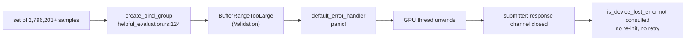
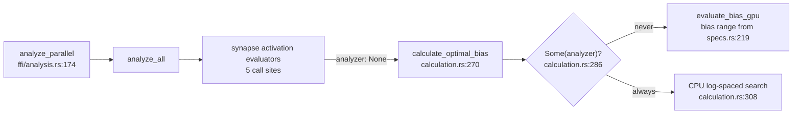
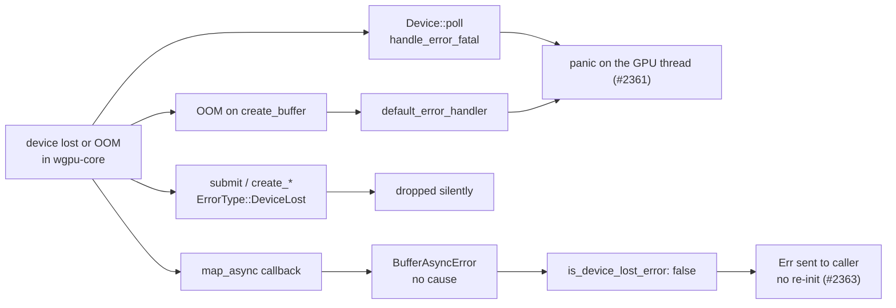

# Security sweep — chunk `9`: GPU dispatch + WGSL shaders

Ledger rules: [`README.md`](README.md). Index entry:
[`lib-sweep-coverage.json`](lib-sweep-coverage.json).

## Record

- **Chunk id:** `9` — matches the `id` in the index.
- **Human name:** GPU dispatch + WGSL shaders — `src/analysis/gpu/**/*.rs`
  (including `queue/`) and `src/shaders/*.wgsl`.
- **Sweep date:** `2026-09-28`
- **Baseline commit:** `a7c3f65108023b93c50e9ac23e6561e0c803e22e`
- **Exposure:** `internal`
- **Swept by:** Issue #2094 (chunk 9 of the #2083 overflow tracker), planned
  under #2231 and split across its slices: shader layer #2232, evaluation
  #2237/#2238, device #2240–#2242, queue core #2243/#2244, queue lifecycle
  #2245/#2246, completeness #2249; scaffolded by Issue #2288.
- **Tracker issue:** `#2094`

Cross-references: the `docs/audits/` bootstrap and the ledger contract this
record follows are #2088 (`tests/issue_2088_sweep_ledger_contract.rs`). The
residual crate-wide `env::set_var` sweep beyond `SEC-fe0b268a3799` belongs to
chunk 13, #2096; the device region below records only the GPU-path
disposition.

### Sweep status — IN PROGRESS

This record is a scaffold. Every file row below reads `pending — <owner>` until
its owning slice sweeps it; the index's `last_swept` date marks when the
scaffold was cut, not a finished sweep. Each slice edits only its own `###`
group in `## Files swept`, its own region under `## Audit sections`, and its own
marked region of the `## Ledger` and `## Refuted / not findings` tables, so
concurrent PRs do not conflict.

### Methodology

Each slice reads its files in full at the baseline commit above and checks them
against the defect classes below, pairing every host-side buffer layout,
binding list and dispatch size with the WGSL declaration it feeds. A finding is
filed in house format (`<!-- finding-id: SEC-… -->`, `<!-- cwe: … -->`) and gets
a `## Ledger` row in the slice's region; a refuted candidate gets a
`## Refuted / not findings` row naming the code that refutes it. Line numbers
are re-verified at the baseline before they are cited.

The filename is `chunk-9`, not the zero-padded `chunk-09` the ledger README
prescribes: the chunk-9 slices already cite this path, and the ledger
contract's `normalise_id` accepts both spellings.

## Defect classes probed

- Host/shader layout mismatch — a Rust struct or buffer whose size, alignment
  or field order disagrees with the WGSL declaration it is bound to, letting a
  shader read or write past the data it was given (CWE-125 / CWE-787).
- Out-of-range invocations — a `global_invocation_id` that is not bounds-checked
  against the real element count before it indexes a storage buffer.
- Barrier divergence — `workgroupBarrier` / `storageBarrier` reached under
  non-uniform control flow.
- NaN / Inf / divide-by-zero — non-finite values produced in a kernel or its
  host-side reduction, and divisors that can be zero.
- Binding-order mismatch — a `build_compute_pipeline` caller whose buffer order
  disagrees with its shader's `@binding(n)`.
- Dispatch-size overflow — workgroup-count arithmetic that can overflow or
  exceed the device's dispatch limit.
- Timeout / availability — a GPU wait, queue or device-loss path that can hang,
  silently fall back, or report an empty result as success.

## Files swept

Line counts as at the baseline commit (`git show <baseline>:<path> | wc -l`):
24 Rust files (9,658 lines) and 10 WGSL shaders (1,338 lines), 34 in total.

`src/shaders/matching.wgsl` (135 lines, dead) and `src/shaders/relu_reduce.wgsl`
(110 lines, unused) were swept at the baseline and have since been deleted
by #2309, so they carry no inventory row below; their audit rows remain in the
shaders audit section. `src/shaders/bias.wgsl` (303 lines) and
`src/analysis/gpu/bias_evaluation.rs` (225 lines) were swept at the baseline —
the former unreachable, the latter dead — and have since been deleted along
with the rest of the unreachable GPU bias path by Issue #2316, so neither
carries an inventory row below; their audit rows remain in the shaders and
evaluation audit sections.

Three files are not named in the #2288 owner list and are assigned to the
group of the module they test or support: `queue/fake_evaluator.rs` (the
`RequestEvaluator` test double for `executor.rs`, driven through
`execution.rs::run_work_loop`) and `queue/wedge_tests.rs` (drives that loop and
the `submission.rs` bounded wait) go to **queue-core**;
`queue/stale_skip_tests.rs` (tests `staleness.rs`) goes to **queue-lifecycle**.

Four files were added after the baseline and had no row until the #2249
reconciliation: `src/analysis/gpu/sample_limits.rs` goes to **evaluation** —
the #2314 pre-allocation guard its callers run before any buffer or bind
group; `src/analysis/gpu/none_field_tests.rs` and
`src/analysis/gpu/queue/none_field_tests.rs` go to **device** — the evidence
for the #2241 entry-point verdict; `src/analysis/gpu/queue/empty_vs_zero_tests.rs`
goes to **queue-core** — the evidence for #2243 check 1. They were read in
full at `3f103b9` because they have no baseline text, and their Lines cell is
the count at that commit, not the baseline. The on-disk inventory is
therefore 27 Rust files and 7 WGSL shaders, still 34.

### shaders

| Path | Lines | Outcome |
| --- | --- | --- |
| `src/analysis/gpu/mod.rs` | 168 | audited, no finding — 56 `pub use` re-exports: 15 used outside `gpu/` through the module root, 41 reached only through a submodule path or not at all (redundant surface, refuted; per-name table in the shaders audit section) |
| `src/analysis/gpu/pipeline_builder.rs` | 157 | audited, no finding — `binding: i as u32` (L36) assigns slots by position and every `STANDARD_BINDINGS`/`BIAS_BINDINGS` slice matches its shader's `@binding` order and access at all 8 call sites; `create_shader_module` (L26, not `_trusted`) keeps runtime bounds checks on; `min_binding_size: None` (L41) defers buffer-size validation to draw time (the size limits themselves are #2237/#2238's) |
| `src/analysis/gpu/shaders.rs` | 392 | finding filed — #2311 (`GPU_INIT_TIMEOUT_SECS` L143 duplicates `device.rs:54` as an independent literal with no equality pin); `WORKGROUP_SIZE` pinned to the 8 embedded kernels by the naga test (L280 at the baseline; `RELU_REDUCE_SHADER` and its `ALL_SHADERS` entry since removed by #2309), the other constants bounded by const asserts |
| `src/shaders/activation.wgsl` | 232 | finding filed — #2308 (`is_finite_value` at L35 is a float self-comparison fast-math may fold, so the L223 output guard can pass an overflowed Inf/NaN as `valid`); `sample_count` guard L195, no barrier, unused `epsilon` refuted |
| `src/shaders/activation_reduce.wgsl` | 101 | audited, no finding — zero-padded load L76–L80 keeps every read in bounds and adds a neutral element; barriers L83/L94 sit under uniform control flow |
| `src/shaders/harmful.wgsl` | 64 | audited, no finding — `length` guard L40 before any access, no barrier, `epsilon` comparisons at L50 reject NaN, no division |
| `src/shaders/harmful_reduce.wgsl` | 92 | audited, no finding — zero-padded load L67–L71; barriers L74/L85 sit under uniform control flow |
| `src/shaders/helpful.wgsl` | 96 | audited, no finding — `length` guard L48 before any access, no barrier, `epsilon` comparisons at L67/L74/L79 reject NaN, no division |
| `src/shaders/helpful_reduce.wgsl` | 116 | audited, no finding — zero-padded load L91–L95; barriers L98/L109 sit under uniform control flow |
| `src/shaders/relu.wgsl` | 89 | finding filed — #2308 (the L63 `is_finite_value` input skip); `length` guard L45, no barrier, `epsilon` guards L73/L81, unused `threshold` refuted |

### evaluation

| Path | Lines | Outcome |
| --- | --- | --- |
| `src/analysis/gpu/activation_evaluation.rs` | 718 | finding filed — #2313 (the `map_async` callback `.expect` at L297 and L666 panics when a timed-out wait drops its receivers, and the batched path aborts when two or more configs are still mapping), #2314 (a set of 4,793,491+ samples exceeds the 128 MiB binding limit at `create_bind_group` L160 and L495, and wgpu 30 panics instead of returning `Err`); the casts at L146/L179/L224/L456/L480/L583, the staging buffers at L266/L278/L528/L540 and the map-wait propagation at L302/L674 are refuted |
| `src/analysis/gpu/harmful_evaluation.rs` | 453 | finding filed — #2313 (the `map_async` callback `.expect` at L376 panics when a timed-out wait drops its receivers, and aborts when two or more maps are still outstanding), #2314 (a set of 8,388,609+ samples exceeds the 128 MiB binding limit at `create_bind_group` L217, and wgpu 30 panics instead of returning `Err`); the casts at L206/L245/L255/L274, the staging buffers at L320/L334 and the map-wait propagation at L383 are refuted |
| `src/analysis/gpu/helpful_evaluation.rs` | 591 | finding filed — #2313 (the `map_async` callback `.expect` at L446 panics when a timed-out wait drops its receivers, and aborts when two or more maps are still outstanding), #2314 (a set of 2,796,203+ samples exceeds the 128 MiB binding limit at `create_bind_group` L124, and wgpu 30 panics instead of returning `Err`); the casts at L295/L349/L365/L374/L382, the `copy_size` readback chain L374→L405→L426→L441/L461 and the map-wait propagation at L455 are refuted |
| `src/analysis/gpu/relu_evaluation.rs` | 242 | finding filed — #2313 (the `map_async` callback `.expect` at L185 panics when a timed-out wait drops its receiver), #2314 (a set of 3,355,444+ samples exceeds the 128 MiB binding limit at `create_bind_group` L128, and wgpu 30 panics instead of returning `Err`); the casts at L117/L166, the staging buffer at L148 and the map-wait propagation at L190 are refuted |
| `src/analysis/gpu/sample_limits.rs` | 210 | audited, no finding — `checked_mul` (L33) bails before the `as u64` widening (L39), both `max_storage_buffer_binding_size` (L41) and `max_buffer_size` (L49) are checked per binding, and the dispatch count (L58–L59) is bounded by `max_compute_workgroups_per_dimension`; every caller passes the live `device.limits()` and the batched paths check the `max_sample_len` their per-slot buffers are sized to (refuted candidates in the evaluation refuted region); read at `3f103b9`, added after the baseline |

### device

| Path | Lines | Outcome |
| --- | --- | --- |
| `src/analysis/gpu/analyzer.rs` | 498 | finding filed — #2332 (the `check_gpu_availability` probe blocks on `request_adapter` L276 and `request_device` L288 with no deadline, behind the `OnceLock` at L255); the `new()` requests at L361/L391, `Limits::default()` at L291/L394 and the missing device-lost / uncaptured-error handler are refuted |
| `src/analysis/gpu/budget.rs` | 245 | audited, no finding — `check` (L111–L119) returns a stage-labelled `Err` once the deadline passes, an unbounded budget is never expired and caps waits at `GPU_BUFFER_MAP_TIMEOUT_SECS`, and the file reads no environment variables |
| `src/analysis/gpu/breaker.rs` | 511 | audited, no finding — a one-way latch whose first `trip` (L149–L172) logs a `warn!` and whose `check` (L187–L198) returns the typed `DiscoveryError::GpuWedged` via `gpu_wedged_error` (L262–L267); the file reads no environment thresholds |
| `src/analysis/gpu/device.rs` | 638 | finding filed — #2332 (`get_adapter_info_internal` blocks on `request_adapter` at L445 with no deadline); every other path returns `Err` or a typed outcome, and the discarded poll at L378 and the no-op block at L309–L316 are refuted |
| `src/analysis/gpu/issue_2332_probe_timeout_test.rs` | 213 | audited, test-only — regression tests for the #2332 fix (`run_gpu_probe_with_timeout`, `check_gpu_availability_with`); every test uses an isolated `GpuCircuitBreaker::new()`, never the global breaker, and none touch real GPU hardware |
| `src/analysis/gpu/none_field_tests.rs` | 130 | audited, test-only — declared under `#[cfg(test)]` (`mod.rs:45`–`:46` at `3f103b9`); builds an all-None `GpuAnalyzer` (L19–L39) and asserts every inherent entry point and `GpuEvaluator` delegation returns the "GPU device unavailable" `Err` — the evidence for the #2241 verdict; no unsafe, no env writes, read at `3f103b9` |
| `src/analysis/gpu/queue/none_field_tests.rs` | 43 | audited, test-only — declared under `#[cfg(test)]` (`queue/mod.rs:64`–`:65` at `3f103b9`); reuses the `gpu/none_field_tests.rs` helpers to assert every `RequestEvaluator` delegation returns `Err` (L15–L43); read at `3f103b9` |

### queue-core

| Path | Lines | Outcome |
| --- | --- | --- |
| `src/analysis/gpu/queue/mod.rs` | 423 | audited, no finding — `GpuFuture::collect` (L100–L115) returns the worker's answer or an `Err` for every non-answer (timeout and stall trip the breaker, a disconnect is a plain `Err`), never an empty or zero `Ok`; `with_deadline` (L234–L237) only stores the deadline; no `unwrap`/`expect`/`.lock()` before the `#[cfg(test)]` module at L240 |
| `src/analysis/gpu/queue/submission.rs` | 1048 | finding filed — #2339 (`send_timeout` at L216/L281/L340/L405/L465/L540 waits the whole batch timeout with no heartbeat or breaker check, and `await_gpu_response` then restarts the same timeout at L102); all seven empty-input short-circuits (L187/L258/L321/L382/L445/L515/L519) run after `breaker.check()?`, and the three that return zero statistics (L382/L445/L519) are indistinguishable from an all-zero answer but unreachable from production callers (refuted); no `unwrap`/`expect`/`.lock()` before the `#[cfg(test)]` module at L571 |
| `src/analysis/gpu/queue/execution.rs` | 928 | audited, no finding — `execute_request` (L67–L254) returns `Err` only for `is_device_lost_error` (L98–L102, L133–L137, L165–L169, L205–L209, L239–L243) and otherwise sends exactly once (L104/L139/L171/L211/L245); every `run_work_loop` device-lost branch sends or finds the caller gone (L406, L477, L513, L436–L445); the byte cap is applied inside the evaluators, not here; no `unwrap`/`expect`/`.lock()` before the `#[cfg(test)]` module at L612 |
| `src/analysis/gpu/queue/executor.rs` | 137 | audited, no finding — every `RequestEvaluator` method (L62–L117) and `GpuAnalyzerFactory::create` (L130–L136) returns the `GpuAnalyzer` result unchanged; the byte cap is #2243's verdict; no `unwrap`/`expect`/`.lock()`/`Mutex` |
| `src/analysis/gpu/queue/scheduling.rs` | 171 | finding filed — #2361 (a panic in `gpu_thread_loop` (L62) skips the L73 exit signal the L72 comment promises, strands every queued request in the bounded channel until the stall window or batch timeout, which then reports a wedge, and `Drop` discards the payload at L166); the work queue is `bounded(get_work_queue_capacity())` at L38–L40 (4/8/16), CWE-400 refuted; the init timeout trips the breaker (L89) and returns a typed error (L92) |
| `src/analysis/gpu/queue/fake_evaluator.rs` | 308 | audited, test-only — declared under `#[cfg(test)]` (`mod.rs:58`–`:59` at the baseline); its `Mutex` (L31, L94) and `.lock().expect` (L107–L108, L171–L172) never compile into the library |
| `src/analysis/gpu/queue/wedge_tests.rs` | 489 | audited, test-only — declared under `#[cfg(test)]` (`mod.rs:63`–`:64` at the baseline); every `expect`/`expect_err` (L145–L470) is a test assertion |
| `src/analysis/gpu/queue/empty_vs_zero_tests.rs` | 439 | audited, test-only — declared under `#[cfg(test)]` (`queue/mod.rs:58`–`:59` at `3f103b9`); drives the production `run_work_loop` with `FakeGpuEvaluator`; its `Box::leak` of one `GpuCircuitBreaker` per harness (L66, as in `wedge_tests.rs:93`) and every `.expect` are test-only, and `stop` (L85–L93) joins the worker thread; the evidence for #2243 check 1; read at `3f103b9` |

### queue-lifecycle

| Path | Lines | Outcome |
| --- | --- | --- |
| `src/analysis/gpu/queue/recovery.rs` | 248 | finding filed — #2363 (neither classifier (L56–L72, L79–L82) matches a device loss or memory exhaustion that wgpu 30 can deliver as an `Err`: the map callback's `BufferAsyncError` drops the cause and `Device::poll` panics), #2365 (the crate's budget-capped timeout text at `device.rs:269`/`:319`/`:381` matches `gpu driver` at L70, so a budget expiry drives needless re-initialisations), #2364 (`NEAT_AI_DISCOVERY_GPU_RETRY_LIMIT` parsing is silent); validation-error mis-classification, forged matches and the `MapRangeError` regression refuted |
| `src/analysis/gpu/queue/staleness.rs` | 266 | audited, no finding — each submission creates its own `bounded(1)` response channel and liveness pair (`submission.rs:202`/`:263`/`:325`/`:390`/`:449`/`:524`, `staleness.rs:55`–`:59`), so a stale result cannot reach a later caller (CWE-362 refuted); a guard dropped after the dequeue check ends in a harmless late send (`execution.rs:104`); `Shutdown` is live by design (`staleness.rs:91`); `BudgetExpired` sends an `Err` (`execution.rs:268`–`:273`) |
| `src/analysis/gpu/heartbeat.rs` | 274 | audited, no finding — a missed heartbeat trips the breaker with `HeartbeatStall` and returns a typed `Err` (`submission.rs:139`–`:141`, `:62`); the `AtomicU64` wrap (L82) is unreachable; another queue's progress can mask a wedge only down to the absolute-timeout backstop; the `0` and 301–600 s windows are silent opt-outs of the #2276 class (not re-filed) |
| `src/analysis/gpu/inflight.rs` | 166 | audited, no finding — a `parking_lot::Mutex<Vec<Entry>>` registry whose caller-side guard removes its own entry by id (L61–L66): no counter to under/overflow, no entry leaked on a worker or caller panic under the default unwind, no poisoning; the read path returns `None` after 50 ms (L29, L86) |
| `src/analysis/gpu/queue/stale_skip_tests.rs` | 362 | audited, test-only — declared under `#[cfg(test)]` (`mod.rs:60`–`:61` at the baseline); its `Mutex` (L13, L41) and `.lock()` (L72) never compile into the library |

## Audit sections

Each slice writes its audit prose only between its own marker and the next.

### shaders

<!-- section: shaders -->

#### Host ↔ WGSL struct parity (Issue #2289)

The 12 `#[repr(C)] bytemuck::Pod` structs in
`src/analysis/samples/gpu_types.rs` against every WGSL struct that mirrors them
(21 declarations across 8 shaders; `matching.wgsl` and `relu_reduce.wgsl` were
deleted by #2309). Field order, scalar types and per-field offsets were
compared member by member; the WGSL size/alignment column is naga 30's `Layouter` output, the
same layout wgpu validates against. No struct uses a `vec3` (or any vector or
nested struct) — every member is a 4-byte `f32`/`u32`, so every WGSL struct
aligns to 4 and its size is `4 × members`, exactly as `repr(C)` lays it out.
Pinned by `tests/issue_2289_gpu_struct_layout.rs`, which fails CI if either
side drifts.

| Struct | Rust file:line | WGSL file:line | Rust size/align | WGSL size/align | Verdict |
| --- | --- | --- | --- | --- | --- |
| `GpuHelpfulSample` | `src/analysis/samples/gpu_types.rs:13` | `helpful.wgsl:1`, `relu.wgsl:1`, `activation.wgsl:1`, `bias.wgsl:4` (`HelpfulSample`); `harmful.wgsl:1` (`HarmfulSample`) | 8 / 4 | 8 / 4 | parity |
| `HelpfulContribution` | `src/analysis/samples/gpu_types.rs:30` | `helpful.wgsl:6`, `helpful_reduce.wgsl:11` | 48 / 4 | 48 / 4 | parity |
| `HelpfulUniforms` | `src/analysis/samples/gpu_types.rs:48` | `helpful.wgsl:21` | 16 / 4 | 16 / 4 | parity |
| `HarmfulContribution` | `src/analysis/samples/gpu_types.rs:58` | `harmful.wgsl:6`, `harmful_reduce.wgsl:11` | 16 / 4 | 16 / 4 | parity |
| `HarmfulUniforms` | `src/analysis/samples/gpu_types.rs:68` | `harmful.wgsl:13` | 16 / 4 | 16 / 4 | parity |
| `ReluContribution` | `src/analysis/samples/gpu_types.rs:78` | `relu.wgsl:6` | 40 / 4 | 40 / 4 | parity |
| `ReluUniforms` | `src/analysis/samples/gpu_types.rs:94` | `relu.wgsl:19` | 16 / 4 | 16 / 4 | parity |
| `BiasResult` | `src/analysis/samples/gpu_types.rs:104` | `bias.wgsl:9` | 16 / 4 | 16 / 4 | parity |
| `BiasUniforms` | `src/analysis/samples/gpu_types.rs:126` | `bias.wgsl:16` | 32 / 4 | 32 / 4 | parity |
| `ActivationOutput` | `src/analysis/samples/gpu_types.rs:140` | `activation.wgsl:6`, `activation_reduce.wgsl:11` | 28 / 4 | 28 / 4 | parity (see decision) |
| `ActivationUniforms` | `src/analysis/samples/gpu_types.rs:153` | `activation.wgsl:16` | 28 / 4 | 28 / 4 | parity (see decision) |
| `ReductionUniforms` | `src/analysis/samples/gpu_types.rs:166` | `helpful_reduce.wgsl:26`, `harmful_reduce.wgsl:18`, `activation_reduce.wgsl:21` | 16 / 4 | 16 / 4 | parity |

WGSL paths are under `src/shaders/`. Every struct-typed `array<T>` global
(`samples`, `contributions`, `outputs`, `partial_sums`, `results`, the
`var<workgroup> shared_data` arrays and `bias.wgsl`'s `shared_samples`) has a
naga stride equal to the Rust `size_of::<T>()` the host multiplies by the
element count.

**Decision — the 28-byte `ActivationUniforms` and `ActivationOutput` are
valid.** WGSL's 16-byte rule for the `uniform` address space
(`RequiredAlignOf(S, uniform) = roundUp(16, AlignOf(S))`, and the uniform
array-stride rule) constrains a struct *nested* inside a uniform buffer and an
array *element* stored there; it does not round up the top-level struct a
`var<uniform>` binds. `activation.wgsl:31` binds `ActivationUniforms` directly
(`var<uniform> uniforms: ActivationUniforms`), and the host uploads exactly
`bytemuck::bytes_of(&uniforms)` — 28 bytes — at
`src/analysis/gpu/activation_evaluation.rs:156` and `:490`, with
`min_binding_size: None` (`src/analysis/gpu/pipeline_builder.rs:41`), so wgpu
checks the 28-byte buffer against naga's 28-byte span. `ActivationOutput` is
only ever an element of `storage`/`workgroup` arrays
(`activation.wgsl:29`, `activation_reduce.wgsl:30`, `:33`, `:39`), where the
stride is `roundUp(AlignOf(T), SizeOf(T)) = roundUp(4, 28) = 28`; the host
sizes those buffers as `size_of::<ActivationOutput>() * n`
(`activation_evaluation.rs:211`, `:277`, `:517`, `:539`, `:596`, `:646`).
naga's validator (`ValidationFlags::all()`) accepts both shaders — it would
report `Disalignment::ArrayStride` or `MemberOffsetAfterStruct` if either rule
were broken — and `uniform_bindings_accept_28_byte_activation_uniforms` pins
that. No padding change is needed.

**Outcome: negative result** — parity holds on all 12 structs; no ledger row
and no issue filed for struct layout.

#### Kernel bounds and arithmetic (Issue #2290)

All 10 `src/shaders/*.wgsl` kernels, read in full at the baseline. Line
numbers are unchanged at the #2289 head (`abd698d`). Every kernel declares
`@compute @workgroup_size(256)`, matching `WORKGROUP_SIZE`
(`src/analysis/gpu/shaders.rs`). Three guard shapes are used:

- **element-wise** (`activation`, `harmful`, `helpful`, `relu`, `matching`):
  `if idx >= uniforms.<count> { return; }` before the first buffer access;
- **reduction** (the four `*_reduce.wgsl`): a lane past `contribution_count`
  loads a zero struct into `shared_data` instead of reading the input, so the
  tree reduction reads only `shared_data[local_idx + stride]` with
  `local_idx < stride <= 128` (max index 255) and never returns early;
- **tiled** (`bias.wgsl`): `in_range = bias_idx < uniforms.bias_count` (L216)
  gates the per-candidate reads and writes, while every lane stays in the tile
  loop to reach both barriers.

Defence in depth: `pipeline_builder.rs:26` uses `create_shader_module`, not the
`_trusted` variant, so wgpu keeps runtime bounds checks on: naga's `Restrict`
policy for storage-buffer access on Metal (`wgpu-hal-30.0.1/src/metal/device.rs:186`)
and on Vulkan without `robustBufferAccess2`, which otherwise supplies the same
guarantee in hardware (`src/vulkan/adapter.rs:2839`–`:2844`). A missed guard
would clamp or read zero rather than read out of bounds.

| Kernel (lines) | `@workgroup_size` line | Bounds guard (`file:line`) | Barrier-safe? | NaN/Inf/div-by-zero handling | Verdict |
| --- | --- | --- | --- | --- | --- |
| `activation.wgsl` (232) | L192 | `activation.wgsl:195` (`idx >= uniforms.sample_count`) | n/a — no barrier, so the early `return` is safe | `is_finite_value` (L35) skips non-finite input (L210) and gates `valid = 1u` on the output (L223); the non-constant divisions are in `logistic`/`swish`/`softsign` with denominators `1 + exp(..)` / `1 + abs(x)` ≥ 1 (`bent_identity` divides by the constant `2.0`); `epsilon` (L21) unread (refuted) | finding — #2308 (the self-comparison guard is foldable under fast-math) |
| `activation_reduce.wgsl` (101) | L67 | zero-padding `activation_reduce.wgsl:76`–`:80` | yes — L83 at function scope, L94 in a constant-bound loop after the non-uniform `if` closes | sums only; the zero pad is the additive identity; `valid` sums ≤ 256 per workgroup, no u32 overflow; no division | clean |
| `bias.wgsl` (303) | L207 | `in_range` `bias.wgsl:216` (gates L224, L247, L287); sample load `bias.wgsl:233`; `tile_end` `bias.wgsl:248` | yes — L244/L283 sit in the tile-loop body outside `if (in_range)`; the loop bound `tile_count` (L228) derives only from a uniform | `is_finite_value` (L38) skips at L253, L264, L273; the NaN pad (L239) is never read because `tile_end` stops the inner loop at the real sample count; `epsilon` (L22) unread (refuted); L228 ceil-div cannot wrap (refuted) | finding — #2308 |
| `harmful.wgsl` (64) | L37 | `harmful.wgsl:40` (`idx >= uniforms.length`) | n/a — no barrier | `abs(..) > uniforms.epsilon` on activation and error (L50) is false for NaN, so a NaN sample contributes zeros; inputs pre-filtered finite on the host; no division | clean |
| `harmful_reduce.wgsl` (92) | L58 | zero-padding `harmful_reduce.wgsl:67`–`:71` | yes — L74 at function scope, L85 in a constant-bound loop | sums only; flag sums ≤ 256 per workgroup; no division | clean |
| `helpful.wgsl` (96) | L45 | `helpful.wgsl:48` (`idx >= uniforms.length`) | n/a — no barrier | `epsilon` comparisons at L67, L74 and L79 are false for NaN; inputs pre-filtered finite on the host; no division | clean |
| `helpful_reduce.wgsl` (116) | L82 | zero-padding `helpful_reduce.wgsl:91`–`:95` | yes — L98 at function scope, L109 in a constant-bound loop | sums only; flag sums ≤ 256 per workgroup; no division | clean |
| `matching.wgsl` (135) | L79 | `matching.wgsl:82` (`idx >= uniforms.from_count`); error reads gated by `error_idx < total_errors` (L106) | n/a — no barrier | `avg_error` division L118 guarded by `error_count > 0u` (L117); non-finite skips via `is_finite_value` (L47) | dead — never compiled into a pipeline; deleted by #2309 |
| `relu.wgsl` (89) | L42 | `relu.wgsl:45` (`idx >= uniforms.length`) | n/a — no barrier | `is_finite_value` (L35) input skip at L63; `relu_positive`/`relu_negative > uniforms.epsilon` at L73/L81; no division (the host's `error_activation / activation` in `relu_evaluation.rs` is guarded by `activation > EPSILON`); `threshold` (L21) unread (refuted) | finding — #2308 |
| `relu_reduce.wgsl` (110) | L76 | zero-padding `relu_reduce.wgsl:85`–`:89` | yes — L92 at function scope, L103 in a constant-bound loop | sums only; count sums ≤ 256 per workgroup; no division | unused — no pipeline builds it; deleted by #2309 |

**Barrier sites.** A barrier reachable only after a thread-dependent early
`return`, or inside a non-uniform branch, would be a finding. None is:

| Barrier | Control flow reaching it | Verdict |
| --- | --- | --- |
| `activation_reduce.wgsl:83` | function scope; no preceding `return`; the L76 `if/else` closes before it | uniform |
| `activation_reduce.wgsl:94` | `for` loop with constant bounds (`stride` 128 → 1); the `local_idx < stride` branch closes at L93 | uniform |
| `harmful_reduce.wgsl:74` | function scope; no preceding `return` | uniform |
| `harmful_reduce.wgsl:85` | constant-bound loop; the branch closes at L84 | uniform |
| `helpful_reduce.wgsl:98` | function scope; no preceding `return` | uniform |
| `helpful_reduce.wgsl:109` | constant-bound loop; the branch closes at L108 | uniform |
| `relu_reduce.wgsl:92` | function scope; no preceding `return` | uniform |
| `relu_reduce.wgsl:103` | constant-bound loop; the branch closes at L102 | uniform |
| `bias.wgsl:244` | tile-loop body, outside `if (in_range)`; loop bound from `uniforms.sample_count` only; `main` has no `return` | uniform |
| `bias.wgsl:283` | same loop body, after `if (in_range)` closes at L280 | uniform |

These verdicts rest on reading the code, not on a tool. naga 30 does not
enforce barrier uniformity: `test_shaders_are_valid_wgsl`
(`src/analysis/gpu/shaders.rs`) validates with `ValidationFlags::all()`, but
naga's `CONTROL_FLOW_UNIFORMITY` check raises `NonUniformControlFlow` only for
expressions that carry a requirement, such as derivatives
(`naga-30.0.1/src/valid/analyzer.rs:915`–`:927`). A barrier statement records
`WORK_GROUP_BARRIER` (`:960`) without being checked against the enclosing
control flow. A future barrier moved under a non-uniform branch would
therefore pass CI, so the table above is the record.

**Arithmetic decisions.**

- *`uniforms.epsilon` guards* — `harmful.wgsl:50` and `relu.wgsl:73`/`:81`
  (also `helpful.wgsl:67`/`:74`/`:79`) compare `>` against a host constant
  `EPSILON = 1e-8` (`src/analysis/samples/mod.rs:29`). A `>` comparison is
  false for NaN, so NaN samples fall through to the zeroed contribution.
- *`bias.wgsl` non-finite handling* — the real mechanism is the
  `is_finite_value` skip at L253 (input), L264 (activated output, charged the
  baseline error) and L273 (corrected error, charged the baseline error). The
  `epsilon` field it declares at L22 is never read (refuted below). The skips
  share the fast-math weakness filed as #2308.
- *`bias.wgsl:228` ceil-div* — `(sample_count + 255u) / 256u` would wrap for
  `sample_count > u32::MAX - 255`. It cannot: the device is requested with
  `wgpu::Limits::default()` (`src/analysis/gpu/analyzer.rs:291`, `:394`),
  whose `max_storage_buffer_binding_size` is 128 MiB
  (`wgpu-types-30.0.1/src/limits.rs:441`). At 8 bytes per
  `GpuHelpfulSample` the `samples` binding holds at most 2^24 samples, and
  `sample_count` is that buffer's own length (`bias_evaluation.rs:125`), so a
  wrapping value never reaches a dispatch. Were it reached, `tile_count`
  would be 0, no sample is read, and every candidate fails
  `min_sample_count` (L292) — fail-safe, not out of bounds.

**Dead shaders.** `matching.wgsl` is dead: `shaders.rs` has no
`include_str!` for it and it is absent from `ALL_SHADERS`, so it is not even
naga-validated. `relu_reduce.wgsl` is unused: it is registered as
`RELU_REDUCE_SHADER` (`shaders.rs:91`) and validated through `ALL_SHADERS`
(`shaders.rs:214`), but no `build_compute_pipeline` call builds it —
`relu_evaluation.rs:33` builds only `RELU_SHADER` — and only `shaders.rs` and
the #2289 layout test reference it. AGENTS.md: "Delete a never-constructed
component unless a concrete writer can be named". No writer is named, so one
removal follow-up covering both was filed as #2309, which has since deleted
both files, `RELU_REDUCE_SHADER` and its `ALL_SHADERS` entry.

**Outcome: one finding** — #2308 (`SEC-e8e1dd84a447`, CWE-754, low). Bounds
guards and barrier placement are sound in all 10 kernels.

#### Pipeline binding order

Issue #2291.

`build_compute_pipeline` (`pipeline_builder.rs:18`) builds one bind group
layout from the caller's `BufferBindingSpec` slice, assigning each entry
`binding: i as u32` (L36) — slot order is the slice order. `STANDARD_BINDINGS`
(L73) is `[storage read, storage read_write, uniform]`; `BIAS_BINDINGS` (L86) is
`[storage read, storage read, storage read_write, uniform]`. Each row checks the
slice against the kernel's `@binding` declarations and against the
`create_bind_group` entries that feed that pipeline's layout.

| Call site | Shader | Bindings slice | Shader `@binding` (index, type, access) | Matching `create_bind_group` entries | Verdict |
| --- | --- | --- | --- | --- | --- |
| `bias_evaluation.rs:30` | `bias.wgsl` | `BIAS_BINDINGS` (L35) | `@binding(0)` storage read (L27), `@binding(1)` storage read (L29), `@binding(2)` storage read_write (L31), `@binding(3)` uniform (L33) | `bias_evaluation.rs:140` — 0 `sample_buffer`, 1 `bias_buffer`, 2 `results_buffer`, 3 `uniform_buffer` | match |
| `activation_evaluation.rs:35` | `activation.wgsl` | `STANDARD_BINDINGS` (L40) | `@binding(0)` storage read (L26), `@binding(1)` storage read_write (L28), `@binding(2)` uniform (L30) | `activation_evaluation.rs:160` and `:495` — 0 `sample_buffer`, 1 `outputs_buffer`, 2 `uniform_buffer` | match |
| `activation_evaluation.rs:53` | `activation_reduce.wgsl` | `STANDARD_BINDINGS` (L58) | `@binding(0)` storage read (L29), `@binding(1)` storage read_write (L32), `@binding(2)` uniform (L35) | `activation_evaluation.rs:236` and `:603` — 0 outputs, 1 `partial_sums_buffer`, 2 `reduction_uniform_buffer` | match |
| `harmful_evaluation.rs:38` | `harmful.wgsl` | `STANDARD_BINDINGS` (L43) | `@binding(0)` storage read (L20), `@binding(1)` storage read_write (L22), `@binding(2)` uniform (L24) | `harmful_evaluation.rs:217` — 0 `sample_buffer`, 1 `contributions_buffer`, 2 `uniform_buffer` | match |
| `harmful_evaluation.rs:56` | `harmful_reduce.wgsl` | `STANDARD_BINDINGS` (L61) | `@binding(0)` storage read (L26), `@binding(1)` storage read_write (L29), `@binding(2)` uniform (L32) | `harmful_evaluation.rs:288` — 0 `contributions_buffer`, 1 `partial_sums_buffer`, 2 `reduction_uniform_buffer` | match |
| `helpful_evaluation.rs:36` | `helpful.wgsl` | `STANDARD_BINDINGS` (L41) | `@binding(0)` storage read (L28), `@binding(1)` storage read_write (L30), `@binding(2)` uniform (L32) | `helpful_evaluation.rs:124` — 0 `sample_buffer`, 1 `contributions_buffer`, 2 `uniform_buffer` | match |
| `helpful_evaluation.rs:54` | `helpful_reduce.wgsl` | `STANDARD_BINDINGS` (L59) | `@binding(0)` storage read (L34), `@binding(1)` storage read_write (L37), `@binding(2)` uniform (L40) | `helpful_evaluation.rs:157` — 0 `contributions_buffer`, 1 `partial_sums_buffer`, 2 `reduction_uniform_buffer` | match |
| `relu_evaluation.rs:33` | `relu.wgsl` | `STANDARD_BINDINGS` (L38) | `@binding(0)` storage read (L26), `@binding(1)` storage read_write (L28), `@binding(2)` uniform (L30) | `relu_evaluation.rs:128` — 0 `sample_buffer`, 1 `contributions_buffer`, 2 `uniform_buffer` | match |

All call sites are in `src/analysis/gpu/`. Every kernel uses `@group(0)` and
entry point `main`, matching the single layout and the `entry_point:
Some("main")` the builder passes. wgpu validates the layout against the shader
module when the pipeline is created, so a drifted slice would fail pipeline
creation rather than bind the wrong buffer. `min_binding_size: None` (L41)
leaves buffer-size checks to draw time. Those size limits belong to issues #2237
and #2238 and are not repeated here.

#### GPU constants

| Constant | Defined at | Value | Checked against | Verdict |
| --- | --- | --- | --- | --- |
| `WORKGROUP_SIZE` | `shaders.rs:122` | `256` | naga test `test_compute_entry_points_declare_workgroup_size` (`shaders.rs:280`) asserts `[WORKGROUP_SIZE, 1, 1]` for every entry point in `ALL_SHADERS`; the 8 `@workgroup_size(256)` kernels agree (10 at the baseline, before #2309 deleted `matching.wgsl` and `relu_reduce.wgsl`) (`tests/issue_2291_chunk_09a_2b_shader_layer_sweep.rs`); const asserts L313–L316 (64..=1024, power of two) | pinned — refuted |
| `GPU_REDUCTION_THRESHOLD` | `shaders.rs:195` | `10_000` | const asserts `shaders.rs:369` (`>= 256`, one workgroup) and `:373` (`<= 100_000`) | bounded — refuted |
| `GPU_SHUTDOWN_TIMEOUT_SECS` | `shaders.rs:156` | `10` | const asserts `shaders.rs:326`–`:327` (5..=30) | bounded — refuted |
| `GPU_BUFFER_MAP_TIMEOUT_MARGIN_SECS` | `device.rs:44` | `5` | const assert `device.rs:621` (`> 0`) | bounded — refuted |
| `GPU_BUFFER_MAP_TIMEOUT_SECS` | `device.rs:49`–`:50` | `295` (`GPU_QUEUE_TIMEOUT_MAX_SECS` 300 at `utils/deadline.rs:46`, minus the 5 s margin) | derived, not a literal; const asserts `device.rs:622` (`> 0`) and `:624` (`< GPU_QUEUE_TIMEOUT_MAX_SECS`) | derived and bounded — refuted |
| `GPU_INIT_TIMEOUT_SECS` | `shaders.rs:143` and `device.rs:54` (two independent literals) | `30` | `shaders.rs:324`–`:325` bound only the shaders copy (5..=60); `device.rs:623`, `mod.rs:134` and `mod.rs:162` assert each copy `> 0`; nothing asserts the two are equal. The live init waits (`analyzer.rs:433`, `queue/scheduling.rs:80`) read the shaders copy; the device copy is re-exported at the module root (`mod.rs:54`) | finding — #2311 (`SEC-4b2140a0cd91`, CWE-1041, low) |

The issue body cites `shaders.rs:324`–`:325` as `WORKGROUP_SIZE` asserts; they
are the `GPU_INIT_TIMEOUT_SECS` bounds. The `WORKGROUP_SIZE` asserts are
L313–L316.

#### Module surface

"Used" means a file outside `src/analysis/gpu/` names the re-export through
the `analysis::gpu` root. `tests/unit/` is not compiled (no `main.rs`), so a use
there does not count.

| Re-export | mod.rs line | Verdict | Evidence |
| --- | --- | --- | --- |
| `GPU_BUFFER_MAP_TIMEOUT_MARGIN_SECS` | L54 | unused | no reference outside `src/analysis/gpu/` |
| `GPU_BUFFER_MAP_TIMEOUT_SECS` | L54 | unused | no reference outside `src/analysis/gpu/` |
| `GPU_INIT_TIMEOUT_SECS` | L54 | unused | device copy; no reference outside `src/analysis/gpu/` (the #2311 duplicate) |
| `GpuAvailabilityResult` | L55 | used | src/ffi_internal/gpu.rs |
| `GpuPerformanceTier` | L55 | unused | only `tests/unit/analysis_implementation.rs` (not compiled); `src/analysis/system.rs` reaches the tier API through `gpu::device` |
| `create_wgpu_instance_safely` | L55 | unused | reached through `gpu::device` only |
| `detect_gpu_tier` | L55 | unused | only `tests/unit/analysis_implementation.rs` (not compiled); `src/analysis/system.rs` uses the `gpu::device` path |
| `detect_unified_memory` | L56 | unused | `src/analysis/system.rs` uses the `gpu::device` path |
| `get_adapter_info_internal` | L56 | unused | no reference outside `src/analysis/gpu/` |
| `map_result_forwarder` | L57 | used | tests/gpu/issue_2313_map_async_dropped_receiver_test.rs (added by #2334 after this sweep's baseline) |
| `no_gpu_result` | L56 | unused | no reference outside `src/analysis/gpu/` |
| `poll_device_until_idle` | L56 | unused | no reference outside `src/analysis/gpu/` |
| `wait_for_buffer_map` | L57 | unused | no reference outside `src/analysis/gpu/` |
| `wait_for_buffer_maps_batch` | L57 | unused | no reference outside `src/analysis/gpu/` |
| `GPU_QUEUE_TIMEOUT_MAX_SECS` | L61 | unused | callers use `analysis::utils` directly |
| `GpuTimeBudget` | L64 | unused | no reference outside `src/analysis/gpu/` |
| `GpuCircuitBreaker` | L68 | used | tests/issue_1991_pr_summary_retention_contract.rs |
| `GpuTripReason` | L68 | used | tests/issue_1991_pr_summary_retention_contract.rs |
| `abandoned_gpu_thread_count` | L68 | unused | callers use the `gpu::breaker` path |
| `check_gpu_breaker` | L68 | unused | callers use the `gpu::breaker` path |
| `global_gpu_breaker` | L69 | used | tests/issue_1991_pr_summary_retention_contract.rs |
| `gpu_breaker_trip_reason` | L69 | unused | callers use the `gpu::breaker` path |
| `is_gpu_breaker_tripped` | L69 | unused | callers (e.g. `src/debug/process_state.rs`) use the `gpu::breaker` path |
| `record_abandoned_gpu_thread` | L70 | unused | callers use the `gpu::breaker` path |
| `reset_gpu_breaker` | L70 | unused | callers use the `gpu::breaker` path |
| `trip_gpu_breaker` | L70 | unused | callers use the `gpu::breaker` path |
| `DEFAULT_GPU_STALL_WINDOW_SECS` | L75 | unused | `src/config/user_facing.rs` uses the `gpu::heartbeat` path |
| `GPU_STALL_WINDOW_ENV` | L75 | unused | `src/config/user_facing.rs` uses the `gpu::heartbeat` path |
| `GpuHeartbeat` | L75 | unused | tests use the `gpu::heartbeat` path |
| `HeartbeatWatch` | L75 | unused | no reference outside `src/analysis/gpu/` |
| `MAX_GPU_STALL_WINDOW_SECS` | L76 | unused | `src/config/user_facing.rs` uses the `gpu::heartbeat` path |
| `MIN_GPU_STALL_WINDOW_SECS` | L76 | unused | `src/config/user_facing.rs` uses the `gpu::heartbeat` path |
| `global_gpu_heartbeat` | L76 | unused | callers use the `gpu::heartbeat` path |
| `GPU_MAX_BATCH_ALLOC_BYTES` | L80 | unused | only `tests/unit/analysis_implementation.rs` (not compiled) |
| `GpuAnalyzer` | L80 | used | src/analysis/synapse/orchestration.rs |
| `GpuEvaluator` | L80 | used | src/analysis/synapse/gpu_evaluation.rs |
| `GpuWorkQueue` | L83 | used | src/analysis/neuron/mod.rs |
| `DEFAULT_BACKOFF_INITIAL_MS` | L85 | used | tests/gpu/issue_647_gpu_device_lost_recovery.rs |
| `DEFAULT_BACKOFF_MAX_MS` | L85 | used | tests/gpu/issue_647_gpu_device_lost_recovery.rs |
| `DEFAULT_GPU_RETRY_LIMIT` | L85 | used | tests/gpu/issue_647_gpu_device_lost_recovery.rs |
| `GPU_RETRY_LIMIT_ENV` | L86 | used | tests/gpu/issue_647_gpu_device_lost_recovery.rs |
| `MINIMUM_GPU_BATCH_SIZE` | L86 | used | tests/gpu/issue_1083_gpu_batch_size_reduction.rs |
| `backoff_delay_ms` | L86 | used | tests/gpu/issue_647_gpu_device_lost_recovery.rs |
| `get_gpu_retry_limit` | L86 | unused | no reference outside `src/analysis/gpu/` |
| `is_device_lost_error` | L87 | used | tests/gpu/issue_647_gpu_device_lost_recovery.rs |
| `is_memory_exhaustion_error` | L87 | used | tests/gpu/issue_1083_gpu_batch_size_reduction.rs |
| `ACTIVATION_REDUCE_SHADER` | L92 | unused | tests use the `gpu::shaders` path |
| `ACTIVATION_SHADER` | L92 | unused | tests use the `gpu::shaders` path |
| `SHADER_GPU_INIT_TIMEOUT_SECS` | L93 | unused | alias of the shaders copy; only the `mod.rs:162` self-assert names it |
| `GPU_SHUTDOWN_TIMEOUT_SECS` | L93 | unused | `queue/scheduling.rs` imports the `gpu::shaders` path |
| `HARMFUL_SHADER` | L94 | unused | tests use the `gpu::shaders` path |
| `HELPFUL_SHADER` | L94 | unused | tests use the `gpu::shaders` path |
| `MIN_NEURON_SAMPLE_COUNT` | L94 | unused | callers use `analysis::constants` |
| `RELU_SHADER` | L94 | unused | tests use the `gpu::shaders` path |
| `WORKGROUP_SIZE` | L94 | unused | callers use the `gpu::shaders` path |
| `get_batch_size_for_tier` | L99 | unused | `#[cfg(test)]`; only `tests/unit/analysis_implementation.rs` (not compiled) |

15 of 56 re-exports are used through the root. The other 41 are redundant
paths to items that stay reachable through their submodule, so they add no C-ABI
or operator surface (refuted below). Pruning them is tidy-up, not security, and
is out of scope here.

**Outcome (#2291): one finding** — #2311 (`SEC-4b2140a0cd91`, CWE-1041, low):
`GPU_INIT_TIMEOUT_SECS` is defined twice with no equality pin. Binding order,
the other five constants and the module surface are sound.

### evaluation

<!-- section: evaluation -->

`src/analysis/gpu/helpful_evaluation.rs` (591 lines) and
`src/analysis/gpu/harmful_evaluation.rs` (453 lines) were read in full at the
baseline (Issue #2237). `src/analysis/gpu/bias_evaluation.rs` (225 lines),
`src/analysis/gpu/relu_evaluation.rs` (242 lines) and
`src/analysis/gpu/activation_evaluation.rs` (718 lines) were read in full at
the baseline (Issue #2238), and their sub-sections cite the shared
dispatch/binding-limit verdict below. Kernel-side tail handling is #2232's verdict, which is linked here rather
than re-derived: the shaders region above records the zero-padded loads at
`helpful_reduce.wgsl:91`–`:95` and `harmful_reduce.wgsl:67`–`:71`.

#### Dispatch and binding limits — shared verdict (Issue #2237)

**Premise correction.** `cap_gpu_batch_size_by_bytes`
(`src/analysis/utils/memory.rs:633`) caps the **number of sample sets** in a
chunk: `(max_batch_bytes / bytes_per_op).max(1)` at `memory.rs:648`, which is
never below 1. It never caps the length of a single set. The helpful module
(L262) and the harmful module (L137) are the only callers. Nothing upstream caps
a set either. `build_samples_from` (`src/analysis/diagnostics/target_data.rs:67`)
yields one sample per matched `obs_index`, and `record_discovery_data` accepts
any number of training rows (`src/record/mod.rs:51`–`:56`).

**Device limits.** Both `request_device` calls pass `wgpu::Limits::default()`
(`src/analysis/gpu/analyzer.rs:291`, `:394`). wgpu-core adopts the requested
limits as they are (`wgpu-core-30.0.1/src/device/resource.rs:553`):

- `max_storage_buffer_binding_size`: 134,217,728 B
- `max_buffer_size`: 268,435,456 B
- `max_compute_workgroups_per_dimension`: 65,535

**Which limit trips first.** The #2112 premise used the 8-byte
`GpuHelpfulSample` binding, which trips at 16,777,217 samples. The contribution
buffers have a wider stride, so they trip much earlier. Each module reaches the
contribution buffer's allocation or binding before it reaches any dispatch:

| Module | Buffer / call | Stride | Limit | First failing set length | Site (program order) |
| --- | --- | --- | --- | --- | --- |
| helpful | contributions, bound at `@binding(1)` | 48 B `HelpfulContribution` | `max_storage_buffer_binding_size` | 2,796,203 | `create_bind_group` `helpful_evaluation.rs:124`, reached through `HelpfulSlotBuffers::new` (L299) — **trips first** |
| helpful | contributions buffer | 48 B | `max_buffer_size` | 5,592,406 | `create_buffer` `helpful_evaluation.rs:110`, which runs before `:124` |
| helpful | samples, bound at `@binding(0)` | 8 B `GpuHelpfulSample` | `max_storage_buffer_binding_size` | 16,777,217 | never first, because `:110`/`:124` have already fired |
| helpful | `dispatch_workgroups` L366 (main), L402 (reduce) | 256 per workgroup | `max_compute_workgroups_per_dimension` | 16,776,961 | never reached |
| harmful | contributions, bound at `@binding(1)` | 16 B `HarmfulContribution` | `max_storage_buffer_binding_size` | 8,388,609 | `create_bind_group` `harmful_evaluation.rs:217` — **trips first** |
| harmful | contributions buffer | 16 B | `max_buffer_size` | 16,777,217 | `create_buffer_init` `harmful_evaluation.rs:196`, which runs before `:217` |
| harmful | `dispatch_workgroups` L246 (main), L316 (reduce) | 256 per workgroup | `max_compute_workgroups_per_dimension` | 16,776,961 | never reached, because `:217` has already fired at every length ≥ 8,388,609 |

**How wgpu 30 reports it: as a panic, not an `Err`.** `CreateBindGroupError::BufferRangeTooLarge`
("Buffer binding {binding} range {given} exceeds `max_*_buffer_binding_size`
limit {limit}", `wgpu-core-30.0.1/src/binding_model.rs:185`) and
`CreateBufferError::MaxBufferSize` (`resource.rs:1146`, classed `Validation` at
`:1174`) both reach `handle_error`. `src` installs no `push_error_scope` and no
`on_uncaptured_error`, so `handle_error_or_return_handler` finds neither a scope
nor a custom handler. It calls `default_error_handler`, which panics with
`"wgpu error: Validation Error …"` (`wgpu-30.0.1/src/backend/wgpu_core.rs:678`,
`:692`–`:694`).

**Queue classification.** The panic unwinds the dedicated GPU thread
(`queue/scheduling.rs:51`). `is_device_lost_error` (`queue/recovery.rs:56`) is
only consulted on an `Err` that `evaluate_*_batch` returns
(`queue/execution.rs:97`–`:101`), so it is **never reached**. The submitter
instead gets `"GPU response channel closed unexpectedly — the GPU thread may
have exited or panicked"` (`queue/submission.rs:143`–`:146`), and later
submissions get `"GPU work queue channel closed"` (`submission.rs:230`).

None of the patterns at `recovery.rs:60`–`:71` matches either message, or the
validation text itself. In particular, `"internal error"` (`:64`) does not
match: wgpu's `Internal` error type is a different filter from `Validation`
(`wgpu_core.rs:660`–`:661`). So there is no device re-initialisation, no retry
and no breaker trip. The request fails, and the analysis call that shares the
queue (`orchestration.rs:872`–`:876`) loses every other GPU request. The same
data fails the same way on the next call.



**Verdict: finding — #2314** (`SEC-1a9af762e205`, CWE-1284, low). The
dispatch-limit overflow itself is refuted as a separate defect: for both
modules, the dispatch limit is never the limit that trips first.

#### `helpful_evaluation.rs` (Issue #2237)

| Check | Verdict | Evidence |
| --- | --- | --- |
| 1 — dispatch / binding limits | finding — #2314 | The dispatches at L366 and L402 are never reached for an oversized set, because the pool's `create_bind_group` (`helpful_evaluation.rs:124`) panics once a set reaches 2,796,203 samples (shared verdict above) |
| 2 — `bias_evaluation.rs` `num_steps` | n/a — bias only, #2238 | This file has no step or range arithmetic |
| 3 — `usize as u32` truncations | refuted — `helpful_evaluation.rs:124` | The five length casts are L295 `max_sample_len as u32`, L349 `length`, L365 `workgroups`, L374 `num_workgroups` and L382 `contribution_count`. Each would wrap only above 4,294,967,295 samples, which is about 103 GB of 24-byte `HelpfulSample`s on the host. L295 runs first, but its wrapped value only sizes `partial_buf_size` (L296). The pool's `create_buffer` at L104/L110 and `create_bind_group` at L124 panic long before that, at 2,796,203. L349–L382 run only after the pool exists, so no truncated value ever reaches a buffer or a dispatch |
| 4 — uninitialised pool / staging buffers | refuted — `helpful_evaluation.rs:441`, `:461` | See the chain below. Each map and read covers only `[0, copy_size)`, and `copy_size` comes from the **current** set's length. The kernels write every element in that range: `helpful.wgsl:95` for `idx < length`, and `helpful_reduce.wgsl:113`–`:114` for each of the `num_workgroups` groups dispatched at L402. Kernel side: the #2232 zero-pad verdict |
| 5 — zeroed vs uninitialised outputs | refuted — `helpful.wgsl:95`, `helpful_reduce.wgsl:114` | Every pool buffer is `create_buffer`, so its contents are not initialised: samples L104, contributions L110, uniforms L118, partial sums L143, reduction uniforms L151 and staging L176. The inputs are rewritten before each dispatch: `write_buffer` samples at L346 and uniforms at L354 and L387. Each output element that is read back is written by its kernel first. As defence in depth, wgpu-core zero-fills any range that was never written before its first use (`wgpu-core-30.0.1/src/command/memory_init.rs:161`, `:250`) |
| 6 — map wait | finding — #2313 (callback panic); `Err` propagation refuted — `helpful_evaluation.rs:455` | The wait itself fails loud. `wait_for_buffer_maps_batch(...).context(...)?` at L455–L456 propagates every `Err`: map error `device.rs:372`, disconnect `:362` and timeout `:382`. `get_mapped_range()` is also propagated with `?` at L462–L464, and no zero-result fallback exists. However, the `map_async` callback's `.expect` (L446) panics when that `?` drops `map_receivers` (L439) before `pool` (L288), because dropping a pending map fires its callback inline (#2313) |

**`copy_size` chain (check 4).**

1. `num_workgroups = (samples.len() as u32).div_ceil(WORKGROUP_SIZE)` (L374) is
   computed for the set being dispatched **now**.
2. `partial_sums_size = size_of::<HelpfulContribution>() * num_workgroups`
   (L375–L377).
3. `used.push((slot_idx, partial_sums_size, num_workgroups as usize, true))`
   (L405). On the non-reduction path, `contribution_size = 48 * samples.len()`
   is pushed instead (L408–L410).
4. `encoder.copy_buffer_to_buffer(source, 0, &pool[slot].staging_buffer, 0, copy_size)`
   (L426). The source is `partial_sums_buffer` or `contributions_buffer`
   (L421–L425).
5. `pool[slot].staging_buffer.slice(0..copy_size)` is mapped at L441 and read at
   L461.

The copy stays inside both of its buffers. The pool is sized from
`max_sample_len` (L293–L296): `partial_buf_size = ceil(max/256) × 48` and
`contrib_buf_size = max × 48`, and the staging buffer is also sized
`contrib_buf_size` (L178). Any set in the batch has `N ≤ max`, so
`ceil(N/256) × 48 ≤ partial_buf_size` and `N × 48 ≤ contrib_buf_size`.

**Verdict: refuted.** A slot sized for a longer set and reused for a shorter one
keeps its stale bytes only past `copy_size`, and those bytes are never copied
or mapped.

Within a chunk, `slot_idx` gives each set its own slot (L335, L413). Across
chunks, the previous chunk has finished before a slot is rewritten: every map
was awaited (L455) and the device was polled idle (L504). `pool[slot_idx]`
cannot go out of range: a chunk holds at most `effective_batch_size` sets
(L311), and `pool_size = effective_batch_size.min(samples_batch.len())` (L287).

#### `harmful_evaluation.rs` (Issue #2237)

| Check | Verdict | Evidence |
| --- | --- | --- |
| 1 — dispatch / binding limits | finding — #2314 | The dispatches at L246 and L316 are never reached for an oversized set, because `create_bind_group` (`harmful_evaluation.rs:217`) panics once a set reaches 8,388,609 samples, and `create_buffer_init` (`:196`) panics once it reaches 16,777,217 (shared verdict above) |
| 2 — `bias_evaluation.rs` `num_steps` | n/a — bias only, #2238 | This file has no step or range arithmetic |
| 3 — `usize as u32` truncations | refuted — `harmful_evaluation.rs:196`, `:217` | The four length casts are L206 `length`, L245 `workgroups`, L255 `num_workgroups` and L274 `contribution_count`; L262 and L257 only widen `u32` to `usize`. Each would wrap only above 4,294,967,295 samples. In program order, all four run after `create_buffer_init` L190/L196. A wrap needs more than 4,294,967,295 samples, far past the point where L196 panics (16,777,217), so no truncated value reaches the GPU. L245, L255 and L274 also run after `create_bind_group` L217, which panics even earlier, at 8,388,609 |
| 4 — uninitialised staging buffers | refuted — `harmful_evaluation.rs:350`–`:356` | Each staging buffer is created fresh for one set and one chunk and is never reused. The reduction path creates it at L320 with `size: partial_sums_size`, and the full path at L334 with `size: contribution_size`. It is pushed together with its source and size (L327–L329 or L341–L343), then filled over its whole length by `copy_buffer_to_buffer(..., contribution_size)` at L350–L356. The whole buffer is mapped at L371 and read at L403 with `slice(..)`, and those are exactly the copied bytes. The zeroed `partial_sums` init (L261–L270) is overwritten by `harmful_reduce.wgsl:90` for each of the `num_workgroups` groups dispatched at L316. Kernel side: the #2232 zero-pad verdict |
| 5 — zeroed vs uninitialised outputs | refuted — `harmful.wgsl:62`, `harmful_reduce.wgsl:90` | These outputs are `create_buffer_init`, so they start zeroed: contributions L196 (from `HarmfulContribution::zeroed()`, L188) and partial sums L263. The inputs are also `create_buffer_init` with their contents: samples L190, uniforms L211 and reduction uniforms L280. The only uninitialised buffers are the staging buffers at L320 and L334, and they are fully overwritten by the copy before they are mapped (check 4). The kernels also write every element that is read back |
| 6 — map wait | finding — #2313 (callback panic); `Err` propagation refuted — `harmful_evaluation.rs:383` | The wait itself fails loud. `wait_for_buffer_maps_batch(...).context(...)?` at L383–L384 propagates map errors, disconnects and timeouts (`device.rs:362`, `:372`, `:382`). `get_mapped_range()` is also propagated with `?` at L404–L406, and no zero-result fallback exists. However, the callback's `.expect` (L376) panics when that `?` drops `map_receivers` (L369) before `batch_staging_buffers` (L163) (#2313) |

**Outcome (#2237): two findings.**

- #2313 (`SEC-d3bf886bc1d3`, CWE-248, medium): after a timed-out map wait, the
  `map_async` callback panics, and with two or more pending maps the process
  aborts.
- #2314 (`SEC-1a9af762e205`, CWE-1284, low): a sample set that is too long
  triggers a wgpu validation panic in place of a typed `Err`.

The `usize as u32` casts, the pool and staging readback ranges, the output
initialisation and the error propagation of the map wait are all sound.

#### Dispatch and binding limits — bias, relu and activation (Issue #2238)

**No byte cap.** None of the three modules calls `cap_gpu_batch_size_by_bytes`
or reads `GPU_MAX_BATCH_ALLOC_BYTES` (268,435,456 B, `analyzer.rs:28`). Each one
sizes every sample-indexed buffer and dispatch directly from `samples.len()`:
`gpu_samples` at bias L97, and `gpu_samples` and the zeroed output `Vec` at
relu L95/L100 and activation L124/L129/L434/L455. The bias results `Vec` (L102)
is the exception: it is sized from `bias_candidates.len()`. Even if they did call it, the cap bounds only
the number of sets per chunk, never the length of one set (shared verdict
above). The device limits are the same `wgpu::Limits::default()` values quoted
there.

**Per-dispatch element ceiling.** `WORKGROUP_SIZE` (256) ×
`max_compute_workgroups_per_dimension` (65,535) = 16,776,960 elements. This is
the largest `N` whose `div_ceil(N, 256)` still dispatches. The #2238 brief
quotes 16,777,215 (2^24 − 1), but that is not the product, and the first
failing length stays 16,776,961 as the shared table above records.

| Module | Buffer / call | Stride | Limit | First failing set length | Site (program order) |
| --- | --- | --- | --- | --- | --- |
| relu | contributions, bound at `@binding(1)` | 40 B `ReluContribution` | `max_storage_buffer_binding_size` | 3,355,444 | `create_bind_group` `relu_evaluation.rs:128` — first to trip |
| relu | contributions buffer / staging buffer | 40 B | `max_buffer_size` | 6,710,887 | `create_buffer_init` L108 and `create_buffer` L148, never first: L108 is still under 256 MiB when L128 fires |
| relu | samples, bound at `@binding(0)` | 8 B `GpuHelpfulSample` | `max_storage_buffer_binding_size` | 16,777,217 | never first, because L128 has already fired |
| relu | `dispatch_workgroups` L167 | 256 per workgroup | `max_compute_workgroups_per_dimension` | 16,776,961 | never reached |
| activation | outputs, bound at `@binding(1)` | 28 B `ActivationOutput` | `max_storage_buffer_binding_size` | 4,793,491 | `create_bind_group` `activation_evaluation.rs:160` (single) and `:495` (batched, per config) — first to trip |
| activation | outputs buffer / direct staging buffer | 28 B | `max_buffer_size` | 9,586,981 | `create_buffer_init` L137/L470 and `create_buffer` L278/L540, never first: L137/L470 are still under 256 MiB when L160/L495 fire |
| activation | samples buffer | 8 B | `max_buffer_size` | 33,554,433 | `create_buffer_init` L131/L448, never first |
| activation | `dispatch_workgroups` L193/L568 (main), L263/L632 (reduce) | 256 per workgroup | `max_compute_workgroups_per_dimension` | 16,776,961 | never reached; the reduce passes dispatch the same `workgroups` value as the main pass |
| bias | samples, bound at `@binding(0)` | 8 B | `max_storage_buffer_binding_size` | 16,777,217 | `create_bind_group` `bias_evaluation.rs:140` — would be first, but `evaluate_bias_gpu` is unreachable (check 2) |
| bias | candidates / results, dispatch L183 | 4 B / 16 B, 256 per workgroup | none reachable | never | sized from `bias_candidates.len()` ≤ 41 (L182): 164 B, 656 B and one workgroup |

**Queue classification.** relu and activation run on the dedicated GPU thread
through the queue (`queue/execution.rs:157`, `:191`, `:231`), so the #2237
verdict above applies unchanged. The binding error is a panic from
`default_error_handler`, not an `Err`. `is_device_lost_error` is never
consulted, and there is no re-initialisation. That verdict is cited here and not
re-derived.

**Verdict: finding — #2314** for relu and activation. #2314 is widened to name
`relu_evaluation.rs:128` and `activation_evaluation.rs:160`/`:495` as further
sites of the same root cause: a single set's length is never checked against
the device limits. The dispatch-limit overflow is refuted as a separate defect
for all three modules. For bias it is also refuted, because its dispatch is one
workgroup.

#### `bias_evaluation.rs` (Issue #2238)

| Check | Verdict | Evidence |
| --- | --- | --- |
| 1 — dispatch / binding limits | refuted — `bias_evaluation.rs:182`–`:183`, `calculation.rs:286` | The dispatch is sized from `bias_candidates.len()` (L182), which is at most 41 (check 2), so it is one workgroup. The only length-driven limit is the 8-byte samples binding at `create_bind_group` L140 (16,777,217 samples, the #2314 pattern). The function is unreachable (check 2), and the latent site is recorded in #2316 |
| 2 — `num_steps` (L87) | refuted — `specs.rs:219`, `calculation.rs:283`, `calculation.rs:290` | L82 rejects only `step < f32::EPSILON`. The sole caller is `calculate_optimal_bias` (`calculation.rs:290`), which passes `get_bias_range(squash)` (`calculation.rs:283`). That function returns only the constants (−10, 10, 1.0) for `BIPOLAR` and (−10, 10, 0.5) otherwise (`specs.rs:219`–`:226`), so `num_steps` is 21 or 41. FFI trace (below): no entry point supplies its own range, and none reaches the GPU branch at all. Latent risk: `evaluate_bias_gpu` is a `pub fn` on the `pub` `GpuAnalyzer` (`gpu/mod.rs:80`). A Rust caller passing, for example, (−1e30, 1e30, 1e-6) would saturate the `as i32` at `i32::MAX` and allocate about 8 GiB of `f32` candidates at L88 (CWE-770). #2316 removes the function |
| 3 — truncations | refuted — `bias_evaluation.rs:104`; bound ≤ 41 | L125 `samples.len() as u32` runs after `create_buffer_init` L104, which exceeds `max_buffer_size` at 33,554,433 samples. A wrap needs more than 4,294,967,295. L126 and L182 `bias_candidates.len() as u32` are at most 41 |
| 4 — uninitialised staging buffer | refuted — `bias_evaluation.rs:186`, `:190` | The staging buffer `create_buffer` L164 is created fresh per call with `size: output_size` (L163, 16 B × current `bias_candidates.len()`). `copy_buffer_to_buffer` L186 fills all `output_size` bytes, `slice(..)` L190 maps exactly those bytes, and L202–L205 reads them. Kernel side: the #2232 verdict (`in_range` guard at `bias.wgsl:216`) |
| 5 — zeroed vs uninitialised outputs | refuted — `bias.wgsl:300` | results is `create_buffer_init` from `BiasResult::zeroed()` (L102, L116). The kernel writes `results[bias_idx]` for every `bias_idx < bias_count` (`bias.wgsl:216`, `:300`), and L183 dispatches `ceil(bias_count / 256) × 256 ≥ bias_count` invocations. An unwritten zeroed element would carry `valid_sample_count = 0` and be skipped by L212 anyway |
| 6 — map wait | finding — #2313 (latent, L195); `Err` propagation refuted — `bias_evaluation.rs:199` | `wait_for_buffer_map(device, &receiver, GPU_BUFFER_MAP_TIMEOUT_SECS).context("Bias buffer mapping failed")?` (L199–L200) propagates every `Err`: map error `device.rs:300`, disconnect `:301` and timeout `:320` (the function starts at `:284`). `get_mapped_range()` is propagated at L202–L204. The callback `.expect` (L195) panics when that `?` drops `receiver` (L191) before `staging_buffer` (L164). There is one pending map, so this is one panic and not an abort. The caller would swallow any `Err` with `if let Ok` (`calculation.rs:290`) and fall back to the CPU search (`calculation.rs:303`), which computes a real result, not zeros. The whole path is unreachable today (#2316) |

**FFI reachability trace (check 2).** `graft_trace_calls evaluate_bias_gpu`
(depth `all`) finds exactly one direct caller, `calculate_optimal_bias`, and
reaches the FFI through `analyze_parallel` (`src/ffi/analysis.rs:174`) →
`analyze_parallel_internal` (`src/ffi_internal/analysis.rs:26`) → `analyze_all`
→ the neuron and synapse activation evaluators → `calculate_optimal_bias`.
Every one of those production call sites passes `analyzer: None`:
`synapse/activation_evaluation.rs:274`, `:338` and `:388`,
`synapse/activation_subset_evaluation.rs:118`, and
`synapse/gpu_evaluation.rs:133`. So the `if let Some(gpu_analyzer) = analyzer`
guard (`calculation.rs:286`) is never taken, and the GPU grid search never runs.
Even if it did run, the range is chosen by `get_bias_range(squash)`
(`calculation.rs:283`), and no FFI field carries a range. This is not a CWE-770
finding, and the dead component is recorded in #2316.



#### `relu_evaluation.rs` (Issue #2238)

| Check | Verdict | Evidence |
| --- | --- | --- |
| 1 — dispatch / binding limits | finding — #2314 | The dispatch at L167 is never reached for an oversized set, because `create_bind_group` (`relu_evaluation.rs:128`) panics once a set reaches 3,355,444 samples (table above) |
| 2 — `bias_evaluation.rs` `num_steps` | n/a — bias only, #2238 | This file has no step or range arithmetic |
| 3 — truncations | refuted — `relu_evaluation.rs:108` | L117 `length` and L166 `workgroups` are the two length casts. Both run after `create_buffer_init` L108, which exceeds `max_buffer_size` at 6,710,887 samples, and L166 also runs after L128 (3,355,444). A wrap needs more than 4,294,967,295 |
| 4 — uninitialised staging buffer | refuted — `relu_evaluation.rs:170`–`:176`, `:180` | The staging buffer `create_buffer` L148 is created fresh per call with `size: contribution_size` (L147, 40 B × the **current** `samples.len()`). `copy_buffer_to_buffer(..., contribution_size)` L170–L176 fills it completely, `slice(..)` L180 maps exactly those bytes, L193–L196 reads them, and L204 stops at `samples.len()`. Kernel side: the #2232 verdict (`relu.wgsl:45` guard) |
| 5 — zeroed vs uninitialised outputs | refuted — `relu.wgsl:64`, `:87` | contributions is `create_buffer_init` from `ReluContribution::zeroed()` (L100, L108). The kernel writes `contributions[idx]` for every `idx < length`, on the skip path (L64) and the normal path (L87) |
| 6 — map wait | finding — #2313 (callback panic); `Err` propagation refuted — `relu_evaluation.rs:190` | `wait_for_buffer_map(device, &receiver, budget.remaining_secs()).context(...)?` (L190–L191) propagates map error, disconnect and timeout (`device.rs:300`, `:301`, `:320`). `get_mapped_range()` is propagated at L193–L195, and no zero-result fallback exists. However, the callback `.expect` (L185) panics when that `?` drops `receiver` (L181) before `staging_buffer` (L148). That kills the GPU thread (`queue/execution.rs:157`), so the timeout never reaches the recovery path |

#### `activation_evaluation.rs` (Issue #2238)

| Check | Verdict | Evidence |
| --- | --- | --- |
| 1 — dispatch / binding limits | finding — #2314 | The dispatches at L193 and L263 (single) and L568 and L632 (batched) are never reached for an oversized set, because `create_bind_group` (`activation_evaluation.rs:160`, `:495`) panics once a set reaches 4,793,491 samples (table above). The batched path also allocates one 28 B × N output buffer per config (L470), so its device footprint is configs × 28 × N, and nothing bounds it (#2314) |
| 2 — `bias_evaluation.rs` `num_steps` | n/a — bias only, #2238 | This file has no step or range arithmetic |
| 3 — truncations | refuted — `activation_evaluation.rs:137`, `:448`, `:470` | L146 `sample_count` runs after `create_buffer_init` L137 (9,586,981). L179 `workgroups` and L224 `contribution_count` also run after L160 (4,793,491). L456 `workgroups` runs after the samples buffer L448 (33,554,433). L480 `sample_count` runs after L470 (9,586,981). L583 `contribution_count` runs after L495 (4,793,491). A wrap needs more than 4,294,967,295 |
| 4 — uninitialised staging buffers | refuted — `activation_evaluation.rs:273`, `:285`, `:636`–`:642`, `:649` | Every staging buffer is created fresh per call (single) or per config (batched) and is never reused. The reduced path (L266, L528) uses `size: partial_sums_size` = 28 B × `workgroups` (L210–L211, L516–L517), and `workgroups` comes from the **current** `samples.len()` (L179, L456). It is filled by `copy_buffer_to_buffer` with the same size at L273, or L636–L642 using the identical L595–L596 formula. The direct path (L278, L540) uses `size: output_size` (L277, L539), filled at L285 and L649 (L646). `slice(..)` at L292, L661 and L680 maps exactly the copied bytes. Kernel side: the #2232 zero-pad verdict (`activation_reduce.wgsl:76`–`:80`) |
| 5 — zeroed vs uninitialised outputs | refuted — `activation.wgsl:211`, `:230`, `activation_reduce.wgsl:99` | The outputs (L137, L470) and partial sums (L215, L520) are `create_buffer_init` from `ActivationOutput::zeroed()` (L129, L213, L455, L518). The kernel writes `outputs[idx]` for every `idx < sample_count` (L211 skip path, L230). The reduce kernel writes `partial_sums[group_id.x]` for each of the `workgroups` groups dispatched at L263/L632, and that is the partial-sums length. The reduction host loops (L315, L691) sum without a `valid` check. That is sound, because an invalid output is written with `output_sq = error_output = 0` (`activation.wgsl:200`–`:203`) |
| 6 — map wait | finding — #2313 (callback panic); `Err` propagation refuted — `activation_evaluation.rs:302`, `:674` | `wait_for_buffer_map(...).context(...)?` (L302–L303) and `wait_for_buffer_maps_batch(...).context(...)?` (L674–L675) propagate map error, disconnect and timeout (`device.rs:300`/`:301`/`:320`, `:361`/`:372`/`:382`). `get_mapped_range()` is propagated at L305–L307 and L681–L683. However, the single path's callback `.expect` (L297) panics when `?` drops `receiver` (L293) before `staging_buffer` (L199). The batched path's (L666) panics when `?` drops `receivers` (L658) before `staging_buffers` (L460), and with two or more configs still mapping, the second panic during unwind aborts the process |

**Outcome (#2238): no new security finding.** relu and activation are further
sites of #2313 and #2314, and both issues are widened to name them. The bias
GPU grid search is unreachable, and its removal is tracked by #2316 (not a
security finding). Its `num_steps` is bounded to 41 today. The `usize as u32`
casts, the staging readback ranges, the output initialisation and the error
propagation of the map wait are all sound. The CPU-only pin test
`tests/issue_2112_gpu_dispatch_bounds.rs` recomputes each numeric bound these
verdicts rest on.

#### `src/analysis/gpu/sample_limits.rs` — gap audit (Issue #2249)

Read in full at `3f103b9`; added after the baseline by #2337 as the #2314 fix.
Findings per defect class: size arithmetic (`checked_mul` L33 → `bail!`, the
`as u64` widening at L39 is lossless since `usize` is at most 64 bits on every
supported target); binding limits are both checked (`max_storage_buffer_binding_size`
L41, `max_buffer_size` L49); dispatch-size overflow is guarded (`div_ceil` L58,
compared at L59); zero samples returns `Ok` with nothing allocated (L28–L30);
every caller passes the live `device.limits()` (`helpful_evaluation.rs:263`–`:266`,
`harmful_evaluation.rs:138`–`:141`, `relu_evaluation.rs:96`,
`activation_evaluation.rs:127`–`:130` and `:435`–`:438`); the batched paths
check the `max_sample_len` their per-slot buffers are sized to
(`helpful_evaluation.rs:300`–`:301`); the reduce-pass partial buffers hold one
element per workgroup (`helpful_evaluation.rs:381`–`:383`), so they are
smaller than the checked contribution binding; `bail!` text interpolates only
counts and byte sizes (already noted in the queue-lifecycle region). Unit
tests L128–L209 pin the struct sizes and the per-path boundaries the #2314
ledger row cites (2,796,203 helpful, 8,388,609 harmful, 3,355,444 relu,
4,793,491 activation).

**Outcome (#2249): no finding.** The SEC-1a9af762e205 ledger status is
finalised by #2250, not here.

### device

<!-- section: device -->

This slice (Issue #2240, first of #2113) re-verifies two named asks at the
baseline: the disposition of **SEC-fe0b268a3799** (#1871: `env::set_var` in
`GpuAnalyzer::new`'s `unsafe` block racing a concurrent `getenv`, because
`new()` runs on the spawned GPU thread and again during device recovery), and
whether a GPU-unavailable run can fall back to CPU without saying so. The
per-file sweep of `analyzer.rs`, `budget.rs`, `breaker.rs` and `device.rs`
belongs to #2241/#2242, and #2242 flips their `## Files swept` rows. The wider
`env::set_var` sweep outside the GPU path belongs to chunk 13 (#2096). This
slice cross-references it and does not repeat it.

#### SEC-fe0b268a3799 — `setup_gpu_environment` sites (Issue #2240)

Every `setup_gpu_environment` site in `src/` (`grep -rn setup_gpu_environment
src`). None discharges an `unsafe` precondition. The three calls are safe calls
into the guarded entry point.

| Site | Kind | Thread context | Verdict |
| --- | --- | --- | --- |
| `src/analysis/gpu/analyzer.rs:23` | `use` import | — | no write here |
| `src/analysis/gpu/analyzer.rs:270` | call in `check_gpu_availability` | lazy: the `gpu_is_available` `OnceLock` (`analyzer.rs:255`) on the first analysis call, and `check_gpu_available_internal` (`src/ffi_internal/gpu.rs:25`) on a host FFI thread | guarded — writes only if `/proc/self/task` counts one thread |
| `src/analysis/gpu/analyzer.rs:352` | call in `GpuAnalyzer::new` (also reached by `new_with_batch_size`, `analyzer.rs:466`) | the spawned GPU thread (`queue/scheduling.rs:51`–`:54`) and the recovery factory (`queue/executor.rs:134`), so at least two threads are always live | guarded — always `Skipped` on these paths. This is the original SEC-fe0b268a3799 trigger, and it is now refused |
| `src/analysis/gpu/device.rs:31` | `use` import | — | no write here |
| `src/analysis/gpu/device.rs:442` | call in `get_adapter_info_internal` | lazy: the `supports_unified_memory` / `get_adapter_info` `OnceLock`s (`analyzer.rs:311`, `:326`) in post-processing | guarded |
| `src/analysis/system.rs:46` | module doc line | — | no write here |
| `src/analysis/system.rs:88` | `pub use` re-export, alongside the two `unsafe fn`s | — | re-export only; see the refuted row on the `unsafe` re-exports |
| `src/analysis/utils/mod.rs:60` | `pub use` re-export, alongside the two `unsafe fn`s | — | re-export only |

#### SEC-fe0b268a3799 — write path (Issue #2240)

The `set_var` was **moved, not removed**. It now has one site,
`platform.rs:62`, and that is the only non-test `env::set_var` in `src/`. Every
other `set_var`/`remove_var` hit is inside a `#[cfg(test)]` module or a
`*_tests.rs` file.

| Symbol | Cited at | Role |
| --- | --- | --- |
| `set_env_if_unset` | `src/analysis/utils/platform.rs:52` | `unsafe fn`, and the sole `env::set_var` (L62). Its `# Safety` contract passes "no concurrent environment access" to every caller |
| `apply_mesa_suppression` | `src/analysis/utils/platform.rs:104` | `unsafe fn`. Calls `set_env_if_unset` at L109, L111 and L113 (the `EGL_LOG_LEVEL`, `MESA_GLSL_CACHE_DISABLE` and `MESA_DEBUG` writes) |
| `apply_xdg_runtime_dir` | `src/analysis/utils/platform.rs:287` | `unsafe fn`. Calls `set_env_if_unset` at L303, only after `prepare_runtime_dir` (L176) returns a trusted 0700 directory (#1904) |
| `suppress_mesa_warnings_if_requested` | `src/analysis/utils/platform.rs:82` | `pub unsafe fn`, `Once`-guarded (L85–L86). The `Once` ensures a single write, not an exclusive one |
| `ensure_xdg_runtime_dir` | `src/analysis/utils/platform.rs:147` | `pub unsafe fn`, `Once`-guarded (L150–L153) |
| `may_mutate_environment` | `src/analysis/utils/platform.rs:345` | the guard: `thread_count == Some(1)`. An unknown count (`None`) is unsafe. Pinned by `test_may_mutate_environment_requires_single_thread` (L698) |
| `live_thread_count` | `src/analysis/utils/platform.rs:351` | counts `/proc/self/task`. A read error at any point returns `None` |
| `setup_gpu_environment` | `src/analysis/utils/platform.rs:405` | the only safe entry point. `NotRequired` when nothing is pending (L406–L408). Counts threads (L410) and returns `Skipped`, with a one-time `warn!` (L382), unless exactly one is live (L411–L413). Only then does it call the two `unsafe fn`s (L421–L422). Non-Linux stub at L429 |

**Verdict: remediated** (by #1873, recorded in
`docs/archive/pr-summaries/pr-summary-1873.md`). Every production path to
`platform.rs:62` passes through `setup_gpu_environment`'s check that exactly one
thread is live. When that check passes, no second thread can exist during the
write, because only an existing thread can spawn one, and nothing between the
count and the write spawns a thread. That code is `quiet_gpu`'s `env::var`
read (`src/config/user_facing.rs:410`), `temp_dir`/`canonicalize` and the
`DirBuilder`/`symlink_metadata` calls. The `tracing::warn!` calls in that window
(`platform.rs:196`, `:213`, `:231`, `:241`, `:251`, `:263`) are all on refusal
paths that return before any write. The original trigger, `GpuAnalyzer::new`
on the spawned GPU thread or in recovery, now always sees at least two threads
and skips the write. `tests/gpu/issue_1873_gpu_env_setup_thread_guard.rs:38`
(`setup_gpu_environment_never_writes_while_threads_live`) and the unit test
`test_setup_gpu_environment_skips_when_other_threads_live`
(`platform.rs:771`) pin that at run time. **No finding.**

#### CPU-fallback cross-check (Issue #2240)

The crate has no CPU analysis path. A missing GPU becomes a typed, logged
refusal at every hop below. `analysis_outcome.rs` and `ffi_internal/gpu.rs` were
read, not changed.

| Symbol | Cited at | Hop |
| --- | --- | --- |
| `no_gpu_result` | `src/analysis/gpu/device.rs:396` | 1 — builds `available: false` with a reason. `is_error: true` on macOS (L397–L408), `false` on Linux and other platforms (L411–L433). `check_gpu_availability` returns it at `analyzer.rs:274`, `:285` and `:301` |
| `GpuAnalyzer::gpu_is_available` | `src/analysis/gpu/analyzer.rs:252` | 2 — caches `check_gpu_availability().available` in a `OnceLock` (L255) |
| `DiscoveryError::GpuUnavailable` | `src/analysis/orchestration.rs:563` | 3 — `analyze_all` returns this typed `Err` before any parquet I/O (L562–L566). There are defence-in-depth copies at `src/analysis/synapse/orchestration.rs:81` and `src/analysis/neuron/mod.rs:195`. `error_kind` maps it to `GpuPermanent` (`src/ffi_types/error_classification.rs:125`) |
| `AnalysisOutcome::gpu_unavailable` | `src/analysis/analysis_outcome.rs:130` | 4 — `analyze_parallel_internal` downcasts the `Err` (`src/ffi_internal/analysis.rs:421`–`:430`), logs a `warn!` (L425), sets `environmentallyDisabled: "gpu_unavailable"` on the `success: false` failure shape, and `errorKind` becomes `gpu_permanent` |
| `AnalysisOutcome::is_environmentally_disabled` | `src/analysis/analysis_outcome.rs:148` | 5 — is `true` for `gpu_unavailable` (test at L238), so `record_failure_unless_disabled` (`src/analysis/target_failure_tracker.rs:192`) keeps the pass out of drought and failure accounting |
| `classify_gpu_unavailable_reason` | `src/ffi_internal/gpu.rs:95` | 6 — the capability probe `check_gpu_available_internal` (L24) → `build_check_gpu_output` (L48, L68) classifies the reason. The default is `GpuPermanent` (L95–L103). A macOS `is_error` result returns `success: false` (L49–L61) |

**Verdict: the no-GPU path is loud and typed. Operators see it** (a `warn!`,
`success: false` and a reason string), **and the FFI caller can tell it apart
from a result** (`errorKind: gpu_permanent`,
`environmentallyDisabled: "gpu_unavailable"`, `gpuAvailable: false`).
**One finding survives: #2318** (`SEC-2b0c59cc73d5`, CWE-754, low). A software
wgpu adapter (`DeviceType::Cpu`, such as Mesa lavapipe) is not treated as
unavailable. `request_adapter` runs with `force_fallback_adapter: false`
(`analyzer.rs:279`, `:364`, `device.rs:448`). In `wgpu-core-30.0.1`
(`src/instance.rs:511`–`:520`, `:596`–`:602`) that flag does not exclude a CPU
adapter; it only ranks one last. `check_gpu_availability` then reports
`available: true` (`analyzer.rs:296`–`:300`). The only sign of that CPU run is
an `info!` line (`analyzer.rs:227`, `:231`) and the free-text adapter name,
because `gpu_info_to_json` (`src/ffi_types/responses/gpu.rs:106`–`:112`) drops
the typed `GpuDeviceType::Software`.

**Outcome (#2240): one finding, #2318.** SEC-fe0b268a3799 is remediated by #1873
and needs no new issue.

#### Entry-point None → Err sites (Issue #2241)

Every `GpuAnalyzer` entry point reads each `Option` field as
`self.X.as_ref().context("…")?` before it touches the GPU, in the order device,
queue, layout, pipeline, then the reduce stage. A `None` field is therefore an
`Err` naming the missing field, never an `Ok`. The unbudgeted wrappers hold no
check of their own: they delegate to their `_with_budget` twin (next table), so
their row cites the twin's checks. The activation reduce checks run only when
`use_reduction` holds (`samples.len() >= GPU_REDUCTION_THRESHOLD`), and on the
direct path the reduce fields are never read. The harmful and helpful reduce
checks are unconditional.

| Entry point | Defined at | device | queue | layout | pipeline | reduce stage |
| --- | --- | --- | --- | --- | --- | --- |
| `evaluate_relu_gpu` | `src/analysis/gpu/relu_evaluation.rs:53` | `src/analysis/gpu/relu_evaluation.rs:81` "GPU device unavailable for ReLU analysis" | `src/analysis/gpu/relu_evaluation.rs:85` "GPU queue not initialised for ReLU analysis" | `src/analysis/gpu/relu_evaluation.rs:89` "GPU ReLU layout not initialised" | `src/analysis/gpu/relu_evaluation.rs:93` "GPU ReLU pipeline not initialised" | — |
| `evaluate_relu_gpu_with_budget` | `src/analysis/gpu/relu_evaluation.rs:63` | `src/analysis/gpu/relu_evaluation.rs:81` "GPU device unavailable for ReLU analysis" | `src/analysis/gpu/relu_evaluation.rs:85` "GPU queue not initialised for ReLU analysis" | `src/analysis/gpu/relu_evaluation.rs:89` "GPU ReLU layout not initialised" | `src/analysis/gpu/relu_evaluation.rs:93` "GPU ReLU pipeline not initialised" | — |
| `evaluate_activation_gpu` | `src/analysis/gpu/activation_evaluation.rs:75` | `src/analysis/gpu/activation_evaluation.rs:110` "GPU device unavailable for activation analysis" | `src/analysis/gpu/activation_evaluation.rs:114` "GPU queue not initialised for activation analysis" | `src/analysis/gpu/activation_evaluation.rs:118` "GPU activation layout not initialised" | `src/analysis/gpu/activation_evaluation.rs:122` "GPU activation pipeline not initialised" | `src/analysis/gpu/activation_evaluation.rs:203` "GPU activation reduce layout not initialised" / `src/analysis/gpu/activation_evaluation.rs:207` "GPU activation reduce pipeline not initialised" |
| `evaluate_activation_gpu_with_budget` | `src/analysis/gpu/activation_evaluation.rs:93` | `src/analysis/gpu/activation_evaluation.rs:110` "GPU device unavailable for activation analysis" | `src/analysis/gpu/activation_evaluation.rs:114` "GPU queue not initialised for activation analysis" | `src/analysis/gpu/activation_evaluation.rs:118` "GPU activation layout not initialised" | `src/analysis/gpu/activation_evaluation.rs:122` "GPU activation pipeline not initialised" | `src/analysis/gpu/activation_evaluation.rs:203` "GPU activation reduce layout not initialised" / `src/analysis/gpu/activation_evaluation.rs:207` "GPU activation reduce pipeline not initialised" |
| `evaluate_activations_batched_gpu` | `src/analysis/gpu/activation_evaluation.rs:382` | `src/analysis/gpu/activation_evaluation.rs:416` "GPU device unavailable for activation analysis" | `src/analysis/gpu/activation_evaluation.rs:420` "GPU queue not initialised for batched activation analysis" | `src/analysis/gpu/activation_evaluation.rs:424` "GPU activation layout not initialised" | `src/analysis/gpu/activation_evaluation.rs:428` "GPU activation pipeline not initialised" | `src/analysis/gpu/activation_evaluation.rs:576` "GPU activation reduce layout not initialised" / `src/analysis/gpu/activation_evaluation.rs:580` "GPU activation reduce pipeline not initialised" |
| `evaluate_activations_batched_gpu_with_budget` | `src/analysis/gpu/activation_evaluation.rs:396` | `src/analysis/gpu/activation_evaluation.rs:416` "GPU device unavailable for activation analysis" | `src/analysis/gpu/activation_evaluation.rs:420` "GPU queue not initialised for batched activation analysis" | `src/analysis/gpu/activation_evaluation.rs:424` "GPU activation layout not initialised" | `src/analysis/gpu/activation_evaluation.rs:428` "GPU activation pipeline not initialised" | `src/analysis/gpu/activation_evaluation.rs:576` "GPU activation reduce layout not initialised" / `src/analysis/gpu/activation_evaluation.rs:580` "GPU activation reduce pipeline not initialised" |
| `evaluate_harmful_batch` | `src/analysis/gpu/harmful_evaluation.rs:80` | `src/analysis/gpu/harmful_evaluation.rs:103` "GPU device unavailable for batched harmful analysis" | `src/analysis/gpu/harmful_evaluation.rs:107` "GPU queue not initialised for batched harmful analysis" | `src/analysis/gpu/harmful_evaluation.rs:111` "GPU layout not initialised for batched harmful analysis" | `src/analysis/gpu/harmful_evaluation.rs:115` "GPU pipeline not initialised for batched harmful analysis" | `src/analysis/gpu/harmful_evaluation.rs:120` "GPU harmful reduce layout not initialised" / `src/analysis/gpu/harmful_evaluation.rs:124` "GPU harmful reduce pipeline not initialised" |
| `evaluate_harmful_batch_with_budget` | `src/analysis/gpu/harmful_evaluation.rs:90` | `src/analysis/gpu/harmful_evaluation.rs:103` "GPU device unavailable for batched harmful analysis" | `src/analysis/gpu/harmful_evaluation.rs:107` "GPU queue not initialised for batched harmful analysis" | `src/analysis/gpu/harmful_evaluation.rs:111` "GPU layout not initialised for batched harmful analysis" | `src/analysis/gpu/harmful_evaluation.rs:115` "GPU pipeline not initialised for batched harmful analysis" | `src/analysis/gpu/harmful_evaluation.rs:120` "GPU harmful reduce layout not initialised" / `src/analysis/gpu/harmful_evaluation.rs:124` "GPU harmful reduce pipeline not initialised" |
| `evaluate_helpful_batch` | `src/analysis/gpu/helpful_evaluation.rs:206` | `src/analysis/gpu/helpful_evaluation.rs:232` "GPU device unavailable for batched helpful analysis" | `src/analysis/gpu/helpful_evaluation.rs:236` "GPU queue not initialised for batched helpful analysis" | `src/analysis/gpu/helpful_evaluation.rs:240` "GPU layout not initialised for batched helpful analysis" | `src/analysis/gpu/helpful_evaluation.rs:244` "GPU pipeline not initialised for batched helpful analysis" | `src/analysis/gpu/helpful_evaluation.rs:249` "GPU helpful reduce layout not initialised" / `src/analysis/gpu/helpful_evaluation.rs:253` "GPU helpful reduce pipeline not initialised" |
| `evaluate_helpful_batch_with_budget` | `src/analysis/gpu/helpful_evaluation.rs:219` | `src/analysis/gpu/helpful_evaluation.rs:232` "GPU device unavailable for batched helpful analysis" | `src/analysis/gpu/helpful_evaluation.rs:236` "GPU queue not initialised for batched helpful analysis" | `src/analysis/gpu/helpful_evaluation.rs:240` "GPU layout not initialised for batched helpful analysis" | `src/analysis/gpu/helpful_evaluation.rs:244` "GPU pipeline not initialised for batched helpful analysis" | `src/analysis/gpu/helpful_evaluation.rs:249` "GPU helpful reduce layout not initialised" / `src/analysis/gpu/helpful_evaluation.rs:253` "GPU helpful reduce pipeline not initialised" |

`evaluate_bias_gpu` (`bias_evaluation.rs:48`, no reduce stage) carried the same
shape of row at this sweep's pinned baseline; it was removed with the whole
unreachable GPU bias path (Issue #2316), so its row is dropped rather than
described as dead.

Only the device check is reachable without a GPU: a `wgpu::Device` cannot be
built in a test, so `src/analysis/gpu/none_field_tests.rs` and
`src/analysis/gpu/queue/none_field_tests.rs` drive every entry point and
delegation on an all-`None` analyser and assert an `Err` carrying
"GPU device unavailable". The queue, layout, pipeline and reduce checks are
pinned by `tests/issue_2113_chunk_09c_device_sweep.rs`, which asserts each cited
`.context("…")` string still guards its entry point in the cited order.
`FakeGpuEvaluator` replaces `GpuAnalyzer` wholesale, so it cannot prove this
property.

#### Entry-point delegations (Issue #2241)

| Caller | Delegates to | Cited at |
| --- | --- | --- |
| `GpuAnalyzer::evaluate_relu_gpu` | `evaluate_relu_gpu_with_budget` | `src/analysis/gpu/relu_evaluation.rs:58` |
| `GpuAnalyzer::evaluate_activation_gpu` | `evaluate_activation_gpu_with_budget` | `src/analysis/gpu/activation_evaluation.rs:82` |
| `GpuAnalyzer::evaluate_activations_batched_gpu` | `evaluate_activations_batched_gpu_with_budget` | `src/analysis/gpu/activation_evaluation.rs:387` |
| `GpuAnalyzer::evaluate_harmful_batch` | `evaluate_harmful_batch_with_budget` | `src/analysis/gpu/harmful_evaluation.rs:84` |
| `GpuAnalyzer::evaluate_helpful_batch` | `evaluate_helpful_batch_with_budget` | `src/analysis/gpu/helpful_evaluation.rs:210` |
| `GpuEvaluator::evaluate_relu` | `evaluate_relu_gpu` | `src/analysis/gpu/analyzer.rs:104` |
| `GpuEvaluator::evaluate_activation` | `evaluate_activation_gpu` | `src/analysis/gpu/analyzer.rs:114` |
| `GpuEvaluator::evaluate_activations_batched` | `evaluate_activations_batched_gpu` | `src/analysis/gpu/analyzer.rs:122` |
| `RequestEvaluator::evaluate_helpful_batch` | `evaluate_helpful_batch_with_budget` | `src/analysis/gpu/queue/executor.rs:72` |
| `RequestEvaluator::evaluate_harmful_batch` | `evaluate_harmful_batch_with_budget` | `src/analysis/gpu/queue/executor.rs:80` |
| `RequestEvaluator::evaluate_relu` | `evaluate_relu_gpu_with_budget` | `src/analysis/gpu/queue/executor.rs:89` |
| `RequestEvaluator::evaluate_activation` | `evaluate_activation_gpu_with_budget` | `src/analysis/gpu/queue/executor.rs:100` |
| `RequestEvaluator::evaluate_activations_batched` | `evaluate_activations_batched_gpu_with_budget` | `src/analysis/gpu/queue/executor.rs:115` |

Every trait method and inherent wrapper forwards to an entry point in the table
above and adds no `Ok` path of its own. The inherent wrappers pass
`GpuTimeBudget::unbounded()`, and `RequestEvaluator` passes the per-request budget.

#### Empty-input Ok short-circuits (Issue #2241)

| Entry point | Guard | Cited at | Returns | Verdict |
| --- | --- | --- | --- | --- |
| `evaluate_relu_gpu_with_budget` | `samples.is_empty()` | `src/analysis/gpu/relu_evaluation.rs:69` | `Ok((ReluStats::new(Positive), ReluStats::new(Negative), 0.0))` | benign: zero-count stats are the true answer for no samples, and the caller reads `count` before any mean |
| `evaluate_activation_gpu_with_budget` | `samples.is_empty()` | `src/analysis/gpu/activation_evaluation.rs:102` | `Ok((0.0, 0.0, 0.0, 0))` | benign: the trailing `0` is the sample count, so no caller can mistake it for a measured result |
| `evaluate_activations_batched_gpu_with_budget` | `activation_configs.is_empty()` | `src/analysis/gpu/activation_evaluation.rs:403` | `Ok(Vec::new())` | benign: one result per config, and there are none |
| `evaluate_activations_batched_gpu_with_budget` | `samples.is_empty()` | `src/analysis/gpu/activation_evaluation.rs:407` | `Ok(vec![(0.0, 0.0, 0.0, 0); activation_configs.len()])` | benign: one zero-count tuple per config, same shape as the single-config path |
| `evaluate_harmful_batch_with_budget` | `samples_batch.is_empty()` | `src/analysis/gpu/harmful_evaluation.rs:95` | `Ok(Vec::new())` | benign: one result per candidate, and there are none |
| `evaluate_helpful_batch_with_budget` | `samples_batch.is_empty()` | `src/analysis/gpu/helpful_evaluation.rs:224` | `Ok(Vec::new())` | benign: one result per candidate, and there are none |

Each short-circuit sits before the `None` checks, so an empty input answers `Ok`
even on an all-`None` analyser. That is sound: no GPU work is needed to answer
for zero samples or zero candidates, and every value is a zero-count or empty
result. `evaluate_bias_gpu` carried two more guards at this sweep's pinned
baseline, both sitting after the `None` checks; the whole function was removed
with the unreachable GPU bias path (Issue #2316).

**Outcome (#2241): no finding.** Every entry point returns `Err` for a `None`
device, queue, layout, pipeline or reduce field, and every delegation forwards
to one of them. The empty-input `Ok` short-circuits are benign.

#### Init timeout — every `pollster::block_on` site (Issue #2242)

`GPU_INIT_TIMEOUT_SECS` (`src/analysis/gpu/device.rs:54`) is not a deadline on
any `block_on` itself. It bounds the warm-up poll and the caller's wait for
`GpuAnalyzer::new()`, and nothing else.

| Site | Cited at | Bounded by | Verdict |
|---|---|---|---|
| Probe `request_adapter` | `src/analysis/gpu/analyzer.rs:276` | Nothing. It runs on the caller's thread inside `check_gpu_availability`, behind the `OnceLock` at `analyzer.rs:255` | **Finding, #2332** |
| Probe `request_device` | `src/analysis/gpu/analyzer.rs:288` | Nothing, as above | **Finding, #2332** |
| Adapter-info `request_adapter` | `src/analysis/gpu/device.rs:445` | Nothing. `get_adapter_info_internal` runs on the caller's thread | **Finding, #2332** |
| `new()` `request_adapter` / `request_device` | `src/analysis/gpu/analyzer.rs:361`, `:391` | They run on the GPU thread (`src/analysis/gpu/queue/scheduling.rs:54`). The caller waits with `recv_timeout(GPU_INIT_TIMEOUT_SECS)` at `scheduling.rs:80`–`:81`, and on timeout it calls `breaker.trip(GpuTripReason::InitTimeout)` (`:89`) and returns `Err(gpu_wedged_error(…))` (`:92`) | Refuted |
| Recovery re-init | `src/analysis/gpu/queue/execution.rs:466` → `src/analysis/gpu/queue/executor.rs:133`–`:134` | It runs on the GPU thread while the caller waits in `wait_for_gpu_response` (`src/analysis/gpu/queue/submission.rs:112`) | Refuted |
| Warm-up poll | `src/analysis/gpu/analyzer.rs:431`–`:435` | `poll_device_until_idle(…, GPU_INIT_TIMEOUT_SECS, …)` returns `Err` at the deadline | Refuted |

#### Limits — `Limits::default()` (Issue #2242)

`required_limits: wgpu::Limits::default()` at `src/analysis/gpu/analyzer.rs:291`
(probe) and `:394` (`new()`) asks for the WebGPU baseline, which every adapter
meets, so the request never fails on limits. A dispatch or binding that exceeds
those limits raises a wgpu validation error. The per-kernel size checks are
tracked in #2237 and #2238, and an uncaptured validation error panics loudly (#2314).
Refuted, no new finding.

#### Device loss (Issue #2242)

There is no `set_device_lost_callback` and no `on_uncaptured_error` anywhere in
`src/`. A lost device still surfaces as an `Err`: `poll_device_until_idle`
returns the poll error at `src/analysis/gpu/device.rs:266`, and the map waits
return a timeout `Err` at `device.rs:318`–`:323` and `:380`–`:385`.
`is_device_lost_error` (`src/analysis/gpu/queue/recovery.rs:56`–`:72`)
classifies those errors by string matching, which is #2115. An uncaptured
validation error panics through wgpu's default handler, which is #2314. Refuted,
no new finding.

#### `device.rs` paths (Issue #2242)

| Symbol | Cited at | Failure outcome |
|---|---|---|
| `create_wgpu_instance_safely` | `src/analysis/gpu/device.rs:178`–`:243` | `catch_unwind` at `:195`–`:200`, `None` on panic at `:240`. Every caller turns `None` into a result: `analyzer.rs:273`–`:275` (`no_gpu_result`), `analyzer.rs:355`–`:360` (`Err`), `device.rs:444` (`?` → `None`) |
| `poll_device_until_idle` | `src/analysis/gpu/device.rs:254`–`:277` | `Ok` only once the queue is empty (`:259`–`:264`). `Err` on a poll error (`:266`) and at the deadline (`:268`–`:273`) |
| `wait_for_buffer_map` | `src/analysis/gpu/device.rs:284`–`:326` | `Err` on a map error (`:300`), on a dropped sender (`:301`–`:303`) and at the deadline (`:318`–`:323`) |
| `wait_for_buffer_maps_batch` | `src/analysis/gpu/device.rs:333`–`:388` | `Ok` for an empty batch (`:338`–`:340`). `Err` on a dropped sender (`:361`–`:363`), on a map error (`:372`) and at the deadline (`:380`–`:385`). The `.expect` at `:370` cannot fire because of the `all(is_some)` guard at `:367` |
| `GPU_BUFFER_MAP_TIMEOUT_SECS` | `src/analysis/gpu/device.rs:49`–`:50` | Derived from the queue maximum minus a margin. The const asserts in `test_buffer_timeout_constants` (`:620`–`:623`) keep it positive and below the queue timeout |
| `no_gpu_result` | `src/analysis/gpu/device.rs:396`–`:433` | Always `available: false` with a reason. `is_error` is `true` on macOS (`:406`) and `false` elsewhere (`:420`, `:430`) |
| `get_adapter_info_internal` | `src/analysis/gpu/device.rs:438`–`:454` | `None` means no adapter info, and its callers log and continue. The unbounded `block_on` at `:445` is part of #2332 |

#### `budget.rs` (Issue #2242)

The file reads no environment variables.

| Symbol | Cited at | Failure outcome |
|---|---|---|
| `unbounded` | `src/analysis/gpu/budget.rs:44` | `deadline: None`. It is never expired, and `remaining` falls back to `GPU_BUFFER_MAP_TIMEOUT_SECS`, so a wait is still capped |
| `from_caller_timeout` | `src/analysis/gpu/budget.rs:54` | Sets a deadline ahead of the caller's timeout |
| `remaining` | `src/analysis/gpu/budget.rs:86` | Saturates at zero |
| `capped` | `src/analysis/gpu/budget.rs:98` | `wait.min(remaining())` |
| `is_expired` | `src/analysis/gpu/budget.rs:104` | Only bounded budgets expire |
| `check` | `src/analysis/gpu/budget.rs:111`–`:119` | Returns a stage-labelled `Err` once expired. Pinned by `exhausted_budget_fails_loudly` (`:209`–`:226`) |

#### `breaker.rs` (Issue #2242)

The file reads no environment thresholds. The shared `parse_env` silent default
(`src/config/helpers.rs:36`–`:38`) is #2122.

| Symbol | Cited at | Failure outcome |
|---|---|---|
| `GpuTripReason` | `src/analysis/gpu/breaker.rs:46`–`:59` | A typed reason carried into every error and skip |
| `trip` | `src/analysis/gpu/breaker.rs:149`–`:172` | A one-way latch. The first trip logs `warn!` |
| `check` | `src/analysis/gpu/breaker.rs:187`–`:198` | `Err` through `error` (`:231`–`:233`) once tripped |
| `warn_analyses_skipped` | `src/analysis/gpu/breaker.rs:211`–`:227` | Logs `warn!` for each skipped analysis |
| `gpu_wedged_error` | `src/analysis/gpu/breaker.rs:262`–`:267` | Typed `DiscoveryError::GpuWedged`. Pinned by `a_suppressed_call_returns_a_typed_wedged_error` (`:397`–`:406`) |
| `GLOBAL_GPU_BREAKER` | `src/analysis/gpu/breaker.rs:270` | Process-wide, reached through `global_gpu_breaker` (`:277`) and `check_gpu_breaker` (`:314`) |
| `gpu_wedged_skip_reason` | `src/analysis/gpu/breaker.rs:324`–`:329` | `Some(reason)` once tripped |
| `reset_gpu_breaker` | `src/analysis/gpu/breaker.rs:332` | Explicit reset. There is no automatic re-arm |

**Outcome (#2242): one finding, #2332** (`SEC-d6747980489b`, CWE-1088, low).
The capability probe (`analyzer.rs:276`, `:288`) and
`get_adapter_info_internal` (`device.rs:445`) block with no deadline, before
the init timeout is armed. Every other `device.rs`, `budget.rs` and `breaker.rs`
path fails loudly with a typed outcome.

#### Post-baseline test files — gap audit (Issue #2249)

Both `src/analysis/gpu/none_field_tests.rs` and
`src/analysis/gpu/queue/none_field_tests.rs` are declared under `#[cfg(test)]`
(`mod.rs:45`–`:46` and `queue/mod.rs:64`–`:65` at `3f103b9`). The first builds
an all-`None` `GpuAnalyzer` (L19–L39) and asserts that every inherent entry
point and the `GpuEvaluator` delegation return the "GPU device unavailable"
`Err` — the evidence for the #2241 verdict. The second reuses those helpers
to assert every `RequestEvaluator` delegation returns the same `Err` (L15–L43).
Neither file has an `unwrap`/`expect` on a production path, neither uses
`unsafe`, neither reads or writes an environment variable, and neither spawns
a thread; their `pub(super)` helpers (`all_none_analyzer`, `samples`,
`assert_device_err`, `CONFIGS`) are shared only inside `#[cfg(test)]`.

**Outcome (#2249): no finding — both files are test-only.**

### queue-core

<!-- section: queue-core -->

This slice (Issue #2243, first of #2114) sweeps `queue/submission.rs` and `queue/execution.rs` at the baseline. Both files are unchanged between the baseline and the time of writing. Checks: 1 empty vs zero, 2 caller-side waiting and `execute_request` error routing, 3 batch byte cap, 4 `send_timeout` → `queue_full_error`, 5 `unwrap`/`expect`/`.lock()` in production code. Thread-loop lifecycle, device-lost string classification and wedge behaviour are #2115's (queue-lifecycle slices #2245/#2246) and are cross-referenced, not re-audited.

#### `src/analysis/gpu/queue/submission.rs` (Issue #2243)

**Check 1 — empty vs zero.** One row per empty-input early return. `empty_vs_zero_tests.rs` (`src/analysis/gpu/queue/empty_vs_zero_tests.rs`) drives each site through the production work loop with `FakeGpuEvaluator` and pins the verdict.

| Function | file:line | Returns | `breaker.check()?` first | Distinguishable from all-zero result | Callers (for `no`) |
| --- | --- | --- | --- | --- | --- |
| `submit_helpful_batch` (L178) | `src/analysis/gpu/queue/submission.rs:187` | a pre-resolved `GpuFuture` whose `collect` yields `Ok(Vec::new())` (L189–L199) | yes, L185 | **yes** — one `HelpfulStats` per sample set, so an empty answer has length 0 and any non-empty request has length ≥ 1 | — |
| `evaluate_helpful_batch` (L250) | `src/analysis/gpu/queue/submission.rs:258` | `Ok(Vec::new())` | yes, L256 | **yes** — per-set length, as above | — |
| `evaluate_harmful_batch` (L313) | `src/analysis/gpu/queue/submission.rs:321` | `Ok(Vec::new())` | yes, L319 | **yes** — one `HarmfulStats` per set | — |
| `evaluate_relu_gpu` (L373) | `src/analysis/gpu/queue/submission.rs:382` | `Ok((ReluStats::new(Positive), ReluStats::new(Negative), 0.0))` (L383–L387) | yes, L380 | **no** — identical to a GPU answer in which no sample fed either orientation and the baseline error is zero | unreachable: the only caller, `evaluate_relu_candidates_split` (`src/analysis/synapse/relu_evaluation.rs:42`, via `GpuEvaluator::evaluate_relu` at `execution.rs:585`–`:591`), submits only when the error-split subset holds `MIN_NEURON_SAMPLE_COUNT` samples (`relu_evaluation.rs:81`, `:128`); a zero answer is rejected by `ReluStats::evaluate` (`src/analysis/samples/statistics.rs:300`), so both yield no candidate |
| `evaluate_activation_gpu` (L434) | `src/analysis/gpu/queue/submission.rs:445` | `Ok((0.0, 0.0, 0.0, 0))` | yes, L443 | **no** — the fourth element is `improved_count`, which the GPU path always returns as `0` (`src/analysis/gpu/activation_evaluation.rs:355`), so no field separates "no samples" from "all sums zero" | unreachable: `evaluate_activation_candidate` (`src/analysis/synapse/activation_evaluation.rs:48`) and `evaluate_activation_for_subset` (`src/analysis/synapse/activation_subset_evaluation.rs:48`) return `Ok(None)` below `MIN_NEURON_SAMPLE_COUNT` before submitting |
| `evaluate_activations_batched_gpu` (L505) | `src/analysis/gpu/queue/submission.rs:515` | `Ok(Vec::new())` for empty `activation_configs` | yes, L512 | **yes** — one tuple per config, so only an empty config list gives length 0 | — |
| `evaluate_activations_batched_gpu` (L505) | `src/analysis/gpu/queue/submission.rs:519` | `Ok(vec![(0.0, 0.0, 0.0, 0); n])` for empty `samples` (L521) | yes, L512 | **no** — same shape and values as an all-zero GPU answer for `n` configs | unreachable: the only caller, `evaluate_all_activation_specs_batched` (`src/analysis/synapse/gpu_evaluation.rs:41`), returns `Ok(Vec::new())` below `MIN_NEURON_SAMPLE_COUNT` (L50) and at zero baseline error (L60) before submitting |

**Verdict (check 1): no finding.** Every short-circuit runs after `breaker.check()?`, so a tripped breaker never reports a clean zero (pinned by `tripped_breaker_suppresses_the_empty_input_fast_paths`, `submission.rs:811`). The three `no` sites return zero-count statistics that no production caller can reach, and an all-zero answer yields no candidate either way (refuted rows below). The #2241 table reads the trailing `0` of `(0.0, 0.0, 0.0, 0)` as a sample count. It is `improved_count`, which the GPU path never fills. That verdict still stands, but for the caller-guard reason recorded here.

**Check 2 — caller-side waiting.**

- `wait_for_gpu_response` (L96–L127) fixes one deadline at L102 and polls at `min(poll_interval, remaining)` (L112). It ends at the absolute timeout (`TimedOut`, L107–L110), at the stall window (`Stalled`, L115–L120), or at once on a dropped sender (`Disconnected`, L122–L124).
- `resolve_gpu_wait` (L131–L148) turns both wedge verdicts into typed errors that trip the breaker (`heartbeat_stall_error` L140, `batch_timeout_error` L142). A disconnect becomes a plain `Err` (L143–L146) without a trip. After a GPU-thread exit the next `send_timeout` fails at once with `"GPU work queue channel closed"` (L230), so no later caller waits.
- `await_gpu_response` (L156–L170) registers the in-flight entry (#1934) and uses the global heartbeat and `gpu_stall_window()`.
- `GpuTimeBudget::from_caller_timeout` (#1928) is built before the send (L207/L270/L330/L395/L454/L529). The worker deadline is therefore anchored earlier than the caller's await deadline and expires first (`src/analysis/gpu/budget.rs:54`).
- `caller_liveness_pair` (#1929) guards live exactly as long as the caller waits: `_caller_guard` for the blocking entry points, and the `GpuFuture` field until `collect` (`mod.rs:100`–`:114` at the baseline) or drop.
- `calculate_gpu_batch_timeout` (`src/analysis/utils/deadline.rs:381`–`:405`) gives half the remaining deadline, clamped to 60–300 s, or 300 s with no deadline.
- **Verdict:** once the request is queued, a GPU thread that drops or never answers cannot hold the caller past `timeout`, and a silent one releases it within the stall window. **But the send phase is outside that bound — finding #2339 (`SEC-1124ca631044`).** `send_timeout(…, timeout)` (L216/L281/L340/L405/L465/L540) waits the full 60–300 s on a full queue. It checks neither heartbeat nor breaker, and the breaker check at L185/L256/L319/L380/L443/L512 has already run. The await then restarts the same `timeout` at L102. So a submitter blocked behind a wedged GPU sits out the whole batch timeout instead of the stall window, and any submitter can wait up to `2 × timeout`.

**Check 3 — batch byte cap (deep trace; also owns the `executor.rs` factory).**

- `GPU_MAX_BATCH_ALLOC_BYTES` (`src/analysis/gpu/analyzer.rs:28`, 256 MiB) is read only by `helpful_evaluation.rs:262`–`:267` and `harmful_evaluation.rs:137`–`:142`. It goes through `cap_gpu_batch_size_by_bytes` (`src/analysis/utils/memory.rs:633`–`:650`), which returns `min(batch_size, 256 MiB / (max_sample_len × bytes_per_sample)).max(1)`. That is a **count of sample sets per chunk**, not a per-set length limit.
- `GpuAnalyzer::batch_size` (`analyzer.rs:472`) is set in `new()` from `get_adjusted_batch_size` (`analyzer.rs:163`). The `NEAT_AI_DISCOVERY_GPU_BATCH_SIZE` override is filtered to 64..=4096 (`src/config/user_facing.rs:39`). `new_with_batch_size` (`analyzer.rs:465`–`:469`) sets the size unfiltered.
- The submission path carries no size at all. `execute_request` hands the evaluator the sample slices and `*budget` unchanged (`execution.rs:90`, `:125`, `:157`, `:191`–`:197`, `:230`–`:231`), and the evaluator caps against its own `batch_size`. The loop reads `RequestEvaluator::batch_size` (`src/analysis/gpu/queue/executor.rs:63`) only on the device-lost path (`execution.rs:396`).
- The factory `create(batch_size_override)` (`executor.rs:131`–`:136`):
  - On memory exhaustion the loop halves `batch_size()` (`execution.rs:396`–`:416`). Below `MINIMUM_GPU_BATCH_SIZE` = 64 (`src/analysis/gpu/queue/recovery.rs:14`) it sends an `Err` and moves on (L399–L414). Otherwise it passes `Some(halved)` to `new_with_batch_size`.
  - A non-OOM recovery passes `None`, so `GpuAnalyzer::new()` restores the auto-detected size. An earlier OOM reduction therefore does not survive a later non-OOM recovery. This is not a safety gap, because the byte cap is recomputed on every call.
  - Halving cannot shrink a single oversized set, because the count is already clamped to 1. The retry fails again, and after `retry_limit` attempts the caller gets an `Err` (L513).
- `evaluate_relu_gpu`, `evaluate_activation_gpu` and `evaluate_activations_batched_gpu` each submit one sample set, so the count cap does not apply and no byte cap exists. The batched path allocates an output buffer and a staging buffer per config (`activation_evaluation.rs:466`–`:470`, `:528`, `:540`) with no aggregate cap. The config count is bounded by the static spec expansion (`src/analysis/activation/specs.rs:481`–`:497`).
- **Verdict: not every path from the queue to a GPU allocation is byte-capped, and a single sample set larger than the cap bypasses it** (`memory.rs:649`, `.max(1)`).
  - At the baseline, a set past the 128 MiB binding limit trips a wgpu validation error, and wgpu's default handler turns it into a **panic** on the GPU thread (#2314). It is not an allocation abort: `Cargo.toml` keeps the default unwind strategy.
  - The unwind drops the request's `response_tx`, so the caller gets an **`Err`** (`"GPU response channel closed unexpectedly"`, `submission.rs:122`–`:124` → `:143`–`:146`) rather than a hang.
  - No new finding. #2314 owns it, and PR #2337 (merged to `Develop` after the baseline, not yet on this milestone branch) returns that `Err` before wgpu is reached.

**Check 4 — `send_timeout` → `queue_full_error`.**

- A full queue returns the typed `GpuWedged` error from `queue_full_error` (L28–L34), which trips the breaker with `BatchTimeout`, at L227/L292/L351/L417/L479/L552.
- A closed channel returns `"GPU work queue channel closed"` at once (L230/L295/L354/L420/L482/L555).
- **Verdict: `Err`, but not promptly.** The full-queue `Err` arrives only after the whole 60–300 s timeout, with no stall-window or breaker short cut. This is finding #2339.

**Check 5 — `unwrap`/`expect`/`.lock()`.** None in production code (L1–L570). Every occurrence is in the `#[cfg(test)]` module at L571. Confirmed.

#### `src/analysis/gpu/queue/execution.rs` (Issue #2243)

**Check 2 — `execute_request` (L67–L254) error routing.**

- **Returned as `Err` to the loop (recovery):** only an evaluator `Err` that `is_device_lost_error` accepts (`recovery.rs:56`–`:72`), at L98–L102 (helpful), L133–L137 (harmful), L165–L169 (ReLU), L205–L209 (activation) and L239–L243 (batched activation). It is re-wrapped as `anyhow!("{e:#}")`.
- **Sent to the caller:** every other result, success or evaluation error, via `response_tx.send(result)` at L104/L139/L171/L211/L245. Examples of evaluation errors: an exhausted budget (`budget.rs:113`), a `None` device field, a map error.
- **The loop's own sends:**
  - an expired-budget stale skip sends an `Err` (`skip_stale_request`, L261–L275, via L352–L355);
  - OOM at the minimum batch size sends an `Err` and moves on (L406–L414);
  - a recovered retry sends from inside `execute_request` (L477);
  - exhausted recovery sends an `Err` (L507–L520). This includes `NEAT_AI_DISCOVERY_GPU_RETRY_LIMIT=0`, where the retry loop body never runs.
- **A dropped receiver:** the send fails only once the caller has returned. That happens after its own timeout or stall verdict, which already tripped the breaker (`submission.rs:139`–`:142`), or after it dropped an uncollected `GpuFuture`. Only the caller side trips the breaker (`submission.rs:29`, `:47`, `:62`, and `scheduling.rs:89`), so the `trace!` loses nothing the caller or the breaker needed.
- **Verdict: no branch neither sends nor returns while a caller waits.**
  - The only arm that does neither is `Shutdown` (L249–L251). It has no caller and is intercepted at L334 before `execute_request`.
  - Recovery gives up without sending only when `has_live_receiver` is false (L436–L445), which means the caller guard has dropped and nobody is waiting.
  - An evaluator panic (#2313/#2314) unwinds the GPU thread and drops the sender, so the caller sees `Disconnected` at `submission.rs:122`.
- Cross-reference #2115 (queue-lifecycle slices #2245/#2246):
  - The budget-capped map-wait timeouts say `"The GPU driver may be unresponsive"` (`src/analysis/gpu/device.rs:269`, `:319`, `:381`). That text matches `is_device_lost_error` (`recovery.rs:71`), so a budget expiry during a map is routed to device re-initialisation rather than straight to the caller.
  - The caller still gets an `Err` or its own timeout verdict. The classification is #2115's to judge.

**Check 3 — how batch size and byte cap reach the evaluators.**

- `execute_request` passes no size. Each evaluator applies `cap_gpu_batch_size_by_bytes` to its own `batch_size` (see the `submission.rs` check 3 trace).
- The loop changes that size only through the factory on the OOM path (L396–L416, L466).

**Check 1 — N/A.** `execute_request` has no empty-input short-circuit. Empty requests never reach it, because `submission.rs` answers them before enqueueing.

**Check 4 — N/A for queue-full; no blocking send.** The worker never sends on the work queue. Each response channel is `bounded(1)`, and the worker sends at most once per request: the device-lost arm returns before its send, and the recovery path sends once. So a response `send` never blocks the GPU thread.

**Check 5 — confirmed.** No `unwrap`/`expect`/`.lock()` before the `#[cfg(test)]` module at L612. The `as u64` casts at L95/L130/L162/L202/L236 (microseconds) and L378 (milliseconds) feed metrics and log fields only (refuted below).

**Outcome (#2243): one finding, #2339** (`SEC-1124ca631044`, CWE-400, low). A submission blocked in `send_timeout` ignores the stall window and the breaker, and its await restarts the timeout. Everything else in `submission.rs` and `execution.rs` fails loudly with a typed or descriptive `Err`.

This slice (Issue #2244, second of #2114) sweeps `queue/scheduling.rs`, `queue/executor.rs` and `queue/mod.rs` at the baseline. `scheduling.rs` and `executor.rs` are unchanged since the baseline. `mod.rs` gained two `#[cfg(test)]` module declarations (#2241, #2243), so baseline L57–L59 sit 3 lower at HEAD and baseline L60 onwards sits 6 lower; the lines below are baseline lines. Checks: 1 empty vs zero, 2 caller-side waiting and error routing, 3 batch byte cap, 4 queue fairness and depth bound (CWE-400), 5 channel/mutex panic discipline. Leaked-thread and wedge lifecycle are #2115's (queue-lifecycle slices #2245/#2246) and are cross-referenced, not re-audited.

#### `src/analysis/gpu/queue/scheduling.rs` (Issue #2244)

**Check 1 — N/A — no result path.** `new()` returns `Ok(Self)` only after `Ok(Ok(()))` at L82. Every other arm returns `Err` (L83–L98). The file submits no work, so it has no empty-input short-circuit.

**Check 2 — error paths in `new()` and `shutdown()`.**

- L31–L32: `breaker.check()?` runs before the spawn, so no new thread is started against a wedged GPU.
- L83–L85, init `Err`: returned with context and no breaker trip, because a failed initialisation is not a wedge. The thread exits after its send (L67).
- L86–L95, init timeout: trips the breaker with `GpuTripReason::InitTimeout` (L89) and returns the typed `gpu_wedged_error` (L92). The `JoinHandle` is dropped when `new()` returns, so the thread is detached, and `work_tx` is dropped with it. If initialisation later completes, the init send fails (trace, L59) and the loop exits on `Disconnected` (`execution.rs:327`–`:332`). If it never completes, the thread is leaked; that accounting is #2115's.
- L96–L98, `Disconnected`: both non-panic arms send (L58, L67), so this arm means `GpuAnalyzer::new()` panicked on the GPU thread. The caller gets a plain `Err` at once. The breaker is not tripped, and the dropped handle discards the payload, so the panic is visible only as the default hook's stderr line. The next analysis retries initialisation and fails fast in the same way (refuted below).
- `shutdown()` (L116–L129) sends `Shutdown` with a 2 s `send_timeout` (L120, L124) and trace-logs a failure only (L127). It is not silent in effect: `Drop` then waits on `exit_rx` (L141–L142), and that wait's `Timeout` arm warns (L152–L156) and calls `record_abandoned_thread` (L161), which trips the breaker. Whether a slow but healthy thread that misses the shutdown window is misjudged as abandoned is #2115's.
- `thread::spawn` (L51) panics if the OS refuses a thread. That panic reaches no `extern "C"` frame unguarded, because the analysis entry points run inside `catch_unwind` (`src/ffi/analysis.rs:114`, `:182`) (refuted below).

**Check 3 — N/A — no batch here.** The evaluator is built inside the thread by `GpuAnalyzer::new()` (L54) with the auto-detected batch size. The byte cap is applied in the evaluators (#2243 check 3).

**Check 4 — queue fairness and depth bound (deep trace).**

- **Depth.** The work queue is `bounded(queue_capacity)` (L38–L40). `get_work_queue_capacity` returns 4, 8 or 16 by memory tier (`src/analysis/utils/memory.rs:655`–`:668`). Every other channel in the three files is bounded too: init and exit are `bounded(1)` (L44, L48), and each request's response channel is `bounded(1)` (`submission.rs:202`, `:263`, `:325`, `:390`, `:449`, `:524`, and the pre-resolved empty future at `:189`). **No queue-side buffer is unbounded.**
- **Service.** One GPU thread takes one request at a time (`execution.rs:316`) and runs it to completion before the next `recv_timeout`. The buffer is FIFO.
- **Blocked senders.** crossbeam-channel 0.5.17 makes no FIFO hand-off among blocked senders. A woken sender retries `start_send`, and when a barging sender has taken the slot it re-registers at the back (`crossbeam-channel-0.5.17/src/flavors/array.rs:357`–`:399`, `src/waker.rs:55`). Each blocked sender is still bounded by its own `send_timeout`, which ends in `queue_full_error`.
- **Starvation bound.** Each request's worker time is capped by its `GpuTimeBudget::from_caller_timeout` (`src/analysis/gpu/budget.rs:54`–`:56`, delegating to `from_caller_timeout_at` at `:61`–`:65`), which is at most the caller's timeout minus the margin, and so at most 300 s (`GPU_QUEUE_TIMEOUT_MAX_SECS`). #2243's byte-cap verdict bounds the allocation **per chunk** (256 MiB through `cap_gpu_batch_size_by_bytes`, `memory.rs:633`–`:650`), not the number of chunks. So one maximum-size `HelpfulBatch` or `HarmfulBatch` runs its chunks back to back inside that one budget, and a caller submitting maximum-size batches can hold the GPU thread for up to its budget per request. A caller queued at depth `d` could need up to `d` budgets before service, but its own await deadline (`submission.rs:102`–`:110`, at most 300 s) ends its wait first with a typed timeout or stall error. The worker then skips the stale request without running it (`execution.rs:352`–`:355`).
- **Per-caller share.** There is no per-caller quota, but each caller thread has at most one outstanding request. The blocking entry points hold the caller for the whole send and await, and the only `GpuFuture` in production is collected before that thread's next submission (`src/analysis/synapse/target_analysis/mod.rs:424`–`:447`).
- **Response channels cannot accumulate.** There is one `bounded(1)` channel per outstanding request, freed when both the request and the caller drop it. The exception is the stranded-after-panic case in check 5 (finding #2361).
- **Full queue.** A full queue does **not** fail fast. The submitter blocks for the whole `timeout` and only then returns `queue_full_error` (`submission.rs:28`–`:34`). That is finding #2339, already filed by #2243.
- **Verdict (CWE-400): refuted.** The depth is bounded at L40, every wait ends at a bounded deadline with a typed `Err`, and no caller can monopolise the thread for longer than one request budget. The send-phase overrun is #2339. No new finding.

**Check 5 — channel/mutex panic discipline (deep trace).**

Every `unwrap`/`expect`/`.lock()`/`Mutex` in the three files, and in the two queue-core test files they declare, at the baseline:

| File | Site | Kind | Production or test |
| --- | --- | --- | --- |
| `scheduling.rs` | — | none in 171 lines | — |
| `executor.rs` | — | none in 137 lines | — |
| `mod.rs` | L356, L378 | `.unwrap()` on `queue.deadline` | test — `#[cfg(test)] mod tests` at L240 |
| `fake_evaluator.rs` | L31, L94 | `Mutex` import, `Arc<Mutex<Vec<Observation>>>` | test — `#[cfg(test)] mod fake_evaluator` (`mod.rs:58`–`:59`) |
| `fake_evaluator.rs` | L107–L108, L171–L172 | `.lock().expect("fake GPU observation buffer poisoned")` | test — as above |
| `wedge_tests.rs` | L145, L172, L210, L262, L263, L331, L356 | `.expect(…)` | test — `#[cfg(test)] mod wedge_tests` (`mod.rs:63`–`:64`) |
| `wedge_tests.rs` | L295, L399, L425, L433, L470 | `.expect_err(…)` | test — as above |

**Production hits: zero.** `fake_evaluator.rs` is test-only: confirmed. crossbeam channels do not poison, so no closed channel or lock can panic the worker. The only implicit production panic site is `thread::spawn` (L51), covered in check 2.

**GPU-thread panic path.** The spawned closure (L51–L77) has no `catch_unwind`.

- A panic in `gpu_thread_loop` (L62) unwinds past `exit_tx.send(())` at L73. The comment at L72 ("Always signal exit, even if initialisation failed or loop panicked") is **inaccurate**. The unwind drops `exit_tx`, which `Drop` sees as `Disconnected` (L163). So `Drop` does not sit out the shutdown timeout, which is right in effect, but no exit signal is sent. `let _ = handle.join()` (L166) discards the panic payload.
- **The in-flight caller** gets an `Err` at once. Its `response_tx` drops in the unwinding frame, and the caller sees `Disconnected` (`submission.rs:122`–`:124`) and gets `"GPU response channel closed unexpectedly"` (`:143`–`:146`). The breaker is not tripped.
- **Blocked and later submitters** get an `Err` at once. Dropping `work_rx` disconnects the channel and wakes blocked senders (`array.rs:498`–`:508`), and `send_timeout` returns `"GPU work queue channel closed"` (`submission.rs:230`).
- **Queued callers are not told.** crossbeam's array flavour only marks the channel disconnected when its last receiver drops. Buffered messages are dropped when the channel is freed (`array.rs:540`–`:570`), which is after every `Sender` has gone. `work_tx` (`mod.rs:210`) lives until the queue drops, so each queued request's `response_tx` stays alive. Its caller waits out the stall window (default 30 s; the full 60–300 s batch timeout when the window is `0` or another live queue beats the process-wide heartbeat). It then returns a stall or timeout `GpuWedged` error that trips the breaker (`submission.rs:139`–`:142`), naming a wedge rather than the panic. **Finding #2361 (`SEC-f0d19ede542c`, CWE-755, low).**
- **Breaker and logging.** The panic itself neither trips the breaker nor logs through `tracing`. The breaker is tripped only later, by a stranded queued caller's stall or timeout verdict. The payload is lost at L166, and the only record is the default panic hook's stderr line (the crate installs no hook).
- Reachable panics on this thread today: #2313 (`map_async` `.expect`) and #2314 (wgpu validation panic, being fixed by PR #2337).

#### `src/analysis/gpu/queue/executor.rs` (Issue #2244)

**Check 1 — N/A — no early return.** Each `RequestEvaluator for GpuAnalyzer` method (L62–L117) forwards to its `GpuAnalyzer` method and returns that `Result` unchanged.

**Check 2 — error routing: no finding.** No method maps, logs or drops an `Err`. `GpuAnalyzerFactory::create` (L130–L136) returns `GpuAnalyzer::new()` or `new_with_batch_size(size)` unchanged. The loop routes a failed re-initialisation (`execution.rs:466`) per #2243's `run_work_loop` verdict.

**Check 3 — batch byte cap: #2243's verdict applies, not re-traced.** For `create(batch_size_override)`: the OOM path passes `Some(halved)` and stops below `MINIMUM_GPU_BATCH_SIZE` = 64. A non-OOM recovery passes `None`, restoring the auto-detected size. The byte cap is recomputed on every call, and a single oversized set is #2314's (see the `submission.rs` check 3 trace above).

**Check 4 — N/A — no channel or queue.** `batch_size()` (L63–L65) is read only on the OOM path (`execution.rs:396`).

**Check 5 — confirmed: none.** No `unwrap`/`expect`/`.lock()`/`Mutex` in 137 lines, and no test module. A panic inside `GpuAnalyzer::new` during recovery unwinds the GPU thread and follows the `scheduling.rs` panic path (#2361).

#### `src/analysis/gpu/queue/mod.rs` (Issue #2244)

**Check 1 — `GpuFuture::collect` and `with_deadline`: no finding.**

- `collect` (L100–L115) calls `await_gpu_response` and returns its result. The answer is the worker's own `Result`. `TimedOut` and `Stalled` become typed `GpuWedged` errors that trip the breaker, and `Disconnected` becomes a plain `Err` (`submission.rs:139`–`:146`). A timed-out request therefore always yields `Err`, never an empty or zero `Ok`.
- An abandoned future (dropped uncollected) yields nothing to anyone. Its drop releases `caller_guard` (L91), and the worker skips the request (`execution.rs:352`–`:355`).
- The only `Ok(Vec::new())` future is the pre-resolved one for an empty input (`submission.rs:187`–`:199`), which #2243 check 1 found distinguishable.
- `with_deadline` (L234–L237) only stores the deadline and never short-circuits a submission. A deadline that has already passed gives the 60 s floor (`src/analysis/utils/deadline.rs:396`–`:399`), a bounded wait rather than an empty result. The overrun past the deadline is #2339's.

**Check 2 — caller-side waiting: covered.** `collect` uses the same bounded wait as the blocking entry points. The `timeout` it restarts (`mod.rs:105`) is part of #2339. Every work variant of `GpuWorkRequest` (L124–L189) carries exactly one `response_tx`, `budget` and `liveness`. `Shutdown` (L191) carries none and is intercepted before `execute_request`.

**Check 3 — N/A — no size here.** The variants carry sample payloads (`Vec<Arc<Vec<HelpfulSample>>>` L133, `(Arc<Vec<HelpfulSample>>, f32)` L147, `Vec<HelpfulSample>` L157/L167/L182) with no size field. The cap is applied in the evaluators (#2243 check 3).

**Check 4 — depth bound held.** `work_tx: Sender<GpuWorkRequest>` (L210) is the bounded sender created at `scheduling.rs:38`–`:40`. The struct holds no other buffer (see the `scheduling.rs` check 4).

**Check 5 — confirmed.** No `unwrap`/`expect`/`.lock()`/`Mutex` in production (L1–L239). The two `.unwrap()` calls (L356, L378) are in the `#[cfg(test)]` module at L240. `fake_evaluator`, `stale_skip_tests` and `wedge_tests` are declared `#[cfg(test)]` (L58–L64), as are `empty_vs_zero_tests` and `none_field_tests`, added since the baseline.

**Outcome (#2244): one finding, #2361** (`SEC-f0d19ede542c`, CWE-755, low). A GPU-thread panic strands the queued requests until the stall window or batch timeout, which then report a wedge, and `Drop` discards the panic payload. The queue depth is bounded (CWE-400 refuted). There are no production `unwrap`/`expect`/`.lock()` sites in the three files, and `fake_evaluator.rs` is test-only.

#### `src/analysis/gpu/queue/empty_vs_zero_tests.rs` — gap audit (Issue #2249)

Declared under `#[cfg(test)]` at `queue/mod.rs:58`–`:59`. The harness (L43–L94)
runs the production `run_work_loop` on its own thread with `FakeGpuEvaluator`
(`WedgeBehaviour::Completes`). `Box::leak` (L66) is bounded to one breaker per
test, matching `wedge_tests.rs:93`. `stop` (L85–L93) sends `Shutdown` with a
1 s `send_timeout` and joins the worker thread. Each test asserts
`FakeGpuProbe::calls` to prove the short-circuit never reached the fake device
for an empty request, and reached it exactly once for an all-zero one. It is
the pinning evidence cited by the #2243 check 1 rows and the queue-core
refuted rows.

**Outcome (#2249): no finding — test-only.**

### queue-lifecycle

<!-- section: queue-lifecycle -->

This slice (Issue #2245, first of #2115) sweeps `queue/recovery.rs` — the
`is_device_lost_error` and `is_memory_exhaustion_error` substring classifiers —
against the wgpu 30.0.1 / naga 30.0.1 error text pinned by `Cargo.lock`, and the
`run_work_loop` retry loop they feed. Crate lines are at the baseline
`a7c3f65`; `recovery.rs`, `execution.rs`, `src/config/user_facing.rs` and
`src/config/helpers.rs` are unchanged at HEAD. wgpu lines are in the crates.io
sources (`wgpu-30.0.1/`, `wgpu-core-30.0.1/`, `wgpu-types-30.0.1/`,
`wgpu-hal-30.0.1/`, `naga-30.0.1/`). The table is pinned by
`tests/issue_2245_gpu_device_lost_classification.rs`. `staleness.rs`,
`heartbeat.rs`, `inflight.rs` and `stale_skip_tests.rs` are swept by #2246 below.

#### `src/analysis/gpu/queue/recovery.rs` — substring table (Issue #2245)

`is_device_lost_error` (`recovery.rs:56`–`:72`) lower-cases
`format!("{error:#}")` (`:57`) and matches 12 substrings (`:60`–`:71`).
`is_memory_exhaustion_error` (`:79`–`:82`) matches two; the retry loop uses it
to halve the batch size (Issue #1083). Verdicts:

- `device-lost` — the producer's text means device loss or a recoverable
  resource exhaustion;
- `over-broad` — a producer matches whose meaning is not device loss;
- `no known producer` — no wgpu 30 / naga 30 type, and no crate string that
  reaches the classifier, contains it.

"Reaches the classifier" means the text can arrive as an evaluator `Err` in
`execute_request` (`execution.rs:98`–`:102` and the four sibling arms, #2243).
wgpu 30 sends most of its errors elsewhere:

- device-lost-typed errors from `Queue::submit` and every `create_*` are
  dropped (`wgpu-30.0.1/src/backend/wgpu_core.rs:304`, "will be surfaced via
  callback");
- validation, internal and out-of-memory errors go to the error sink; with no
  error scope and no custom handler, `default_error_handler` panics
  (`wgpu_core.rs:657`–`:694`);
- a device error from `Device::poll` panics through `handle_error_fatal`
  (`wgpu_core.rs:1924`, `:349`);
- every map-callback error, device loss included, becomes the cause-free
  `BufferAsyncError` (`wgpu_core.rs:2241`).



| # | Substring | wgpu 30 / naga 30 producer(s) | Crate-internal producer(s) | Reaches the classifier as `Err`? | Verdict |
| --- | --- | --- | --- | --- | --- |
| 1 | `device is lost` | `wgpu_core::device::DeviceError::Lost` — "Parent device is lost" (`wgpu-core-30.0.1/src/device/mod.rs:345`). `wgpu_hal::DeviceError::Lost` — "Device is lost" (`wgpu-hal-30.0.1/src/lib.rs:384`) is converted to the core type by `DeviceError::from_hal` (`device/mod.rs:363`–`:369`) before it is displayed | none | No — poll panics (`wgpu_core.rs:1924`), a map yields `BufferAsyncError` (`wgpu_core.rs:2241`), submit and create drop it (`wgpu_core.rs:304`), and `get_mapped_range` never checks device validity (`wgpu-core-30.0.1/src/resource.rs:831`). Finding #2363 | `device-lost` |
| 2 | `device lost` | none as an error — only `panic!` payloads in wgpu-hal (`wgpu-hal-30.0.1/src/auxil/dxgi/result.rs:17`, `vulkan/mod.rs:1686`) | `execution.rs:516` "GPU device lost and recovery failed after …" — sent to the caller, never re-classified | No | `no known producer` |
| 3 | `device was lost` | none | none | No | `no known producer` |
| 4 | `gpu device poll error` | wraps `wgpu::PollError` (`wgpu-types-30.0.1/src/lib.rs:243`–`:265`): `Timeout` "The requested Wait timed out before the submission was completed." and `WrongSubmissionIndex` — neither means device loss | `device.rs:266` `"GPU device poll error ({label}): {e}"` | No — `poll_device_until_idle` uses `PollType::Poll` (`device.rs:258`), for which `Device::maintain` returns neither variant (`wgpu-core-30.0.1/src/device/resource.rs:836`–`:864`), and a device error has no `to_poll_error` (`wgpu-core-30.0.1/src/device/life.rs:147`–`:156`), so it panics (`wgpu_core.rs:1924`) | `over-broad` |
| 5 | `internal error` | `CreateComputePipelineError::Internal` "Internal error: {0}" (`wgpu-core-30.0.1/src/pipeline.rs:279`); `CreateRenderPipelineError::Internal` "Internal error in {stage:?} shader: {error}" (`pipeline.rs:818`); the pass `set_immediates` messages (`command/pass.rs:268`, `:280`); naga's GLSL front end "Internal error: {0}" (`naga-30.0.1/src/front/glsl/error.rs:134`, feature `glsl-in` not enabled) | none | No — pipeline and pass errors are validation- or internal-typed and panic in the default handler (`wgpu_core.rs:692`–`:694`) | `over-broad` |
| 6 | `out of memory` | `wgpu::Error::OutOfMemory` — "Out of Memory" (`wgpu-30.0.1/src/api/device.rs:941`). `wgpu_hal::DeviceError::OutOfMemory` — "Out of memory" (`wgpu-hal-30.0.1/src/lib.rs:382`) is converted to the core "Not enough memory left." (`device/mod.rs:347`), which does **not** match | none | No — `Error::OutOfMemory` is delivered only to an error scope or the uncaptured handler, which panics (`wgpu_core.rs:692`–`:694`). Finding #2363 | `device-lost` |
| 7 | `allocation failed` | none (wgpu 30.0.1, wgpu-hal 30.0.1, naga 30.0.1, gpu-allocator 0.28.0) | none | No | `no known producer` |
| 8 | `command buffer` | `EncoderStateError::Submitted` — "This command buffer has already been submitted." (`wgpu-core-30.0.1/src/command/mod.rs:1621`), validation-typed. Metal's "refusing to create new command buffer …" is a `log::warn!`, not an error (`wgpu-hal-30.0.1/src/metal/command.rs:493`–`:499`) | the poll labels `"post-harmful-batch command buffer release"` (`harmful_evaluation.rs:447`) and `"post-helpful-batch command buffer release"` (`helpful_evaluation.rs:507`), interpolated into `device.rs:266` and `:270` | Yes, through the label — a post-batch poll timeout matches here as well as on row 11 | `over-broad` |
| 9 | `too many command buffers` | none — Metal's command-buffer limit returns `DeviceError::Lost` (`metal/command.rs:491`–`:500`), so it reaches the crate as row 1 | none | No | `no known producer` |
| 10 | `device creation failed` | none in wgpu — `RequestDeviceError` displays its inner core error (`wgpu-30.0.1/src/api/device.rs:824`–`:835`) | `analyzer.rs:403` "GPU device creation failed: {e}. …" (init `Err`) and `analyzer.rs:301` (a probe reason string) | No — init errors go to `factory.create` (`execution.rs:466`, logged at `:497`–`:503`) or `scheduling.rs:84`, never to `execute_request` | `no known producer` |
| 11 | `gpu driver` | none | `device.rs:269`–`:272` (poll timeout), `:319`–`:322` (map timeout), `:381`–`:384` (batch map timeout): "… The GPU driver may be unresponsive." | Yes | `over-broad` — the map waits and post-batch polls are bounded by the request budget (`relu_evaluation.rs:190`, `helpful_evaluation.rs:455`, `:506`, `harmful_evaluation.rs:383`, `:446`), so a budget expiry is routed to re-initialisation. Finding #2365 |
| 12 | `driver may be unresponsive` | none | the three sites in row 11 | Yes | `over-broad` — as row 11. Finding #2365 |
| M1 | `out of memory` (`is_memory_exhaustion_error`, `recovery.rs:81`) | as row 6 | none — `execution.rs:408`–`:413` "GPU memory exhaustion …" is sent to the caller and does not contain it | No — the #1083 halving (`execution.rs:397`–`:416`) never runs on a real wgpu 30 error. Finding #2363 | `device-lost` |
| M2 | `allocation failed` (`is_memory_exhaustion_error`, `recovery.rs:81`) | none | none | No | `no known producer` |

The crate's FFI error classifier (`src/ffi_types/error_classification.rs:224`–`:233`,
`:255`–`:257`) repeats most of these substrings. It classifies host-facing
responses, not the retry loop, so it is outside this slice.

#### wgpu 29 → 30 regression check — `MapRangeError`, `BufferAsyncError`, `PollError` (Issue #2245)

wgpu 30 made `Buffer::get_mapped_range()` return
`Result<BufferView, MapRangeError>`. The five sites wrap it in
`.context("… get_mapped_range failed")`: `helpful_evaluation.rs:464`,
`harmful_evaluation.rs:406`, `bias_evaluation.rs:204` (deleted since by #2316),
`activation_evaluation.rs:307` and `:683`. Those are the `.context` lines at the
baseline; each `get_mapped_range()` call is one line earlier.

`MapRangeError` is a struct around a crate-private `String`
(`wgpu-30.0.1/src/api/buffer.rs:895`), displayed as `"Buffer view error: {0}"`
(`:897`–`:901`). It has no public constructor. Its producers:

| Producer | Text after the `Buffer view error:` prefix | Means device loss? | Matches the table? |
| --- | --- | --- | --- |
| client `validate_and_add` (`buffer.rs:815`–`:817`) | "tried to call get_mapped_range(_mut) on an unmapped buffer" | No | No |
| client `validate_and_add` (`buffer.rs:821`–`:827`) | "tried to call get_mapped_range(_mut) on a range that is not entirely mapped. Attempted to get range …, but the mapped range is …" | No | No |
| client `validate_and_add` (`buffer.rs:836`–`:842`) | "tried to call get_mapped_range(_mut) on a range that has already been mapped and would break Rust memory aliasing rules. …" | No | No |
| core, through `format_error` (`wgpu_core.rs:2275`; prefix "Validation Error\n\nCaused by:\n", `:352`–`:376`), wrapping the `BufferAccessError` from `buffer_get_mapped_range` (`wgpu-core-30.0.1/src/device/global.rs:2027`–`:2039`, `resource.rs:831`): `InvalidResource` "{0} is invalid" (`resource.rs:452`), `UnalignedOffset` (`:339`), `UnalignedRangeSize` (`:341`), `OutOfBoundsStartOffsetUnderrun` / `…Overrun` / `OutOfBoundsEndOffsetOverrun` (`:343`–`:362`), `MapStartOffsetOverrun` (`:367`), `MapEndOffsetOverrun` (`:372`), `NotMapped` "Buffer is not mapped" (`:333`) | as listed | No — this path never checks device validity, so `BufferAccessError::Device` cannot come from it | No |

**Verdict: no regression.** No `MapRangeError` producer means device loss, and
none matches the table, which is correct. A lost device fails the earlier
`map_async` instead, so the evaluator returns before `get_mapped_range`.

The async-map and poll errors the evaluators propagate:

- `wgpu::BufferAsyncError` (`wgpu-30.0.1/src/api/buffer.rs:878`–`:885`) is a
  unit struct with the single text "Error occurred when trying to async map a
  buffer". Every map-callback error collapses into it (`wgpu_core.rs:2241`),
  including device loss: `try_map_async` fails `device.check_is_valid()`
  (`wgpu-core-30.0.1/src/resource.rs:752`) and fires the callback at once
  (`:667`). The crate wraps it at `device.rs:300` / `:372` and
  `.context("… buffer mapping failed")` (`helpful_evaluation.rs:456`,
  `harmful_evaluation.rs:384`, `relu_evaluation.rs:191`,
  `activation_evaluation.rs:303`, `:675`). **Means device loss: yes, once the
  device is lost. Matches: no.** A device lost outside a map wait — for example
  Metal's command-buffer refusal (`metal/command.rs:491`–`:500`), which
  `Device::handle_hal_error` turns into a permanent `lose`
  (`wgpu-core-30.0.1/src/device/resource.rs:701`–`:710`) — is never
  re-initialised, and every later request fails the same way. **Finding #2363.**
- `wgpu::PollError` is row 4. Device errors never become a `PollError`;
  `Device::poll` panics on them instead (`wgpu_core.rs:1924`), which is the
  GPU-thread panic path of #2361.

wgpu 29 is not in the lockfile, so whether it carried the cause through either
path was not checked. The finding stands on wgpu 30 alone.

#### Validation-error mis-classification (Issue #2245)

**The retry loop** (`execution.rs:383`–`:521`). When `execute_request` returns
a matched `Err`:

- `is_memory_exhaustion_error` (`:384`) decides the batch halving. Only a
  memory match halves `batch_size` (`:397`–`:416`); a halved size below
  `MINIMUM_GPU_BATCH_SIZE` (64) sends the error and stops (`:399`–`:414`).
- `for attempt in 1..=retry_limit` (`:431`). Each attempt checks
  `has_live_receiver` (`:436`–`:445`), then sleeps
  `backoff_delay_ms(attempt, 10, 1_000)` (`:447`–`:461`): 10, 20 and 40 ms for
  the default 3 (70 ms in total), 4,270 ms in total at the maximum of 10. It then
  re-initialises the device with `factory.create` (`:466`), which is a full
  `GpuAnalyzer::new` (adapter, device, every pipeline and the warm-up poll), and
  re-runs the request (`:477`).
- The loop stops at the first attempt whose `execute_request` returns `Ok`
  (`:478`–`:486`). A retry whose new error does **not** match is sent to the
  caller inside `execute_request` and returns `Ok`, so it also ends the loop.
- Exhaustion sends "GPU device lost and recovery failed after {retry_limit}
  attempts: …" (`:507`–`:520`).

So a non-device-lost error that matches costs **1 to `retry_limit`** device
re-initialisations (at most 10) and 10 ms to 4.27 s of back-off. The batch is
halved only if the text also carries `out of memory`, and a working
`GpuAnalyzer` is replaced each time.

**Can a validation error reach `is_device_lost_error`?** No.

- `src/` has no `push_error_scope`, `pop_error_scope`, `on_uncaptured_error` or
  `set_device_lost_callback` call. This is #2242's verdict ("Device loss" in the
  device section).
- wgpu 30's `handle_error_or_return_handler` (`wgpu_core.rs:657`–`:689`) finds
  no scope and no custom handler, and calls `default_error_handler`, which
  panics with "wgpu error: {err}" (`:692`–`:694`). The brief's assumption that
  the default handler panics holds.
- The workgroup example: a dispatch over `max_compute_workgroups_per_dimension`
  records `DispatchError::InvalidGroupSize` — "Each current dispatch group size
  dimension ({current:?}) must be less or equal to {limit}"
  (`wgpu-core-30.0.1/src/command/compute.rs:137`–`:140`). It is
  validation-typed, so it panics the GPU thread through that handler and never
  becomes an evaluator `Err`. Its text matches none of the 12 patterns either
  (pinned in the test). #2237 found that the binding limit trips before the
  dispatch limit; that panic is #2314.
- The panic unwinds the GPU thread; the stranded-queue consequence is #2361
  (#2244).

**Verdict: unreachable — validation errors take the uncaptured-error path.**
`execution.rs:98`–`:102` (and its four sibling arms) is the only way into the
classifier, and the panic bypasses it. Rows 5 and 8 are over-broad in text
only, for wgpu's own errors.

The reachable over-broad matches are the crate's own timeout messages
(rows 8, 11 and 12), which #2243 cross-referenced. A budget expiry during a map
wait or post-batch poll produces "… The GPU driver may be unresponsive." and is
routed to re-initialisation. Helpful and harmful stop after one needless
re-initialisation, because their retry fails `budget.check`
(`helpful_evaluation.rs:315`, `harmful_evaluation.rs:160`), which does not
match. ReLU and activation have no `budget.check`: their retry waits
`budget.remaining_secs()` = 0 s, times out at once with the same matching
text, and repeats up to `retry_limit` times. The loop re-checks only
`has_live_receiver` (`:436`), not budget expiry (`staleness.rs:111`–`:119`).
The budget deadline is only 5 s before the caller's timeout
(`budget.rs:61`–`:66`, `device.rs:44`), so a slow recovery can let the caller's
batch timeout trip the breaker (`submission.rs:47`). **Finding #2365** (CWE-754,
low).

#### Forged-match verdict (Issue #2245)

Every `anyhow!` / `bail!` / `.context` / `format!`-built error in
`src/analysis/gpu/**` (production code, baseline) that interpolates a runtime
value:

| Site | Interpolated value(s) | Source | Caller-controlled text? |
| --- | --- | --- | --- |
| `budget.rs:113`–`:116` | `{label}` | literal stage labels (`helpful_evaluation.rs:315`, `harmful_evaluation.rs:160`) | No |
| `device.rs:266` | `{label}`, `{e}` | literal poll labels (`analyzer.rs:434`, `harmful_evaluation.rs:447`, `helpful_evaluation.rs:507`); `wgpu::PollError` | No — the two post-batch labels contain `command buffer` (row 8), a crate literal |
| `device.rs:269`–`:272` | `{:.1}` timeout, `{label}` | `Duration`; the literal labels above | No |
| `device.rs:300` | `{err}` | `wgpu::BufferAsyncError` (fixed text) | No |
| `device.rs:319`–`:322` | `{:.1}` timeout | `Duration` | No |
| `device.rs:362` | `{i}` | receiver index | No |
| `device.rs:372` | `{i}`, `{err}` | index; `BufferAsyncError` | No |
| `device.rs:381`–`:384` | `{:.1}` timeout | `Duration` | No |
| `analyzer.rs:402`–`:405` | `{e}` | `wgpu::RequestDeviceError` (wgpu-core text) | No — init path, never classified |
| `analyzer.rs:301` | `{e}` | same; a `no_gpu_result` reason, not an `Err` | No |
| `execution.rs:101`, `:136`, `:168`, `:208`, `:242` | `{e:#}` | the evaluator error, re-wrapped | No |
| `execution.rs:408`–`:413` | `{effective_batch_size}`, `{device_err}` | a number; an already-matched error | No — sent to the caller, not re-classified |
| `execution.rs:515`–`:518` | `{retry_limit}`, `{device_err}` | a number; an already-matched error | No — sent to the caller |
| `execution.rs:533`, `:541`, `:549`, `:557`, `:565` | `{error_msg}` | the two strings above | No |
| `scheduling.rs:84` | `.context` over `e` | the `GpuAnalyzer::new` error | No — init path |
| `scheduling.rs:92`–`:94` | `{GPU_INIT_TIMEOUT_SECS}` | a constant | No |
| `submission.rs:30`–`:33`, `:48`, `:63`–`:68` | `{timeout_secs}`, `{operation}`, idle and window seconds | numbers; literal operation names (e.g. `submission.rs:427`, `:489`) | No — caller side, never classified |
| `breaker.rs:232` | `{reason}` | `GpuTripReason` | No — caller side |

The evaluators' `.context(...)` strings and the non-interpolating `anyhow!`
sites (`device.rs:302`, `scheduling.rs:97`, `submission.rs:143`–`:146`,
`:230`, `analyzer.rs:356`–`:359`, `:374`–`:377`) are fixed text. A
`GpuWorkRequest` carries numeric samples, a threshold or activation id, a
`GpuTimeBudget`, a response channel and a liveness guard — no string
(`queue/mod.rs:130`–`:170`). `sample_limits.rs`, added after the baseline,
interpolates only counts and byte sizes (`bail!` at HEAD L34, L42, L50 and
L60).

**Verdict: refuted.** The classifier is text-only, so
`anyhow!("user label: internal error")` does match (pinned in the test), but no
error that reaches it can carry caller-controlled text.

#### Retry-limit parsing (Issue #2245)

`crate::config::gpu_retry_limit()` (`src/config/user_facing.rs:47`–`:54`) calls
`parse_env::<u32>` (`src/config/helpers.rs:36`–`:38`: `trim()`, then
`.parse().ok()`), keeps the value only if `n <= 10` (`user_facing.rs:51`),
falls back to `DEFAULT_GPU_RETRY_LIMIT` = 3 (`:52`; `recovery.rs:10`), and
caches it in a `OnceLock` (`user_facing.rs:48`). The loop reads it once per
queue (`execution.rs:311`).

| `NEAT_AI_DISCOVERY_GPU_RETRY_LIMIT` | Result | Log output |
| --- | --- | --- |
| `""` | 3 — `"".parse::<u32>()` fails (`helpers.rs:37`), so `unwrap_or` applies (`user_facing.rs:52`) | none |
| `"abc"` | 3 — the parse fails (`helpers.rs:37`) | none |
| `"0"` | 0 — passes `n <= 10` (`user_facing.rs:51`) | none at read time. `for attempt in 1..=0` never runs (`execution.rs:431`), so the first device loss logs "GPU recovery exhausted all 0 attempts" at `warn` (`:508`–`:512`) and sends the error (`:513`–`:519`) |
| `"999999"` | 3 — fails `n <= 10` (`user_facing.rs:51`) | none |

The loop is bounded at 10 attempts either way (CWE-400 refuted below). The
silent fallback and the silent `0` are one site of the "silent guard opt-outs"
class that #2213 planned and #2276 is to file. No class issue existed when this
slice ran, so the site is filed on its own as **#2364** (CWE-778, low) and
cross-referenced on #2276. The chunk-13 ledger records the `0–10` range
under #2122.

**Outcome (#2245): three findings — #2363, #2364 and #2365.** wgpu 30 never
delivers a device loss or memory exhaustion to the classifiers as a matching
`Err` (#2363). The crate's own budget-capped timeout text is mis-classified as
device loss (#2365). The retry-limit override is parsed silently (#2364).
Validation-error mis-classification, forged matches, the `MapRangeError`
regression and an unbounded retry limit are refuted.

This slice (Issue #2246, second of #2115) sweeps `queue/staleness.rs`, `heartbeat.rs` and `inflight.rs` at the baseline, with the test-only `queue/stale_skip_tests.rs`. Those four files and `submission.rs`, `execution.rs`, `scheduling.rs`, `inflight.rs` and `src/config/user_facing.rs` are unchanged at HEAD, so baseline and HEAD lines agree. `mod.rs`, `device.rs`, `helpful_evaluation.rs` and `harmful_evaluation.rs` lines are baseline lines. `fake_evaluator.rs` and `wedge_tests.rs` (queue-core) are used as evidence only.

#### `src/analysis/gpu/queue/staleness.rs` (Issue #2246)

**CWE-362 — can a stale request's result reach a later caller's slot? Refuted.**

- Every submission creates its own one-shot channel just before it enqueues: `let (response_tx, response_rx) = bounded(1)` at `submission.rs:202` (`submit_helpful_batch`), `:263` (`evaluate_helpful_batch`), `:325` (`evaluate_harmful_batch`), `:390` (`evaluate_relu_gpu`), `:449` (`evaluate_activation_gpu`) and `:524` (`evaluate_activations_batched_gpu`). The pre-resolved empty future builds its own at `:189`.
- The sender is moved into that request's `GpuWorkRequest` variant (`:216`–`:224` and siblings). Every work variant carries exactly one `response_tx` and one `liveness` (`mod.rs:135`/`:139`, `:149`/`:153`, `:159`/`:163`, `:171`/`:175`, `:184`/`:188`). No sender is cloned, stored, pooled or keyed by an id, so the worker can only answer the receiver created with it.
- The liveness handle is paired the same way. `caller_liveness_pair()` (`staleness.rs:55`–`:59`) makes a fresh `Arc<()>` and its `Weak` on each call, at `submission.rs:210`, `:273`, `:333`, `:398`, `:457` and `:532`. `CallerLiveness` is built only there (`staleness.rs:57`), so one request's liveness cannot speak for another caller.
- A later call by the same caller makes a new channel. A late answer to an old call lands in the old channel's `bounded(1)` buffer and is freed with it; no receiver reads it.
- **Verdict: cross-caller delivery is structurally impossible.**

**TOCTOU — the guard drops after the dequeue check. Harmless.**

- `stale_reason()` (`staleness.rs:111`–`:119`) runs once per request, at dequeue (`execution.rs:352`–`:355`). The caller may drop its guard during evaluation.
- The receiver never outlives the guard by more than the return. The blocking entry points declare `_caller_guard` after `response_rx` (for example `submission.rs:263`, then `:273`), so both drop together when the function returns, guard first. `GpuFuture::collect` drops `caller_guard` after its wait (`mod.rs:113`), and `response_rx` goes with `self` at the end of `collect`.
- The worker's late `response_tx.send(result)` (`execution.rs:104`, `:139`, `:171`, `:211`, `:245`) then either lands in the orphaned `bounded(1)` buffer or fails with a `trace!`. Both are harmless: the caller has already returned its own verdict, and only the caller side trips the breaker (#2243).
- On the device-lost path the loop re-checks liveness before every recovery attempt (`execution.rs:436`–`:445`), so a caller that leaves mid-evaluation costs no re-initialisation.

**`Shutdown` is always live — safe.** `has_live_receiver` returns `true` for `Shutdown` (`staleness.rs:91`) and `request_budget` returns `None` (`:103`), so `stale_reason` never classifies it. The loop intercepts `Shutdown` at `execution.rs:334`–`:341`, before the stale check at `:352`, so the arm is defensive and fails safe. Were `Shutdown` ever classified stale, the loop would `continue` past it and never exit, and `Drop` would wait out the shutdown timeout and record a false abandoned thread (`scheduling.rs:149`–`:161`).

**`BudgetExpired` returns `Err` to the caller.** `skip_stale_request` (`execution.rs:261`–`:275`) calls `send_error_to_request` (`:268`–`:273`, defined at `:529`–`:575`), which sends `Err("GPU time budget expired while the request waited in the work queue …")` on the request's own channel — never an empty `Ok`. `ReceiverGone` sends nothing, because nobody is left to receive it (`:258`). Both paths count the skip (`record_stale_skip`, `:262`).

**Covered by:**

| Verdict | Test |
| --- | --- |
| A guard dropped before dequeue is skipped, and the live request behind it is still served | `src/analysis/gpu/queue/stale_skip_tests.rs::stale_request_skipped_without_analysis`; `src/analysis/gpu/queue/staleness.rs::dropped_caller_guard_is_stale`, `::dropped_caller_detected_for_every_variant`; `src/analysis/gpu/queue/wedge_tests.rs::an_abandoned_request_never_reaches_the_wedged_gpu` |
| A guard dropped during a device-lost evaluation stops recovery | `stale_skip_tests.rs::device_lost_retry_aborts_on_dead_receiver` |
| A live caller keeps the full recovery budget | `stale_skip_tests.rs::device_lost_retry_still_runs_for_live_caller` |
| Skips are counted | `stale_skip_tests.rs::stale_skip_counted_in_metrics`; `tests/gpu/issue_1929_stale_request_skip.rs::fresh_metrics_report_no_stale_skips`, `::stale_skips_accumulate_per_skipped_request`, `::stale_skips_do_not_inflate_batch_or_sample_counts`, `::global_metrics_expose_the_stale_skip_counter` |
| `BudgetExpired` returns `Err` without analysis | `stale_skip_tests.rs::expired_budget_request_fails_loudly_without_analysis`; `staleness.rs::expired_budget_is_stale_even_with_live_caller`, `::expired_budget_detected_for_every_variant`, `::unexpired_budget_with_live_caller_is_not_stale` |
| A dead receiver wins over an expired budget | `staleness.rs::dropped_caller_wins_over_expired_budget` |
| `Shutdown` is never stale | `staleness.rs::shutdown_is_never_stale` |
| A live caller is not stale, and the labels are distinct | `staleness.rs::live_caller_with_unbounded_budget_is_not_stale`, `::stale_reason_labels_are_distinct` |

**Gaps (not vulnerabilities, not filed):**

- **Guard dropped after dequeue, during a successful or non-device-lost evaluation.** `CountingEvaluator::abandoning` (`stale_skip_tests.rs:54`) is used only with `StubOutcome::DeviceLost` (`:248`). No test drives the late `send` at `execution.rs:104` after the guard has gone, or asserts that the loop then serves the next request.
- No test submits two requests and asserts that each answer reaches only its own receiver. The CWE-362 verdict rests on the construction sites above, and the loop tests hold one receiver per request, the same structure.

#### `src/analysis/gpu/heartbeat.rs` (Issue #2246)

**A missed heartbeat trips the breaker and returns `Err` to the caller.** The chain:

1. `HeartbeatWatch::stalled_for` (`heartbeat.rs:146`–`:158`) returns `Some(idle)` once the tick count has not changed for `stall_window`, measured from the last change (`:148`–`:151`) or from the start of the wait (`:140`).
2. `wait_for_gpu_response` (`submission.rs:96`–`:127`) calls it on every `recv_timeout` timeout (`:114`–`:120`) and returns `GpuWaitOutcome::Stalled { idle, window }`.
3. `resolve_gpu_wait` (`:131`–`:148`) maps `Stalled` to `heartbeat_stall_error` (`:139`–`:141`).
4. `heartbeat_stall_error` (`:56`–`:69`) trips the breaker with **`GpuTripReason::HeartbeatStall`** (`:62`) and returns the typed `gpu_wedged_error` (`:63`).
5. `await_gpu_response` (`:156`–`:170`) returns that `Err` to the caller.

The first trip logs at `warn` (`breaker.rs:157`–`:162`), and `breaker.check()` then refuses every later GPU entry point (`submission.rs:185`, `:256`, `:319`, `:380`, `:443`, `:512`; `scheduling.rs:31`–`:32`). **A missed heartbeat is never log-only: it is a `warn` line, a breaker trip and a typed `Err`.**

**Tick counter.**

- One process-wide `AtomicU64` (`heartbeat.rs:65`, `:99`–`:102`), advanced by `fetch_add(1, Release)` (`:82`).
- **Wrap: unreachable.** `fetch_add` wraps silently. The `+ 1` at `:82` would panic under debug overflow checks only when the counter is already `u64::MAX`, which takes about 584 years at a billion beats a second. After a wrap, `stalled_for` still sees a change, because it compares with `!=` (`:148`), not `>`.
- **Within one queue, global progress cannot mask a wedged request.** A `GpuWorkQueue`'s single GPU thread runs one request at a time (`execution.rs:316`), so when a request is wedged, that thread publishes nothing. A request queued behind a slow-but-progressing one is correctly not flagged.
- **Across queues, it can.** `GpuWorkQueue::new()` has three production callers (`src/analysis/orchestration.rs:873`, `src/analysis/neuron/mod.rs:146`, `src/analysis/synapse/mod.rs:174`). Concurrent standalone FFI analyses therefore run separate GPU threads on the one global heartbeat, and a progressing thread B keeps resetting the window of a waiter on a wedged thread A. That waiter ends instead at its absolute timeout (`submission.rs:107`–`:110`), and `batch_timeout_error` trips with `BatchTimeout` (`:42`–`:49`, `:142`). **Detection degrades to the 60–300 s backstop, still an `Err` and still a trip.** This is refuted as a vulnerability and recorded as a gap below.
- Beats come only from completed steps: `execution.rs:346`, `:361`, `:464`, `:484`, `device.rs:262`, `:297`, `:357`, `helpful_evaluation.rs:434` and `harmful_evaluation.rs:364`. None is inside a poll loop, so a spinning driver cannot fake liveness (`heartbeat.rs:78`–`:80`).

**Stall window.**

- `crate::config::gpu_stall_window` (`src/config/user_facing.rs:63`–`:79`) resolves the value as follows. It logs nothing at read time and is read on every wait (`submission.rs:167`), not cached.
  - Unset or unparsable: 30 s (`DEFAULT_GPU_STALL_WINDOW_SECS`, `heartbeat.rs:37`).
  - `0`: the guard is disabled (`user_facing.rs:71`–`:72`, `heartbeat.rs:153`–`:155`), and the absolute timeout remains the bound (`submission.rs:107`–`:110`, polled every 1 s per `heartbeat.rs:164`–`:166`).
  - Anything else: clamped to 1–600 s (`user_facing.rs:74`, `heartbeat.rs:41`, `:45`).
- `0` is one site of the silent guard opt-out class planned by #2213 and listed in #2276 (its `GPU_STALL_WINDOW_SECS` row). **Not re-filed.**
- A value of 301–600 s can never fire before the 300 s maximum batch timeout (`GPU_QUEUE_TIMEOUT_MAX_SECS`, `src/analysis/utils/deadline.rs:46`), so it is a silent opt-out too. The `:43`–`:44` doc comment contradicts the 600 s cap. It was added to #2276 as a comment on the same site, not filed separately.

**Wedge fail-loud verdict: holds.**

- A GPU thread that never answers ends every waiter with an `Err`: within the stall window (`HeartbeatStall`), or at the absolute timeout (`BatchTimeout`) when the window is `0`, above 300 s, or masked by another queue.
- Both verdicts trip the breaker. The first wedge refuses every later submission and every new GPU thread without waiting.
- A thread that dies instead of wedging answers `Disconnected` (`submission.rs:122`–`:124`, `:143`–`:146`). The queued requests it strands are #2361, and the send-phase overrun is #2339.

**Covered by:**

| Verdict | Test |
| --- | --- |
| Silence past the window reads as `Stalled` | `src/analysis/gpu/heartbeat.rs::a_silent_heartbeat_is_reported_as_stalled_after_the_window`; `src/analysis/gpu/queue/wedge_tests.rs::a_silent_gpu_is_declared_wedged_within_the_stall_window` (asserts `GpuTripReason::HeartbeatStall` and `DiscoveryErrorKind::GpuWedged`) |
| Slow progress is never flagged | `heartbeat.rs::slow_progress_keeps_resetting_the_stall_clock`; `wedge_tests.rs::a_device_that_answers_inside_the_window_is_not_flagged`, `::a_slow_but_progressing_gpu_is_never_flagged_as_wedged` |
| Endless progress still ends at the backstop (`BatchTimeout`) | `wedge_tests.rs::an_endlessly_progressing_gpu_still_ends_at_the_absolute_timeout` |
| The first wedge stops every later submission | `wedge_tests.rs::the_first_wedge_stops_every_later_submission`, `::the_whole_wedge_sequence_fits_inside_a_simulated_run_budget` |
| Process-wide breaker, no second GPU thread, signalled partial result | `tests/issue_1935_wedged_gpu_harness.rs::a_silent_gpu_trips_the_process_wide_breaker_within_the_stall_window`, `::no_second_gpu_thread_is_spawned_after_the_first_wedge`, `::analyze_all_returns_a_signalled_partial_result_after_a_wedge`, `::the_whole_wedge_sequence_fits_inside_a_simulated_run_budget` |
| `0` disables the guard, the poll interval is bounded, the counter is monotonic, and the device helpers beat the global heartbeat | `heartbeat.rs::a_zero_window_disables_the_guard`, `::the_poll_interval_stays_within_its_bounds`, `::beats_advance_the_counter_monotonically`, `::the_device_step_helpers_publish_on_the_global_heartbeat` |
| Window parsing: default, clamp, `0`, invalid | `tests/issue_2096_config_user_facing_a.rs::gpu_stall_window_clamps_disables_and_falls_back`; `tests/infrastructure/issue_717_config_env_vars.rs::config_gpu_stall_window_default`, `::config_gpu_stall_window_custom_value` |
| A missed heartbeat trips `HeartbeatStall` and returns a typed `Err` | `tests/issue_2246_chunk_09e_queue_lifecycle_sweep_test.rs::a_missed_heartbeat_trips_the_breaker_and_returns_a_typed_err` |

**Gaps (not vulnerabilities, not filed):**

- No test drives two heartbeat publishers, so the cross-queue masking above (a wedged queue whose waiter ends only at the backstop) is unpinned.
- No test pins that a 301–600 s window never fires before the 300 s backstop (tracked on #2276).

#### `src/analysis/gpu/inflight.rs` (Issue #2246)

**What it is.** Not a counter pair but a `parking_lot::Mutex<Vec<Entry>>` registry (`inflight.rs:21`, `:35`):

- `register` (`:69`–`:77`) takes an id from `NEXT_ID.fetch_add(1, Relaxed)` (`:32`, `:70`) and pushes one entry.
- The caller-side `InflightGuard` removes its own entry by id on `Drop` (`:61`–`:66`).
- The only production registration is `let _inflight = inflight::register(operation)` in `await_gpu_response` (`submission.rs:162`). It is a local on the caller's stack and lasts exactly as long as the wait.

**Panic verdict: no underflow, no overflow, no leaked entry.**

- **Under/overflow.** Nothing is counted. The Vec holds one entry per live guard, and `retain` (`:64`) removes by id, so a double removal is a no-op, not an underflow. `NEXT_ID` wraps only after 2^64 registrations, which is unreachable. A duplicate id after a wrap could make one guard remove its twin's entry as well, which under-reports a diagnostic and nothing more.
- **The GPU worker panics.** The worker never touches the registry; only the caller registers, so a worker panic cannot leak an entry. The in-flight waiter sees `Disconnected` at once (`submission.rs:122`–`:124`). A queued waiter is released by the stall window or the timeout (#2361). Either way `await_gpu_response` returns and `_inflight` drops.
- **A caller panics mid-wait.** `Cargo.toml` sets no `panic` key in `[profile.dev]` (L232–L233) or `[profile.release]` (L235–L238), so the default `unwind` applies and unwinding runs `InflightGuard::drop`. Under `panic = "abort"` the process would end, taking the registry with it, so the answer would not change.
- **The lock under panic.** `parking_lot` mutexes do not poison. The two critical sections are a `push` (`:71`) and a `retain` whose closure cannot panic (`:64`); an allocation failure there aborts rather than unwinds. The mutex is not re-entrant, but no critical section calls back into `register` or a guard drop, and the reader (`:86`–`:94`) only maps entries.

**Read path.** `outstanding_requests` (`:85`–`:97`) waits at most `READ_LOCK_TIMEOUT` = 50 ms (`:29`) through `try_lock_for` (`:86`). On contention it returns **`None`, not an empty list**.

- The dump renders `None` as "Outstanding GPU requests: UNREADABLE — registry lock contended" (`src/debug/process_state.rs:79`–`:84`), distinct from "none" (`:87`–`:89`).
- The SIGUSR1 dump runs on a `signal_hook` iterator thread (`src/debug.rs:314`–`:327`), not inside the signal handler, so taking the lock raises no async-signal-safety issue.

**Covered by:** `src/analysis/gpu/inflight.rs::a_registered_request_is_listed_until_its_guard_drops`, `::dropping_one_guard_leaves_its_sibling_registered`, `::an_outstanding_request_reports_its_age`; `src/analysis/gpu/queue/submission.rs::a_waiting_caller_is_listed_as_an_outstanding_request` (L980).

**Gaps (not vulnerabilities, not filed):**

- No test drops a guard by unwinding (a panic mid-wait inside `catch_unwind`).
- No test holds the lock past 50 ms to pin the `None` path or its "UNREADABLE" rendering.
- Only the await phase is registered. A submitter blocked in `send_timeout` (#2339) and a `GpuFuture` between submit and `collect` are not listed. Neither has been handed to the GPU yet, so the registry still answers "what the GPU was asked to do".

#### Leaked-thread and wedge lifecycle (Issue #2246)

The #2243 and #2244 slices hand this question to #2115. A wedged GPU thread — breaker tripped, thread never exits — interacts with the three components as follows:

- **Heartbeat.** The wedged thread publishes nothing, so each waiter on it is released within the stall window (`HeartbeatStall`). The exception is a window that is `0`, above 300 s, or reset by another queue, where the waiter is released at the absolute timeout (`BatchTimeout`). After the first trip no other queue can be created (`scheduling.rs:31`–`:32`), so nothing else can beat.
- **Waiters.** Every waiter that reached `await_gpu_response` resolves to a typed `Err` within the stall window, or at most at the 300 s timeout. `breaker.check()` refuses later submitters at once. A submitter blocked in `send_timeout` waits the full timeout, then gets `queue_full_error` (#2339).
- **In-flight entries.** They are held only on waiters' stacks (`submission.rs:162`), so each entry is removed as its waiter's `Err` returns. The leaked thread holds none.
- **Staleness.**
  - The wedged thread never dequeues. The requests still buffered, at most the 4/8/16 capacity (`scheduling.rs:38`–`:40`), and their payloads are retained for as long as the leaked thread holds `work_rx`. Their guards drop when their callers return.
  - If the thread ever recovers, `stale_reason` skips each buffered request as `ReceiverGone` without analysis (`execution.rs:352`–`:355`). The loop then exits on `Disconnected` (`:326`–`:332`), because `work_tx` went with the dropped queue.
  - `Drop` records the thread as abandoned (`scheduling.rs:149`–`:161`, `AbandonedThread`). The breaker allows at most one such thread per process.
- **Panic path.** A GPU thread that panics rather than wedges is covered by #2244's verdict, cited rather than re-traced. The in-flight caller gets `Disconnected` at once. The queued callers wait out the stall window or the timeout and then report a wedge — finding **#2361** (`SEC-f0d19ede542c`).
- **Verdict:** every in-flight entry and every waiter resolves to `Err` within the stall window or the batch-timeout bound (at most 300 s). The only overrun is the send phase, #2339.

#### `src/analysis/gpu/queue/stale_skip_tests.rs` (Issue #2246)

Test-only — declared under `#[cfg(test)]` (`mod.rs:60`–`:61` at the baseline). Its `std::sync::Mutex` (L13, L41, L49, L56) and `.lock()` (L72) hold the `CountingEvaluator`'s abandon-on-call guard and never compile into the library. It is the evidence for the `staleness.rs` verdicts above.

**Outcome (#2246): no new finding.**

- Cross-caller stale delivery (CWE-362) is structurally impossible, and the TOCTOU late send is harmless.
- A missed heartbeat trips the breaker with `HeartbeatStall` and returns a typed `Err`.
- The in-flight registry cannot under/overflow or leak an entry on either panic path.
- The stall window's `0` and 301–600 s values are silent opt-outs of the #2276 class, commented there rather than re-filed.
- The related wedge-lifecycle findings are #2339 and #2361, already filed.

## Ledger

Each slice appends rows only inside its own marked region.

| finding-id | file:line | CWE | severity | status |
| --- | --- | --- | --- | --- |
<!-- section: shaders -->
| SEC-e8e1dd84a447 | `src/shaders/activation.wgsl:35` (also `relu.wgsl:35`, `bias.wgsl:38`) | CWE-754 | low | open — #2308 |
| SEC-4b2140a0cd91 | `src/analysis/gpu/shaders.rs:143` (also `device.rs:54`) | CWE-1041 | low | open — #2311 |
<!-- section: evaluation -->
| SEC-d3bf886bc1d3 | `src/analysis/gpu/helpful_evaluation.rs:446` (also `harmful_evaluation.rs:376`, `relu_evaluation.rs:185`, `activation_evaluation.rs:297`, `:666`, latent `bias_evaluation.rs:195`) | CWE-248 | medium | open — #2313 |
| SEC-1a9af762e205 | `src/analysis/gpu/helpful_evaluation.rs:124` (also `helpful_evaluation.rs:110`, `harmful_evaluation.rs:217`, `:196`, `relu_evaluation.rs:128`, `activation_evaluation.rs:160`, `:495`) | CWE-1284 | low | open — #2314 |
<!-- section: device -->
| SEC-fe0b268a3799 | `src/analysis/utils/platform.rs:62` (was `analyzer.rs:354`–`:363`; guard `platform.rs:410`–`:413`) | CWE-362 | low | remediated — #1873: the only `set_var` is reached solely through `setup_gpu_environment`, which writes only while `/proc/self/task` counts one thread (`docs/archive/pr-summaries/pr-summary-1873.md`, `tests/gpu/issue_1873_gpu_env_setup_thread_guard.rs:38`) |
| SEC-2b0c59cc73d5 | `src/analysis/gpu/analyzer.rs:296` (also `analyzer.rs:279`, `ffi_types/responses/gpu.rs:106`) | CWE-754 | low | open — #2318 |
| SEC-d6747980489b | `src/analysis/gpu/analyzer.rs:276` (also `analyzer.rs:288`, `device.rs:445`) | CWE-1088 | low | open — #2332 |
<!-- section: queue-core -->
| SEC-1124ca631044 | `src/analysis/gpu/queue/submission.rs:216` (also `:281`, `:340`, `:405`, `:465`, `:540`; await restart `:102`) | CWE-400 | low | open — #2339 |
| SEC-f0d19ede542c | `src/analysis/gpu/queue/scheduling.rs:62` (also `:72`–`:73`, `:166`; stranded wait `submission.rs:115`–`:120`) | CWE-755 | low | open — #2361 |
<!-- section: queue-lifecycle -->
| SEC-19ddcad53b91 | `src/analysis/gpu/queue/recovery.rs:60` (also `recovery.rs:81`; opaque map error `device.rs:300`, `:372`; wgpu `wgpu_core.rs:2241`, `:1924`, `:694`) | CWE-754 | low | open — #2363 |
| SEC-6f84944cf02b | `src/analysis/gpu/queue/recovery.rs:70` (also `recovery.rs:71`; timeout text `device.rs:269`, `:319`, `:381`; retry re-check `execution.rs:436`) | CWE-754 | low | open — #2365 |
| SEC-c01db5943e3c | `src/config/user_facing.rs:51` (also `user_facing.rs:52`, `helpers.rs:37`; `execution.rs:431`) | CWE-778 | low | open — #2364 |

## Refuted / not findings

Each slice appends rows only inside its own marked region.

| Candidate | Refuting file:line | Why it is not a finding |
| --- | --- | --- |
<!-- section: shaders -->
| Host/shader layout mismatch in any of the 12 `Pod` structs (CWE-125 / CWE-787) | `src/analysis/samples/gpu_types.rs:13`–`:172`; `tests/issue_2289_gpu_struct_layout.rs` | Every WGSL mirror has the same member names, order, scalar types, offsets, size and alignment as its Rust struct, per naga's `Layouter` (Issue #2289) |
| 28-byte `ActivationUniforms` invalid as a `var<uniform>` (not a multiple of 16) | `src/shaders/activation.wgsl:31`; `src/analysis/gpu/activation_evaluation.rs:156` | The 16-byte rounding applies to structs nested in, or arrays stored in, uniform space — not the top-level bound struct; naga validation passes and the host uploads exactly 28 bytes |
| 28-byte `ActivationOutput` gives a misaligned `array<ActivationOutput>` stride | `src/shaders/activation.wgsl:29`; `src/shaders/activation_reduce.wgsl:30` | Storage/workgroup arrays have stride `roundUp(4, 28) = 28`, matching the host `size_of::<ActivationOutput>() * n` sizing |
| A `vec3` member forcing 16-byte alignment on the WGSL side | `src/shaders/*.wgsl` struct declarations | No struct member in the 23 mirrors is a vector; `vec3<u32>` appears only as `@builtin` entry-point parameters, which carry no host layout |
| `bias.wgsl` declares `epsilon` in `BiasUniforms` but never reads it (dead config surface) | `src/shaders/bias.wgsl:22`; `src/analysis/gpu/bias_evaluation.rs:130` | The host always writes the compile-time constant `EPSILON` (`src/analysis/samples/mod.rs:29`); no env var, config field or caller can set it, so it is not an operator lever that silently does nothing. Non-finite handling is the `is_finite_value` skips at `bias.wgsl:253`/`:264`/`:273` (their fast-math weakness is #2308). The field is layout padding pinned by `tests/issue_2289_gpu_struct_layout.rs`; dropping it would change the 32-byte `BiasUniforms` for no safety gain |
| u32 wrap in the `bias.wgsl` tile-count ceil-div `(sample_count + TILE_SIZE - 1u) / TILE_SIZE` | `src/shaders/bias.wgsl:228`; `src/analysis/gpu/analyzer.rs:291`, `:394` | The device uses `wgpu::Limits::default()`, whose 128 MiB `max_storage_buffer_binding_size` caps the 8-byte-per-sample `samples` binding at 2^24 elements; `sample_count` is that buffer's own length (`bias_evaluation.rs:125`), far below `u32::MAX - 255`. Even if it wrapped, `tile_count = 0` reads nothing and `min_sample_count` (`bias.wgsl:292`) rejects every candidate |
| `bias.wgsl` NaN tile padding read as a sample | `src/shaders/bias.wgsl:239`, `:248` | Padded slots sit at `shared_samples[i]` with `i >= tile_end`, and the inner loop stops at `tile_end = min(TILE_SIZE, sample_count - tile * TILE_SIZE)`, so the pad is never read; its NaN is a second guard, not the only one |
| `workgroupBarrier()` reached under non-uniform control flow (10 sites) | `activation_reduce.wgsl:83`/`:94`, `harmful_reduce.wgsl:74`/`:85`, `helpful_reduce.wgsl:98`/`:109`, `relu_reduce.wgsl:92`/`:103`, `bias.wgsl:244`/`:283` | No kernel with a barrier returns early; each barrier is at function scope or in a loop whose bound is a constant or a uniform, after the lane-dependent `if` has closed (per-site table in the shaders audit section) |
| Out-of-range `global_invocation_id` indexes a storage buffer | `activation.wgsl:195`, `harmful.wgsl:40`, `helpful.wgsl:48`, `relu.wgsl:45`, `bias.wgsl:216`/`:233`, `*_reduce.wgsl` zero-pad loads | Every element-wise kernel returns before its first access; reductions read the input only when `global_idx < contribution_count` and index `shared_data` at most 255; `bias.wgsl` gates `bias_candidates`/`results` on `in_range` and `samples` on `sample_load_idx < sample_count` |
| `activation.wgsl` declares `epsilon` but never reads it | `src/shaders/activation.wgsl:21`; `src/analysis/gpu/activation_evaluation.rs:150` | Host-written constant, not an operator lever; the kernel's non-finite handling is `is_finite_value` (L210/L223, #2308) |
| `relu.wgsl` declares `threshold` but never reads it, so the caller's threshold is dropped | `src/shaders/relu.wgsl:21`; `src/analysis/synapse/relu_evaluation.rs:88`, `:135` | `threshold` is an improvement floor applied on the host after the GPU returns (`best_improvement = threshold`), not a per-sample filter, so the kernel has no use for it |
| Division by zero in a kernel | `activation.wgsl:77`/`:80`/`:150`, `bias.wgsl:80`/`:83`/`:157`, `matching.wgsl:118` | Activation-function denominators are `1 + exp(..)` or `1 + abs(x)`, never below 1 for finite input; `matching.wgsl`'s average is guarded by `error_count > 0u` (L117) and the kernel is never compiled |
| Pipeline binding order drifts from a shader's `@binding` layout, binding the wrong buffer (CWE-125 / CWE-787) | `src/analysis/gpu/pipeline_builder.rs:36`, `:73`, `:86` | All 8 `build_compute_pipeline` call sites pass a slice whose positional order and access match the kernel's `@binding` declarations and the `create_bind_group` entries (per-row table in the shaders audit section, Issue #2291); wgpu rejects a layout that disagrees with the shader at pipeline creation |
| `WORKGROUP_SIZE` or another GPU constant drifts from what the kernels or deadlines assume | `src/analysis/gpu/shaders.rs:280`, `:313`–`:327`, `:369`–`:373`; `src/analysis/gpu/device.rs:621`–`:624` | `WORKGROUP_SIZE` is pinned to every entry point by the naga test; the other constants are bounded by const asserts and `GPU_BUFFER_MAP_TIMEOUT_SECS` is derived from `GPU_QUEUE_TIMEOUT_MAX_SECS`. Only the duplicated `GPU_INIT_TIMEOUT_SECS` lacks a pin (#2311) |
| 41 `pub use` re-exports in `gpu/mod.rs` unused through the module root (dead surface) | `src/analysis/gpu/mod.rs:54`–`:99` | Each re-export is a redundant path to an item still reached through its submodule (or used inside `gpu/`); `gpu` is not a C-ABI surface and none of them reads env or config, so none is an operator lever that silently does nothing |
<!-- section: evaluation -->
| Dispatch-limit overflow: more than 65,535 workgroups at helpful L366/L402 or harmful L246/L316 (CWE-190) | `src/analysis/gpu/helpful_evaluation.rs:124`, `:110`; `src/analysis/gpu/harmful_evaluation.rs:217`, `:196` | The dispatch limit (a set of 16,776,961+ samples) is never the limit that trips first. The 48-byte (helpful) and 16-byte (harmful) contribution buffers exceed the 128 MiB binding limit at 2,796,203 and 8,388,609 samples, during allocation and binding, before any dispatch. That panic is #2314 |
| A wgpu validation error is misclassified as device loss (for example by `"internal error"`), causing a device re-initialisation loop | `src/analysis/gpu/queue/recovery.rs:60`–`:71`; `src/analysis/gpu/queue/execution.rs:97`–`:101`; `wgpu-30.0.1/src/backend/wgpu_core.rs:692`–`:694` | The validation error is a panic from wgpu's default handler, not an `Err`, so `is_device_lost_error` is never called on it. The resulting "response channel closed" / "work queue channel closed" messages match none of its patterns. There is no re-initialisation or retry, and the panic itself is #2314 |
| `usize as u32` length truncation in helpful (L295/L349/L365/L374/L382) or harmful (L206/L245/L255/L274) (CWE-190) | `src/analysis/gpu/helpful_evaluation.rs:104`, `:110`, `:124`; `src/analysis/gpu/harmful_evaluation.rs:190`, `:196`, `:217` | A wrap needs more than 4,294,967,295 samples in one set, which is about 103 GB of `HelpfulSample`s on the host. Buffer creation or binding panics at 2,796,203 (helpful) or 8,388,609 (harmful) before any truncated value reaches a buffer or a dispatch |
| A reused helpful pool slot returns stale bytes from a longer, earlier set (CWE-908) | `src/analysis/gpu/helpful_evaluation.rs:374`–`:377`, `:405`, `:426`, `:441`, `:461`; `src/shaders/helpful.wgsl:95`; `src/shaders/helpful_reduce.wgsl:114` | `copy_size` comes from the current set's `num_workgroups` or length. Only `[0, copy_size)` is copied, mapped and read, and the kernels write every element in that range. Stale tail bytes are never read |
| The helpful readback copy overruns its source or staging buffer | `src/analysis/gpu/helpful_evaluation.rs:293`–`:296`, `:178` | Every buffer in a slot is sized from `max_sample_len`, which is at least any set's length. So `ceil(N/256) × 48 ≤ partial_buf_size` and `N × 48 ≤ contrib_buf_size`, and `contrib_buf_size` is also the staging size |
| Uninitialised harmful staging buffers are read back (CWE-908) | `src/analysis/gpu/harmful_evaluation.rs:320`, `:334`, `:350`–`:356`, `:371` | Each staging buffer is created fresh at exactly the copy size and is fully overwritten by `copy_buffer_to_buffer` before `slice(..)` maps it. Staging buffers are never reused across sets or chunks |
| The helpful `pool[slot_idx]` index goes out of range | `src/analysis/gpu/helpful_evaluation.rs:287`, `:311`, `:335` | A chunk holds at most `effective_batch_size` sets, and `pool_size = effective_batch_size.min(samples_batch.len())`. `slot_idx` counts only the non-empty sets in the chunk |
| A map-wait timeout or map error is swallowed and returns zero stats | `src/analysis/gpu/helpful_evaluation.rs:455`–`:456`, `:462`–`:464`; `src/analysis/gpu/harmful_evaluation.rs:383`–`:384`, `:404`–`:406`; `src/analysis/gpu/device.rs:362`, `:372`, `:382` | Both modules propagate the wait's `Err` and `get_mapped_range`'s `Err` with `?`, and neither has a zero-result fallback. What goes wrong on that path is the callback panic during the drop, which is #2313 |
| `merge_batch_results` silently inserts default stats on a count mismatch (fail-silent) | `src/analysis/gpu/helpful_evaluation.rs:405`, `:410`, `:493`, `:537`–`:540` | Each non-empty set pushes exactly one `used` entry, and each `used` entry pushes exactly one result, so the counts are equal by construction. The fallback branch is unreachable, and `debug_assert_eq!` (L523) pins it |
| Dispatch-limit overflow at relu L167 or activation L193/L263/L568/L632 (CWE-190) | `src/analysis/gpu/relu_evaluation.rs:128`; `src/analysis/gpu/activation_evaluation.rs:160`, `:495` | The per-dispatch ceiling is 256 × 65,535 = 16,776,960 elements. The 40-byte `ReluContribution` and 28-byte `ActivationOutput` bindings exceed the 128 MiB limit first, at 3,355,444 and 4,793,491 samples. That panic is #2314 (Issue #2238) |
| Dispatch-limit overflow at bias L183 (CWE-190) | `src/analysis/gpu/bias_evaluation.rs:182`–`:183`; `src/analysis/activation/specs.rs:219` | The bias dispatch is sized from `bias_candidates.len()`, which is at most 41, so it is always one workgroup (Issue #2238) |
| `bias_evaluation.rs` L87 `num_steps` is unbounded, so a huge candidate `Vec` or dispatch is possible (CWE-770) | `src/analysis/activation/specs.rs:219`; `src/analysis/scoring/weights/calculation.rs:283`, `:286`, `:290` | The sole caller passes `get_bias_range(squash)`, whose constants give 21 or 41 steps. No FFI entry point supplies a range, and every production caller passes `analyzer: None`, so the GPU branch never runs. The `pub fn` stays a latent risk for Rust callers, and #2316 removes it (Issue #2238) |
| `usize as u32` length truncation in bias (L125/L126/L182), relu (L117/L166) or activation (L146/L179/L224/L456/L480/L583) (CWE-190) | `src/analysis/gpu/bias_evaluation.rs:104`; `src/analysis/gpu/relu_evaluation.rs:108`; `src/analysis/gpu/activation_evaluation.rs:137`, `:448`, `:470` | Each sample-length cast runs after a buffer that exceeds `max_buffer_size` at 33,554,433 samples or fewer. A wrap needs more than 4,294,967,295. The bias-candidate casts are at most 41 (Issue #2238) |
| Uninitialised bias/relu/activation staging buffers are read back (CWE-908) | `src/analysis/gpu/bias_evaluation.rs:186`, `:190`; `src/analysis/gpu/relu_evaluation.rs:170`–`:176`, `:180`; `src/analysis/gpu/activation_evaluation.rs:273`, `:285`, `:636`–`:642`, `:649` | Each staging buffer is created fresh at exactly the copy size, from the current `samples.len()` or `bias_candidates.len()`. It is fully overwritten by `copy_buffer_to_buffer` before `slice(..)` maps it, and it is never reused (Issue #2238) |
| A zeroed bias/relu/activation output element is read back as a real result | `src/shaders/bias.wgsl:300`; `src/shaders/relu.wgsl:64`, `:87`; `src/shaders/activation.wgsl:211`, `:230`; `src/shaders/activation_reduce.wgsl:99` | Every output is `create_buffer_init`-zeroed, and the kernels write every element in the range that is read back (Issue #2238) |
| A bias/relu/activation map-wait timeout or map error is swallowed and returns zero stats | `src/analysis/gpu/bias_evaluation.rs:199`–`:200`; `src/analysis/gpu/relu_evaluation.rs:190`–`:191`; `src/analysis/gpu/activation_evaluation.rs:302`–`:303`, `:674`–`:675`; `src/analysis/gpu/device.rs:300`, `:320` | All three modules propagate the wait's `Err` and `get_mapped_range`'s `Err` with `?`, and none has a zero-result fallback. What goes wrong on that path is the callback panic during the drop, which is #2313 (Issue #2238) |
| `sample_limits.rs` truncates the byte count when widening it to `u64` | `src/analysis/gpu/sample_limits.rs:33`, `:39` | `checked_mul` bails on overflow before the cast, and `usize` is at most 64 bits on every supported target, so `as u64` is lossless (Issue #2249) |
| The #2314 pre-allocation guard checks default limits instead of the device's, or only one sample set of a batch | `src/analysis/gpu/helpful_evaluation.rs:263`–`:266`, `src/analysis/gpu/harmful_evaluation.rs:138`–`:141`, `src/analysis/gpu/relu_evaluation.rs:96`, `src/analysis/gpu/activation_evaluation.rs:127`–`:130`, `:435`–`:438` | Every caller passes the live `device.limits()`, and the batched paths check `max_sample_len`, the length every per-slot buffer is sized to (Issue #2249) |
<!-- section: device -->
| GPU-unavailable run silently falls back to a CPU analysis (CPU-fallback cross-check) | `no_gpu_result` `src/analysis/gpu/device.rs:396` → `gpu_is_available` `analyzer.rs:255` → `DiscoveryError::GpuUnavailable` `src/analysis/orchestration.rs:563` → `AnalysisOutcome::gpu_unavailable` `src/analysis/analysis_outcome.rs:130` (mapped at `src/ffi_internal/analysis.rs:422`) → `is_environmentally_disabled` `analysis_outcome.rs:148`; probe: `classify_gpu_unavailable_reason` `src/ffi_internal/gpu.rs:95` | The crate has no CPU analysis path. A missing GPU becomes a typed `Err` with `errorKind: gpu_permanent`, `environmentallyDisabled: "gpu_unavailable"` and a `warn!`, or `gpuAvailable: false` from the probe. The one gap is a software wgpu adapter accepted as a GPU, which is #2318 (Issue #2240) |
| TOCTOU: a thread spawned between the `/proc/self/task` count and the `set_var` (CWE-367) | `src/analysis/utils/platform.rs:410`, `:421`–`:422`, `:176`–`:216`, `:287`–`:304` | Only an existing thread can spawn one. Between the count and the writes the lone thread runs `env::var`, `temp_dir`, `canonicalize`, `DirBuilder` and `symlink_metadata`, and none of them spawns a thread. Every `tracing::warn!` in that window is on a refusal path that returns before a write (Issue #2240) |
| The `pub unsafe fn` re-exports (`suppress_mesa_warnings_if_requested`, `ensure_xdg_runtime_dir`) let a caller skip the thread guard | `src/analysis/system.rs:88`; `src/analysis/utils/mod.rs:60`; `src/analysis/utils/platform.rs:82`, `:147`, `:421`–`:422` | Both are `unsafe fn`, so a Rust caller must write `unsafe` and take on the `# Safety` precondition. Neither is `extern "C"`, and the only non-test call site is inside `setup_gpu_environment` after the guard (Issue #2240) |
| Another non-test `env::set_var` on the GPU init path races `getenv` | `src/analysis/utils/platform.rs:62` | `platform.rs:62` is the only `env::set_var` in `src/` outside a `#[cfg(test)]` module or `*_tests.rs` file. The crate-wide env-write sweep is chunk 13 (#2096) (Issue #2240) |
| An entry point returns `Ok` with a `None` device, queue, layout, pipeline or reduce field | `src/analysis/gpu/relu_evaluation.rs:81`; `src/analysis/gpu/activation_evaluation.rs:110`, `:416`; `src/analysis/gpu/bias_evaluation.rs:67`; `src/analysis/gpu/harmful_evaluation.rs:103`; `src/analysis/gpu/helpful_evaluation.rs:232` | Every field is read through `.context("…")?` before any GPU work, and the only `Ok` before those checks is an empty-input short-circuit that returns a zero-count or empty result (Issue #2241) |
| `GpuAnalyzer::new()` blocks on `request_adapter`/`request_device` with no deadline | `src/analysis/gpu/analyzer.rs:361`, `:391`; `src/analysis/gpu/queue/scheduling.rs:80`–`:92` | It runs on the GPU thread. The caller's `recv_timeout(GPU_INIT_TIMEOUT_SECS)` trips the breaker and returns the typed `gpu_wedged_error` (Issue #2242) |
| `Limits::default()` under-requests adapter limits | `src/analysis/gpu/analyzer.rs:291`, `:394` | The WebGPU baseline never fails the request. An oversized dispatch or binding is a validation error covered by #2237/#2238, and it panics loudly (#2314) (Issue #2242) |
| No device-lost callback and no `on_uncaptured_error` | `src/analysis/gpu/device.rs:266`, `:318`–`:323`, `:380`–`:385`; `src/analysis/gpu/queue/recovery.rs:56`–`:72` | A lost device surfaces as a poll or timeout `Err`. The string classification is #2115, and the uncaptured-error panic is #2314 (Issue #2242) |
| The batch map wait discards the `device.poll` result | `src/analysis/gpu/device.rs:378` | A lost device never completes its callbacks, so the loop still returns `Err` at the deadline (`:380`–`:385`) (Issue #2242) |
| The single map wait swallows an empty-queue stall | `src/analysis/gpu/device.rs:309`–`:316` | The block is a no-op hint, and the loop still returns `Err` at the deadline (`:318`–`:323`) (Issue #2242) |
| `budget.rs`/`breaker.rs` silently default a bad environment threshold | `src/analysis/gpu/budget.rs`; `src/analysis/gpu/breaker.rs`; `src/config/helpers.rs:36`–`:38` | Neither file reads the environment. The shared `parse_env` silent default is #2122 (Issue #2242) |
<!-- section: queue-core -->
| `evaluate_relu_gpu`'s empty-input short-circuit (`submission.rs:382`) reports zero statistics a caller mistakes for a measured result | `src/analysis/synapse/relu_evaluation.rs:81`, `:128`; `src/analysis/samples/statistics.rs:300` | The only production caller submits only with `MIN_NEURON_SAMPLE_COUNT` or more samples, so the short-circuit is unreachable. An all-zero answer is rejected by `ReluStats::evaluate`, so both answers yield no candidate. Pinned as indistinguishable by `empty_vs_zero_tests.rs` (Issue #2243) |
| `evaluate_activation_gpu`'s `(0.0, 0.0, 0.0, 0)` short-circuit (`submission.rs:445`) is indistinguishable from an all-zero answer | `src/analysis/synapse/activation_evaluation.rs:48`; `src/analysis/synapse/activation_subset_evaluation.rs:48`; `src/analysis/gpu/activation_evaluation.rs:355` | Both callers return `Ok(None)` below `MIN_NEURON_SAMPLE_COUNT` before submitting. The trailing `0` is `improved_count`, which the GPU path always returns as `0`, not a sample count. Pinned by `empty_vs_zero_tests.rs` (Issue #2243) |
| `evaluate_activations_batched_gpu`'s empty-`samples` short-circuit (`submission.rs:519`) returns `n` zero tuples | `src/analysis/synapse/gpu_evaluation.rs:50`, `:60` | The only caller returns before submitting below `MIN_NEURON_SAMPLE_COUNT` or at zero baseline error. Pinned by `empty_vs_zero_tests.rs` (Issue #2243) |
| A caller waits past its budget when the GPU thread drops the response sender or never answers | `src/analysis/gpu/queue/submission.rs:107`–`:110`, `:115`–`:120`, `:122`–`:124`, `:143`–`:146` | Once the request is queued, the await ends at the absolute deadline or the stall window (both trip the breaker), or at once on a dropped sender. The send-phase overrun is #2339 (Issue #2243) |
| The worker's time budget outlives the caller's wait | `src/analysis/gpu/queue/submission.rs:207`; `src/analysis/gpu/budget.rs:54` | `from_caller_timeout` runs before the send (also L270/L330/L395/L454/L529). The worker deadline is anchored earlier than the await deadline and expires a margin before it (Issue #2243) |
| An `execute_request` branch neither sends nor returns, leaving the caller waiting until timeout | `src/analysis/gpu/queue/execution.rs:104`, `:139`, `:171`, `:211`, `:245`, `:249`–`:251`, `:334` | Each work arm sends once or returns a device-lost `Err`. `Shutdown` has no caller and is intercepted before `execute_request` (Issue #2243) |
| A device-lost `Err` in `run_work_loop` leaves the caller waiting | `src/analysis/gpu/queue/execution.rs:406`–`:414`, `:436`–`:445`, `:477`, `:507`–`:520` | OOM at the minimum size, a recovered retry and exhausted recovery (including a retry limit of 0) all send. Recovery abandons without a send only once the caller guard has dropped (Issue #2243) |
| The `trace!`-only send failure loses a result the caller or breaker needed | `src/analysis/gpu/queue/execution.rs:104`–`:106`; `src/analysis/gpu/queue/submission.rs:139`–`:142` | The send fails only after the caller has returned, and the breaker is tripped only on the caller side (`queue_full_error`, `batch_timeout_error`, `heartbeat_stall_error`, `scheduling.rs:89`) (Issue #2243) |
| `execute_request` flattens a typed error with `anyhow!("{e:#}")` (`execution.rs:101`) | `src/analysis/gpu/device.rs:266`, `:269`, `:300`, `:319`, `:381`; `src/analysis/gpu/budget.rs:113` | Worker-side evaluator errors are plain `anyhow!` strings. The typed `gpu_wedged_error` is built only on the caller side (`submission.rs:30`, `:48`, `:63`) (Issue #2243) |
| The GPU thread blocks sending on a full response channel | `src/analysis/gpu/queue/submission.rs:202`; `src/analysis/gpu/queue/execution.rs:98`–`:104` | Each response channel is `bounded(1)`, and the worker sends at most once per request, so the send never blocks (Issue #2243) |
| A single sample set larger than `GPU_MAX_BATCH_ALLOC_BYTES` bypasses the byte cap and aborts the process | `src/analysis/utils/memory.rs:648`–`:649`; `src/analysis/gpu/queue/submission.rs:122`–`:124`, `:143`–`:146` | The cap bounds sets per chunk, clamped to 1, so an oversized set is submitted alone. At the baseline the wgpu validation panic (#2314) unwinds the GPU thread and the caller gets an `Err`, not an abort. PR #2337 on `Develop` returns that `Err` before wgpu (Issue #2243) |
| `as u64` truncation of elapsed time at `execution.rs:95`/`:130`/`:162`/`:202`/`:236`/`:378` (CWE-197) | `src/analysis/gpu/queue/execution.rs:95`, `:378` | Microseconds or milliseconds truncate only after about 584,000 years. The values feed metrics counters and a log field, not control flow (Issue #2243) |
| Unbounded GPU work-queue depth lets submitters exhaust memory (CWE-400) | `src/analysis/gpu/queue/scheduling.rs:38`–`:40`; `src/analysis/utils/memory.rs:655`–`:668` | The work queue is `bounded(get_work_queue_capacity())`, 4, 8 or 16. A full queue blocks the submitter in `send_timeout`, which is bounded (its full-timeout wait is #2339) (Issue #2244) |
| One caller submitting maximum-size batches starves the others indefinitely (CWE-400) | `src/analysis/gpu/budget.rs:54`–`:65`; `src/analysis/gpu/queue/submission.rs:102`–`:110`; `src/analysis/gpu/queue/execution.rs:352`–`:355` | Each request's worker time is capped by its budget (at most 300 s). A queued caller's own await deadline ends its wait with a typed error, and the worker then skips the stale request. The byte cap bounds each chunk's allocation, not the request's duration (Issue #2244) |
| Per-request `bounded(1)` response channels accumulate | `src/analysis/gpu/queue/submission.rs:202`; `src/analysis/synapse/target_analysis/mod.rs:424`–`:447` | There is one per outstanding request, freed when both ends drop. Each caller thread has at most one outstanding request, and the only `GpuFuture` is collected before that thread's next submission. The post-panic stranding is #2361 (Issue #2244) |
| Blocked senders are served out of order, starving one of them | `src/analysis/gpu/queue/submission.rs:216`, `:227` | crossbeam makes no FIFO hand-off (`array.rs:357`–`:399`), but each blocked sender's wait ends at its `send_timeout` with `queue_full_error`. The full-timeout wait is #2339 (Issue #2244) |
| `GpuFuture::collect` or `with_deadline` turns an abandoned or timed-out request into an empty or zero result | `src/analysis/gpu/queue/mod.rs:100`–`:115`, `:234`–`:237`; `src/analysis/gpu/queue/submission.rs:139`–`:146` | `collect` returns the worker's answer, or an `Err` for all three non-answer outcomes. A dropped future yields nothing. `with_deadline` only stores the deadline, and a passed deadline gives the 60 s floor (`deadline.rs:396`–`:399`), not an empty result (Issue #2244) |
| `thread::spawn` at `scheduling.rs:51` panics when the OS refuses a thread and aborts the host across `extern "C"` | `src/ffi/analysis.rs:114`, `:182` | The analysis entry points run inside `catch_unwind`, so the panic becomes a structured error response, not an abort (Issue #2244) |
| The init `Disconnected` arm (`scheduling.rs:96`–`:98`) hides an initialisation panic | `src/analysis/gpu/queue/scheduling.rs:97` | The caller gets an `Err` at once. Both non-panic arms send (L58, L67), so the arm fires only on a panic, which the default hook prints. The next analysis retries and fails fast the same way (Issue #2244) |
| The init timeout leaves an unaccounted thread running against the device | `src/analysis/gpu/queue/scheduling.rs:31`–`:32`, `:89`, `:92` | The breaker is tripped with `InitTimeout` and a typed `gpu_wedged_error` is returned, so `new()` refuses to spawn another thread. The leaked-thread accounting is #2115's (#2245/#2246) (Issue #2244) |
| `shutdown()`'s trace-only send failure (`scheduling.rs:127`) hides a hung GPU thread | `src/analysis/gpu/queue/scheduling.rs:142`, `:152`–`:161` | `Drop`'s exit wait follows at once, and its timeout arm warns and records the abandoned thread, tripping the breaker. The slow-versus-hung classification is #2115's (Issue #2244) |
| A poisoned `Mutex` or closed channel panics the GPU thread | `src/analysis/gpu/queue/mod.rs:58`–`:59` | The only `Mutex` is `fake_evaluator.rs`'s, which compiles only under `#[cfg(test)]`. crossbeam channels do not poison, and every channel operation in the three files handles its `Err` (Issue #2244) |
| `GpuAnalyzerFactory::create` swallows a re-initialisation failure | `src/analysis/gpu/queue/executor.rs:131`–`:136` | It returns the `GpuAnalyzer` constructor's `Result` unchanged. The loop routes a failed re-init per #2243's `run_work_loop` verdict (Issue #2244) |
<!-- section: queue-lifecycle -->
| A wgpu validation error (for example a dispatch over `max_compute_workgroups_per_dimension`) is mis-classified as device loss and drives a re-initialisation loop | `wgpu-30.0.1/src/backend/wgpu_core.rs:692`–`:694`; `src/analysis/gpu/queue/execution.rs:98`–`:102` | No error scope and no uncaptured-error handler in `src/`, so wgpu's default handler panics; the classifier is reached only from an evaluator `Err`. Verdict: unreachable — validation errors take the uncaptured-error path (the panic is #2314 / #2361) |
| Caller-controlled text forges a device-lost match (for example `"user label: internal error"`) | `src/analysis/gpu/device.rs:266`, `:269`–`:272`; `src/analysis/gpu/budget.rs:113`–`:116` | Every interpolating error site in `src/analysis/gpu/**` interpolates a wgpu error, a number or a crate-literal label, and no `GpuWorkRequest` carries a string (`src/analysis/gpu/queue/mod.rs:130`–`:170`). The classifier would match such text (pinned), but nothing can supply it |
| `MapRangeError` from the wgpu 29 → 30 `get_mapped_range()` change hides a device loss from recovery | `wgpu-core-30.0.1/src/resource.rs:831`; `wgpu-30.0.1/src/api/buffer.rs:815`–`:842` | No `MapRangeError` producer means device loss, and a lost device fails the earlier `map_async` first. The map-callback gap is #2363 |
| A large or malformed `NEAT_AI_DISCOVERY_GPU_RETRY_LIMIT` drives unbounded re-initialisation (CWE-400) | `src/config/user_facing.rs:51`; `src/analysis/gpu/queue/execution.rs:431` | `n <= 10` bounds the loop at 10 attempts and 4,270 ms of back-off; out-of-range input falls back to 3. The silence is #2364 |
| `backoff_delay_ms` overflows or panics for a large attempt number | `src/analysis/gpu/queue/recovery.rs:38`–`:42` | `saturating_sub`, `checked_shl(..).unwrap_or(u64::MAX)`, `saturating_mul`, then `min(max_ms)`; pinned by `test_backoff_delay_large_attempt_does_not_overflow` (`:198`–`:202`) |
| The over-broad `internal error` / `command buffer` patterns re-initialise a healthy device on a wgpu pipeline or validation error | `wgpu-30.0.1/src/backend/wgpu_core.rs:692`–`:694`; `src/analysis/gpu/helpful_evaluation.rs:507` | Those wgpu errors panic in the default handler and never reach the classifier. The only reachable `command buffer` match is the crate's own post-batch poll label on a timeout, which `gpu driver` already matches (#2365) |
| A stale request's result reaches a later caller's receiver (CWE-362) | `src/analysis/gpu/queue/submission.rs:202`, `:263`, `:325`, `:390`, `:449`, `:524`; `src/analysis/gpu/queue/staleness.rs:55`–`:59` | Each submission creates its own `bounded(1)` channel and `Arc`/`Weak` liveness pair and moves the sender into that request alone; nothing clones, stores or keys a sender, so an answer can only reach the receiver created with it (Issue #2246) |
| A caller that drops its guard after the dequeue check (TOCTOU) loses a result or blocks the worker | `src/analysis/gpu/queue/execution.rs:104`–`:106`; `src/analysis/gpu/queue/submission.rs:202` | The late send lands in the orphaned `bounded(1)` buffer or fails with a `trace!`; the caller has already returned its own verdict, and the send never blocks (Issue #2246) |
| Treating `Shutdown` as always live keeps a dead queue's thread running | `src/analysis/gpu/queue/execution.rs:334`–`:341`; `src/analysis/gpu/queue/staleness.rs:91`, `:103` | `Shutdown` is intercepted before the stale check; live is the fail-safe direction, because a stale verdict would skip it and stop the thread exiting (Issue #2246) |
| An expired-budget skip answers the caller with an empty `Ok` | `src/analysis/gpu/queue/execution.rs:268`–`:273`, `:529`–`:575` | `skip_stale_request` sends `Err("GPU time budget expired …")` through `send_error_to_request` (Issue #2246) |
| A missed heartbeat is only logged | `src/analysis/gpu/queue/submission.rs:139`–`:141`, `:62`–`:63` | `resolve_gpu_wait` maps `Stalled` to `heartbeat_stall_error`, which trips the breaker with `HeartbeatStall` and returns a typed `GpuWedged` `Err` (Issue #2246) |
| The heartbeat tick counter wraps or panics on overflow | `src/analysis/gpu/heartbeat.rs:82`, `:148` | 2^64 beats take about 584 years at a billion a second; `stalled_for` compares with `!=`, so a wrap still reads as progress (Issue #2246) |
| Another queue's progress masks a wedged request so that its waiter hangs | `src/analysis/gpu/queue/submission.rs:107`–`:110`, `:142` | Masking is possible only across concurrent `GpuWorkQueue`s, and the waiter still ends at the absolute timeout (at most 300 s) with a `BatchTimeout` trip and a typed `Err` (Issue #2246) |
| In-flight accounting under/overflows or leaks an entry when the GPU worker or a caller panics | `src/analysis/gpu/inflight.rs:61`–`:66`; `src/analysis/gpu/queue/submission.rs:162`; `Cargo.toml:232`–`:238` | There is no counter: the registry is a Vec of live guards removed by id. Only the caller registers, and unwinding (the default; no `panic` key is set) drops the guard (Issue #2246) |
| A panic under the in-flight registry lock poisons it and blocks every later submission | `src/analysis/gpu/inflight.rs:21`, `:64`, `:71` | `parking_lot` mutexes do not poison, and neither critical section can unwind (Issue #2246) |
| The thread dump blocks on a contended in-flight registry or reports "none" | `src/analysis/gpu/inflight.rs:29`, `:86`; `src/debug/process_state.rs:79`–`:84` | `try_lock_for(50 ms)` returns `None`, which the dump renders as "UNREADABLE — registry lock contended" (Issue #2246) |
| A leaked, wedged GPU thread leaves waiters or in-flight entries unresolved | `src/analysis/gpu/queue/submission.rs:107`–`:120`, `:162`; `src/analysis/gpu/queue/scheduling.rs:31`–`:32`, `:149`–`:161` | Waiters end in `Err` within the stall window or the timeout, and their entries go with them; the breaker refuses every later queue, and buffered requests are bounded by the 4/8/16 capacity. The send-phase overrun is #2339 and the panic path is #2361 (Issue #2246) |

## Reconciliation

Every file on disk under `src/analysis/gpu/**/*.rs` and `src/shaders/*.wgsl` at
`3f103b9`, with the section region holding its verdict, confirmed by reading
that region; pinned by `tests/issue_2249_chunk9_ledger_complete.rs`.

- [x] `src/analysis/gpu/mod.rs` — shaders — audited, no finding
- [x] `src/analysis/gpu/pipeline_builder.rs` — shaders — audited, no finding
- [x] `src/analysis/gpu/shaders.rs` — shaders — finding filed — #2311
- [x] `src/shaders/activation.wgsl` — shaders — finding filed — #2308
- [x] `src/shaders/activation_reduce.wgsl` — shaders — audited, no finding
- [x] `src/shaders/harmful.wgsl` — shaders — audited, no finding
- [x] `src/shaders/harmful_reduce.wgsl` — shaders — audited, no finding
- [x] `src/shaders/helpful.wgsl` — shaders — audited, no finding
- [x] `src/shaders/helpful_reduce.wgsl` — shaders — audited, no finding
- [x] `src/shaders/relu.wgsl` — shaders — finding filed — #2308
- [x] `src/analysis/gpu/activation_evaluation.rs` — evaluation — finding filed — #2313, #2314
- [x] `src/analysis/gpu/harmful_evaluation.rs` — evaluation — finding filed — #2313, #2314
- [x] `src/analysis/gpu/helpful_evaluation.rs` — evaluation — finding filed — #2313, #2314
- [x] `src/analysis/gpu/relu_evaluation.rs` — evaluation — finding filed — #2313, #2314
- [x] `src/analysis/gpu/sample_limits.rs` — evaluation — audited, no finding (gap, #2249)
- [x] `src/analysis/gpu/analyzer.rs` — device — finding filed — #2332; also the primary site of #2318 (the #2240 CPU-fallback cross-check)
- [x] `src/analysis/gpu/budget.rs` — device — audited, no finding
- [x] `src/analysis/gpu/breaker.rs` — device — audited, no finding
- [x] `src/analysis/gpu/device.rs` — device — finding filed — #2332
- [x] `src/analysis/gpu/issue_2332_probe_timeout_test.rs` — device — audited, test-only
- [x] `src/analysis/gpu/none_field_tests.rs` — device — audited, test-only (gap, #2249)
- [x] `src/analysis/gpu/queue/none_field_tests.rs` — device — audited, test-only (gap, #2249)
- [x] `src/analysis/gpu/queue/mod.rs` — queue-core — audited, no finding
- [x] `src/analysis/gpu/queue/submission.rs` — queue-core — finding filed — #2339
- [x] `src/analysis/gpu/queue/execution.rs` — queue-core — audited, no finding
- [x] `src/analysis/gpu/queue/executor.rs` — queue-core — audited, no finding
- [x] `src/analysis/gpu/queue/scheduling.rs` — queue-core — finding filed — #2361
- [x] `src/analysis/gpu/queue/fake_evaluator.rs` — queue-core — audited, test-only
- [x] `src/analysis/gpu/queue/wedge_tests.rs` — queue-core — audited, test-only
- [x] `src/analysis/gpu/queue/empty_vs_zero_tests.rs` — queue-core — audited, test-only (gap, #2249)
- [x] `src/analysis/gpu/queue/recovery.rs` — queue-lifecycle — finding filed — #2363, #2364, #2365
- [x] `src/analysis/gpu/queue/staleness.rs` — queue-lifecycle — audited, no finding
- [x] `src/analysis/gpu/heartbeat.rs` — queue-lifecycle — audited, no finding
- [x] `src/analysis/gpu/inflight.rs` — queue-lifecycle — audited, no finding
- [x] `src/analysis/gpu/queue/stale_skip_tests.rs` — queue-lifecycle — audited, test-only

Gap audit (#2249): no row read `pending` and no cited path was missing, but
four files added after the baseline had no row — `src/analysis/gpu/sample_limits.rs`,
`src/analysis/gpu/none_field_tests.rs`, `src/analysis/gpu/queue/none_field_tests.rs`
and `src/analysis/gpu/queue/empty_vs_zero_tests.rs` — and were audited here at
`3f103b9` with no finding.

## Outcome

In progress — the shaders slice is complete: the 10 `src/shaders/*.wgsl`
kernels (#2290: one finding, #2308) and `mod.rs`, `pipeline_builder.rs` and
`shaders.rs` (#2291: one finding, #2311). The evaluation slice is complete: the helpful and
harmful halves (#2237: two findings, #2313 and #2314) and the bias, relu and
activation halves (#2238: no new finding; relu and activation
widen #2313 and #2314, and the unreachable GPU bias path is #2316). The device
slice has recorded the SEC-fe0b268a3799 disposition (remediated by #1873) and
the CPU-fallback cross-check (#2240: one finding, #2318) and the entry-point
`None → Err` sweep (#2241: no finding) and the per-file sweep of `analyzer.rs`,
`budget.rs`, `breaker.rs` and `device.rs` (#2242: one finding, #2332).
The queue-core slice has swept `submission.rs` and `execution.rs` (#2243: one
finding, #2339) and `scheduling.rs`, `executor.rs` and `mod.rs` with the
test-only `fake_evaluator.rs` and `wedge_tests.rs` (#2244: one finding, #2361).
The queue-lifecycle slice has swept `recovery.rs` and the retry loop it feeds
(#2245: three findings, #2363, #2364 and #2365), and `staleness.rs`, `heartbeat.rs` and
`inflight.rs` with the test-only `stale_skip_tests.rs` (#2246: no new finding; the
stall-window opt-out is a site of the #2276 class).
Every other file is pending its slice. Each slice records its
outcome in its region under `## Audit sections`.

## Issues filed

The sweep is in progress; each slice lists the issues it files here.

- #2308 — `SEC-e8e1dd84a447` (CWE-754, low): WGSL `is_finite_value` guards are
  float self-comparisons fast-math may fold away (shaders slice, #2290).
- #2309 — removal follow-up for the dead `matching.wgsl` and unused
  `relu_reduce.wgsl` (not a security finding; shaders slice, #2290); both
  files deleted.
- #2311 — `SEC-4b2140a0cd91` (CWE-1041, low): `GPU_INIT_TIMEOUT_SECS` defined
  twice with no equality pin (shaders slice, #2291).
- #2313 — `SEC-d3bf886bc1d3` (CWE-248, medium): after a timed-out map wait, the
  helpful/harmful `map_async` callback `.expect` panics, and with two or more
  pending maps the process aborts (evaluation slice, #2237). Confirmed by
  #2238 at the relu and activation sites (the batched activation path is an
  abort case), and at the unreachable bias site.
- #2314 — `SEC-1a9af762e205` (CWE-1284, low): a helpful/harmful sample set that
  is too long trips a wgpu validation error, which the default handler turns
  into a panic that kills the GPU thread (evaluation slice, #2237). Widened by
  #2238 to the relu and activation sites.
- #2316 — removal follow-up for the unreachable GPU bias grid search
  (`evaluate_bias_gpu`): every `calculate_optimal_bias` caller passes
  `analyzer: None` (not a security finding; evaluation slice, #2238).
- #2318 — `SEC-2b0c59cc73d5` (CWE-754, low): a software (CPU) wgpu adapter
  passes the GPU capability gate, and `gpu_info_to_json` drops its device type
  (device slice, #2240).
- #2332 — `SEC-d6747980489b` (CWE-1088, low): the GPU capability probe blocks
  on `request_adapter`/`request_device` with no deadline, before the init
  timeout is armed, and a hung driver wedges every caller of the `OnceLock`
  (device slice, #2242).
- #2339 — `SEC-1124ca631044` (CWE-400, low): a GPU work submission blocked in
  `send_timeout` waits the whole batch timeout with no stall-window or breaker
  check, and its response wait then restarts the same timeout (queue-core
  slice, #2243).
- #2361 — `SEC-f0d19ede542c` (CWE-755, low): a GPU-thread panic strands every
  queued request in the bounded work channel until the stall window or batch
  timeout, which then reports a wedge, and `Drop` discards the panic payload
  (queue-core slice, #2244).
- #2363 — `SEC-19ddcad53b91` (CWE-754, low): wgpu 30 reports a lost device to
  the evaluators only as the cause-free `BufferAsyncError` or a `Device::poll`
  panic, and GPU OOM only as an uncaptured-error panic, so
  `is_device_lost_error` and `is_memory_exhaustion_error` never match and the
  #647 recovery and #1083 batch halving never run (queue-lifecycle slice,
  #2245).
- #2364 — `SEC-c01db5943e3c` (CWE-778, low):
  `NEAT_AI_DISCOVERY_GPU_RETRY_LIMIT` silently falls back to 3 on empty,
  invalid or out-of-range input, and `0` silently disables device-lost
  recovery (queue-lifecycle slice, #2245; one site of the #2276 class).
- #2365 — `SEC-6f84944cf02b` (CWE-754, low): a budget-capped map-wait or poll
  timeout ("… The GPU driver may be unresponsive.") is classified as device
  loss, driving up to `retry_limit` needless device re-initialisations for
  ReLU and activation requests and possibly a caller-side breaker trip
  (queue-lifecycle slice, #2245).

## Verify this record

```bash
git diff a7c3f65108023b93c50e9ac23e6561e0c803e22e..HEAD -- src/analysis/gpu src/shaders
```

An empty diff means this record still describes the current code.
