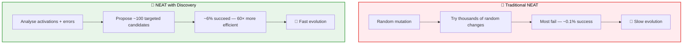
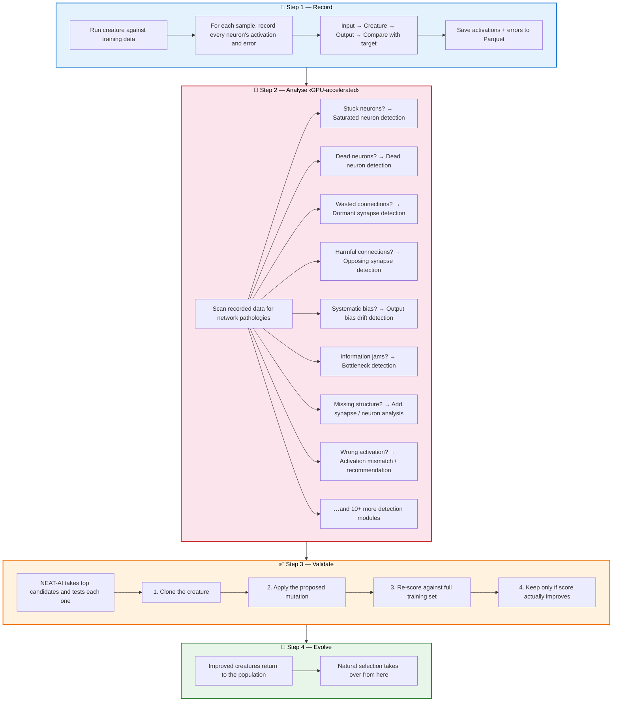

# 🧬 Discovery Scenarios — Overview

[Back to main README](../../README.md) | [Technical reference](../DISCOVERY_TYPES.md) | [Analysis deep dive](../ANALYSIS_DEEP_DIVE.md)

---

## 🤔 What Is Discovery?

In [NEAT](https://en.wikipedia.org/wiki/Neuroevolution_of_augmenting_topologies)
(NeuroEvolution of Augmenting Topologies), creatures evolve through random
mutation — adding neurons, adding connections, and adjusting weights. This works,
but as creatures grow larger the search space explodes and random mutations
become increasingly unlikely to find improvements.

**NEAT-AI-Discovery** replaces the random search with **guided discovery**. It
records how every neuron fires and where errors occur across thousands of
training samples, then analyses that data to propose **specific structural
changes** that are likely to improve the creature's score.

---

## 🔄 How It Works (The Pipeline)

---

## 📖 Discovery Scenario Index

Each scenario targets a specific network pathology. Click through for a
detailed explanation with diagrams, examples, and references.

### ✂️ Pruning Discoveries (Remove Waste)

These discoveries simplify the network by removing components that are not
earning their keep.

| Scenario | What It Finds | Proposed Fix |
|----------|--------------|--------------|
| [Dead Neuron](dead-neuron.md) | Neurons that always output zero | Remove the neuron |
| [Dormant Synapse](dormant-synapse.md) | Connections with near-zero weight | Remove the synapse |
| [Opposing Synapse](opposing-synapse.md) | Connections that increase error | Remove or flip the synapse |
| [Redundant Path](redundant-path.md) | Duplicate paths carrying the same signal | Remove the weaker path |
| [Remove Low-Impact](remove-low-impact.md) | Neurons below the cost of growth | Remove the neuron |
| [Co-Adaptation](co-adaptation.md) | Neuron pairs with correlated activations | Remove redundant neuron or perturb weights |
| [Noise-to-Signal Ratio](noise-signal.md) | Neurons/synapses with high noise-to-signal | Remove or dampen noisy components |

### 🔧 Repair Discoveries (Fix Broken Components)

These discoveries fix neurons that are malfunctioning due to their current
configuration.

| Scenario | What It Finds | Proposed Fix |
|----------|--------------|--------------|
| [Saturated Neuron](saturated-neuron.md) | Neurons stuck at activation bounds | Change activation function + adjust bias |
| [Output Bias Drift](output-bias-drift.md) | Outputs consistently predicting too high/low | Adjust the bias |
| [Oscillating Neuron](oscillating-neuron.md) | Neurons flipping between ± values | Change activation function |
| [Activation Mismatch](activation-mismatch.md) | Activation function incompatible with data | Change to compatible activation |
| [Unbounded Capping](unbounded-capping.md) | Unbounded activations producing extreme values | Cap with bounded activation (e.g., RELU6) |
| [Restricted Range](restricted-range.md) | Neurons using tiny fraction of output range | Change squash, adjust bias, or rescale weights |
| [Operating Point](operating-point.md) | Pre-activation misaligned with active zone | Shift bias, change squash, or rescale weights |
| [Bias Perturbation](bias-perturbation.md) | Neurons stuck in saturated tail of activation | Large bias shift to active zone centre |
| [Squash + Weight Rescale](squash-weight-rescale.md) | Activation change needed with weight compensation | Coordinated squash change + weight rescaling |
| [Activation Recommendation](activation-recommendation.md) | Activation mismatched to input distribution | Proactive squash change based on data shape |
| [Symmetry Breaking](symmetry-breaking.md) | Neuron pairs with near-identical weight configs | Perturb weights and bias to break symmetry |
| [Error Plateau](error-plateau.md) | Output neurons stuck at uniformly high error | Change squash + recentre bias |
| [Output Squash Mismatch](output-squash-mismatch.md) | Output activation incompatible with target data | Change to compatible output activation |

### 🌱 Growth Discoveries (Add Missing Structure)

These discoveries expand the network by adding components where new signal
paths would reduce error.

| Scenario | What It Finds | Proposed Fix |
|----------|--------------|--------------|
| [Bottleneck Neuron](bottleneck-neuron.md) | Information jams (many inputs, one neuron) | Add parallel neuron or bypass |
| [Correlated Error](correlated-error.md) | Multiple outputs with shared error pattern | Add shared hidden neuron |
| [Multi-Hop](multi-hop.md) | Useful indirect signal paths (2–3 hops) | Add synapse or relay neuron |
| [Add Neuron](add-neuron.md) | Missing intermediate computations | Add hidden neuron |
| [Add Synapse](add-synapse.md) | Missing direct connections | Add synapse |
| [Skip Connection](skip-connection.md) | Deep neurons with attenuated gradients | Add direct shortcut from shallow source |
| [Topology Diversification](topology-diversification.md) | Output with no hidden-neuron paths | Add non-linear hidden neuron |

### ⚖️ Synapse Weight Discoveries (Adjust Weights)

These discoveries fine-tune synapse weights to improve signal flow and
reduce brittleness.

| Scenario | What It Finds | Proposed Fix |
|----------|--------------|--------------|
| [Gradient-Based Synapse Adjustment](gradient-discovery.md) | Synapses with gradient-based improvement potential | Adjust weight in error-reducing direction |
| [Weight Coherence](weight-coherence.md) | Incoherent ratios, constant paths, symmetric cancellation | Rescale, adjust bias, or reduce cancelling weights |
| [Weight Magnitude Reset](weight-magnitude-reset.md) | Synapses stuck in error plateau | Try dramatically different weight values |
| [Input Sensitivity](input-sensitivity.md) | Dominant inputs or threshold cliff effects | Reduce weight, add dampening, or shift bias |
| [Sample-Weighted Discovery](sample-weighted.md) | Neurons failing on high-error samples | Adjust bias toward hard-sample performance |

### 🛡️ Data Quality Discoveries (Handle Sentinel Values)

These discoveries improve how the network handles missing or special-marker
input values.

| Scenario | What It Finds | Proposed Fix |
|----------|--------------|--------------|
| [Bounded Range](bounded-range.md) | Sentinel boundary clusters in activations | Add gating neuron to suppress sentinels |
| [Sentinel Value Gating](sentinel-gating.md) | Input sentinels confirmed by error analysis | Add STEP gate to separate sentinel from signal |
| [Observation Utilisation](observation-utilisation.md) | Inputs dominated by sentinel values | Bias-compensate downstream neurons |

---

## 📈 Production Success Rates

How often does each discovery type actually improve the creature when validated
by NEAT-AI? The authoritative per-type success/failure counts and rates
(currently ~6.3% overall across ~9,900 validated candidates) are maintained in
one place — the
[Production Success Rates table in docs/DISCOVERY_TYPES.md](../DISCOVERY_TYPES.md#production-success-rates).

The pruning discoveries (saturated, bottleneck, dead, dormant, opposing,
oscillating, correlated error, multi-hop, redundant path, output bias drift) are
emitted as **coordinated structural candidates** and their success rates are
tracked separately within each category.

---

## 📚 Further Reading

| Document | Description |
|----------|-------------|
| [DISCOVERY_TYPES.md](../DISCOVERY_TYPES.md) | Full technical reference with detection criteria, thresholds, and output formats |
| [ANALYSIS_DEEP_DIVE.md](../ANALYSIS_DEEP_DIVE.md) | Internal analysis workflow and algorithm details |
| [IMPACT_CALCULATION.md](../IMPACT_CALCULATION.md) | How neuron impact scores are computed |
| [NEAT on Wikipedia](https://en.wikipedia.org/wiki/Neuroevolution_of_augmenting_topologies) | The NEAT algorithm that this library extends |
