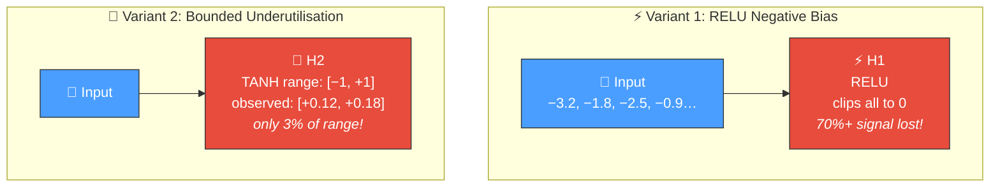
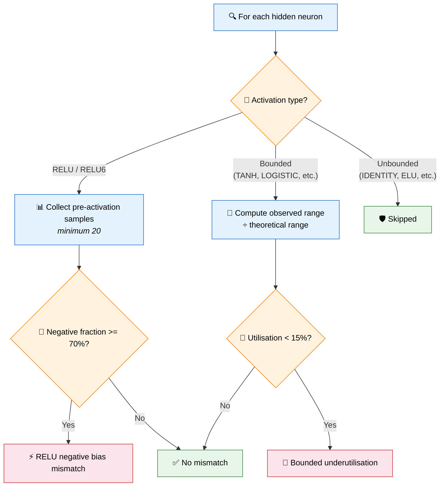
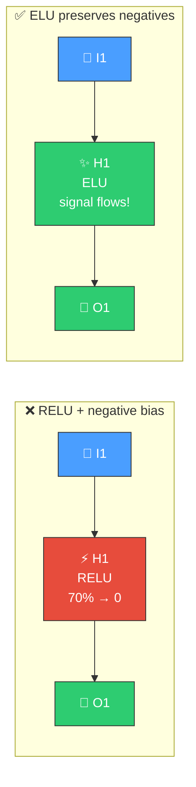
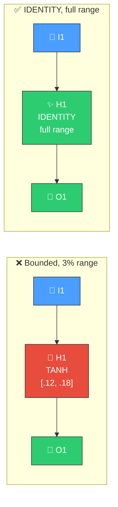

# ⚡ Activation Mismatch Detection

[Back to Discovery Index](README.md) | **Source:** [`src/analysis/detection/activation_mismatch.rs`](../../src/analysis/detection/activation_mismatch.rs) | **Issue:** [#543](https://github.com/stSoftwareAU/NEAT-AI-Discovery/issues/543)

---

## 🔍 The Problem

An **activation mismatch** occurs when a neuron's activation function is structurally
incompatible with the data flowing through it, causing it to waste information
silently. Two common variants exist:

1. **RELU with negative bias**: A RELU neuron whose pre-activation values are
   predominantly negative gets clipped to zero — the neuron is "alive" but
   discarding most of its input signal.
2. **Bounded underutilisation**: A bounded activation (TANH, LOGISTIC, etc.)
   where the neuron only exercises a tiny fraction of the available output range,
   squashing useful variation into a narrow band.

### ⚠️ Why It Hurts the Creature's Score

- **Signal destruction (RELU)**: When most pre-activation values are negative,
  RELU discards the majority of the input signal, turning a functional neuron
  into a near-dead one.
- **Wasted capacity (bounded)**: Using only a sliver of a bounded function's
  range means the neuron cannot distinguish between inputs that differ only
  slightly — fine-grained information is lost.
- **Downstream starvation**: Neurons receiving the mismatched neuron's output
  see a near-constant signal, limiting their ability to learn useful patterns.

---

## 🔬 How We Detect It

### 🛡️ Skipped Activations

Activations that inherently handle wide input ranges are excluded from this
check: IDENTITY, ELU, SELU, LEAKYRELU, GELU, MISH, SOFTPLUS, BENTIDENTITY.

---

## 🛠️ How We Fix It

| Variant | Candidate | Operation | Detail |
|---------|-----------|-----------|--------|
| **RELU negative bias** | Change squash | `changeSquash` | RELU → ELU (preserves negative values) |
| **Bounded underutilisation** | Change squash | `changeSquash` | Bounded → IDENTITY (removes range constraint) |

---

## 📝 Example

> A creature has 30 hidden neurons. Discovery finds:
>
> **Neuron H8:** RELU, 82% of pre-activation values are negative
> → Only 18% of input signal passes through
> **Fix:** Change to ELU to preserve negative information
>
> **Neuron H21:** TANH, observed activation range [+0.05, +0.11]
> → Using only 3% of [−1, +1] range
> **Fix:** Change to IDENTITY to use full range
>
> **Result:** Both neurons now pass meaningful signal variation
> to downstream neurons, enabling better learning ✅

---

## 📚 References

- **Source module**: [`src/analysis/detection/activation_mismatch.rs`](../../src/analysis/detection/activation_mismatch.rs)
- **DISCOVERY_TYPES.md**: [Technical reference](../DISCOVERY_TYPES.md)
- **Dying RELU problem** —
  [Wikipedia](https://en.wikipedia.org/wiki/Rectifier_(neural_networks)#Dying_ReLU_problem):
  A well-known variant where RELU neurons become permanently inactive.
