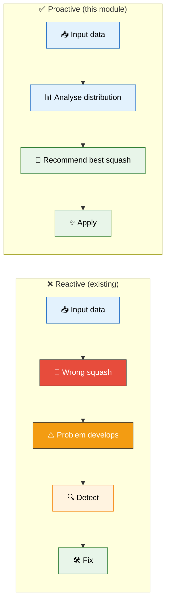
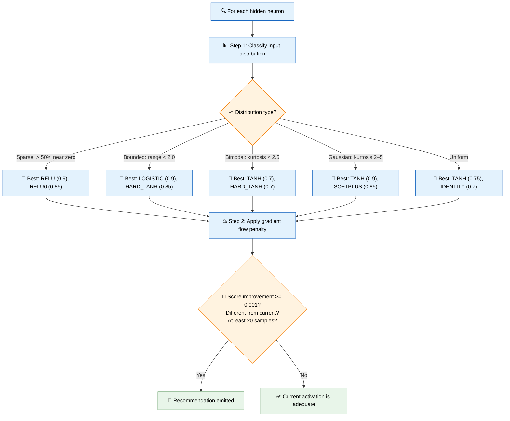
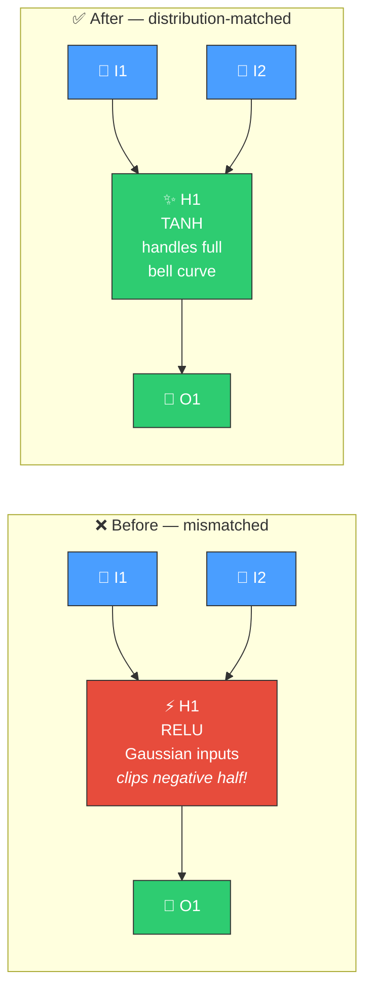

# 🧬 Activation Recommendation

[Back to Discovery Index](README.md) | **Source:** [`src/analysis/recommendation/activation_recommendation.rs`](../../src/analysis/recommendation/activation_recommendation.rs) | **Issue:** [#431](https://github.com/stSoftwareAU/NEAT-AI-Discovery/issues/431)

---

## 🔍 The Problem

Most activation function changes in NEAT are **reactive** — triggered after
a problem is detected (saturation, oscillation, etc.). But by the time the
problem manifests, the neuron may have already wasted many generations of
evolution operating inefficiently.

**Activation recommendation** takes a **proactive** approach: it analyses the
statistical distribution of each neuron's inputs and recommends the activation
function that best matches the data characteristics — before problems occur.

> 🧬 **Proactive catches the mismatch immediately** — no generations wasted waiting for symptoms to appear.

### ✨ Why It Matters

- **Prevents future problems**: A well-matched activation function avoids
  saturation, oscillation, and restricted range issues before they start.
- **Better gradient flow**: Matching the activation to the input distribution
  ensures healthy gradients from the beginning.
- **Higher success rate**: Proactive recommendations target the root cause
  (activation/data mismatch) rather than symptoms.

---

## 🔬 How We Detect It

### ⚖️ Gradient Flow Penalties

- TANH/LOGISTIC penalised 30% if inputs cause saturation
- RELU penalised if many inputs are negative

---

## 🛠️ How We Fix It

| Candidate | Operation | Detail |
|-----------|-----------|--------|
| **Change squash** | `changeSquash` | Switch to distribution-matched activation |

Expected improvement: `improvement_delta × 0.02`, where `improvement_delta`
is the suitability score difference between recommended and current activation.

---

## 📝 Example

> **Neuron H8:** current activation = RELU
> Input distribution classified as: **Gaussian**
>
> | Metric | Value |
> |--------|-------|
> | Mean | 0.02 |
> | Std dev | 0.8 |
> | Min | -2.0 |
> | Max | 2.0 |
> | Kurtosis | 2.9 |
>
> **Suitability scores** (the Gaussian map in
> `activation_recommendation.rs::classify_activation_suitability`, then
> `apply_gradient_flow_penalty`):
>
> | Activation | Score | Notes |
> |-----------|-------|-------|
> | **TANH** | **0.90** | ← best for Gaussian; unpenalised, \|min\| and \|max\| stay under 3.0 |
> | SOFTPLUS | 0.85 | |
> | GELU | 0.80 | |
> | ELU | 0.75 | |
> | IDENTITY | 0.70 | |
> | LOGISTIC | 0.60 | |
> | RELU | 0.375 | current — base 0.50 penalised ×0.75 for clipping the negative half |
>
> The RELU penalty is `1 − negative_fraction × 0.5`, where
> `negative_fraction = (0 − min) / (max − min) = 2.0 / 4.0 = 0.5`, giving
> `0.50 × 0.75 = 0.375`.
>
> Improvement: 0.90 − 0.375 = 0.525 (>> 0.001 threshold)
>
> **Candidate:** Change RELU → TANH
> Expected improvement: 0.525 × 0.02 = 0.0105
>
> After fix: TANH handles the full bell-curve distribution
> symmetrically, preserving negative inputs that RELU was clipping to zero ✅

---

## 📚 References

- **Source module**: [`src/analysis/recommendation/activation_recommendation.rs`](../../src/analysis/recommendation/activation_recommendation.rs)
- **DISCOVERY_TYPES.md**: [Activation Function Recommendation](../DISCOVERY_TYPES.md#activation-function-recommendation)
- **Related**: [Saturated Neuron](saturated-neuron.md) — reactive fix for
  neurons already stuck at bounds
- **Related**: [Oscillating Neuron](oscillating-neuron.md) — reactive fix
  for sign-oscillating neurons
- **Related**: [Squash + Weight Rescale](squash-weight-rescale.md) —
  coordinated squash change with weight adjustment
