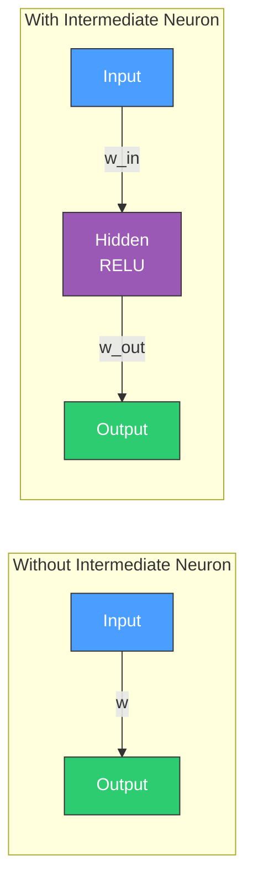
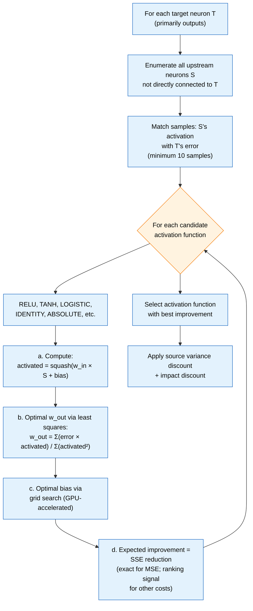
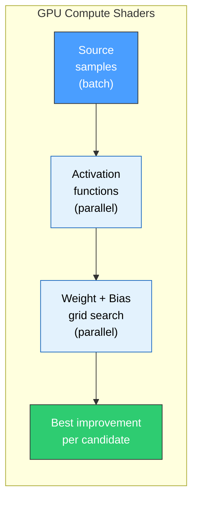
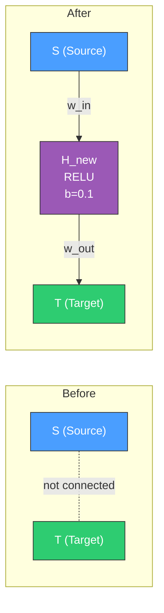

# 🧠 Add Neuron Discovery

[Back to Discovery Index](README.md) | **Source:** [`src/analysis/neuron/`](../../src/analysis/neuron/)

---

## 🔍 The Problem

A creature's network may lack **intermediate computation** between its inputs
and outputs. Some functions cannot be learnt with direct connections alone —
they need a hidden neuron to transform the signal first.

> [!NOTE]
> 🔑 **Without** the hidden neuron the network can only learn `output = w * input` (linear).
> **With** the hidden neuron it can learn `output = w_out * RELU(w_in * input + bias)` (non-linear).

### ⚠️ Why It Hurts the Creature's Score

- The network cannot represent **non-linear relationships** between certain
  inputs and outputs.
- Error persists because no amount of weight adjustment on existing
  connections can produce the needed transformation.
- The creature has hit the limits of its current topology.

> [!WARNING]
> 🚧 Once a creature reaches this topological ceiling, **no weight-only optimisation** can overcome the deficit — structural change is required.

---

## 🔬 How We Detect It

> [!TIP]
> 🎯 The algorithm tries every combination of source neuron and activation function to find the hidden neuron that would **most reduce** the target's error.

> [!NOTE]
> 📐 The "expected improvement" we score is **sum-of-squared-error (SSE) reduction**. This equals the network's loss reduction only when NEAT-AI's cost function is `MSE`; under other costs (`MAE`, `MAPE`, `MSLE`, `HINGE`, `CROSS_ENTROPY`, `CATEGORICAL_ERROR`) it is a useful ranking signal but is not equal to the actual loss reduction. See [`docs/COST_FUNCTION_NOTES.md`](../COST_FUNCTION_NOTES.md) §4 and §6.

### 🖥️ GPU-Accelerated Evaluation

> [!NOTE]
> ⚡ Evaluating thousands of source × activation × bias combinations in parallel on the GPU makes this analysis feasible within the discovery deadline.

---

## 🛠️ How We Fix It

Insert a new hidden neuron between a source and target:

> [!TIP]
> 🔗 The new neuron transforms S's signal through RELU before feeding it to T, enabling **non-linear mapping**.

| Candidate | Operation | Detail |
|-----------|-----------|--------|
| **Add neuron** | `addNeuron` | Includes incoming weight, outgoing weight (capped at ±`MAX_OUTGOING_WEIGHT`), bias, and activation function |

### 🔒 Parameter Constraints

Every emitted candidate clears `variant_generation.rs::filter_candidates_to_sensible_ranges`.
Issue #888 tightened all three caps against the production discovery cache
(incoming 20 → 5, outgoing 0.1 → 0.01, bias 10 → 2), so the constants — not the
values — are the durable reference:

| Parameter | Constraint | Constant |
|-----------|-----------|----------|
| \|incoming weight\| | ≤ 5.0 | `detection_thresholds.rs::MAX_INCOMING_WEIGHT`, enforced as `variant_generation.rs::SENSIBLE_INCOMING_ABS_MAX` |
| \|outgoing weight\| | ≤ 0.01 | `weights/mod.rs::MAX_OUTGOING_WEIGHT`, enforced as `variant_generation.rs::SENSIBLE_OUTGOING_ABS_MAX` |
| \|bias\| | ≤ 2.0 | `detection_thresholds.rs::MAX_BIAS_MAGNITUDE`, enforced as `variant_generation.rs::SENSIBLE_BIAS_ABS_MAX` |
| Weight ratio (in/out) | ≥ 50 for IDENTITY, ≥ 10 for non-linear activations (when \|in\| > 1) | `weights/mod.rs::MIN_WEIGHT_RATIO` / `weights/mod.rs::MIN_WEIGHT_RATIO_NON_LINEAR` |
| IDENTITY with \|bias\| < 0.01 | Filtered out (redundant with direct synapse) | — |

> [!NOTE]
> Issue #905 relaxed the *calculation* ceiling for non-linear activations to
> `weights/mod.rs::MAX_OUTGOING_WEIGHT_NON_LINEAR` (0.03), because they compress
> their output range. The sensible-range filter still applies
> `SENSIBLE_OUTGOING_ABS_MAX` (0.01) to every candidate regardless of activation,
> so 0.01 is the effective ceiling on anything emitted.

> [!CAUTION]
> 🚫 The outgoing weight is deliberately capped at a small magnitude (±0.01) to prevent the newly added neuron from **destabilising** the existing network.

---

## 📝 Example

> **Scenario:** Output O1 has persistent error that no weight adjustment can fix.
>
> **Analysis finds:** Input I3's activation correlates with O1's error pattern, but the relationship is non-linear.
>
> **Best candidate:**
> - **Source:** I3
> - **Activation:** RELU
> - **Incoming weight:** 1.2
> - **Bias:** -0.3
> - **Outgoing weight:** 0.008
>
> **New neuron H_new:**
> `output = 0.008 × RELU(1.2 × I3 − 0.3)`
>
> **This creates a threshold detector:**
> - When I3 < 0.25 → output = 0 (RELU cuts off)
> - When I3 > 0.25 → output scales linearly
> - Captures the non-linear boundary O1 needs
>
> 📊 **Production success rate:** 5.9% (556 successes from 9,500 candidates).
> This is the **highest-volume** discovery type.

---

## 📚 References

- **Universal approximation theorem** —
  [Wikipedia](https://en.wikipedia.org/wiki/Universal_approximation_theorem):
  Proves that networks with at least one hidden layer can approximate any
  continuous function. Adding neurons increases approximation capacity.
- **Least squares estimation** —
  [Wikipedia](https://en.wikipedia.org/wiki/Least_squares): The method used
  to compute optimal outgoing weights that minimise error.
- **NEAT (NeuroEvolution of Augmenting Topologies)** —
  [Wikipedia](https://en.wikipedia.org/wiki/Neuroevolution_of_augmenting_topologies):
  The evolutionary algorithm framework this library extends. NEAT adds
  neurons through mutation; this discovery accelerates the process by
  identifying where neurons are most needed.
