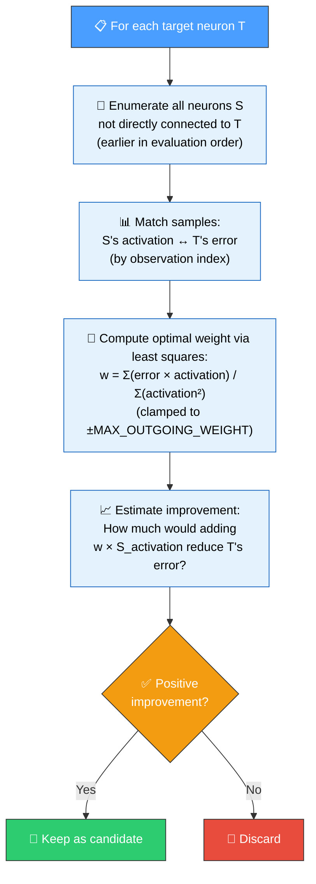
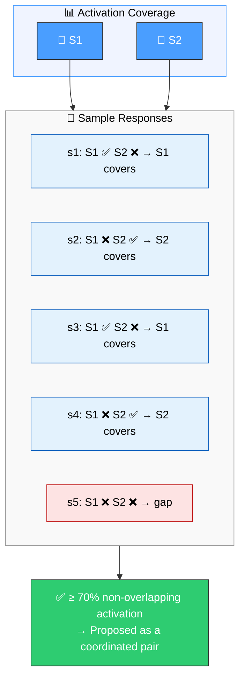
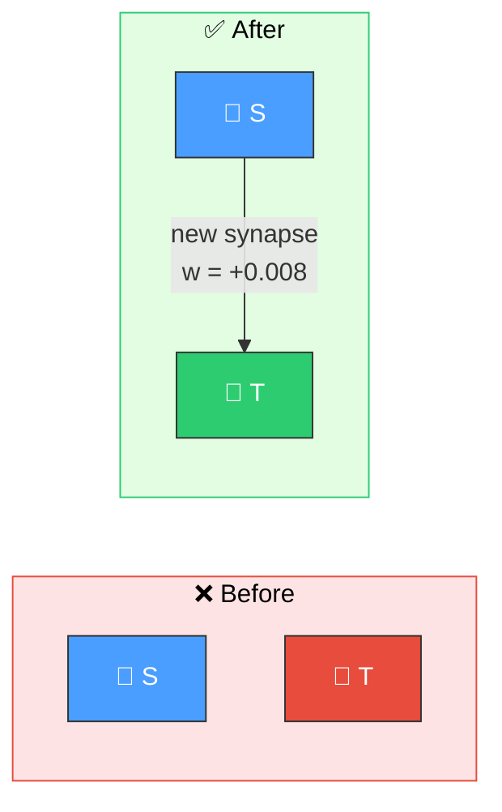
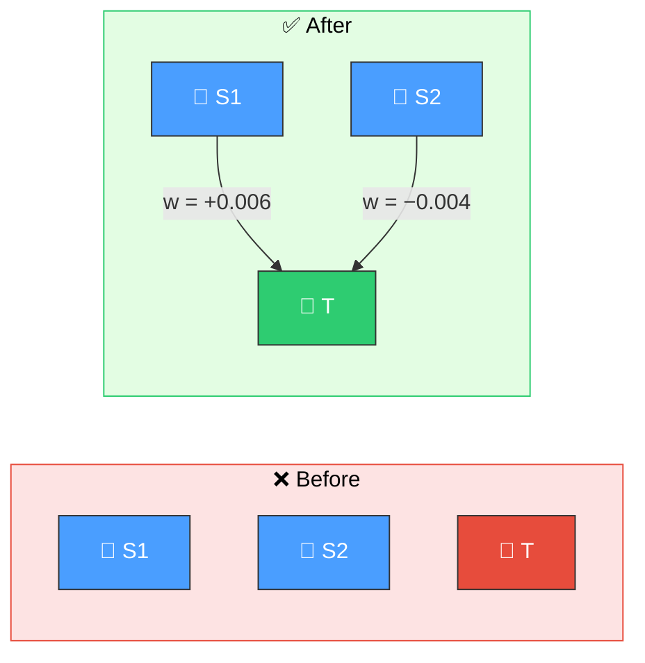

# 🔗 Add Synapse Discovery

[Back to Discovery Index](README.md) | **Source:** [`src/analysis/synapse/`](../../src/analysis/synapse/)

---

## 🔍 The Problem

A creature's network may be missing a **direct connection** between two neurons
that should communicate. The source neuron carries useful information that would
reduce the target's error, but no synapse exists to transmit it.

> 💡 **Key Insight:** The source neuron carries a signal that would help the
> target produce better predictions, but there is no connection to transmit it.

### ⚠️ Why It Hurts the Creature's Score

- The target neuron cannot access information that would help it produce
  better predictions.
- Error persists because the useful signal from S never reaches T.
- In NEAT evolution, adding connections is random — discovery identifies
  **which specific connections** would help most.

> ⚠️ **Without discovery**, NEAT must rely on random mutation to stumble upon
> beneficial connections. Discovery targets the most impactful ones directly.

---

## 🔬 How We Detect It

### 🧬 Epistatic Pair Detection

The analysis also detects **epistatic pairs** — two neurons that complement
each other and work better together than alone:

> 🧬 **Epistatic pairs** fire on different samples, so together they cover more
> error cases than either neuron alone — they are proposed as a coordinated pair.

---

## 🛠️ How We Fix It

Add the missing synapse with an optimally computed weight:

> 🎯 **Weight** is computed to minimise T's error given S's activation.

For epistatic pairs, both synapses are added together:

> 🔧 Both synapses are added **atomically** as a coordinated structural candidate.

| Candidate | Operation | Detail |
|-----------|-----------|--------|
| **Add synapse** | `addSynapse` | Weight clamped to ±`MAX_OUTGOING_WEIGHT` (0.01, `src/analysis/scoring/weights/mod.rs`) |
| **Epistatic pair** | 2× `addSynapse` (coordinated) | Both added atomically |

> [!NOTE]
> Issue #888 tightened the clamp by an order of magnitude (0.1 → 0.01) against
> the production discovery cache: successful synapses land at 0.001–0.005, while
> the 0.01–0.1 band almost always fails. Every weight illustrated on this page
> therefore sits in the 1e-3 band.

---

## 📝 Example

> **Scenario:** Output neuron O1 predicts house prices.
> Input I5 contains "number of bedrooms" but has no synapse to O1.
>
> **Analysis:**
> - Matched 500 samples of I5 activation with O1 error
> - Optimal weight: w = +0.007
> - Expected improvement: 12% reduction in O1's sum-of-squared error (exact for `MSE`; a ranking signal for other costs)
>
> **Fix:** `addSynapse I5 → O1 (weight +0.007)`
>
> ✅ Now O1 can factor in bedroom count directly.

---

## 📚 References

- **Least squares estimation** —
  [Wikipedia](https://en.wikipedia.org/wiki/Least_squares): The method used
  to compute optimal synapse weights that minimise target error.
- **Epistasis** —
  [Wikipedia](https://en.wikipedia.org/wiki/Epistasis): The biological
  concept of gene interactions, applied here to neural connections that work
  better in combination than individually.
- **NEAT (NeuroEvolution of Augmenting Topologies)** —
  [Wikipedia](https://en.wikipedia.org/wiki/Neuroevolution_of_augmenting_topologies):
  The evolutionary algorithm framework this library extends. NEAT adds
  connections through random mutation; this discovery identifies the most
  beneficial connections to add.
