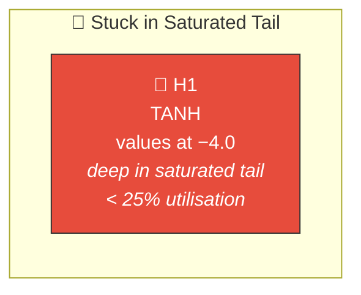
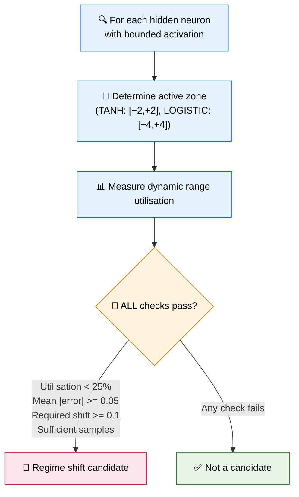
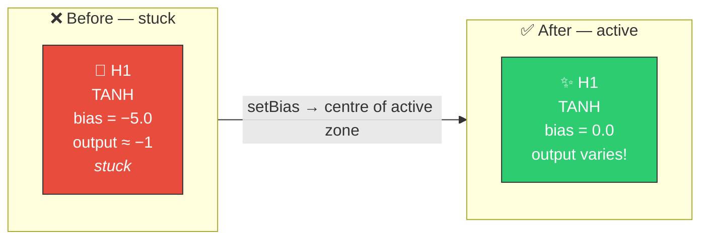

# 🔀 Bias Perturbation Regime Shift

[Back to Discovery Index](README.md) | **Source:** [`src/analysis/detection/bias_perturbation.rs`](../../src/analysis/detection/bias_perturbation.rs) | **Issue:** [#551](https://github.com/stSoftwareAU/NEAT-AI-Discovery/issues/551)

---

## 🔍 The Problem

A **bias perturbation regime shift** targets hidden neurons that are stuck
operating in a suboptimal region of their activation function — either deep
in a saturated tail or confined to a narrow linear sub-zone — when a large
bias shift could move them to a qualitatively different, more productive
regime.

Small gradient-based adjustments cannot escape these local minima because the
error surface is flat in the current region. A deliberate, large bias shift
is needed to "jump" to a better operating point.

> 🔀 **Trapped!** The neuron is deep in the saturated tail — small gradient-based adjustments cannot escape. Only a large bias shift can reach the active zone.

### ⚠️ Why It Hurts the Creature's Score

- **Gradient starvation**: In the saturated tail, the derivative is near zero,
  so normal weight updates cannot escape the region.
- **Wasted capacity**: The neuron occupies network resources but only produces
  a near-constant output.
- **Local minimum trap**: Small perturbations keep the neuron in the same
  flat region — only a large shift can reach the active zone.

---

## 🔬 How We Detect It

### 📐 Active Zone Definitions

| Squash | Active Zone | Centre |
|--------|------------|--------|
| TANH / HARD_TANH / CLIPPED | [−2, +2] | 0 |
| LOGISTIC / SOFTSIGN | [−4, +4] | 0 |
| ARCTAN | [−3, +3] | 0 |
| RELU6 | [0, +6] | 3 |

---

## 🛠️ How We Fix It

The fix applies a large bias shift to relocate the neuron's operating point
from the saturated tail to the centre of the active zone:

| Candidate | Operation | Detail |
|-----------|-----------|--------|
| **Set bias** | `setBias` | Shift bias to centre of the active zone |

The estimated improvement is proportional to both the mean error and how
far from the active zone the neuron currently operates:
`improvement = mean_error × (1 − utilisation) × 0.2`.

---

## 📝 Example

> A creature has a TANH neuron H5 with bias = −4.8.
> Active zone for TANH is [−2, +2], centre = 0.
>
> | Metric | Value |
> |--------|-------|
> | Pre-activation values | Centred around −4.8 |
> | Output | ≈ −0.9999 (deep in saturated tail) |
> | Utilisation of active zone | 8% |
> | Mean |error| | 0.12 |
>
> **Fix:** Set bias to 0.0 (centre of active zone)
> → Pre-activation values now centred around 0
> → Neuron operates in the responsive region
> → Output varies meaningfully with input ✅

---

## 📚 References

- **Source module**: [`src/analysis/detection/bias_perturbation.rs`](../../src/analysis/detection/bias_perturbation.rs)
- **DISCOVERY_TYPES.md**: [Technical reference](../DISCOVERY_TYPES.md)
- **Related**: [Operating Point Analysis](operating-point.md) — analyses
  pre-activation distribution against the active zone
- **Related**: [Saturated Neuron](saturated-neuron.md) — detects neurons
  already at activation bounds
