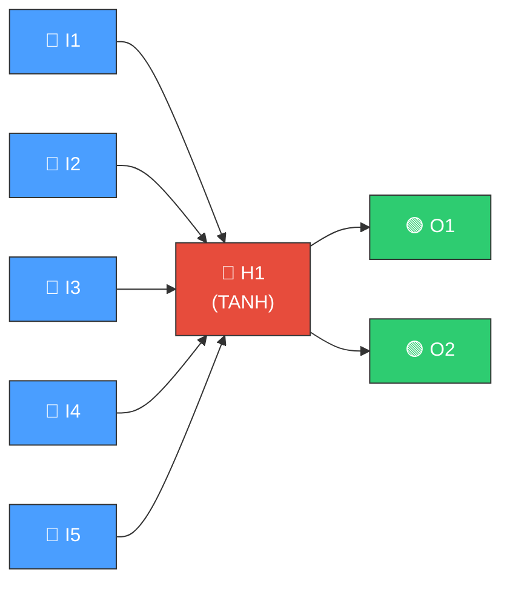
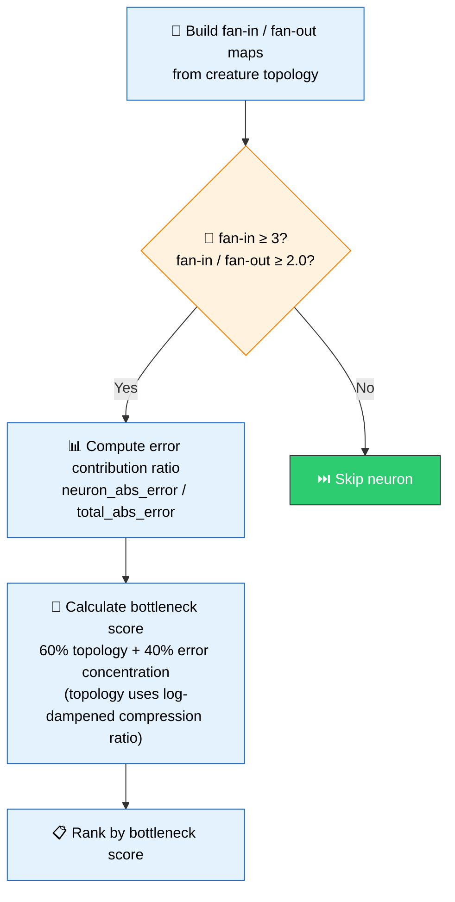
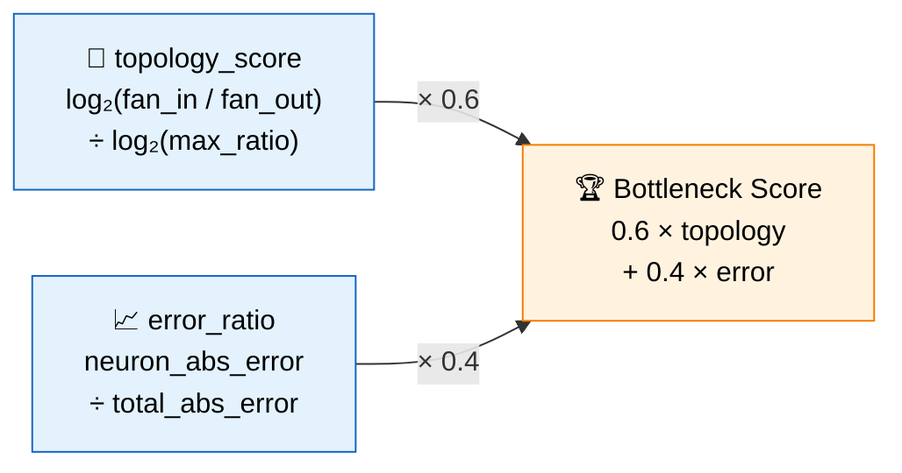
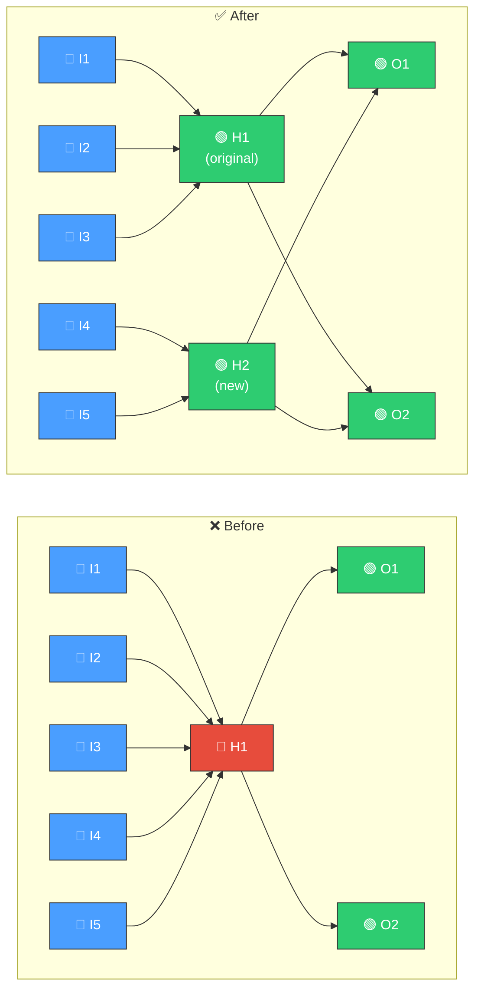
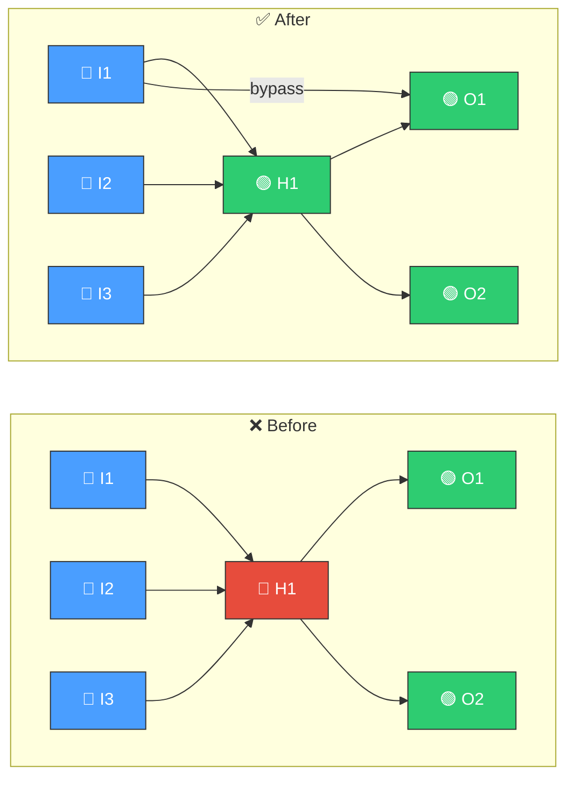
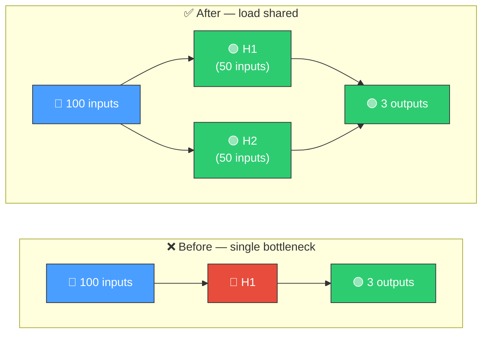

# 🚧 Bottleneck Neuron Detection

[Back to Discovery Index](README.md) | **Source:** [`src/analysis/detection/bottleneck.rs`](../../src/analysis/detection/bottleneck.rs) | **Issue:** [#343](https://github.com/stSoftwareAU/NEAT-AI-Discovery/issues/343)

---

## 🔍 The Problem

A **bottleneck neuron** is a single hidden neuron through which many input
signals are forced to pass before reaching the output. One neuron's activation
range cannot encode all upstream information — detail is lost.

> 🚧 **Information bottleneck!** Five signals are compressed into a single
> neuron value. The downstream neurons cannot recover the original inputs.

### ⚠️ Why It Hurts the Creature's Score

- **Information loss**: Five independent input signals are compressed into a
  single scalar. The downstream neurons cannot distinguish which input caused
  the output.
- **Error concentration**: The bottleneck neuron accumulates
  disproportionately large error because it is the only path for error to
  flow back to multiple inputs.
- **Limited expressiveness**: The network cannot learn functions that require
  independent use of the compressed inputs.

---

## 🔬 How We Detect It

### 📊 Scoring Breakdown

> 💡 **Note:** The topology score is log-dampened to avoid over-weighting
> extreme fan-in values.

---

## 🛠️ How We Fix It

Two complementary strategies relieve the bottleneck:

### 🔀 Strategy 1: Parallel Neuron

Add a second neuron alongside the bottleneck to share the load:

The new neuron takes the top half of upstream inputs (by weight magnitude) at
50% scaled weights and connects to all downstream outputs.

### 🔗 Strategy 2: Bypass Synapse

Connect the strongest upstream neuron directly to downstream targets, skipping
the bottleneck entirely:

> 💡 **Bypass weight** = `upstream_weight × downstream_weight × 0.5`

| Candidate | Operation | When |
|-----------|-----------|------|
| **Parallel neuron** | `addNeuron` + `addSynapse` (multiple) | Always proposed |
| **Bypass synapse** | `addSynapse` (direct) | When fan-in > 3 |

---

## 📝 Example

> A creature classifying images has 100 pixel inputs feeding through a single
> hidden neuron to 3 output classes.

> **H1** can only output one value per sample — it cannot represent all 100
> input dimensions. By adding **H2** to handle half the inputs, each neuron
> manages a subset, yielding a more expressive network.

---

## 📚 References

- **Information bottleneck theory** —
  [Wikipedia](https://en.wikipedia.org/wiki/Information_bottleneck_method):
  The information-theoretic framework for understanding compression in neural
  networks.
- **Tishby & Zaslavsky (2015)** — *Deep learning and the information
  bottleneck principle*: Formalises how intermediate layers compress
  information and why bottlenecks limit learning.
- **NEAT (NeuroEvolution of Augmenting Topologies)** —
  [Wikipedia](https://en.wikipedia.org/wiki/Neuroevolution_of_augmenting_topologies):
  The evolutionary algorithm framework this library extends.
