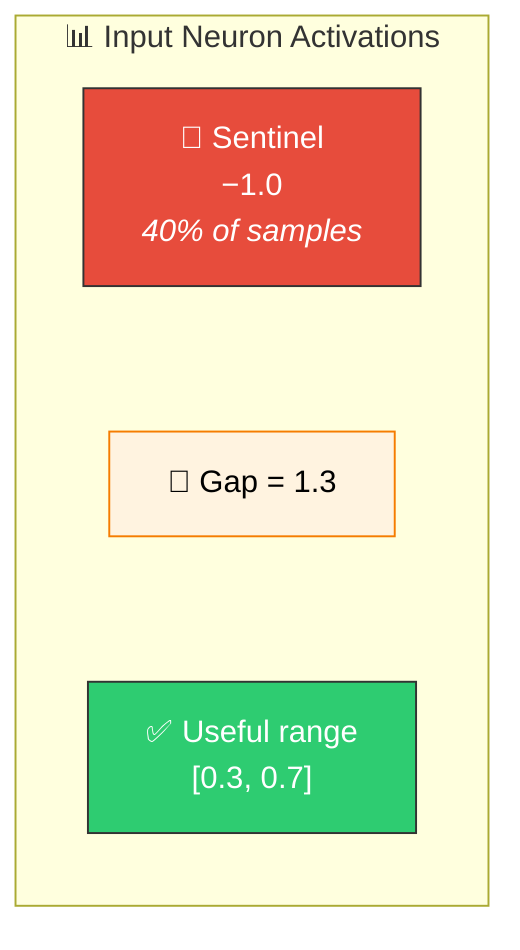
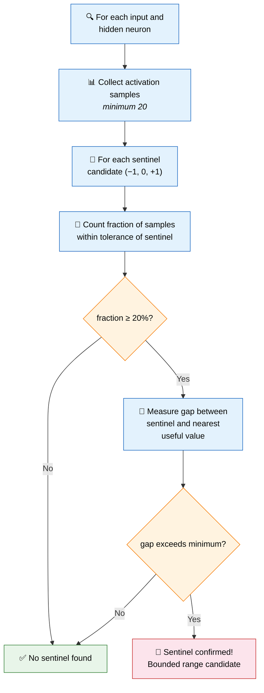
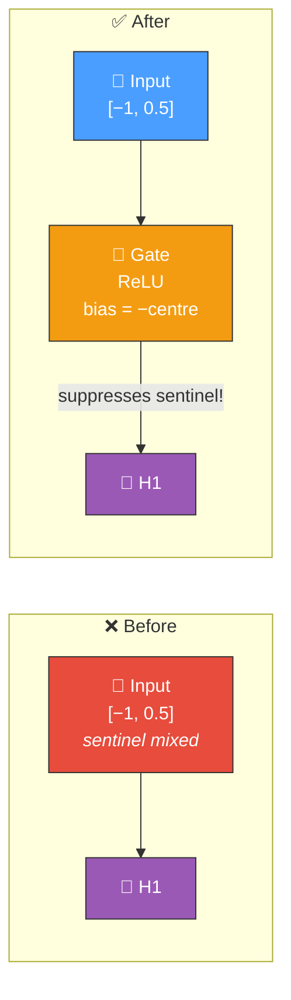

# 🚧 Bounded Range Detection

[Back to Discovery Index](README.md) | **Source:** [`src/analysis/detection/bounded_range.rs`](../../src/analysis/detection/bounded_range.rs) | **Issue:** [#395](https://github.com/stSoftwareAU/NEAT-AI-Discovery/issues/395)

---

## 🔍 The Problem

Some input and hidden neurons receive data where a significant fraction of
samples sit at a **sentinel boundary value** (typically −1, 0, or +1 meaning
"missing", "off", or "maximum"). These sentinel values carry no useful signal
but are mixed in with genuine data, confusing downstream neurons that cannot
distinguish "missing" from "actually zero".

> 🚧 Sentinel values (−1) are mixed with useful data ([0.3, 0.7]) —
> downstream neurons can't tell the difference!

### ⚠️ Why It Hurts the Creature's Score

- **Signal contamination**: The sentinel value is treated as a real data
  point, biasing learned weights.
- **Wasted capacity**: The neuron cannot learn separate responses for
  "missing data" vs "data with value near the sentinel".
- **Downstream confusion**: Neurons receiving this signal cannot distinguish
  meaningful values from sentinel markers.

---

## 🔬 How We Detect It

### 📊 Confidence Scoring

| Component | Weight | Description |
|-----------|--------|-------------|
| **Fraction factor** | 40% | Higher sentinel fraction → higher confidence |
| **Gap factor** | 40% | Wider gap → higher confidence |
| **Sample factor** | 20% | More samples → higher confidence |

> `Confidence = 0.5 + (fraction × 0.4 + gap × 0.4 + samples × 0.2) × 0.5`

---

## 🛠️ How We Fix It

The fix adds a **gating neuron** that learns to suppress the sentinel values
while passing useful data through:

| Candidate | Operations | Detail |
|-----------|-----------|--------|
| **Add gating neuron** | `addNeuron` + `addSynapse` | ReLU gate with bias set to suppress the sentinel value |

The gate neuron's bias is set to `−useful_centre`, causing sentinel values
to produce zero output while useful values pass through.

---

## 📝 Example

> Input neuron I5 has 500 samples:
> - 180 samples (36%) at value = −1.0 (sentinel for "missing")
> - 320 samples in range [0.2, 0.8] (useful data)
> - Gap between sentinel and useful range: 1.2
>
> **Fix:** Add ReLU gate neuron
> - Bias = −(0.2 + 0.8)/2 = **−0.5**
>
> | Input | Calculation | Output |
> |-------|-------------|--------|
> | −1.0 (sentinel) | ReLU(−1.0 − 0.5) = ReLU(−1.5) | **0** (suppressed) ✅ |
> | 0.5 (useful) | ReLU(0.5 − 0.5) = ReLU(0.0) | 0.0 (borderline) |
> | 0.8 (useful) | ReLU(0.8 − 0.5) = ReLU(0.3) | **0.3** (passes through) ✅ |
>
> **Result:** Downstream neurons receive 0 for missing data
> and proportional values for real data. 🎯

---

## 📚 References

- **Source module**: [`src/analysis/detection/bounded_range.rs`](../../src/analysis/detection/bounded_range.rs)
- **DISCOVERY_TYPES.md**: [Technical reference](../DISCOVERY_TYPES.md)
- **Related**: [Sentinel Value Gating](sentinel-gating.md) — similar concept
  for input neurons with additional error-correlation checks
- **Related**: [Observation Utilisation](observation-utilisation.md) — flags
  underutilised input ranges dominated by sentinels
