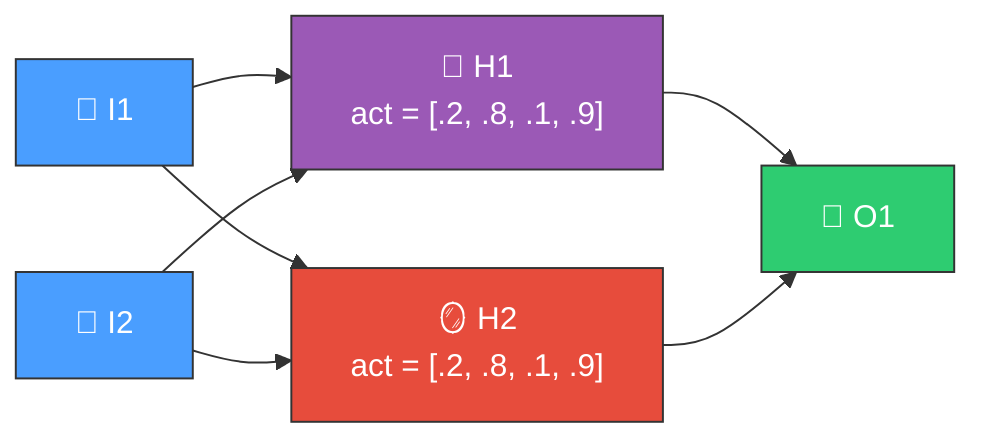
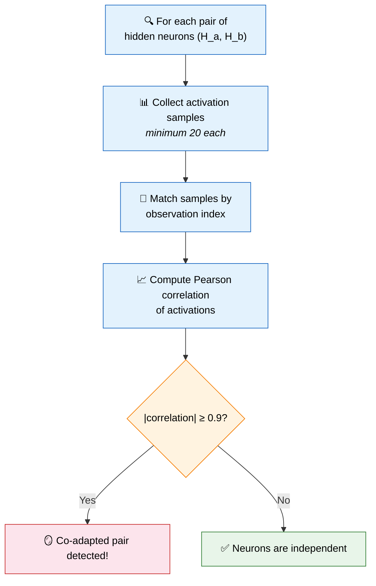
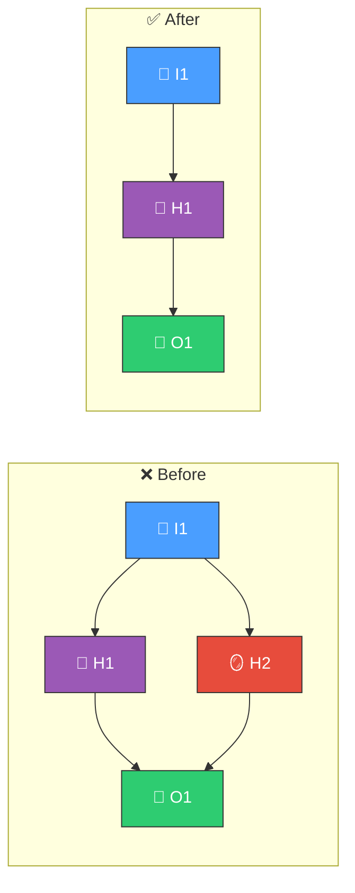
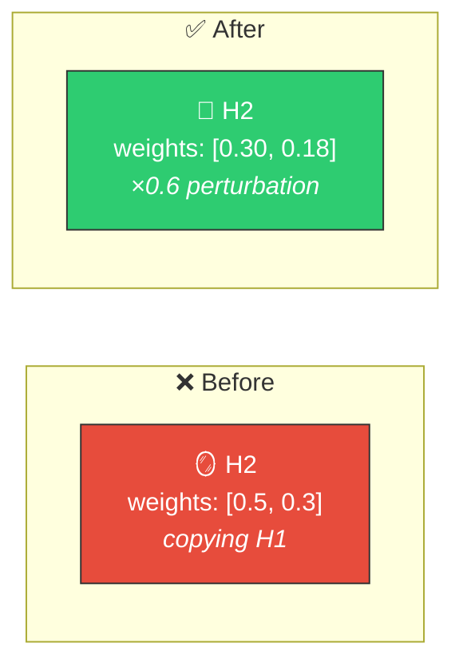

# 🪞 Co-Adaptation Detection

[Back to Discovery Index](README.md) | **Source:** [`src/analysis/detection/co_adaptation.rs`](../../src/analysis/detection/co_adaptation.rs) | **Issue:** [#571](https://github.com/stSoftwareAU/NEAT-AI-Discovery/issues/571)

---

## 🔍 The Problem

**Co-adaptation** occurs when two hidden neurons evolve to encode the same
information — their activations become highly correlated (or anti-correlated)
across training samples. This wastes network capacity because two neurons are
doing one neuron's job.

> 🪞 **Correlation ≥ 0.9 — same information!** H2 is a copy of H1.
> Wasted capacity and unnecessary complexity cost.

### ⚠️ Why It Hurts the Creature's Score

- **Redundant computation**: Two neurons consuming resources to produce
  effectively the same signal.
- **Wasted capacity**: The network could represent an additional independent
  feature if one neuron were freed from copying the other.
- **Complexity cost**: NEAT penalises structural complexity — co-adapted
  neurons add cost without adding capability.

---

## 🔬 How We Detect It

> **Note:** Anti-correlation (≤ −0.9) also counts — the neurons are encoding
> the same information with flipped sign.

Requires at least 2 hidden neurons in the network.

---

## 🛠️ How We Fix It

Two candidate strategies are proposed for each co-adapted pair:

### ✂️ Strategy 1: Remove the Redundant Neuron

> H2 removed (was redundant) ✅

### 🔧 Strategy 2: Perturb Weights to Break Co-Adaptation

> Now learns independently! 🔓

| Strategy | Candidate | Operation | Detail |
|----------|-----------|-----------|--------|
| **Remove redundant** | Remove neuron | `removeNeuron` | Remove the lower-activation neuron |
| **Break co-adaptation** | Perturb weights | `setWeight` | Scale incoming weights by 0.6 |

---

## 📝 Example

> A creature has 15 hidden neurons. Discovery finds:
>
> | Neuron | Mean Activation |
> |--------|----------------|
> | H3 | 0.45 |
> | H11 | 0.42 |
>
> Pearson correlation = **0.96** — these neurons respond almost identically to all inputs.
>
> **Candidates:**
> 1. Remove H11 (lower mean activation) → saves computation, reduces complexity cost
> 2. Scale H11's incoming weights by 0.6 → breaks the correlation, allowing H11 to specialise
>
> Either fix frees capacity for the network to represent a new independent feature. ✅

---

## 📚 References

- **Source module**: [`src/analysis/detection/co_adaptation.rs`](../../src/analysis/detection/co_adaptation.rs)
- **DISCOVERY_TYPES.md**: [Technical reference](../DISCOVERY_TYPES.md)
- **Related**: [Symmetry Breaking](symmetry-breaking.md) — detects neurons
  with near-identical weight configurations (structural similarity)
- **Related**: [Redundant Path](redundant-path.md) — detects correlated
  activation patterns feeding the same target
