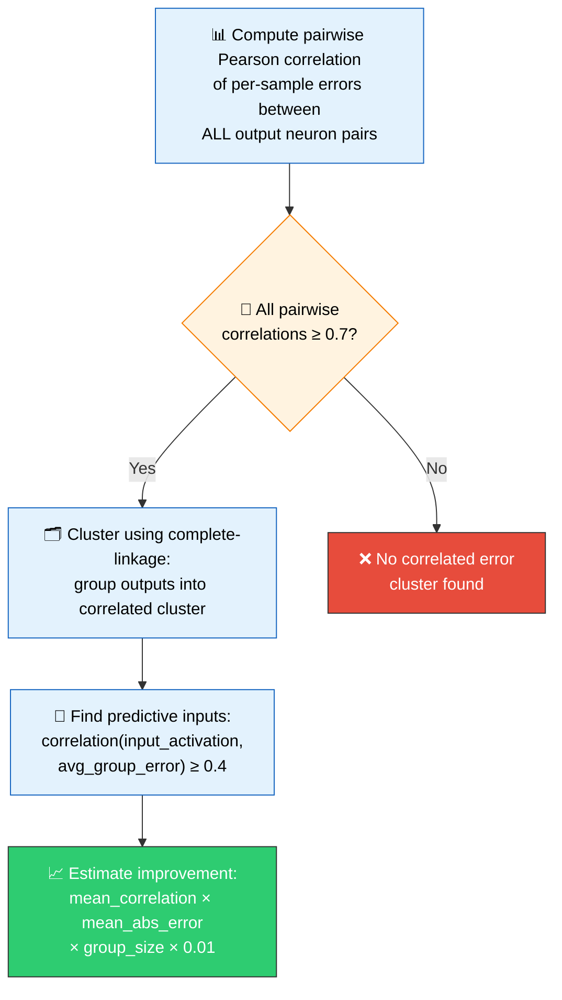
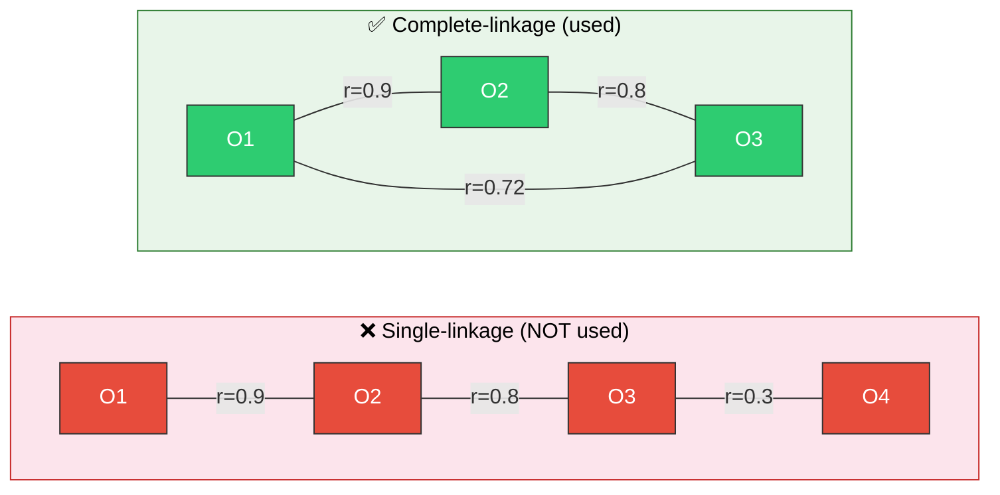
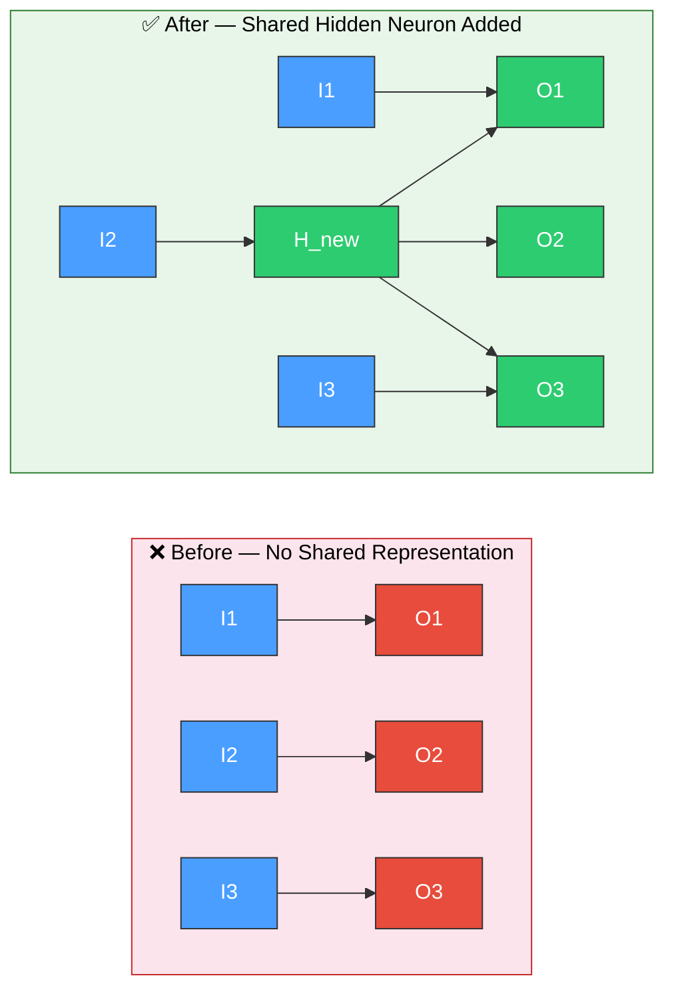
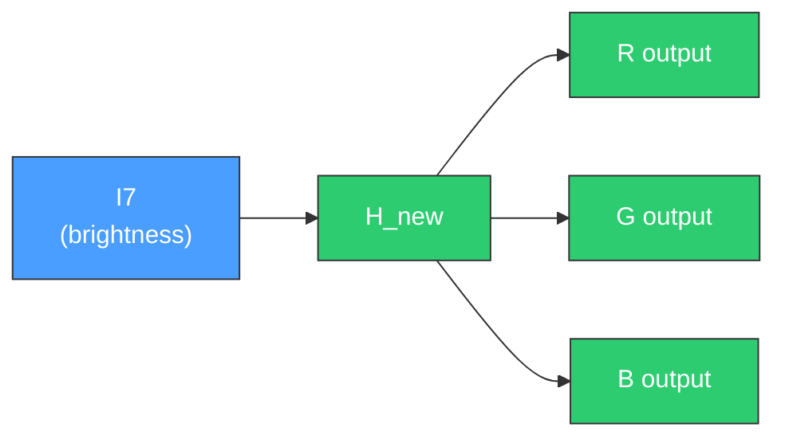

# 🔗 Correlated Error Pattern Detection

[Back to Discovery Index](README.md) | **Source:** [`src/analysis/detection/correlated_error.rs`](../../src/analysis/detection/correlated_error.rs) | **Issue:** [#344](https://github.com/stSoftwareAU/NEAT-AI-Discovery/issues/344)

---

## 🔍 The Problem

**Correlated error** occurs when multiple output neurons make errors in the same
direction on the same training samples. This pattern suggests a **missing shared
cause** — there is an input feature or combination that affects several outputs,
but the network has no shared hidden neuron to represent it.

> 💡 **Key Insight:** When outputs err together, it is a strong signal that the
> network is missing a shared internal representation.

| Sample | O1 error | O2 error | O3 error | Same direction? |
|--------|----------|----------|----------|-----------------|
| s1     | +0.3     | +0.2     | +0.4     | ✅ YES (all +)  |
| s2     | −0.1     | −0.2     | −0.15    | ✅ YES (all −)  |
| s3     | +0.25    | +0.3     | +0.28    | ✅ YES (all +)  |
| s4     | −0.2     | −0.15    | −0.22    | ✅ YES (all −)  |

> ⚠️ **Pattern:** O1, O2, and O3 err together — likely a shared missing feature.

### 📉 Why It Hurts the Creature's Score

- Each output neuron independently tries to compensate for the missing
  feature, duplicating effort.
- Without a shared representation, the network cannot learn the common
  pattern efficiently.
- The correlated errors compound — fixing one output does not fix the others.

---

## 🔬 How We Detect It

> 📐 **Correlation Threshold:** A pairwise Pearson *r* ≥ 0.7 is required for
> outputs to be grouped into the same cluster. This ensures only strongly
> correlated error patterns trigger a fix.

### 🔗 Complete-Linkage Clustering

Complete-linkage ensures tight clusters where **every** pair is correlated:

> ⚠️ **Why complete-linkage?** Single-linkage can chain loosely related outputs
> into one oversized cluster (e.g., O1↔O4 may have low correlation). Complete-linkage
> guarantees that **all** pairs within a cluster meet the threshold.

---

## 🛠️ How We Fix It

Add a **shared hidden neuron** that captures the common pattern and feeds all
correlated outputs:

> 🧠 **How it works:** `H_new` captures the shared pattern from predictive inputs
> and feeds a corrective signal to all three outputs simultaneously.

| Candidate | Operation | Detail |
|-----------|-----------|--------|
| **Add shared neuron** | `addNeuron` (TANH) | Placed before the first output in the cluster |
| **Connect inputs** | `addSynapse` (weight 0.5) | From each predictive input to the new neuron |
| **Connect outputs** | `addSynapse` (weight 0.1) | From the new neuron to each correlated output |

---

## 📝 Example

> 🎨 **Scenario:** A creature predicting RGB colour values has 3 outputs: R, G, B.
>
> **Analysis shows:**
> - Pearson(R\_error, G\_error) = **0.82**
> - Pearson(R\_error, B\_error) = **0.75**
> - Pearson(G\_error, B\_error) = **0.79**
>
> All ≥ 0.7 → {R, G, B} form a **correlated error cluster**.
>
> Predictive input **I7 (brightness)** correlates with average group
> error at *r* = 0.65.
>
> **Fix:** Add hidden neuron `H_new`
> - I7 → H\_new (weight 0.5)
> - H\_new → R output (weight 0.1)
> - H\_new → G output (weight 0.1)
> - H\_new → B output (weight 0.1)
>
> ✅ `H_new` now represents the shared brightness correction.

---

## 📚 References

- **Correlation clustering** —
  [Wikipedia](https://en.wikipedia.org/wiki/Correlation_clustering): The
  general framework for grouping items by pairwise similarity.
- **Multi-task learning** —
  [Wikipedia](https://en.wikipedia.org/wiki/Multi-task_learning): The
  principle that shared representations improve learning when tasks are
  related (correlated errors indicate related output tasks).
- **Pearson correlation coefficient** —
  [Wikipedia](https://en.wikipedia.org/wiki/Pearson_correlation_coefficient):
  The statistical measure used to detect co-occurring error patterns.
- **NEAT (NeuroEvolution of Augmenting Topologies)** —
  [Wikipedia](https://en.wikipedia.org/wiki/Neuroevolution_of_augmenting_topologies):
  The evolutionary algorithm framework this library extends.
