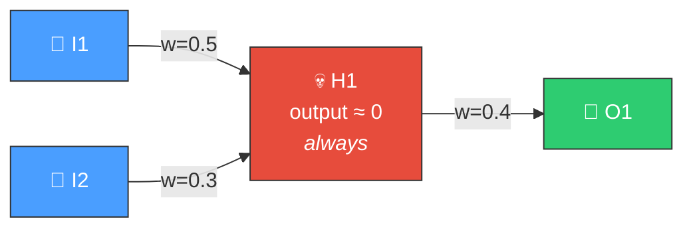
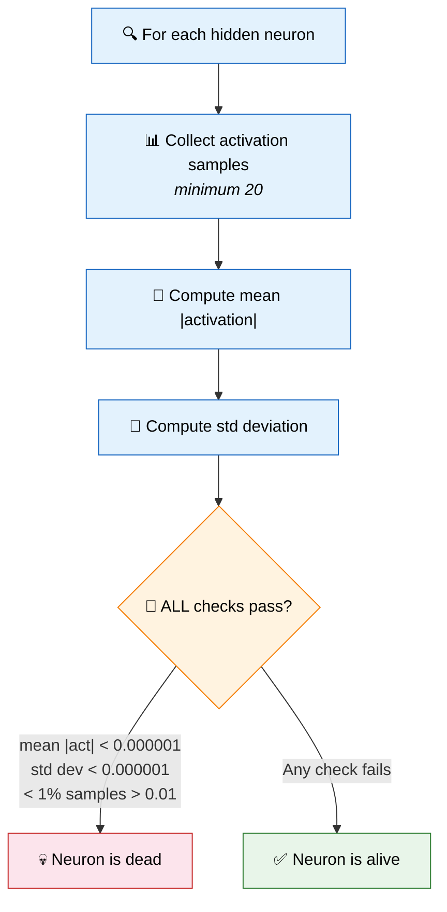
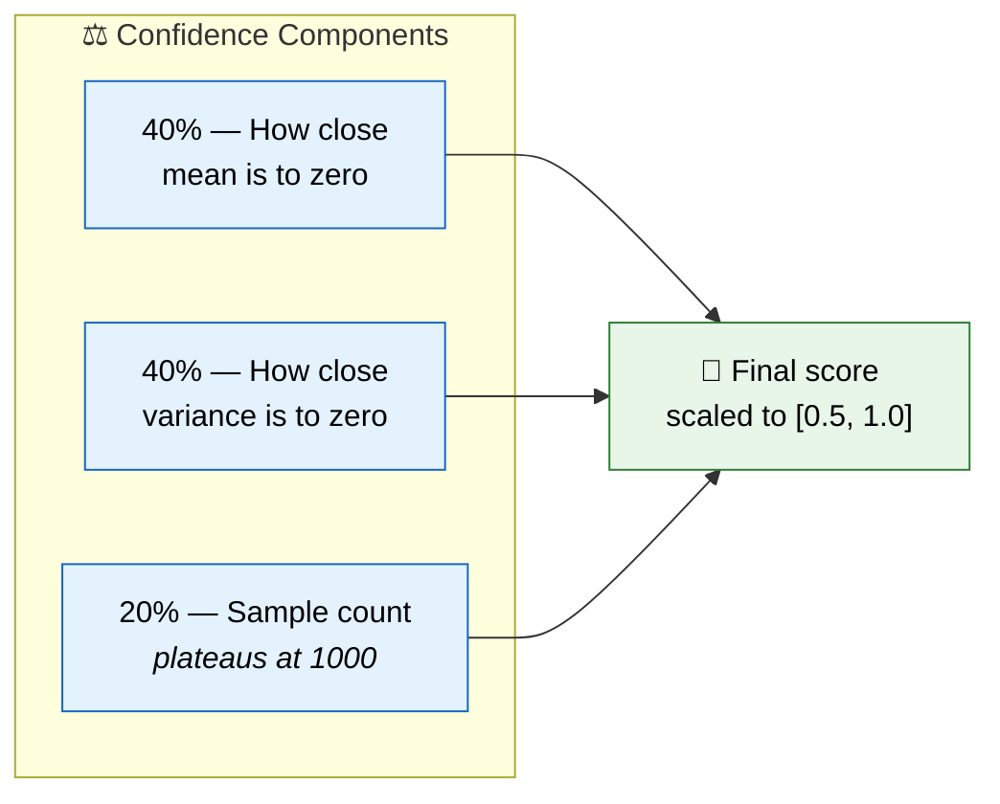
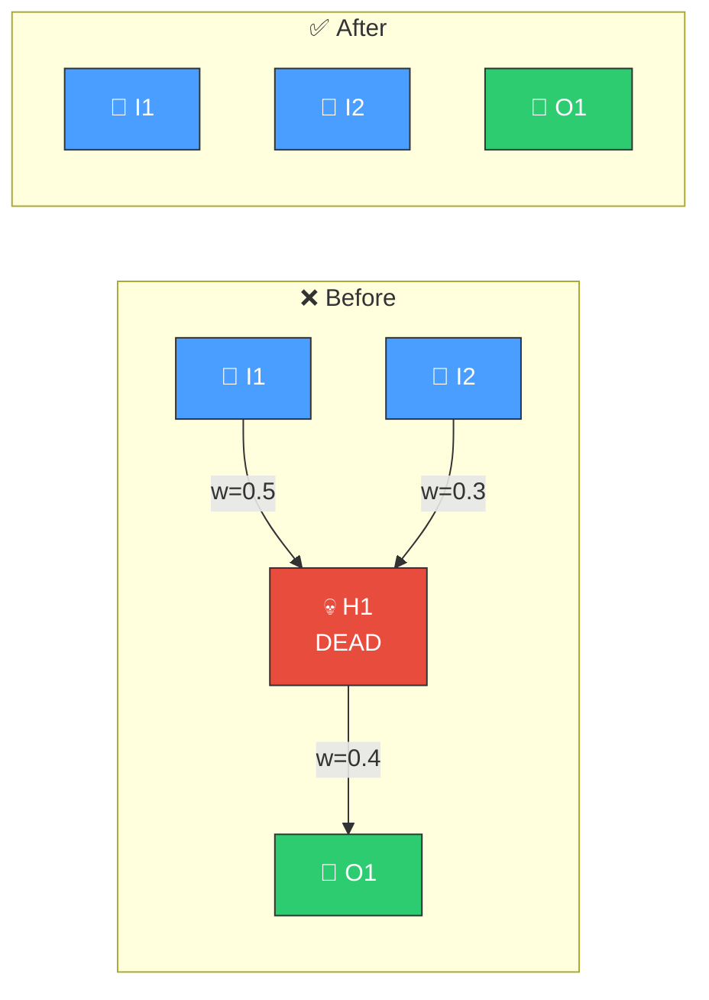

# 💀 Dead Neuron Detection

[Back to Discovery Index](README.md) | **Source:** [`src/analysis/detection/dead_neuron.rs`](../../src/analysis/detection/dead_neuron.rs) | **Issue:** [#341](https://github.com/stSoftwareAU/NEAT-AI-Discovery/issues/341)

---

## 🔍 The Problem

A **dead neuron** is a hidden neuron that always outputs zero (or near-zero)
regardless of the input. It consumes computation and adds complexity to the
network topology without contributing any signal.

> 💀 **Dead neuron!** Adds cost, no benefit — the neuron fires nothing useful.

### ⚠️ Why It Hurts the Creature's Score

- **Wasted computation**: Every evaluation computes the neuron's activation
  for nothing.
- **Structural bloat**: Extra synapses (both incoming and outgoing) increase
  the creature's complexity cost without improving its score.
- **Evolutionary drag**: NEAT's complexity penalty (cost of growth) means dead
  neurons actively hurt the creature's fitness score.

---

## 🔬 How We Detect It

### 📊 Confidence Scoring

More samples and lower activation both increase confidence that the neuron is
truly dead and not just rarely active.

---

## 🛠️ How We Fix It

The fix is straightforward — **remove the dead neuron** and all its synapses:

| Candidate | Operation | Detail |
|-----------|-----------|--------|
| **Remove neuron** | `removeNeuron` | Emitted as a coordinated structural candidate |

The removal also eliminates all incoming and outgoing synapses, simplifying the
network topology.

---

## 📝 Example

> A creature has evolved 50 hidden neurons over many generations.
> 3 of them have mean |activation| < 0.0000001:
>
> | Neuron | Mean | Std Dev | Active Fraction |
> |--------|------|---------|-----------------|
> | H12 | 0.0000000 | 0.0000000 | 0.0% |
> | H34 | 0.0000000 | 0.0000000 | 0.2% |
> | H47 | 0.0000000 | 0.0000000 | 0.0% |
>
> Each dead neuron has ~5 synapses → **15 wasted connections**.
>
> **Fix:** Remove H12, H34, H47
> **Result:** 47 neurons, 15 fewer synapses → lower complexity cost, same functional output ✅

---

## 📚 References

- **Dying ReLU problem** —
  [Wikipedia](https://en.wikipedia.org/wiki/Rectifier_(neural_networks)#Dying_ReLU_problem):
  A well-known variant where ReLU neurons become permanently inactive.
- **Network pruning** —
  [Wikipedia](https://en.wikipedia.org/wiki/Pruning_(artificial_neural_network)):
  The general technique of removing unnecessary neurons and connections to
  improve efficiency.
- **NEAT (NeuroEvolution of Augmenting Topologies)** —
  [Wikipedia](https://en.wikipedia.org/wiki/Neuroevolution_of_augmenting_topologies):
  The evolutionary algorithm framework this library extends.
