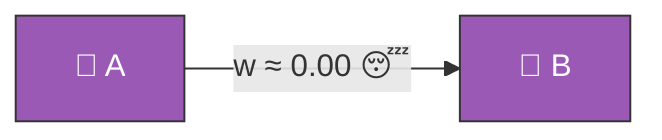
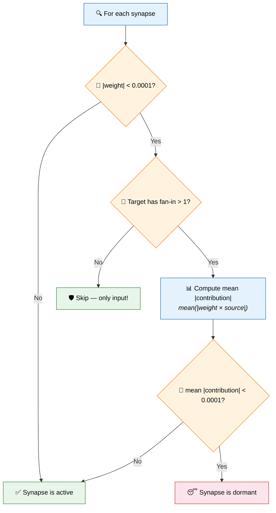
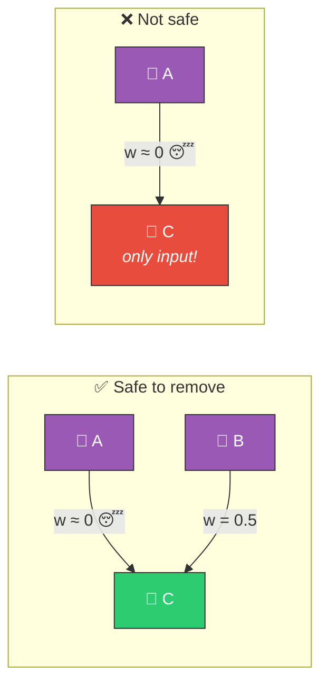
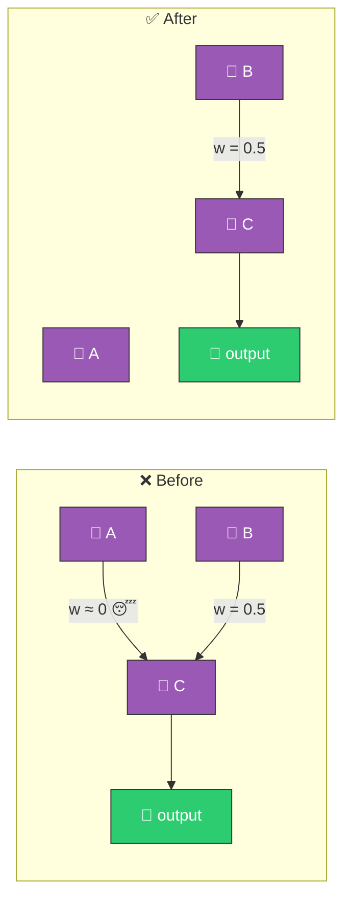

# 😴 Dormant Synapse Detection

[Back to Discovery Index](README.md) | **Source:** [`src/analysis/dormant_synapse.rs`](../../src/analysis/dormant_synapse.rs) | **Issue:** [#359](https://github.com/stSoftwareAU/NEAT-AI-Discovery/issues/359)

---

## 🔍 The Problem

A **dormant synapse** is a connection between two neurons whose weight has
decayed to near-zero. It contributes negligible signal to its target but still
adds to the creature's structural complexity.

> 😴 **Dormant synapse!** Signal = activation × 0.00 ≈ 0 — adds cost, contributes nothing.

### ⚠️ Why It Hurts the Creature's Score

- **Structural bloat**: Each synapse adds to the creature's complexity cost
  (cost of growth penalty in NEAT).
- **Wasted evaluation**: The connection is computed during forward pass but
  contributes nothing.
- **Evolutionary noise**: A near-zero weight can mutate back to a small
  value, creating misleading signals.

---

## 🔬 How We Detect It

The fan-in check is a safety guard — we never remove a target neuron's only
remaining input, as that would effectively disconnect it.

> C has **fan-in = 2** → safe to remove A→C. C has **fan-in = 1** → do **NOT** remove.

---

## 🛠️ How We Fix It

Simply **remove the dormant synapse**:

> Signal through C is essentially unchanged (lost only w ≈ 0 contribution from A)
> but the creature is simpler. ✅

| Candidate | Operation | Detail |
|-----------|-----------|--------|
| **Remove synapse** | `removeSynapse` | Emitted as a coordinated structural candidate |

---

## 📝 Example

> A creature has 200 synapses. Analysis finds 12 with |weight| < 0.0001:
>
> | Synapse | Weight | Contribution |
> |---------|--------|-------------|
> | I3 → H5 | 0.00002 | 0.000008 |
> | H2 → H7 | 0.00001 | 0.000003 |
> | H8 → O1 | 0.00009 | 0.000041 |
> | … (9 more) | | |
>
> All targets have fan-in > 1.
>
> **Fix:** Remove all 12 dormant synapses
> **Result:** 188 synapses, lower complexity cost, same functional output ✅

---

## 📚 References

- **Network pruning** —
  [Wikipedia](https://en.wikipedia.org/wiki/Pruning_(artificial_neural_network)):
  The general technique of removing low-magnitude connections, closely related
  to magnitude-based pruning methods.
- **LeCun, Denker & Solla (1989)** — *Optimal Brain Damage*: The foundational
  paper on removing low-saliency weights from neural networks.
- **NEAT (NeuroEvolution of Augmenting Topologies)** —
  [Wikipedia](https://en.wikipedia.org/wiki/Neuroevolution_of_augmenting_topologies):
  The evolutionary algorithm framework this library extends.
