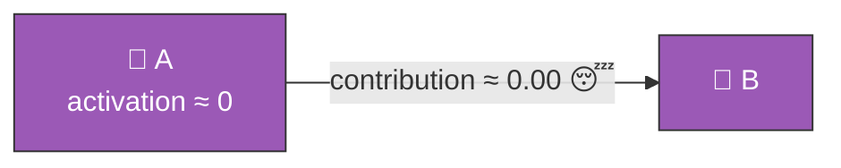
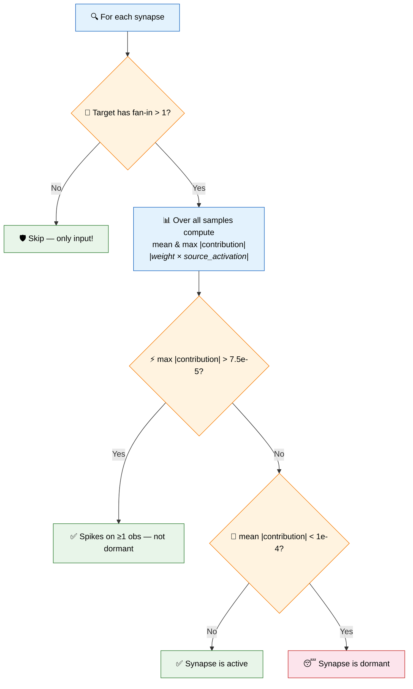
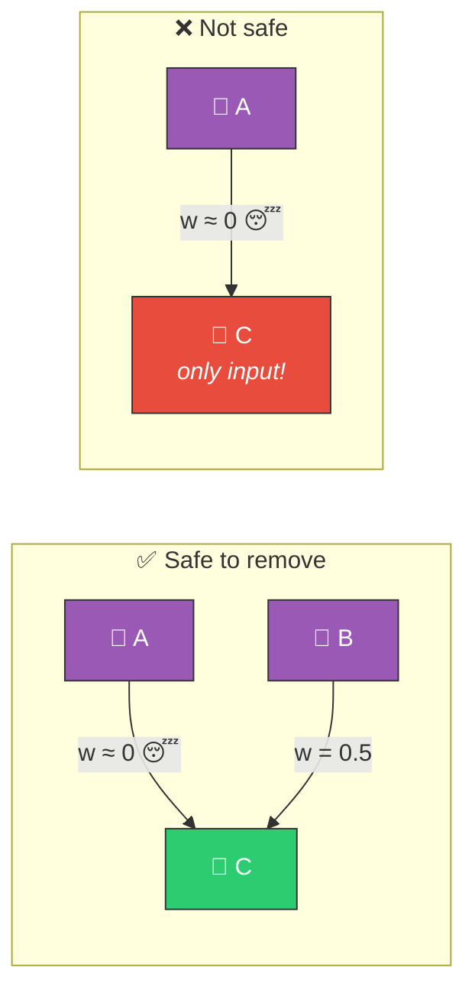
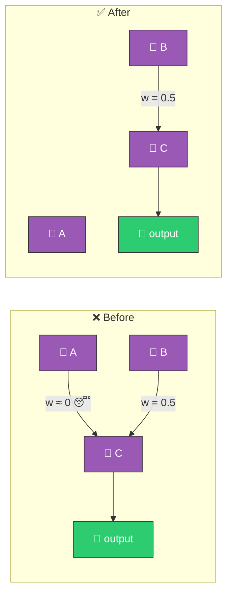

# 😴 Dormant Synapse Detection

[Back to Discovery Index](README.md) | **Source:** [`src/analysis/detection/dormant_synapse.rs`](../../src/analysis/detection/dormant_synapse.rs) | **Issue:** [#359](https://github.com/stSoftwareAU/NEAT-AI-Discovery/issues/359), [#1632](https://github.com/stSoftwareAU/NEAT-AI-Discovery/issues/1632)

---

## 🔍 The Problem

A **dormant synapse** is a connection that carries negligible **signal** to its
target — its mean absolute contribution (`|weight × source_activation|`) is
near-zero — yet it still adds to the creature's structural complexity. Dormancy
is judged on contribution, **not** on weight magnitude (Issue #1632): a large
weight whose source neuron is gated to ~0 across every observation carries no
signal and is just as removable as a near-zero weight.

> 😴 **Dormant synapse!** Contribution = weight × activation ≈ 0 — adds cost, contributes nothing.

### ⚠️ Why It Hurts the Creature's Score

- **Structural bloat**: Each synapse adds to the creature's complexity cost
  (cost of growth penalty in NEAT).
- **Wasted evaluation**: The connection is computed during forward pass but
  contributes nothing.
- **Evolutionary noise**: A near-zero weight can mutate back to a small
  value, creating misleading signals.

---

## 🔬 How We Detect It

Detection is **contribution-first** (Issue #1632): weight magnitude alone is
never the gate. The primary criterion is a negligible **mean** absolute
contribution, and a **spike guard** protects any synapse whose *maximum*
contribution on a single observation exceeds `7.5e-5` — a synapse that is
strongly active on even one observation is not dormant. The fan-in check is a
further safety guard — we never remove a target neuron's only remaining input,
as that would effectively disconnect it.

> C has **fan-in = 2** → safe to remove A→C. C has **fan-in = 1** → do **NOT** remove.

---

## 🛠️ How We Fix It

Simply **remove the dormant synapse**:

> Signal through C is essentially unchanged (lost only w ≈ 0 contribution from A)
> but the creature is simpler. ✅

| Candidate | Operation | Detail |
|-----------|-----------|--------|
| **Remove synapse** | `removeSynapse` | Emitted as a coordinated structural candidate |

---

## 📝 Example

> A creature has 200 synapses. Analysis finds 12 whose mean absolute
> contribution (`|weight × source_activation|`) is below `1e-4` with no
> single-observation spike above `7.5e-5`:
>
> | Synapse | Weight | Mean \|contribution\| | Why dormant |
> |---------|--------|-----------------------|-------------|
> | I3 → H5 | 0.00002 | 0.000008 | tiny weight |
> | H2 → H7 | 0.00001 | 0.000003 | tiny weight |
> | H8 → O1 | 4.20 | 0.000041 | large weight, source gated to ~0 |
> | … (9 more) | | | |
>
> Note H8 → O1: a large weight is still dormant because its source neuron is
> gated to ~0 across every observation, so it carries no signal — the
> contribution-first criterion (Issue #1632) catches it where a weight-magnitude
> gate would have missed it. All targets have fan-in > 1.
>
> **Fix:** Remove all 12 dormant synapses
> **Result:** 188 synapses, lower complexity cost, same functional output ✅

---

## 📚 References

- **Network pruning** —
  [Wikipedia](https://en.wikipedia.org/wiki/Pruning_(artificial_neural_network)):
  The general technique of removing low-magnitude connections, closely related
  to magnitude-based pruning methods.
- **LeCun, Denker & Solla (1989)** — *Optimal Brain Damage*: The foundational
  paper on removing low-saliency weights from neural networks.
- **NEAT (NeuroEvolution of Augmenting Topologies)** —
  [Wikipedia](https://en.wikipedia.org/wiki/Neuroevolution_of_augmenting_topologies):
  The evolutionary algorithm framework this library extends.
