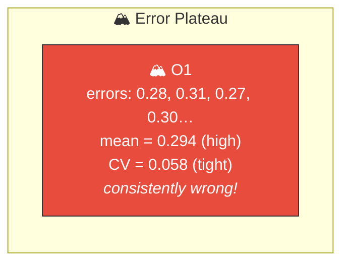
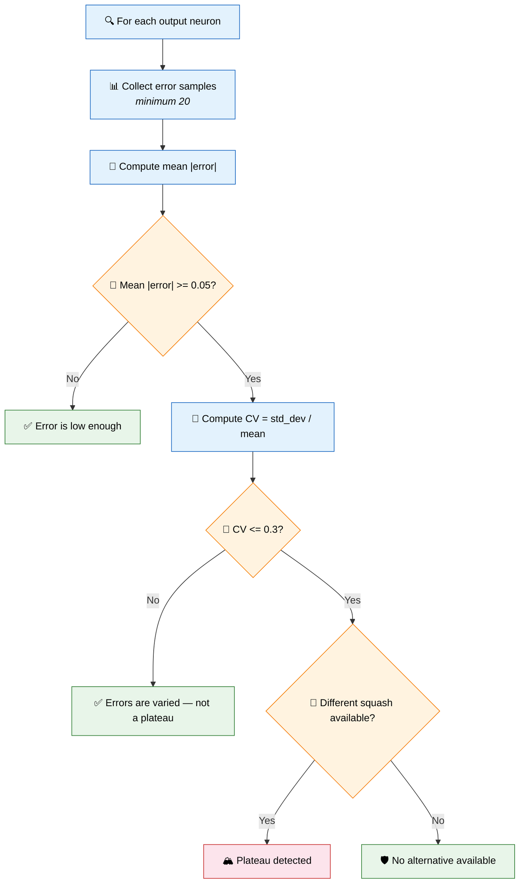
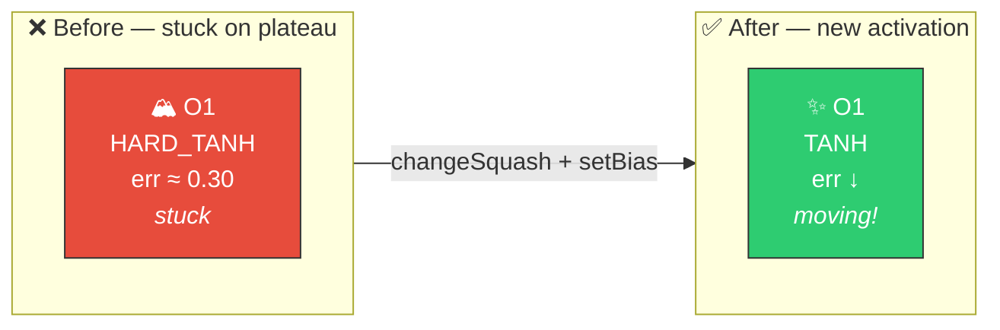

# 🏔️ Error Plateau Detection

[Back to Discovery Index](README.md) | **Source:** [`src/analysis/detection/error_plateau.rs`](../../src/analysis/detection/error_plateau.rs) | **Issue:** [#545](https://github.com/stSoftwareAU/NEAT-AI-Discovery/issues/545)

---

## 🔍 The Problem

An **error plateau** occurs when an output neuron is stuck in a local minimum
characterised by persistently high, statistically uniform error. The error
surface is flat — gradient-based learning cannot find a direction to improve
because all nearby weight configurations produce similar error.

> 🏔️ **Stuck on a plateau!** The error is not random noise — it's consistently wrong, and the flat error surface provides no gradient signal for improvement.

### ⚠️ Why It Hurts the Creature's Score

- **Stuck at high error**: The output neuron reliably produces incorrect
  predictions, and weight adjustments cannot fix it.
- **Flat gradients**: The error surface provides no useful gradient signal
  for improvement.
- **Wrong activation function**: Often caused by a fundamental mismatch
  between the activation function and the target data distribution.

---

## 🔬 How We Detect It

### 📐 Plateau Tightness

The lower the coefficient of variation, the tighter the plateau. This
metric feeds into both confidence and improvement estimates:
`plateau_tightness = 1.0 − CV/0.3`.

---

## 🛠️ How We Fix It

The fix is a coordinated **activation function change + bias recentring**
to break out of the flat region of the error surface:

### 🧬 Activation Recommendations

| Current Squash | Recommended | Rationale |
|---------------|-------------|-----------|
| HARD_TANH, CLIPPED | TANH | Smooth version for better gradients |
| TANH | SOFTSIGN or IDENTITY | Different gradient profile |
| LOGISTIC | TANH or SOFTSIGN | Wider range, symmetric |
| RELU | TANH | Adds negative range |
| IDENTITY | TANH | Adds non-linearity |

| Candidate | Operations | Detail |
|-----------|-----------|--------|
| **Squash change + bias recentre** | `changeSquash` + `setBias` | Atomic pair: new activation + bias adjustment |

The bias adjustment is: `new_bias = current_bias − mean_signed_error`,
recentring the output. Only included if the adjustment exceeds 0.02.

---

## 📝 Example

> **Output neuron O2:** LOGISTIC, bias = 0.8
>
> | Metric | Value |
> |--------|-------|
> | Error samples | [0.22, 0.25, 0.21, 0.24, 0.23, 0.22, 0.25, 0.24] |
> | Mean |error| | 0.233 (> 0.05) |
> | CV | 0.065 (< 0.3 → plateau confirmed) |
> | Mean signed error | −0.15 |
>
> **Candidate:**
> Change squash: LOGISTIC → TANH
> Set bias: 0.8 − (−0.15) = 0.95
> Plateau tightness: 1.0 − 0.065/0.3 = 0.78
> Estimated improvement: 0.233 × 0.78 × 0.3 = **0.055**
>
> The TANH activation provides a different gradient landscape,
> and the bias recentring shifts the output towards the targets ✅

---

## 📚 References

- **Source module**: [`src/analysis/detection/error_plateau.rs`](../../src/analysis/detection/error_plateau.rs)
- **DISCOVERY_TYPES.md**: [Technical reference](../DISCOVERY_TYPES.md)
- **Related**: [Output Squash Mismatch](output-squash-mismatch.md) — detects
  activation/target-data incompatibility at outputs
- **Related**: [Weight Magnitude Reset](weight-magnitude-reset.md) — escapes
  plateau by trying dramatically different weight values
- **Related**: [Output Bias Drift](output-bias-drift.md) — corrects
  systematic bias in output predictions
