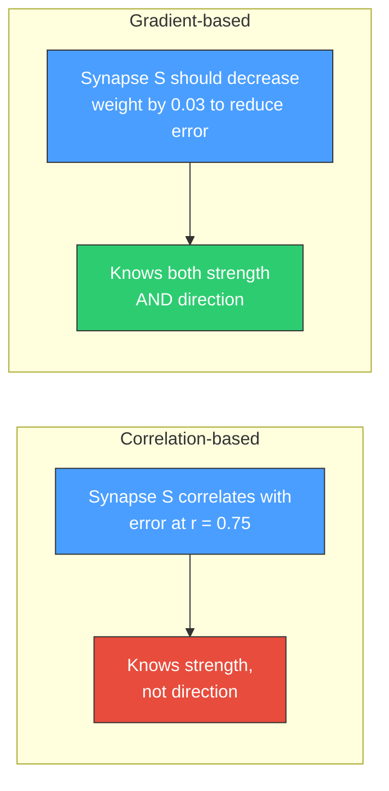
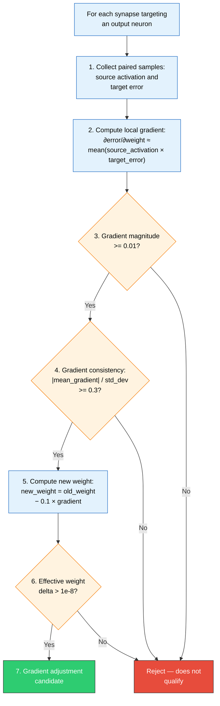
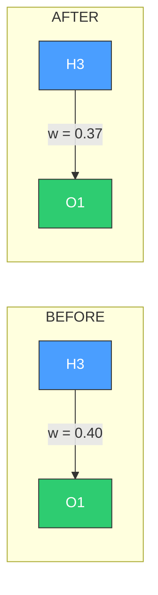

# 📐 Gradient-Based Synapse Adjustment

[Back to Discovery Index](README.md) | **Source:** [`src/analysis/recommendation/gradient_discovery.rs`](../../src/analysis/recommendation/gradient_discovery.rs) | **Issue:** [#421](https://github.com/stSoftwareAU/NEAT-AI-Discovery/issues/421)

---

## 🔍 The Problem

Correlation-based discovery methods measure the *strength* of association
between a synapse's contribution and the target's error, but they do not
indicate *which direction* to adjust the weight. **Gradient-based discovery**
computes the local gradient (∂error/∂weight) for each synapse, providing
directional information about how to change the weight for maximum error
reduction.

> 💡 **Key Insight:** Correlation tells you *that* a synapse matters;
> gradients tell you *how* to fix it.

### 🎯 Why It Matters

- **Directional guidance**: Gradients tell us not just *that* a weight
  matters, but *which way* to adjust it.
- **Higher success rate**: Gradient-based weight adjustments target 25–30%
  success rate, higher than correlation-based methods.
- **Conservative approach**: Uses a small learning rate (0.1) since NEAT-AI
  validates through ablation testing anyway.

> ⚠️ **Note:** The conservative learning rate of 0.1 is intentional — NEAT-AI
> validates every adjustment through ablation testing, so aggressive changes
> are unnecessary.

---

## 🔬 How We Detect It

### 🧮 Gradient Computation

The local gradient approximates the partial derivative using the chain rule:

> 📝 **Formula:**
> `∂error/∂weight ≈ mean(source_activation × target_error)`
>
> This measures: "If I increase the weight slightly, how much
> does the target error change, on average across all samples?"

---

## 🛠️ How We Fix It

> 🔧 **Adjustment:** gradient = 0.3 — increasing the weight increases the
> error, so we decrease it: `w = 0.40 − 0.1 × 0.3 = 0.37`.

| Candidate | Operation | Detail |
|-----------|-----------|--------|
| **Adjust weight** | `setWeight` | new_weight = old_weight − 0.1 × gradient |

The learning rate of 0.1 is conservative — NEAT-AI will validate the
adjustment through ablation testing, so aggressive changes are unnecessary.

> 📊 **Estimated improvement:**
> `|mean_gradient| × |weight_delta| × min(consistency, 3.0) × 0.01`

---

## 📝 Example

> **Synapse H5 → O2**, current weight = 0.60
>
> **Paired samples** (source activation, target error):
> (0.8, 0.3), (0.5, 0.2), (0.9, 0.4), (0.3, 0.1), (0.7, 0.25)
>
> **Gradient** = mean(0.8×0.3 + 0.5×0.2 + 0.9×0.4 + 0.3×0.1 + 0.7×0.25)
> = mean(0.24 + 0.10 + 0.36 + 0.03 + 0.175)
> = 0.181
>
> |gradient| = 0.181 (>= 0.01 ✓)
> Std dev of gradients = 0.12
> Consistency = 0.181 / 0.12 = 1.51 (>= 0.3 ✓)
>
> **New weight** = 0.60 − 0.1 × 0.181 = 0.582
> Delta = 0.018
>
> **Estimated improvement:** 0.181 × 0.018 × min(1.51, 3.0) × 0.01 = 0.000049
>
> ✅ **After fix:** Weight adjusted in the error-reducing direction.
> NEAT-AI validates through ablation testing.

---

## 📚 References

- **Source module**: [`src/analysis/recommendation/gradient_discovery.rs`](../../src/analysis/recommendation/gradient_discovery.rs)
- **DISCOVERY_TYPES.md**: [Gradient-Based Synapse Adjustment](../DISCOVERY_TYPES.md#gradient-based-synapse-adjustment)
- **Related**: [Weight Magnitude Reset](weight-magnitude-reset.md) — tries
  dramatically different weights to escape plateaus (complementary approach)
- **Related**: [Opposing Synapse](opposing-synapse.md) — detects synapses
  with positive contribution–error correlation
- **Gradient descent** —
  [Wikipedia](https://en.wikipedia.org/wiki/Gradient_descent):
  The optimisation technique this module adapts for NEAT discovery.
