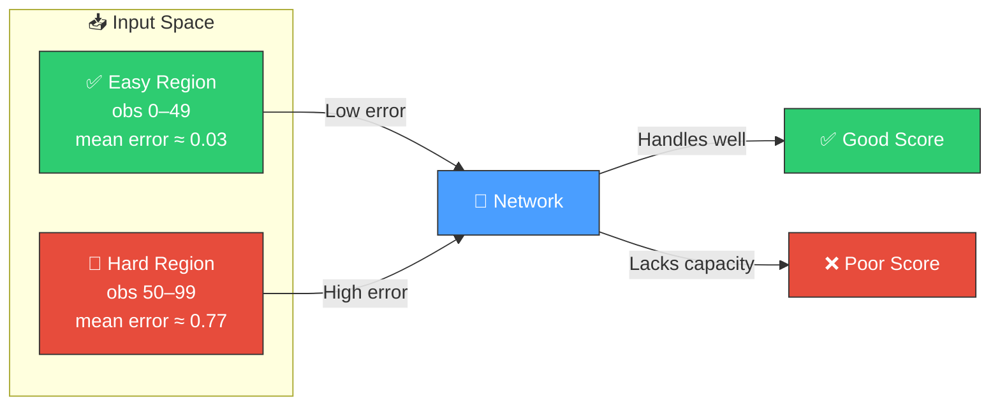
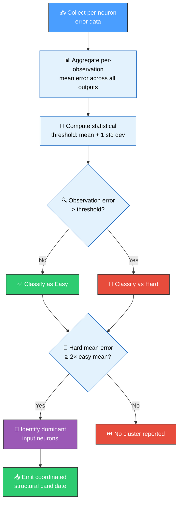
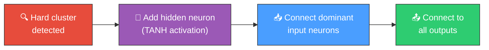

# 🎯 Hard Sample Cluster Detection

[Back to Discovery Index](README.md) | **Source:** [`src/analysis/detection/hard_sample_cluster.rs`](../../src/analysis/detection/hard_sample_cluster.rs) | **Issue:** [#642](https://github.com/stSoftwareAU/NEAT-AI-Discovery/issues/642)

---

## 🔍 The Problem

**Hard sample clusters** occur when groups of training observations are consistently
high-error across all output neurons. This indicates a systematic structural gap — the
network lacks capacity to handle that region of the input space.

> 💡 **Key Insight:** Unlike per-neuron analysis, hard sample cluster detection identifies
> observations that are difficult for the *entire* network — revealing structural gaps
> rather than individual neuron weaknesses.

### 📊 Error Distribution Example

| obs_index | Mean Error | Classification |
|:---------:|:----------:|:--------------:|
| 0         | 0.02       | ✅ Easy        |
| 1         | 0.03       | ✅ Easy        |
| ...       | ...        | ...            |
| 50        | 0.75       | 🔴 HARD       |
| 51        | 0.82       | 🔴 HARD       |
| 52        | 0.71       | 🔴 HARD       |
| ...       | ...        | ...            |
| 99        | 0.78       | 🔴 HARD       |

> ⚠️ **Warning:** Observations 50–99 are consistently hard across **all** outputs
> — this signals a systematic structural gap.

### 📉 Why It Hurts the Creature's Score

- The network cannot represent the input region that produces hard samples
- All output neurons struggle on the same observations simultaneously
- Adding capacity per-neuron (as `sample_weighted.rs` does) treats each neuron
  independently and misses the cross-network pattern
- The hard region drags down the overall score proportionally to its size

### 🔀 Difference from `sample_weighted.rs`

The `sample_weighted.rs` module analyses error per neuron independently. This
module joins error data **across neurons** by `obs_index` to find observations
that are systematically hard for the entire network.

> 📝 **Note:** `sample_weighted.rs` optimises individual neurons;
> `hard_sample_cluster.rs` optimises the network as a whole.

---

## 🔬 Detection Method

1. **Aggregate per-observation error**: For each `obs_index`, compute the mean
   absolute error averaged across all output neurons
2. **Statistical threshold**: Observations with error above `mean + 1 std dev`
   are classified as "hard"
3. **Hard-to-easy ratio check**: Only report clusters where the hard group's
   mean error is at least 2× the easy group's mean error
4. **Dominant input identification**: Compare input neuron activations between
   hard and easy groups to find which inputs discriminate the two

---

## 💡 Recommended Actions

When a hard sample cluster is detected:

1. **Add a hidden neuron** (TANH activation) placed before the output layer
2. **Connect dominant inputs** — inputs whose activations differ most between
   hard and easy observations — to the new neuron
3. **Connect to all outputs** — the new neuron feeds all output neurons,
   adding capacity for the entire hard region

> 🔧 **Implementation Detail:** These are emitted as
> `CoordinatedStructuralCandidateJson` with `AddNeuron` and `AddSynapse`
> operations.

---

## ⚙️ Configuration

| Parameter | Default | Description |
|-----------|---------|-------------|
| `min_hard_easy_ratio` | 2.0 | Minimum ratio to report a cluster |
| `min_hard_obs` | 5 | Minimum hard observations required |
| `min_samples` | 20 | Minimum total observations for analysis |

---

## 🔄 Edge Cases

| Scenario | Behaviour |
|----------|-----------|
| Single output neuron | Works as degenerate case — aggregation over one output |
| Uniform error | No clusters detected (ratio below threshold) |
| All observations hard | No easy baseline → no meaningful ratio |
| Insufficient samples | Skipped (below `min_samples`) |
| Non-finite errors | Treated as 0.0 |
