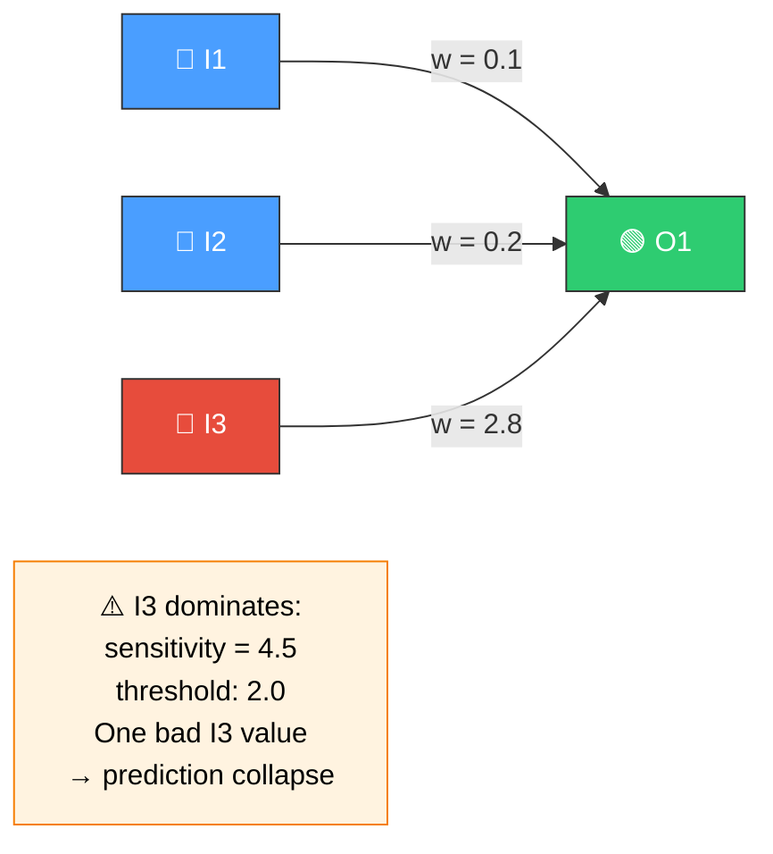
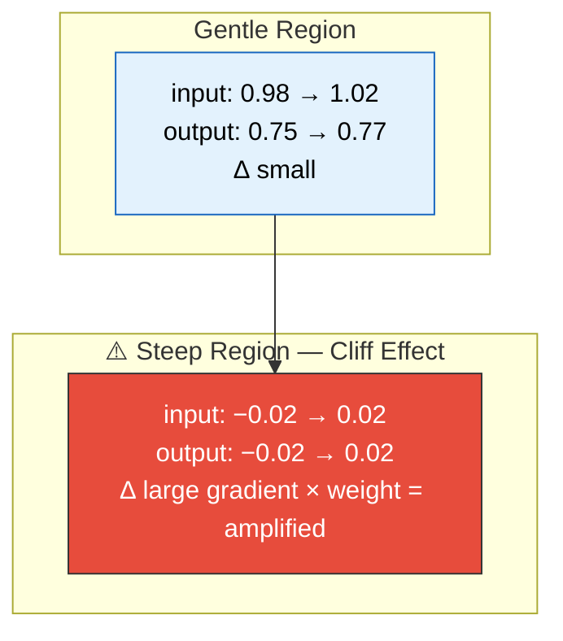
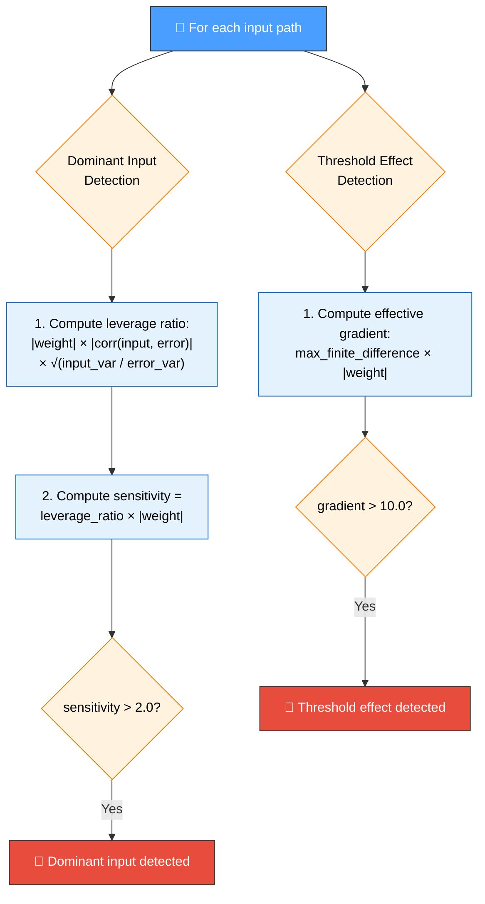
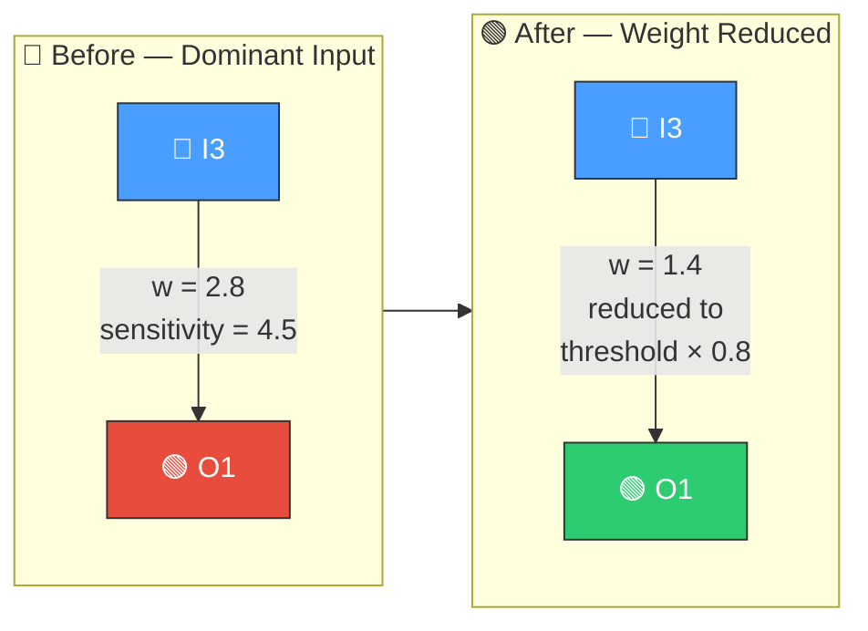
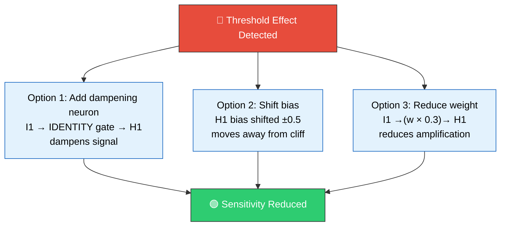

# 🎚️ Input Sensitivity Analysis

[Back to Discovery Index](README.md) | **Source:** [`src/analysis/detection/input_sensitivity.rs`](../../src/analysis/detection/input_sensitivity.rs) | **Issue:** [#435](https://github.com/stSoftwareAU/NEAT-AI-Discovery/issues/435)

---

## 🔍 The Problem

Input sensitivity analysis detects two related brittleness patterns where
small input changes cause disproportionately large output swings:

### ⚡ 1. Dominant Input Detection

A single input neuron has excessive **leverage** over the network output —
its weight, correlation with error, and variance combine to give it outsized
influence. If this input receives noisy or missing data, the entire
prediction collapses.

### 📉 2. Threshold Effect Detection

An input feeds a hidden neuron through a region of extreme gradient in the
activation function (e.g., near the steep part of TANH or LOGISTIC). Tiny
input changes cause sudden, large output changes — a cliff effect.

### ⚠️ Why It Hurts the Creature's Score

> [!WARNING]
> These sensitivity patterns make a creature's predictions unreliable and
> fragile, leading to poor generalisation.

- **Brittle predictions**: Dominant inputs make the model fragile — noise
  or missing values in one input can swing the entire output.
- **Cliff effects**: Threshold regions amplify small input perturbations into
  large output changes, reducing prediction reliability.
- **Overfitting risk**: High sensitivity to one input often means the model
  has memorised training-set-specific patterns.

---

## 🔬 How We Detect It

### ⚙️ Environment Variables

> [!NOTE]
> These thresholds can be tuned via environment variables to adjust
> detection sensitivity for your specific use case.

- `NEAT_AI_DISCOVERY_DOMINANCE_THRESHOLD`: Sensitivity threshold for dominant
  input detection (default: 2.0).
- `NEAT_AI_DISCOVERY_GRADIENT_THRESHOLD`: Effective gradient threshold for
  threshold effect detection (default: 10.0).

---

## 🛠️ How We Fix It

> [!TIP]
> The repair system selects the most appropriate fix based on the pattern
> detected and the network topology.

| Pattern | Candidate | Operation | Detail |
|---------|-----------|-----------|--------|
| **Dominant input** | Reduce weight | `setWeight` | Scale to dominance_threshold × 0.8 |
| **Threshold effect** | Add dampening | `addNeuron` | IDENTITY neuron to attenuate signal |
| **Threshold effect** | Shift bias | `setBias` | Move operating point away from cliff |
| **Threshold effect** | Reduce weight | `setWeight` | Scale weight by gradient × 0.3 |

---

## 📝 Example

> **Dominant Input:**
> Input I7 → Output O1, weight = 3.2
> Correlation(I7, O1\_error) = 0.85
> Leverage ratio = 3.2 × 0.85 × 1.8 = 4.9
> Sensitivity = 4.9 × 3.2 = 15.7 (>> 2.0)
> Fix: Set weight to 2.0 × 0.8 = 1.6
>
> **Threshold Effect:**
> Input I2 → Hidden H3 (TANH), weight = 1.5
> Max finite difference in activation = 0.98
> Effective gradient = 0.98 × 1.5 = 14.7 (> 10.0)
> Fix options:
> 1. Add IDENTITY dampening neuron between I2 and H3
> 2. Shift H3 bias by ±0.5 to move away from steep region
> 3. Reduce I2→H3 weight to 14.7 × 0.3 = 4.4

---

## 📚 References

- **Source module**: [`src/analysis/detection/input_sensitivity.rs`](../../src/analysis/detection/input_sensitivity.rs)
- **DISCOVERY_TYPES.md**: [Technical reference](../DISCOVERY_TYPES.md)
- **Part of**: "Brilliant but Brittle" initiative (Issue #432)
- **Related**: [Noise-to-Signal Ratio](noise-signal.md) — detects noisy
  neurons and synapses
- **Related**: [Weight Coherence](weight-coherence.md) — detects incoherent
  weight configurations
