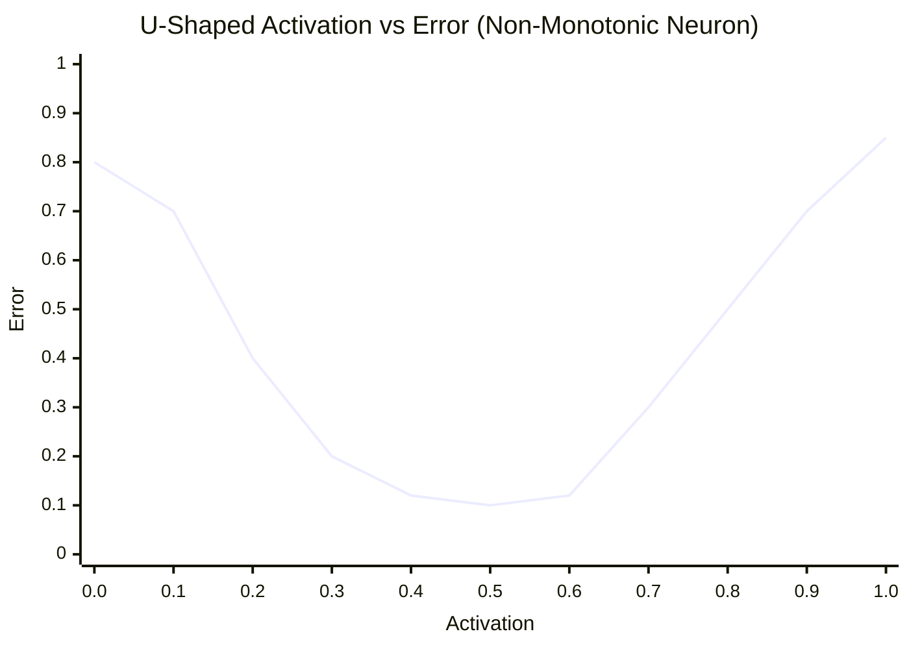
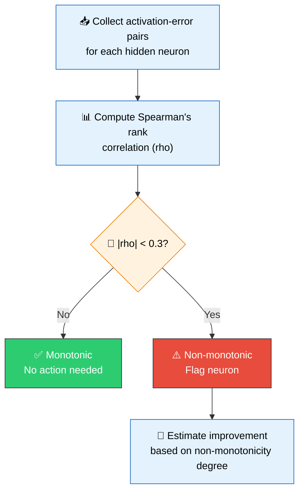
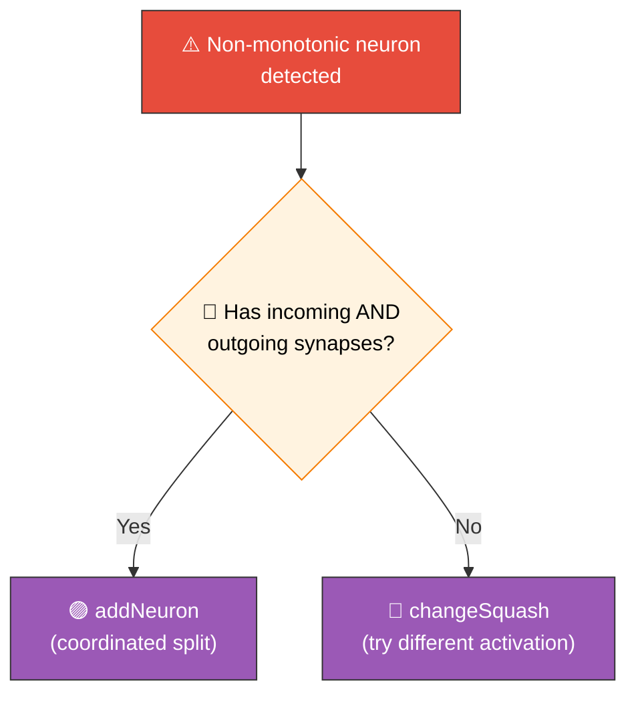
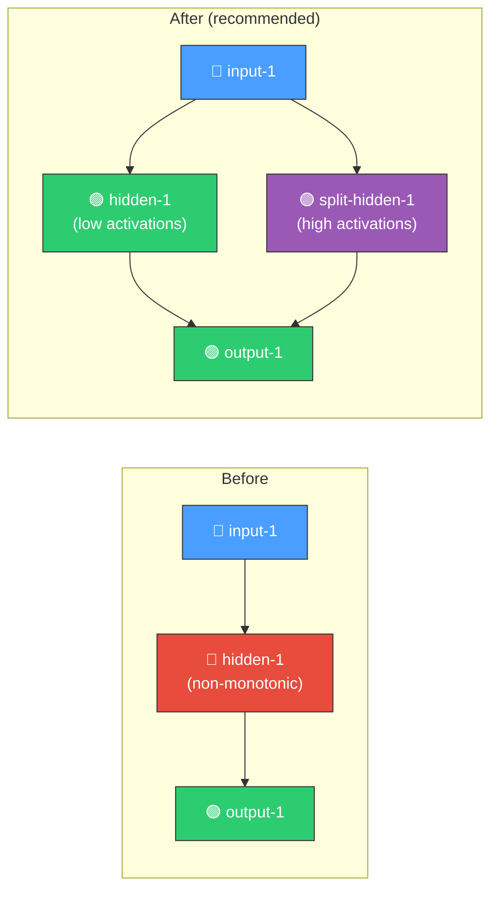

# 📈 Activation-Error Monotonicity Detection

[Back to Discovery Index](README.md) | **Source:** [`src/analysis/detection/monotonicity.rs`](../../src/analysis/detection/monotonicity.rs) | **Issue:** [#643](https://github.com/stSoftwareAU/NEAT-AI-Discovery/issues/643)

---

## 🔍 The Problem

**Non-monotonic activation-error relationships** occur when a hidden neuron's
activation is inconsistently related to output error — higher activation sometimes
correlates with lower error and sometimes with higher error. This contradictory
behaviour suggests the neuron is trying to encode two or more features and should
be split or restructured.

> [!WARNING]
> 🚨 A non-monotonic neuron sends **contradictory signals** to downstream neurons — it cannot consistently reduce error by adjusting its activation in any single direction.

> [!NOTE]
> 📊 The **U-shaped curve** shows error is high at both low and high activation — the neuron encodes contradictory information and should be split.

### ⚠️ Why It Hurts the Creature's Score

- The neuron cannot consistently reduce error by increasing or decreasing activation
- It encodes multiple features that interfere with each other
- Downstream neurons receive contradictory signals from the same source
- The creature's learning process cannot find a stable weight configuration

### 🔀 Difference from `noise_signal.rs`

The noise-to-signal detector measures **variance ratio** — whether error variance
dominates activation variance. A neuron can have high noise-to-signal ratio but
still be monotonic (e.g., noisy but consistently trending). Conversely, a neuron
can have low noise but be non-monotonic (e.g., a clean U-shaped curve).

> [!TIP]
> 🎯 The monotonicity detector specifically measures **directional consistency** using Spearman's rank correlation, whereas the noise-to-signal detector measures **variance ratio**.

### 🔀 Difference from `gradient_discovery.rs`

Gradient discovery analyses existing synapse gradients to suggest weight adjustments.
It operates on synapse-level data. The monotonicity detector analyses the
neuron-level activation-error relationship independent of specific synapses.

---

## 🔬 Detection Method

1. For each hidden neuron, collect all (activation, error) pairs from recorded samples
2. Compute **Spearman's rank correlation** (rho) between activation and absolute error
3. If |rho| < 0.3, the relationship is considered non-monotonic
4. Estimate improvement based on the degree of non-monotonicity and sample count

### 📊 Spearman's Rank Correlation

Spearman's rho measures the monotonicity of the relationship between two variables:

| rho value | Interpretation |
|-----------|----------------|
| +1.0 | Perfectly monotonically increasing |
| -1.0 | Perfectly monotonically decreasing |
| ~0.0 | No monotonic relationship |
| < 0.3 | Weak/non-monotonic (flagged) |

---

## 💡 Recommended Actions

| Candidate Type | When Produced | Rationale |
|---------------|---------------|-----------|
| `addNeuron` (coordinated) | Neuron has incoming and outgoing synapses | Split the neuron into two, each handling one direction of the activation-error mapping |
| `changeSquash` | Neuron lacks full connectivity | Try a different activation function that may better fit the data |

---

## 📝 Example Scenario

> **Network:** `input-1` → `hidden-1` → `output-1`
>
> **hidden-1 activation-error relationship:**
>
> | Activation | Error | Level |
> |-----------|-------|-------|
> | 0.1 | 0.7 | 🔴 High |
> | 0.3 | 0.2 | 🟢 Low |
> | 0.5 | 0.1 | 🟢 Low |
> | 0.7 | 0.3 | 🟡 Medium |
> | 0.9 | 0.8 | 🔴 High |
>
> **Spearman's rho ≈ 0.1** (non-monotonic)
>
> ➡️ **Recommendation:** Add a parallel neuron (`split-hidden-1`) to handle the high-activation region separately.

> [!TIP]
> 🧬 Splitting a non-monotonic neuron allows each resulting neuron to specialise in one region of the activation space, producing consistent error reduction.

---

## ⚙️ Thresholds

| Parameter | Value | Description |
|-----------|-------|-------------|
| `MONOTONICITY_THRESHOLD` | 0.3 | Minimum \|rho\| to consider a relationship monotonic |
| `MIN_SAMPLES_FOR_DETECTION` | 20 | Minimum samples for reliable rank correlation |

> [!IMPORTANT]
> 📏 At least **20 samples** are required for reliable Spearman's rank correlation. Below this threshold, the detector will not flag neurons to avoid false positives.
