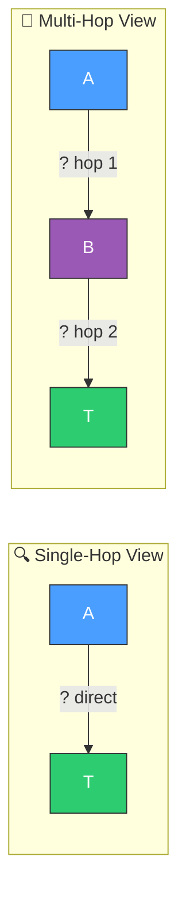
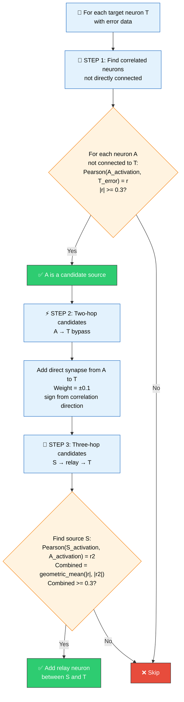
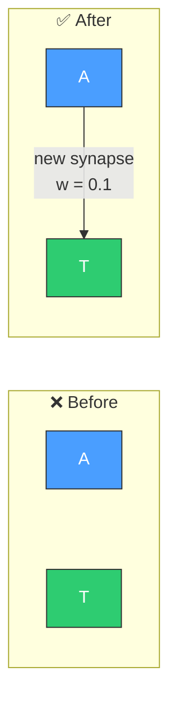
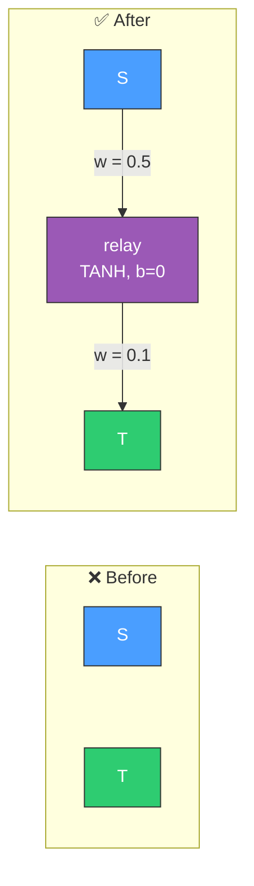
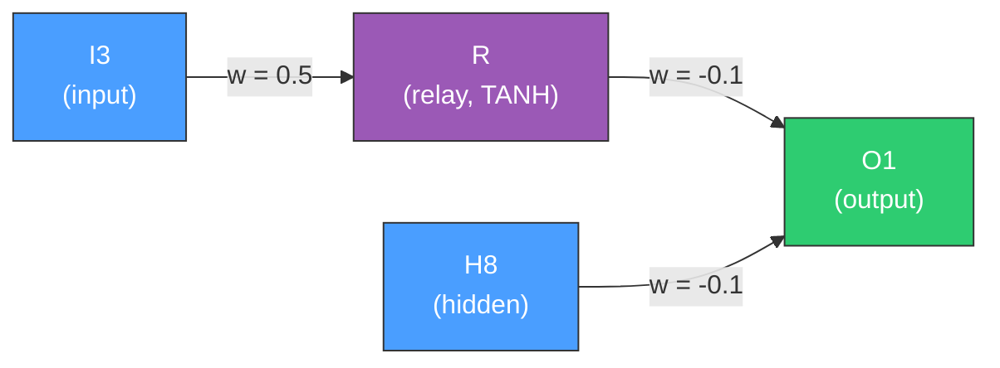

# 🔀 Multi-Hop Candidate Analysis

[Back to Discovery Index](README.md) | **Source:** [`src/analysis/multi_hop.rs`](../../src/analysis/multi_hop.rs) | **Issue:** [#230](https://github.com/stSoftwareAU/NEAT-AI-Discovery/issues/230)

---

## 🔍 The Problem

Some useful signal paths require **two or three connections** to reach a target
neuron. Standard single-hop analysis only considers direct connections (source →
target). Multi-hop analysis discovers **indirect** improvements — neurons that
are correlated with the target's error but are too far away in the network
topology to connect directly.

> [!NOTE]
> 🧠 Single-hop analysis is blind to signal paths that require intermediary
> neurons. Multi-hop analysis bridges this gap by examining indirect
> correlations across the network topology.

### ⚠️ Why It Hurts the Creature's Score

- Valuable signal paths that require intermediaries are **invisible** to
  single-hop analysis.
- The creature misses structural improvements that require adding a relay
  neuron.
- Complex functions often need multi-layer computation that single-hop
  cannot discover.

> [!WARNING]
> 🚨 Without multi-hop analysis, creatures may stagnate at local optima
> because they cannot discover the relay neurons needed for deeper
> computation.

---

## 🔬 How We Detect It

### ✂️ Pruning to Avoid Combinatorial Explosion

| Parameter | Limit |
|---|---|
| Max intermediates per target | 10 |
| Max total candidates | 50 |
| Max hops | 3 |
| Min samples for correlation | 20 |

> [!CAUTION]
> 💥 Without these limits, a creature with 200 neurons would generate
> 200 × 199 = 39,800 potential pairs to check — an expensive
> combinatorial explosion.

---

## 🛠️ How We Fix It

### ⚡ Two-Hop: Add Bypass Synapse

When neuron A correlates with target T but is not directly connected:

> [!TIP]
> 🎯 A's activation correlates with T's error (|r| >= 0.3) — adding a
> direct synapse lets the signal through immediately.

### 🔗 Three-Hop: Add Relay Neuron

When the signal needs to be transformed before reaching T:

> [!TIP]
> 🧬 S correlates with intermediate A, and A correlates with T's error —
> a new TANH relay neuron bridges the gap, enabling signal transformation.

| Hops | Candidate | Operations |
|------|-----------|------------|
| 2 | **Bypass synapse** | `addSynapse` (weight ±0.1) |
| 3 | **Relay neuron** | `addNeuron` (TANH, bias 0) + 2× `addSynapse` |

---

## 📝 Example

> **Target output O1** has high error.
>
> **Analysis finds:**
> - Hidden neuron H8 (not connected to O1) has
>   `Pearson(H8_activation, O1_error) = -0.45`
>
> **Two-hop candidate:** Add synapse H8 → O1 (weight -0.1)
>
> **Further analysis finds:**
> - Input I3 has `Pearson(I3_activation, H8_activation) = 0.52`
> - Combined score = `sqrt(0.45 × 0.52) = 0.48`
>
> **Three-hop candidate:** Add relay neuron R
> - I3 → R (weight 0.5)
> - R → O1 (weight -0.1)
>
> Both candidates provide O1 with access to signal it previously
> could not reach, potentially reducing its error.

---

## 📚 References

- **Multi-hop reasoning** —
  [Wikipedia](https://en.wikipedia.org/wiki/Multi-hop_question_answering):
  The general concept of reasoning through intermediate steps, applied here
  to neural network topology.
- **Network depth and expressiveness** — Deeper networks can represent more
  complex functions; multi-hop analysis discovers where additional depth is
  needed.
- **NEAT (NeuroEvolution of Augmenting Topologies)** —
  [Wikipedia](https://en.wikipedia.org/wiki/Neuroevolution_of_augmenting_topologies):
  The evolutionary algorithm framework this library extends. NEAT naturally
  adds complexity over generations; multi-hop accelerates the discovery of
  useful depth.
