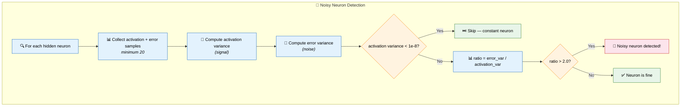
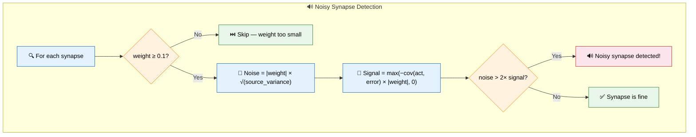
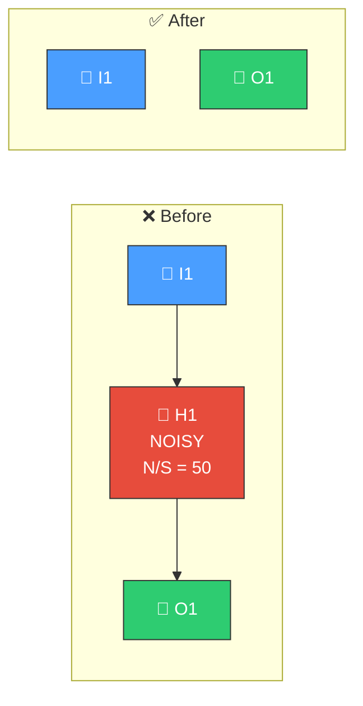
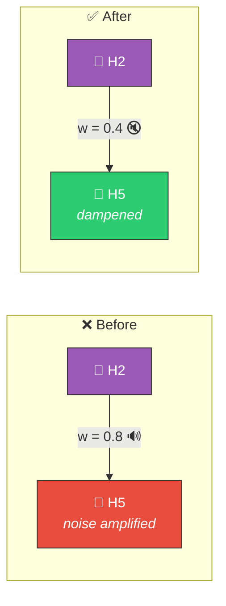

# 📡 Noise-to-Signal Ratio Detection

[Back to Discovery Index](README.md) | **Source:** [`src/analysis/detection/noise_signal.rs`](../../src/analysis/detection/noise_signal.rs) | **Issue:** [#434](https://github.com/stSoftwareAU/NEAT-AI-Discovery/issues/434)

---

## 🔍 The Problem

Part of the "Brilliant but Brittle" initiative (Issue #432), this module
identifies neurons and synapses with high **noise-to-signal ratios** that
make predictions fragile. A noisy neuron produces unpredictable error
contributions despite having low activation variance — it adds randomness
without information. A noisy synapse amplifies upstream variance without
contributing to error reduction.

### 📡 Noisy Neuron

| Sample | Activation (signal) | Error (noise) |
|--------|-------------------|---------------|
| 1 | 0.50 | 0.3 |
| 2 | 0.51 | −0.8 |
| 3 | 0.49 | 0.5 |
| 4 | 0.50 | −0.2 |
| 5 | 0.52 | 0.9 |

> Activation variance: **0.0001** | Error variance: **0.35**
> Noise-to-signal ratio: 0.35 / 0.0001 = **3500** (>> 2.0 threshold)
> → Neuron contributes randomness, not information! 📡

### 🔊 Noisy Synapse

> Source neuron: high variance activation, poor error correlation
> Weight: **0.8** (large — amplifies the noise)
> Noise contribution >> 2× signal contribution
> → Synapse is a noise amplifier! 🔊

### ⚠️ Why It Hurts the Creature's Score

- **Brittle predictions**: High noise-to-signal neurons cause unpredictable
  output swings on noisy or missing inputs.
- **Noise amplification**: Large-weight synapses connected to noisy sources
  propagate and amplify randomness through the network.
- **Wasted resources**: Noisy components consume computation without
  improving predictions.

---

## 🔬 How We Detect It

### ⚙️ Environment Variable

- `NEAT_AI_DISCOVERY_NOISE_SIGNAL_THRESHOLD`: Configure the neuron
  noise-to-signal threshold (default: 2.0).

---

## 🛠️ How We Fix It

### 📡 Noisy Neuron Fix

> H1 removed (noise source) ✅

### 🔊 Noisy Synapse Fix

> Weight halved to dampen noise (or removed entirely if no signal). ✅

| Target | Candidate | Operation | Detail |
|--------|-----------|-----------|--------|
| **Noisy neuron** | Remove neuron | `removeNeuron` | Eliminate the noise source |
| **Noisy synapse (no signal)** | Remove synapse | `removeSynapse` | When signal contribution ≤ 0.01 |
| **Noisy synapse (some signal)** | Reduce weight | `setWeight` | Halve the weight to dampen noise |

---

## 📝 Example

> **Noisy Neuron:**
> Neuron H6: activation variance = 0.0003, error variance = 0.12
> Noise-to-signal ratio: **400** (>> 2.0)
> **Fix:** Remove H6
>
> **Noisy Synapse:**
> Synapse H3 → H9, weight = 0.6
> Source H3 activation variance = 0.8
> Noise contribution: 0.6 × √0.8 = **0.537**
> Signal contribution: **0.05**
> Noise/signal: 10.7× (>> 2×)
> Signal > 0.01, so some useful information
> **Fix:** Set weight to 0.3 (halved to dampen noise while preserving signal) ✅

---

## 📚 References

- **Source module**: [`src/analysis/detection/noise_signal.rs`](../../src/analysis/detection/noise_signal.rs)
- **DISCOVERY_TYPES.md**: [Noise-to-Signal Ratio Detection](../DISCOVERY_TYPES.md#noise-to-signal-ratio-detection)
- **Part of**: "Brilliant but Brittle" initiative (Issue #432)
- **Related**: [Input Sensitivity](input-sensitivity.md) — detects dominant
  inputs and threshold effects
- **Related**: [Weight Coherence](weight-coherence.md) — detects incoherent
  weight configurations
