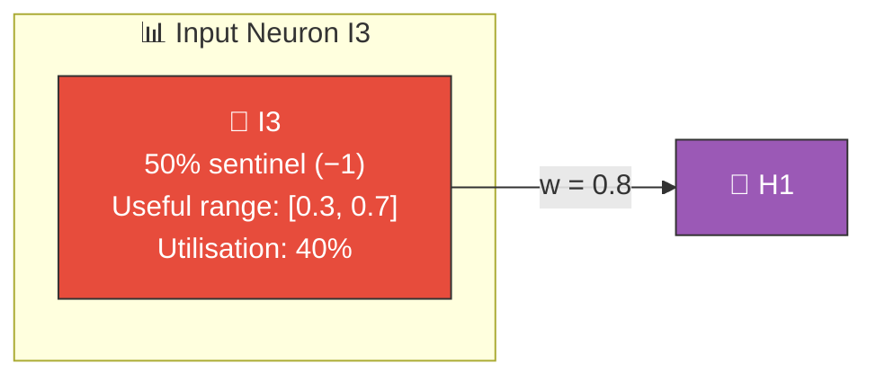
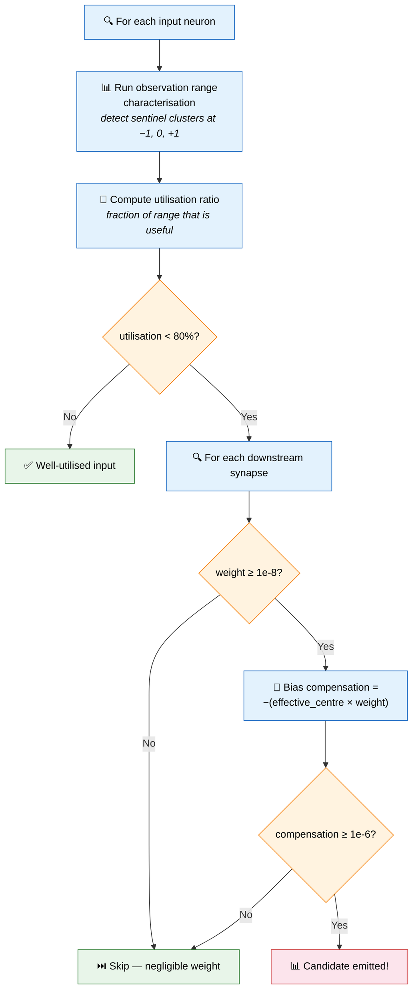
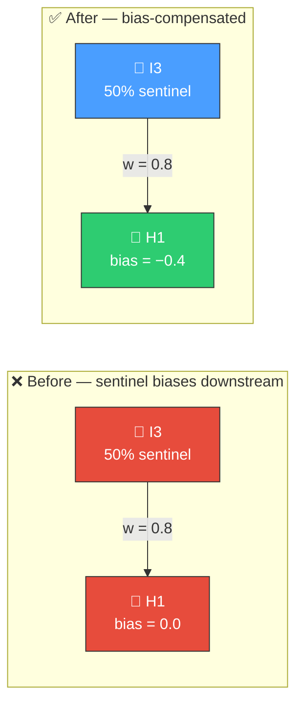

# 📊 Observation Utilisation

[Back to Discovery Index](README.md) | **Source:** [`src/analysis/detection/observation_utilisation.rs`](../../src/analysis/detection/observation_utilisation.rs) | **Issue:** [#543](https://github.com/stSoftwareAU/NEAT-AI-Discovery/issues/543)

---

## 🔍 The Problem

Input neurons often receive data where a large fraction of samples are
**sentinel values** (e.g., −1 for "missing data", 0 for "not applicable").
These sentinels reduce the effective utilisation of the input range, and
downstream neurons cannot distinguish between "the value is zero because
the data is missing" and "the value is zero because the measurement is zero".

This module builds on the observation range characterisation (Issue #398)
to recommend bias adjustments on downstream neurons that compensate for the
sentinel-induced offset.

> 📊 When I3 = −1 (sentinel): contribution = **−0.8**
> When I3 = 0.5 (useful): contribution = **+0.4**
> Average contribution is **biased by the sentinel!**

### ⚠️ Why It Hurts the Creature's Score

- **Biased downstream activation**: Sentinel values shift the mean input
  to downstream neurons, biasing their operating point.
- **Underused input range**: Less than 80% of the input's range carries
  useful information.
- **Confounded learning**: Downstream weights learn a compromise between
  handling sentinel values and real data, doing neither well.

---

## 🔬 How We Detect It

---

## 🛠️ How We Fix It

The fix adjusts the bias of each downstream target neuron to compensate for
the sentinel-induced offset:

> Bias compensates for sentinel offset! ✅

| Candidate | Operation | Detail |
|-----------|-----------|--------|
| **Bias compensation** | `setBias` | Per downstream target: bias += −(effective_centre × weight) |

Estimated improvement: `(1.0 − utilisation_ratio) × 0.005`.

---

## 📝 Example

> Input neuron I5:
> - Utilisation ratio: **55%** (< 80%)
> - Sentinel: 0 detected (35% of samples)
> - Effective centre of useful range: 0.6
>
> Downstream synapses from I5:
>
> | Synapse | Weight | Current Bias | New Bias | Calculation |
> |---------|--------|-------------|----------|-------------|
> | I5 → H2 | 0.5 | 0.1 | **−0.2** | 0.1 + (−(0.6 × 0.5)) = 0.1 − 0.3 |
> | I5 → H7 | −0.3 | 0.0 | **0.18** | 0.0 + (−(0.6 × −0.3)) = 0.0 + 0.18 |
>
> **After fix:** Downstream neurons' operating points are
> compensated for the sentinel-induced offset. 🎯

---

## 📚 References

- **Source module**: [`src/analysis/detection/observation_utilisation.rs`](../../src/analysis/detection/observation_utilisation.rs)
- **DISCOVERY_TYPES.md**: [Technical reference](../DISCOVERY_TYPES.md)
- **Related**: [Bounded Range](bounded-range.md) — adds gating neurons to
  suppress sentinel values
- **Related**: [Sentinel Value Gating](sentinel-gating.md) — input-neuron
  sentinel detection with error-correlation checks
