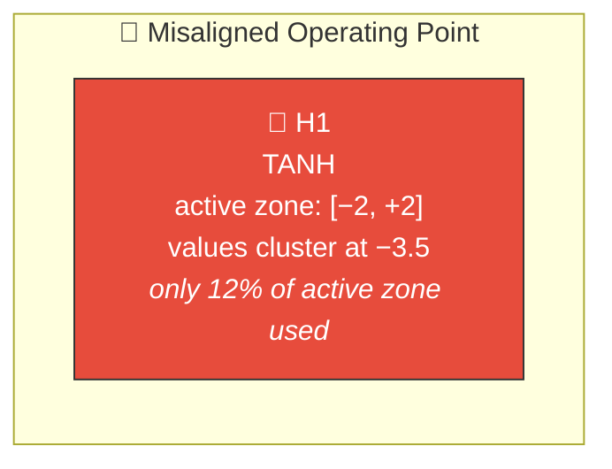
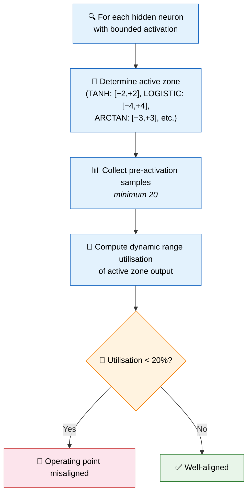
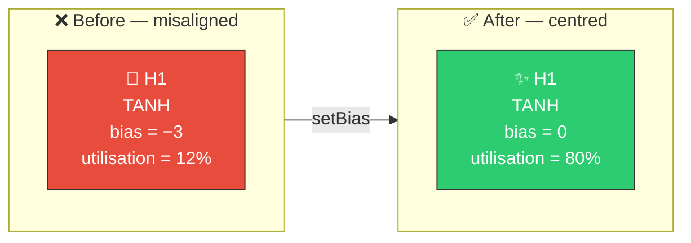

# 🎯 Operating Point Analysis

[Back to Discovery Index](README.md) | **Source:** [`src/analysis/detection/operating_point.rs`](../../src/analysis/detection/operating_point.rs) | **Issue:** [#401](https://github.com/stSoftwareAU/NEAT-AI-Discovery/issues/401)

---

## 🔍 The Problem

A neuron's **operating point** is where its pre-activation values (before the
squash function is applied) sit relative to the activation function's "active
zone" — the input range that produces meaningfully different outputs.

When the operating point is misaligned, the neuron's pre-activation values
cluster in a region where the activation function provides little
discrimination, wasting the neuron's potential.

> 🎯 **Off-target!** Pre-activation values cluster far from the active zone — the neuron's output is near-constant and uninformative.

### ⚠️ Why It Hurts the Creature's Score

- **Poor discrimination**: The neuron cannot distinguish between inputs that
  map to nearly the same output value.
- **Gradient weakness**: In flat regions of the activation function, gradients
  are small, slowing learning.
- **Capacity waste**: The neuron occupies a slot in the topology but contributes
  little useful computation.

---

## 🔬 How We Detect It

### 📐 Active Zone Definitions

| Squash | Active Zone | Output Range |
|--------|------------|-------------|
| TANH | [−2, +2] | [−0.96, +0.96] |
| LOGISTIC | [−4, +4] | [0.02, 0.98] |
| SOFTSIGN | [−4, +4] | [−0.80, +0.80] |
| ARCTAN | [−3, +3] | [−1.25, +1.25] |
| RELU6 | [0, +6] | [0, +6] |

### 🔗 Key Difference from Restricted Range

Operating point analysis examines **pre-activation** values against the
active zone, while [restricted range detection](restricted-range.md) examines
**post-activation** values against the theoretical output bounds. They
complement each other — operating point analysis catches cases where the
input distribution is misaligned, while restricted range catches cases where
the output range is underused.

---

## 🛠️ How We Fix It

Up to three candidates are proposed, in priority order:

| Priority | Candidate | Operation | Detail |
|----------|-----------|-----------|--------|
| 1 | **Set bias** | `setBias` | Shift bias to align pre-activation centre with active zone centre |
| 2 | **Change squash** | `changeSquash` | Switch to IDENTITY (removes bounding entirely) |
| 3 | **Rescale weights** | `setWeight` | Scale incoming weights to expand pre-activation range to 80% of active zone |

---

## 📝 Example

> A creature has a TANH neuron H7 with bias = −3.5.
>
> | Metric | Value |
> |--------|-------|
> | Active zone for TANH | [−2, +2], centre = 0 |
> | Pre-activation values | Cluster around −3.5 |
> | Dynamic range utilisation | 8% |
> | Neuron output | Near-constant ≈ −0.998 |
>
> **Candidates:**
> 1. Set bias to 0.0 → centres values in active zone
> 2. Change to IDENTITY → removes bounding entirely
> 3. Scale incoming weights → spreads values across active zone
>
> **After fix:** Neuron output varies with input, providing useful discrimination for downstream neurons ✅

---

## 📚 References

- **Source module**: [`src/analysis/detection/operating_point.rs`](../../src/analysis/detection/operating_point.rs)
- **DISCOVERY_TYPES.md**: [Technical reference](../DISCOVERY_TYPES.md)
- **Related**: [Restricted Range](restricted-range.md) — post-activation
  range analysis
- **Related**: [Bias Perturbation](bias-perturbation.md) — large bias shifts
  to escape saturated regimes
- **Related**: [Saturated Neuron](saturated-neuron.md) — detects neurons
  already stuck at activation bounds
