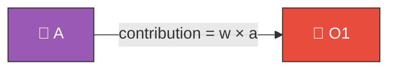
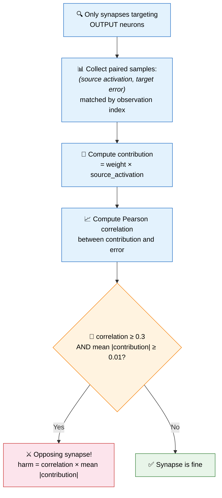
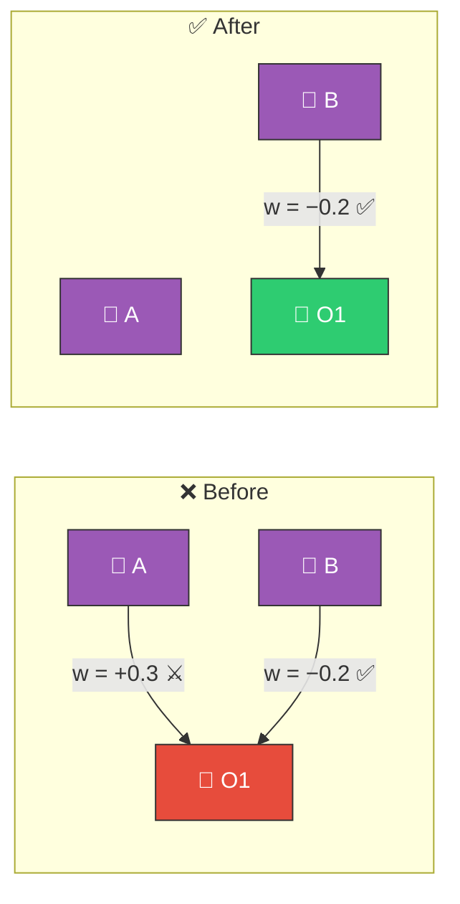
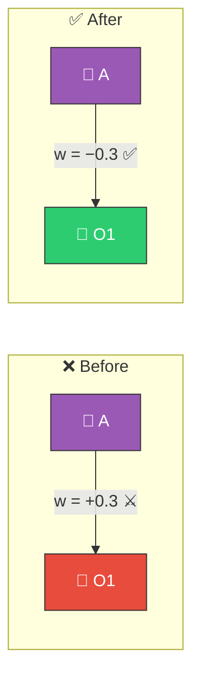

# ⚔️ Opposing Synapse Detection

[Back to Discovery Index](README.md) | **Source:** [`src/analysis/opposing_synapse.rs`](../../src/analysis/opposing_synapse.rs) | **Issue:** [#360](https://github.com/stSoftwareAU/NEAT-AI-Discovery/issues/360)

---

## 🔍 The Problem

An **opposing synapse** is a connection whose contribution actively pushes the
output neuron further in the wrong direction. When the output is already too
high, the synapse makes it higher; when too low, it makes it lower.

> ⚔️ **Opposing synapse!** When O1 error is positive, contribution is also positive —
> pushing O1 even further in the wrong direction. Error persists or grows.

### ⚠️ Why It Hurts the Creature's Score

- The synapse is **actively harmful** — it increases error rather than
  reducing it.
- Unlike a dormant synapse (which does nothing), an opposing synapse makes
  things **worse**.
- Removing or flipping it provides an immediate improvement.

---

## 🔬 How We Detect It

### 📈 Interpreting the Correlation

| Correlation | Meaning | Effect |
|-------------|---------|--------|
| **≈ +1.0** | When error is positive, contribution is positive | ⚔️ **HARMFUL** — pushes output further from target |
| **≈ 0.0** | No consistent relationship | 😐 Synapse is neutral |
| **≈ −1.0** | When error is positive, contribution is negative | ✅ **HELPFUL** — pushes output toward target |

---

## 🛠️ How We Fix It

The fix depends on how strongly opposing the synapse is:

### ✂️ Strong Opposition (correlation > 0.5): Remove

> Remove the harmful A→O1 synapse entirely.

### 🔄 Moderate Opposition (correlation 0.3–0.5): Flip

> Negate the weight: the synapse now pushes in the correct direction. 🔄

| Correlation | Candidate | Operation |
|-------------|-----------|-----------|
| > 0.5 | **Remove synapse** | `removeSynapse` |
| 0.3–0.5 | **Flip weight** | `setWeight` (negated, at 70% confidence) |

---

## 📝 Example

> Output neuron O1 consistently predicts too high (positive error).
>
> Synapse H3→O1 has weight **+0.4**.
> When O1 error is positive, H3's activation is also positive.
> contribution = 0.4 × activation ≈ **+0.2** on average.
>
> Pearson correlation between contribution and error: **r = 0.72**
>
> Since r > 0.5 → **remove synapse H3→O1**
> Expected improvement: 0.72 × 0.2 = **0.144** ✅

---

## 📚 References

- **Pearson correlation coefficient** —
  [Wikipedia](https://en.wikipedia.org/wiki/Pearson_correlation_coefficient):
  The statistical measure used to quantify the linear relationship between
  synapse contribution and output error.
- **Hebbian theory** —
  [Wikipedia](https://en.wikipedia.org/wiki/Hebbian_theory): The principle
  that connections should strengthen when they reduce error (the opposing
  synapse is the inverse — it strengthens error).
- **NEAT (NeuroEvolution of Augmenting Topologies)** —
  [Wikipedia](https://en.wikipedia.org/wiki/Neuroevolution_of_augmenting_topologies):
  The evolutionary algorithm framework this library extends.
