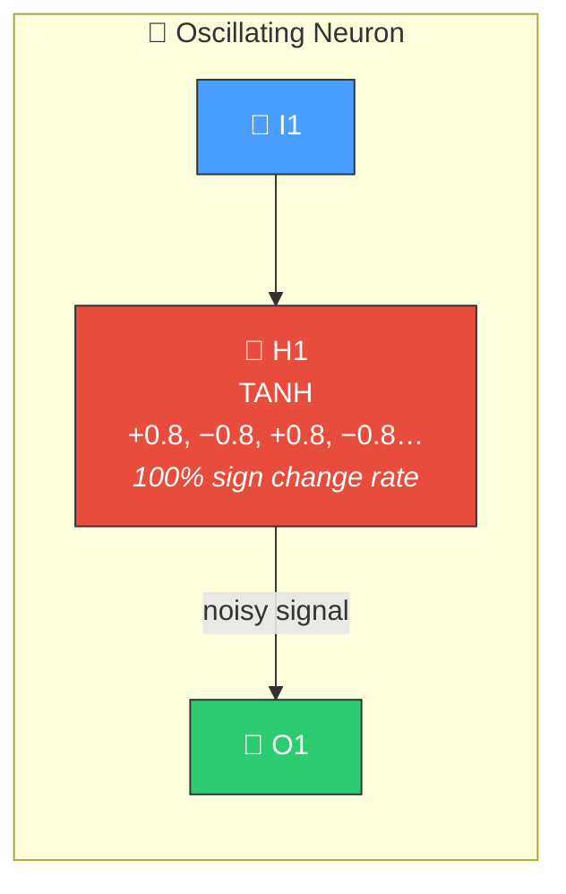
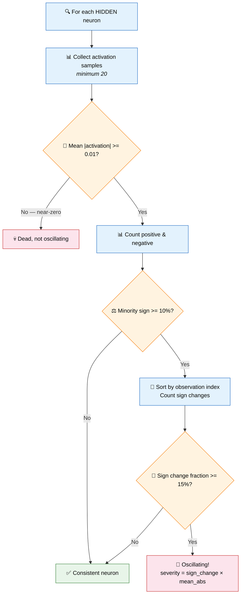
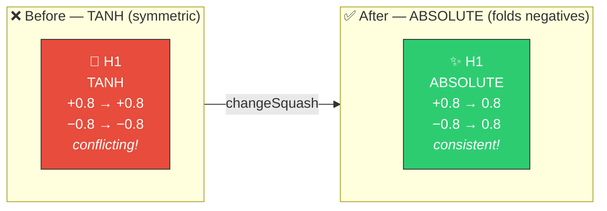

# 🔄 Oscillating Neuron Detection

[Back to Discovery Index](README.md) | **Source:** [`src/analysis/detection/oscillating_neuron.rs`](../../src/analysis/detection/oscillating_neuron.rs) | **Issue:** [#358](https://github.com/stSoftwareAU/NEAT-AI-Discovery/issues/358)

---

## 🔍 The Problem

An **oscillating neuron** is a hidden neuron whose activation frequently flips
between positive and negative values across consecutive training samples. This
suggests the neuron is receiving conflicting signals and cannot settle on a
consistent role in the network.

> 🔄 **Fighting itself!** The neuron alternates between +0.8 and −0.8 — downstream neurons receive an unreliable, noisy signal.

### ⚠️ Why It Hurts the Creature's Score

- The neuron is **fighting itself**: it tries to serve two contradictory
  functions simultaneously.
- Downstream neurons receive an unreliable, noisy signal that makes learning
  harder.
- The oscillation wastes the neuron's representational capacity — it could
  be doing useful work with a more suitable activation function.

---

## 🔬 How We Detect It

### 📊 Why the Thresholds Matter

| Sign Change Fraction | Meaning |
|---------------------|---------|
| 0% | All same sign → not oscillating |
| 10% | Mostly one sign → normal variation |
| **15%** | **Frequent flips → OSCILLATING** ⚠️ (Issue #417: lowered from 30%) |
| 50% | Random flips → strongly oscillating |

---

## 🛠️ How We Fix It

Replace the symmetric activation function with one that resolves the conflict:

| Current Activation | Recommended Change | Rationale |
|---|---|---|
| TANH, IDENTITY, SOFTSIGN, ARCTAN, HARD_TANH | `changeSquash` → ABSOLUTE | Fold negative values to positive; the magnitude is the useful signal |
| LOGISTIC, RELU, others | `changeSquash` → RELU | Clamp negatives to zero; keep positive signal |

An optional `setBias` adjustment shifts the operating point when the positive/
negative split is uneven (>60% or <40% positive).

---

## 📝 Example

> Hidden neuron H5 (TANH activation):
>
> | Metric | Value |
> |--------|-------|
> | Samples | 200 |
> | Mean |activation| | 0.65 (not dead) |
> | Positive activations | 108/200 = 54% |
> | Negative activations | 92/200 = 46% (minority 46% >= 10% ✓) |
> | Sign changes | 78/199 = 39% (>= 15% ✓) |
> | Severity | 0.39 × 0.65 = **0.25** |
>
> **Fix:** `changeSquash` TANH → ABSOLUTE
> Now both +0.65 and −0.65 map to 0.65 → downstream neurons see a consistent signal ✅

---

## 📚 References

- **Activation functions** —
  [Wikipedia](https://en.wikipedia.org/wiki/Activation_function): Overview
  of common activation functions and their properties (symmetry, bounds).
- **Absolute value activation** — Used in some architectures to fold
  negative signals, preserving magnitude information when sign is
  uninformative.
- **NEAT (NeuroEvolution of Augmenting Topologies)** —
  [Wikipedia](https://en.wikipedia.org/wiki/Neuroevolution_of_augmenting_topologies):
  The evolutionary algorithm framework this library extends.
