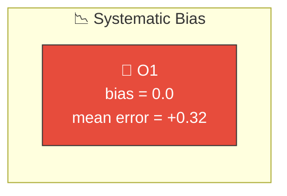
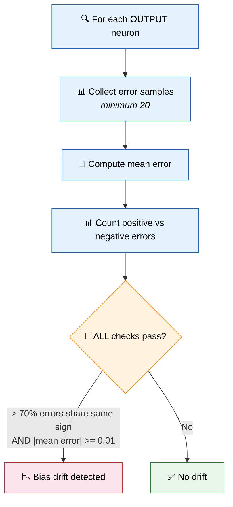
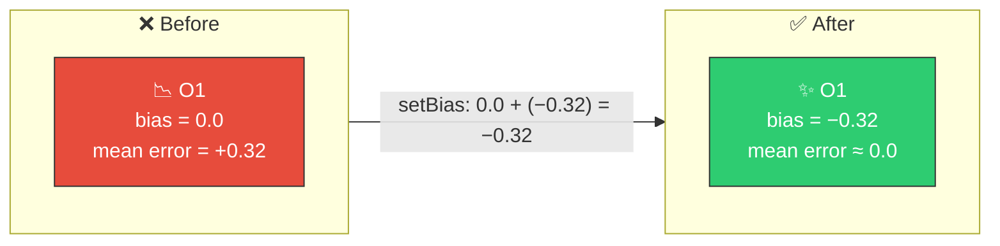

# 📉 Output Bias Drift Detection

[Back to Discovery Index](README.md) | **Source:** [`src/analysis/output_bias_drift.rs`](../../src/analysis/output_bias_drift.rs) | **Issue:** [#361](https://github.com/stSoftwareAU/NEAT-AI-Discovery/issues/361)

---

## 🔍 The Problem

**Output bias drift** occurs when an output neuron consistently predicts too
high or too low across the majority of training samples. The network has learned
the correct pattern shape but is offset by a constant amount.

> 📉 **Predictions follow the correct pattern but are shifted UP by ~0.4** — systematic positive bias. Every sample carries the same offset error.

### ⚠️ Why It Hurts the Creature's Score

- Every sample has approximately the same error (the offset).
- The error does not cancel out — it consistently adds to the total score
  penalty.
- A simple bias adjustment would eliminate this entire class of error.

---

## 🔬 How We Detect It

### 📊 Visualising the Detection

> **Error distribution for output neuron O1:**
>
> Mean error = **+0.32**, 85% of errors are positive → **clear positive bias drift**.

---

## 🛠️ How We Fix It

Adjust the output neuron's bias to centre the predictions:

| Candidate | Operation | Detail |
|-----------|-----------|--------|
| **Set bias** | `setBias` | new_bias = current_bias − mean_error |

The estimated improvement is proportional to the magnitude of the drift and the
consistency (majority fraction).

---

## 📝 Example

> Output neuron O2 (classifying "cat" vs "not cat"):
>
> | Metric | Value |
> |--------|-------|
> | Samples | 500 |
> | Mean error | +0.18 (predictions consistently too high) |
> | Positive errors | 412/500 = 82.4% |
> | Current bias | 0.05 |
>
> **Recommended fix:** `setBias` → 0.05 + (−0.18) = **−0.13**
>
> After fix: predictions shift down by 0.18, mean error ≈ 0.0,
> score improves across 82% of samples ✅

---

## 📚 References

- **Bias in neural networks** —
  [Wikipedia](https://en.wikipedia.org/wiki/Artificial_neuron#Types_of_transfer_functions):
  How the bias parameter shifts the activation function's operating point.
- **Mean squared error** —
  [Wikipedia](https://en.wikipedia.org/wiki/Mean_squared_error): A common
  loss metric. Output bias drift inflates the network's loss under any cost
  function; the inflation is exact for `MSE` and a ranking signal for the
  other built-in costs (see
  [`docs/COST_FUNCTION_NOTES.md`](../COST_FUNCTION_NOTES.md) §4).
- **NEAT (NeuroEvolution of Augmenting Topologies)** —
  [Wikipedia](https://en.wikipedia.org/wiki/Neuroevolution_of_augmenting_topologies):
  The evolutionary algorithm framework this library extends.
