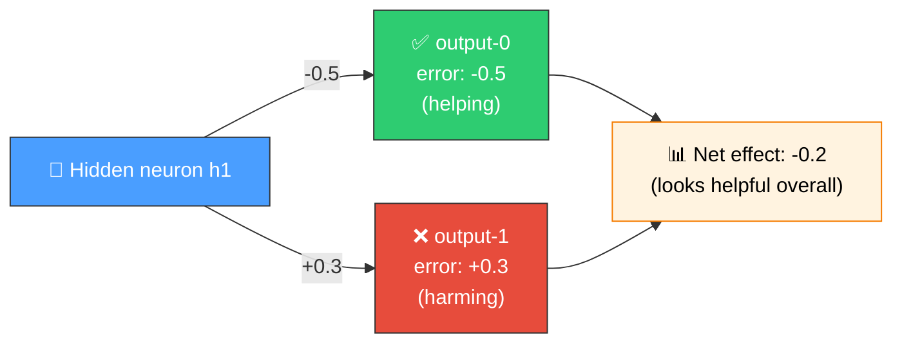
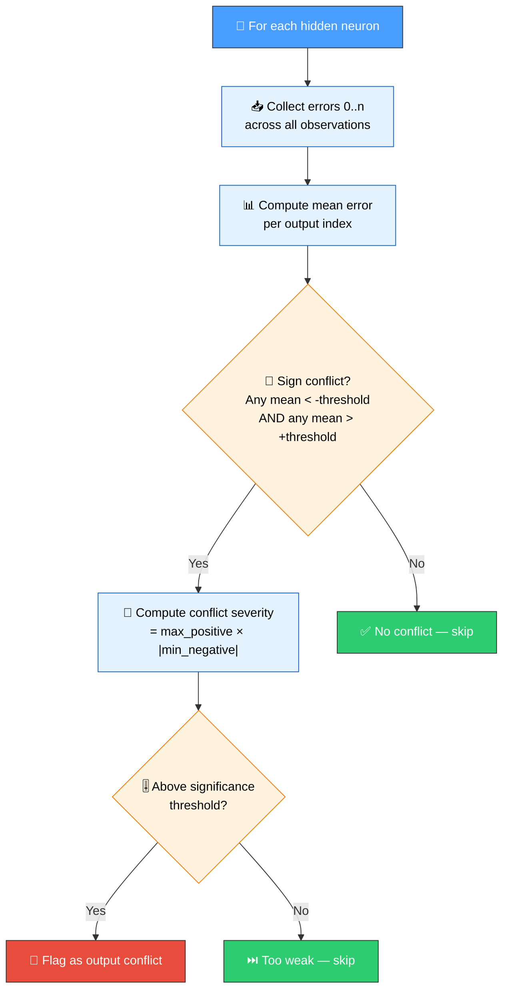
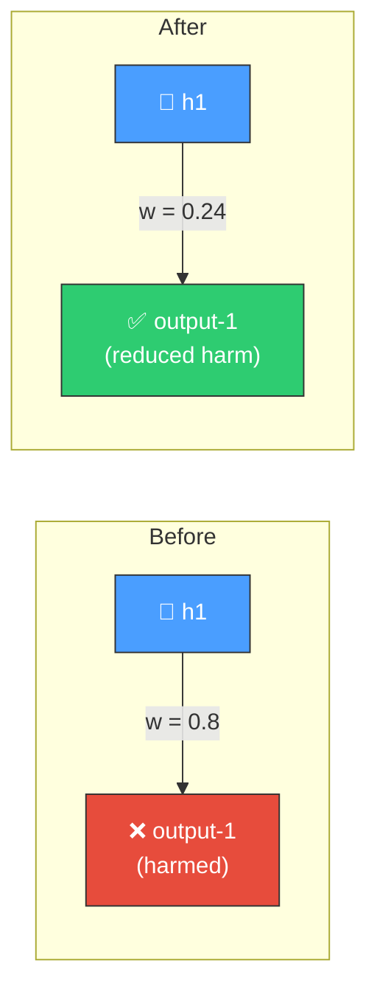
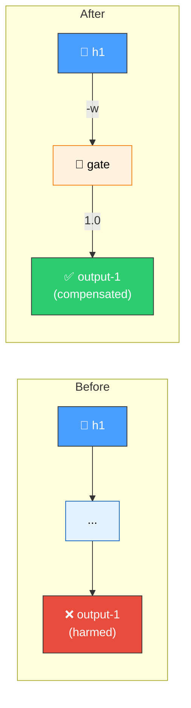
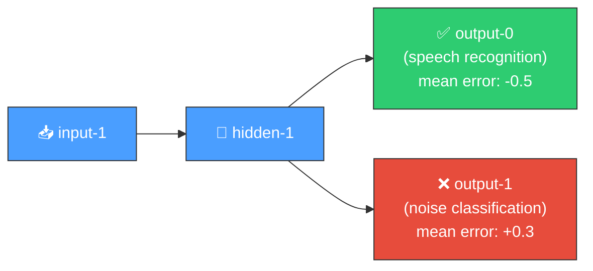

# ⚔️ Output Conflict Detection

[Back to Discovery Index](README.md) | **Source:** [`src/analysis/detection/output_conflict.rs`](../../src/analysis/detection/output_conflict.rs) | **Issue:** [#639](https://github.com/stSoftwareAU/NEAT-AI-Discovery/issues/639)

---

## 🔍 The Problem

A **per-output error conflict** occurs when a hidden neuron has a positive
effect on some outputs but actively harms others. The net error may look
acceptable, but the neuron is creating a cross-output tug-of-war.

> [!WARNING]
> Although the net effect appears helpful (-0.2), output-1 is being actively harmed. Summed-error metrics hide this cross-output tug-of-war.

### ⚠️ Why It Hurts the Creature's Score

- **Hidden harm**: The net error masks the damage to individual outputs.
  Summed-error metrics make the neuron appear beneficial when it is not.
- **Training interference**: Gradient updates that improve one output's
  contribution through this neuron may worsen another output.
- **Structural limitation**: A single hidden neuron cannot simultaneously
  optimise its contribution to outputs that require opposing effects.

---

## 🔬 How We Detect It

> [!NOTE]
> The detector analyses the `errors[0..n]` vector for each hidden neuron, looking for outputs where the mean error contribution has opposing signs.

### 📏 Thresholds

| Parameter | Value | Purpose |
|-----------|-------|---------|
| Minimum significant error | 0.01 | Ignore noise-level error contributions |
| Minimum samples | 10 | Ensure statistical reliability |
| Minimum outputs | 2 | Conflict requires multiple outputs |

---

## 💡 What We Recommend

### 🔧 Strategy 1: Attenuate the Harmful Connection (SetWeight)

When a direct synapse exists from the conflicting neuron to the harmed
output, reduce its weight to 30% of the current value.

> [!TIP]
> Attenuating the weight to 30% preserves the neuron's beneficial contributions to other outputs while reducing the harm to the conflicting output.

### 🧩 Strategy 2: Add a Compensating Gating Neuron (AddNeuron + AddSynapse)

When the path to the harmed output is indirect, insert a compensating
neuron that counteracts the harmful contribution.

> [!NOTE]
> All recommendations are emitted as `CoordinatedStructuralCandidateJson`.

---

## 🔗 Relationship to Other Modules

| Module | Scope | Difference |
|--------|-------|------------|
| **Correlated error** | Output-neuron error correlations | Analyses correlations between output neurons, not hidden neuron per-output contributions |
| **Output conflict** (this) | Hidden neuron per-output disaggregation | Analyses the `errors[0..n]` vector for hidden neurons to find cross-output sign conflicts |

---

## 📝 Example Scenario

A creature with 2 outputs and 1 hidden neuron:

Over 50 training samples, `hidden-1` consistently:
- Reduces error on output-0 by ~0.5 (mean error = -0.5)
- Increases error on output-1 by ~0.3 (mean error = +0.3)

> [!IMPORTANT]
> The detector flags `hidden-1` with a `conflict_severity = 0.5 × 0.3 = 0.15` and recommends attenuating the synapse to output-1.
