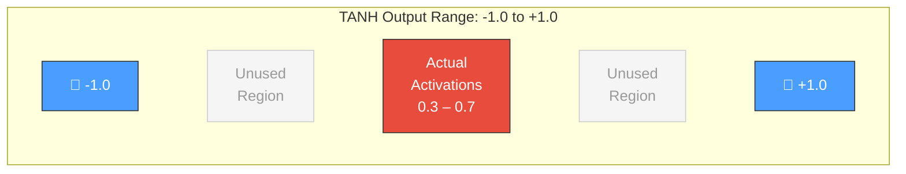
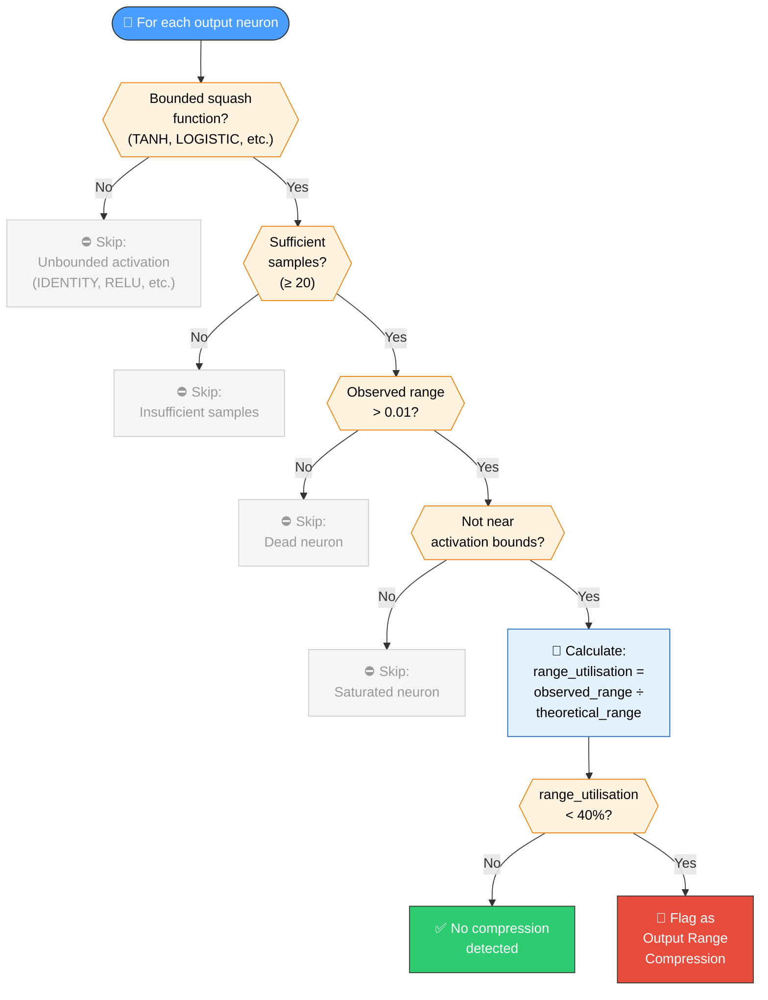
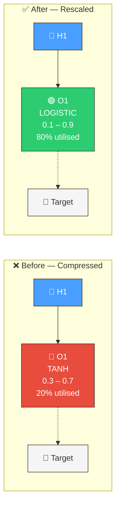

# 📏 Output Range Compression

[Back to Discovery Index](README.md) | **Source:** [`src/analysis/detection/output_range_compression.rs`](../../src/analysis/detection/output_range_compression.rs) | **Issue:** [#645](https://github.com/stSoftwareAU/NEAT-AI-Discovery/issues/645)

---

## 🔍 The Problem

An **output range compression** occurs when an output neuron uses a bounded
activation function (e.g., TANH with range [-1, 1]) but its actual activations
cluster in a narrow sub-range (e.g., [0.3, 0.7]). The neuron is using the
correct *type* of activation but operating at reduced dynamic resolution.

> 💡 **Key insight:** The neuron cannot make fine-grained distinctions in the
> output because weight adjustments produce tiny activation changes relative to
> the full range.

### ⚠️ Why It Hurts the Creature's Score

- **Reduced resolution**: Small weight changes produce negligible activation
  differences within the compressed band, making optimisation sluggish.
- **Wasted capacity**: The activation function's full range could encode much
  more information than the narrow operating band allows.
- **Imprecise predictions**: The network cannot distinguish between target
  values that differ by less than the compressed range's granularity.

---

## 🔬 How We Detect It

> 🔎 **Exclusions:** Hidden neurons are handled by the
> [restricted range](restricted-range.md) module instead.

---

## 🛠️ How We Fix It

| Strategy | Candidate | Operations | Description |
|----------|-----------|------------|-------------|
| **Change squash** | Better-fitting activation | `changeSquash` | Switch to activation whose range matches target distribution |
| **Rescale pathway** | Coordinated adjustment | `setBias` + `setWeight` | Scale incoming weights to expand operating range and recentre bias |

> 🛠️ **Repair strategy:** The detector prefers `changeSquash` when the target
> distribution clearly suits a different activation function, and falls back to
> coordinated weight/bias rescaling otherwise.

---

## 📝 Example

> **Output neuron O1:** TANH (range [-1, +1]), bias = 0.5
> Observed activations: [0.3, 0.7] across 50 samples
> Range utilisation: 0.4 / 2.0 = **20%**
>
> **Candidate 1 — changeSquash → LOGISTIC**
> LOGISTIC range [0, 1] better matches the positive-only distribution.
> Expected improvement: 0.004
>
> **Candidate 2 — setBias + setWeight (coordinated)**
> Scale incoming weights by 4.0× to expand operating range.
> Adjust bias from 0.5 to 0.0 to recentre in activation range.
> Expected improvement: 0.0028

---

## 🔗 Relationship to Other Modules

| Module | What It Detects | Difference |
|--------|----------------|------------|
| **Restricted range** (Issue #399) | Hidden neurons with compressed range | This module targets *output* neurons |
| **Output squash mismatch** (Issue #546) | Wrong activation function type | That module detects fundamentally wrong functions; this detects correct type but compressed usage |
| **Squash weight rescale** (Issue #548) | Coordinated squash+weight changes | That module is for hidden neurons; this produces similar candidates for outputs |

---

## 📚 References

- **Source module**: [`src/analysis/detection/output_range_compression.rs`](../../src/analysis/detection/output_range_compression.rs)
- **DISCOVERY_TYPES.md**: [Technical reference](../DISCOVERY_TYPES.md)
- **Related**: [Restricted Range](restricted-range.md) — hidden neuron version
- **Related**: [Output Squash Mismatch](output-squash-mismatch.md) — wrong function type
- **Related**: [Squash Weight Rescale](squash-weight-rescale.md) — coordinated rescaling for hidden neurons
