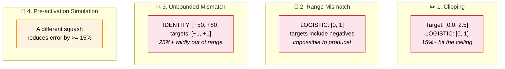
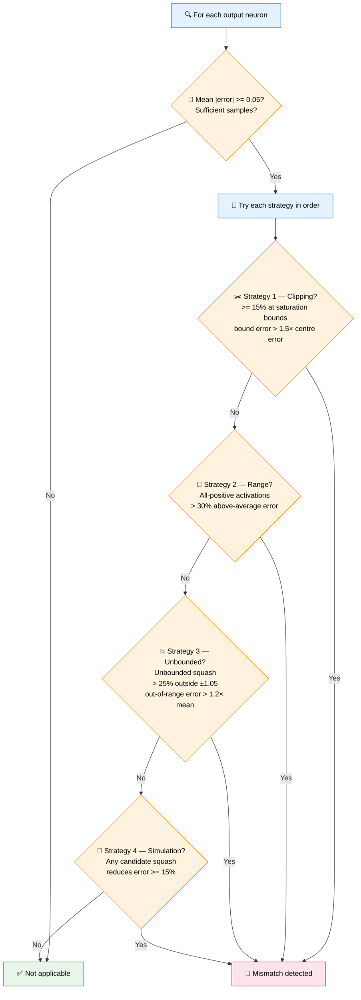
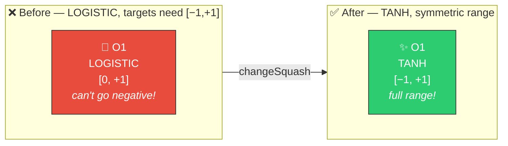

# 🔧 Output Squash Mismatch

[Back to Discovery Index](README.md) | **Source:** [`src/analysis/detection/output_squash_mismatch.rs`](../../src/analysis/detection/output_squash_mismatch.rs) | **Issue:** [#545](https://github.com/stSoftwareAU/NEAT-AI-Discovery/issues/545)

---

## 🔍 The Problem

An **output squash mismatch** occurs when an output neuron's activation
function is fundamentally incompatible with the target data distribution.
No amount of weight or bias tuning can fix this — the activation function
itself prevents the neuron from reaching the correct output values.

Four distinct mismatch patterns exist:

### ⚠️ Why It Hurts the Creature's Score

- **Impossible targets**: The activation function physically cannot produce
  the output values needed, guaranteeing minimum error above zero.
- **Systematic error**: Clipping or range mismatches produce consistent,
  directional errors that bias cannot fix.
- **Wasted convergence effort**: Weight tuning tries to compensate for an
  architectural problem, wasting optimisation budget.

---

## 🔬 How We Detect It

> First matching strategy wins.

---

## 🛠️ How We Fix It

| Strategy | Candidate | Operation | Typical Recommendation |
|----------|-----------|-----------|----------------------|
| **Clipping** | Change squash | `changeSquash` | Bounded → wider range (e.g., TANH) |
| **Range mismatch** | Change squash | `changeSquash` | Non-negative → symmetric (e.g., LOGISTIC → TANH) |
| **Unbounded mismatch** | Change squash | `changeSquash` | Unbounded → bounded (e.g., IDENTITY → TANH) |
| **Pre-activation comparison** | Change squash | `changeSquash` | Best-performing alternative from simulation |

---

## 📝 Example

> **Output neuron O1:** LOGISTIC, bias = 0.5
> Target data range: [−0.8, +1.2]
>
> **Strategy 2 triggers:**
>
> | Check | Result |
> |-------|--------|
> | Activation min | 0.12 (> −0.05 → all positive) |
> | Samples with above-average error | 42% (> 30%) |
> | Problem | Neuron cannot output negative values to match negative targets |
>
> **Candidate:** Change to TANH
> TANH range: [−1, +1] — covers the negative target values
> Estimated improvement: **0.15**
>
> After fix: O1 can now produce negative outputs,
> allowing it to match the full target distribution ✅

---

## 📚 References

- **Source module**: [`src/analysis/detection/output_squash_mismatch.rs`](../../src/analysis/detection/output_squash_mismatch.rs)
- **DISCOVERY_TYPES.md**: [Technical reference](../DISCOVERY_TYPES.md)
- **Related**: [Error Plateau](error-plateau.md) — detects output neurons
  stuck at uniformly high error
- **Related**: [Activation Recommendation](activation-recommendation.md) —
  proactive activation matching for hidden neurons
- **Related**: [Saturated Neuron](saturated-neuron.md) — detects saturation
  in hidden neurons
