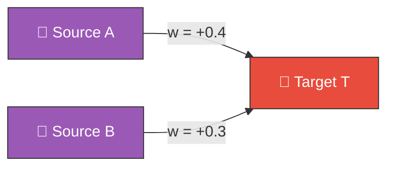
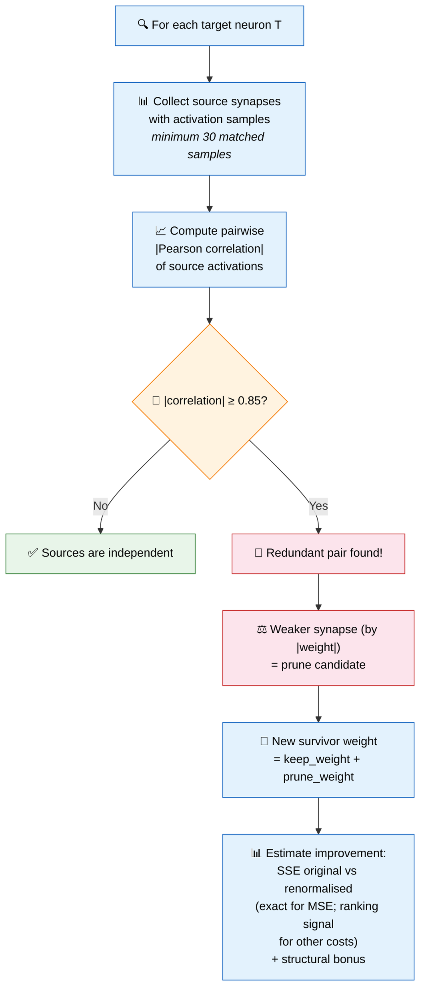
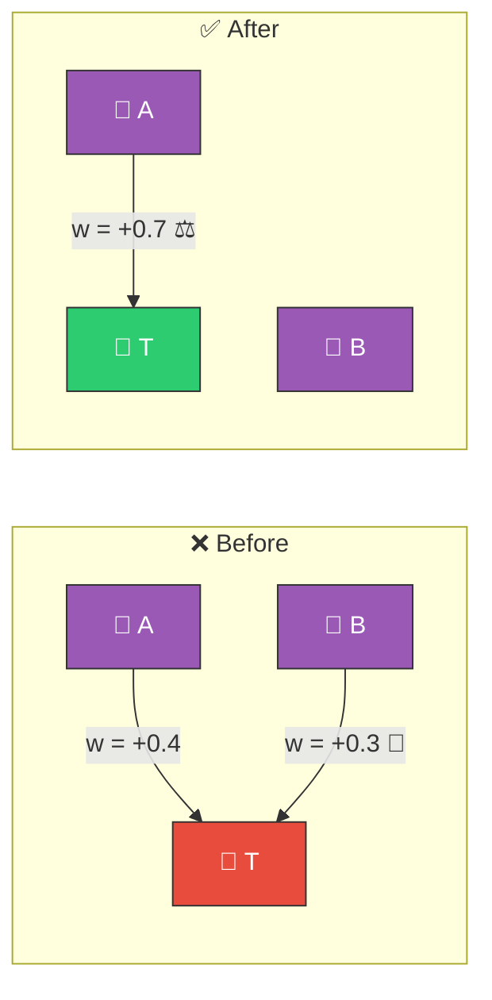

# 🔀 Redundant Path Pruning

[Back to Discovery Index](README.md) | **Source:** [`src/analysis/detection/redundant_path.rs`](../../src/analysis/detection/redundant_path.rs) | **Issue:** [#164](https://github.com/stSoftwareAU/NEAT-AI-Discovery/issues/164)

---

## 🔍 The Problem

**Redundant paths** occur when two synapses feeding the same target neuron carry
effectively the same signal. The network wastes two connections to transmit
information that one could handle.

> 🔀 If A and B activations are highly correlated (r ≥ 0.85):
> both synapses carry ~the same information → **one is redundant**.

### ⚠️ Why It Hurts the Creature's Score

- **Structural complexity**: Two synapses where one would suffice increases
  the creature's complexity cost.
- **Fragile encoding**: If one path mutates slightly, the near-duplicate
  can cause unexpected changes.
- **Wasted capacity**: The creature could use those connections for genuinely
  different signals.

---

## 🔬 How We Detect It

### 📏 Correlation Threshold

| |Pearson r| Range | Interpretation |
|-------------------|----------------|
| 0.0 – 0.5 | 🟢 Unrelated signals |
| 0.5 – 0.85 | 🟡 Different enough to keep |
| **0.85 – 1.0** | 🔴 **REDUNDANT** (threshold) |

> **Note:** Uses **absolute** correlation — both positively correlated
> (r ≈ +1.0) and anti-correlated (r ≈ −1.0) signals count as
> redundant (they carry the same information, just inverted).

---

## 🛠️ How We Fix It

Remove the weaker synapse and renormalise the survivor:

> Survivor weight = 0.4 + 0.3 = **0.7** — signal to T is approximately preserved but simpler. ✅

| Candidate | Operation | Detail |
|-----------|-----------|--------|
| **Remove weaker synapse** | `removeSynapse` | The lower |weight| path |
| **Renormalise survivor** | `setWeight` | New weight = sum of both weights |

---

## 📝 Example

> Target hidden neuron H5 has two inputs:
>
> | Synapse | Weight |
> |---------|--------|
> | I2 → H5 | +0.45 |
> | I7 → H5 | +0.22 |
>
> Activation correlation between I2 and I7: **|r| = 0.91**
>
> Since 0.91 ≥ 0.85 and I7 has the smaller |weight|:
>
> **Fix:**
> 1. `removeSynapse` I7 → H5
> 2. `setWeight` I2 → H5 to 0.45 + 0.22 = **0.67**
>
> Sum-of-squared-error comparison shows the single-path produces nearly identical
> output with one fewer synapse. ✅ (SSE reduction is exact for `MSE`; for
> other costs it serves as a ranking signal — see
> [`docs/COST_FUNCTION_NOTES.md`](../COST_FUNCTION_NOTES.md) §4.)

---

## 📚 References

- **Feature redundancy** —
  [Wikipedia](https://en.wikipedia.org/wiki/Feature_selection#Redundancy):
  The general problem of redundant features in machine learning.
- **Optimal Brain Damage (LeCun et al., 1989)** — Foundational work on
  identifying and removing unnecessary connections in neural networks.
- **Optimal Brain Surgeon (Hasselmo et al., 1992)** — Extends pruning to
  account for weight renormalisation after removal, similar to this approach.
- **NEAT (NeuroEvolution of Augmenting Topologies)** —
  [Wikipedia](https://en.wikipedia.org/wiki/Neuroevolution_of_augmenting_topologies):
  The evolutionary algorithm framework this library extends.
