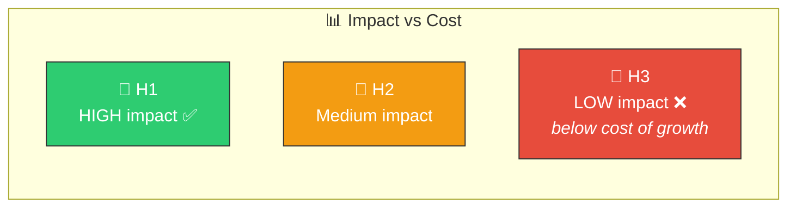
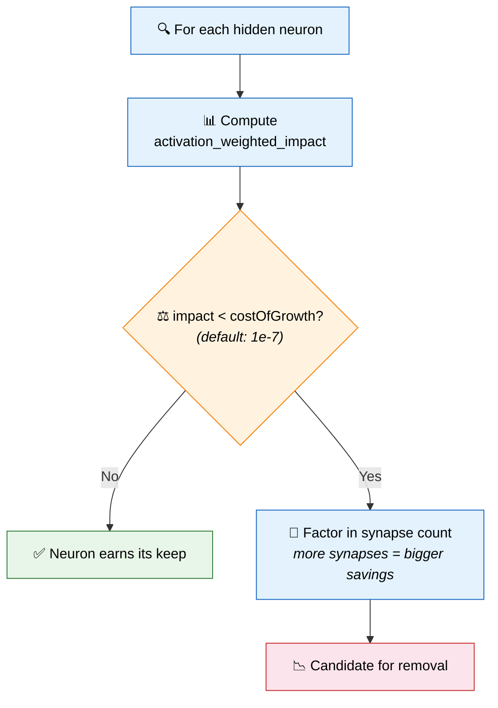
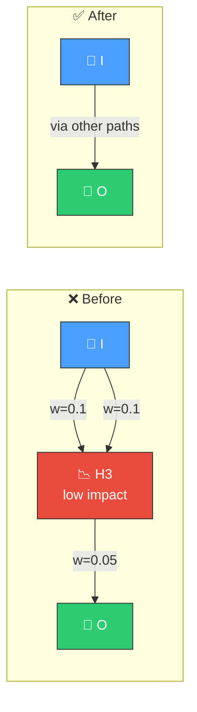

# 📉 Remove Low-Impact Neurons

[Back to Discovery Index](README.md) | **Source:** [`src/analysis/neuron/`](../../src/analysis/neuron/)

---

## 🔍 The Problem

Some neurons contribute **less benefit** to the network than the **cost of
their complexity**. In NEAT, every neuron and synapse incurs a "cost of growth"
penalty on the creature's fitness. If a neuron's impact on accuracy is smaller
than this penalty, the creature would score better without it.

> 📉 **H3 costs more to maintain than it contributes.** Removing H3 improves the
> creature's overall fitness.

### ⚠️ Why It Hurts the Creature's Score

- NEAT's fitness function penalises structural complexity.
- A low-impact neuron adds penalty without enough accuracy benefit to
  compensate.
- Removing it reduces the complexity cost while barely affecting predictions.
- The net effect: **higher fitness score**.

---

## 🔬 How We Detect It

### 📊 Impact Scoring

The `activation_weighted_impact` considers:

| Factor | Description |
|--------|-------------|
| 🔥 **Activation magnitude** | How often and how strongly the neuron fires across samples |
| ⚡ **Connection strength** | Weight magnitude of outgoing synapses |
| 📏 **Distance to output** | Closer to output = higher impact |

> A neuron deep in the network with tiny outgoing weights has very low impact —
> prime removal target. 🎯

---

## 🛠️ How We Fix It

Remove the low-impact neuron and all its connections:

> 2 synapses removed, 1 neuron removed → lower complexity cost ✅

| Candidate | Operation | Detail |
|-----------|-----------|--------|
| **Remove neuron** | `removeNeuron` | Emitted as a removal candidate |

---

## 📝 Example

> Creature with 50 hidden neurons, costOfGrowth = 1e-7
>
> **Neuron H28:**
> - activation_weighted_impact = 3.2e-8 (below 1e-7 threshold)
> - Fan-in: 4 synapses
> - Fan-out: 2 synapses
> - Total synapses removed: 6
>
> | Metric | Value |
> |--------|-------|
> | Accuracy loss | ~0.000000032 (negligible) |
> | Complexity saved | 1 neuron + 6 synapses |
> | Net fitness improvement | positive ✅ |
>
> **Production success rate: 17.6%** (65 successes from 369 candidates)
> This is the highest success-rate discovery type. 🏆

---

## 📚 References

- **Network pruning** —
  [Wikipedia](https://en.wikipedia.org/wiki/Pruning_(artificial_neural_network)):
  The general technique of removing low-contribution components from neural
  networks.
- **NEAT complexity penalty** — In NEAT, fitness is adjusted by a complexity
  metric (cost of growth) that penalises larger networks. This ensures
  evolution favours simpler solutions when accuracy is similar.
- **Occam's razor** —
  [Wikipedia](https://en.wikipedia.org/wiki/Occam%27s_razor): The principle
  that simpler explanations (smaller networks) are preferable when they
  perform equally well.
- **NEAT (NeuroEvolution of Augmenting Topologies)** —
  [Wikipedia](https://en.wikipedia.org/wiki/Neuroevolution_of_augmenting_topologies):
  The evolutionary algorithm framework this library extends.
