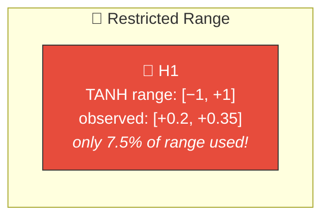
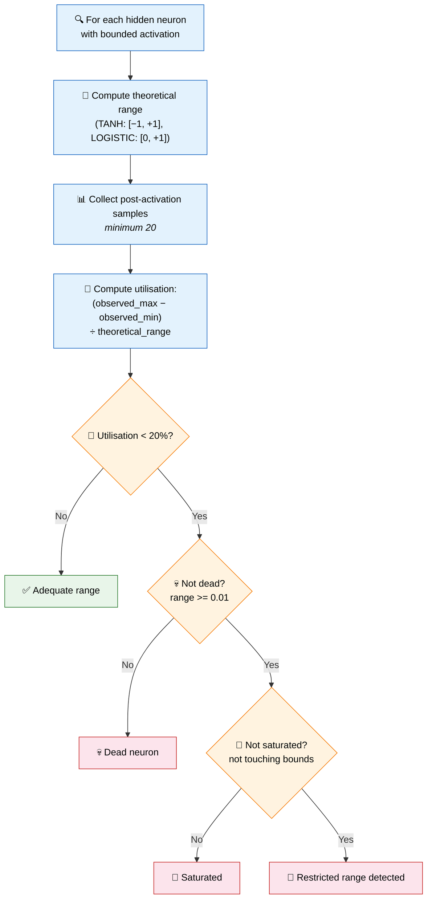
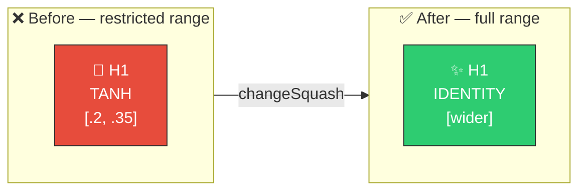

# 📏 Restricted Range Detection

[Back to Discovery Index](README.md) | **Source:** [`src/analysis/detection/restricted_range.rs`](../../src/analysis/detection/restricted_range.rs) | **Issue:** [#399](https://github.com/stSoftwareAU/NEAT-AI-Discovery/issues/399)

---

## 🔍 The Problem

A **restricted range** neuron is one that is active (not dead, not saturated)
but confined to a narrow band within its bounded activation function's
theoretical output range. The neuron is technically working, but using only
a small fraction of its capacity.

> 📏 **Tiny window!** The neuron only uses 7.5% of the available [−1, +1] range — downstream neurons see a near-constant signal.

### ⚠️ Why It Hurts the Creature's Score

- **Poor resolution**: Downstream neurons see a near-constant signal with
  tiny variations, making it hard to distinguish between different inputs.
- **Wasted non-linearity**: The bounded activation function adds computational
  cost without providing meaningful non-linear transformation.
- **Capacity underuse**: The neuron could represent a much wider range of
  values but is constrained by its current weight/bias configuration.

---

## 🔬 How We Detect It

### 🎯 Key Distinction

This detector catches neurons in the "middle ground" between dead and
saturated — they produce output that varies, but not enough to be useful.

---

## 🛠️ How We Fix It

Up to three candidates are proposed per neuron:

| Priority | Candidate | Operation | Detail |
|----------|-----------|-----------|--------|
| 1 | **Change squash** | `changeSquash` | Switch to IDENTITY (removes bounding) |
| 2 | **Adjust bias** | `setBias` | Shift to centre activation in theoretical range |
| 3 | **Rescale weights** | `setWeight` | Scale incoming weights by 0.80/utilisation to expand range |

---

## 📝 Example

> A creature has 25 hidden neurons. Discovery finds:
>
> **Neuron H14:** TANH, observed activations in [+0.20, +0.35]
>
> | Metric | Value |
> |--------|-------|
> | Theoretical range | [−1, +1] (width 2.0) |
> | Observed range | 0.15 (width) |
> | Utilisation | 7.5% |
> | Status | Not dead (range > 0.01), not saturated (away from ±1) |
>
> **Candidates:**
> 1. Change to IDENTITY → removes bounding, allows full range
> 2. Adjust bias → centres the operating point
> 3. Scale incoming weights by 0.80/0.075 ≈ 10.7× → expands pre-activation range
>
> **Result:** Neuron output spans a wider range, providing richer signal to downstream neurons ✅

---

## 📚 References

- **Source module**: [`src/analysis/detection/restricted_range.rs`](../../src/analysis/detection/restricted_range.rs)
- **DISCOVERY_TYPES.md**: [Technical reference](../DISCOVERY_TYPES.md)
- **Related**: [Operating Point](operating-point.md) — pre-activation
  analysis against the active zone
- **Related**: [Dead Neuron](dead-neuron.md) — neurons with zero output
- **Related**: [Saturated Neuron](saturated-neuron.md) — neurons stuck at
  activation bounds
