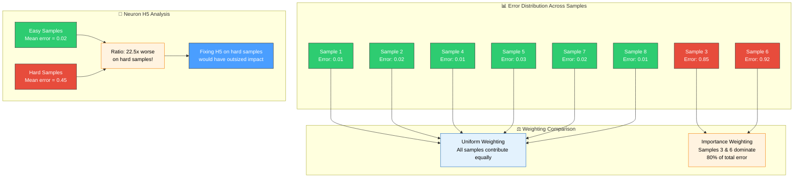
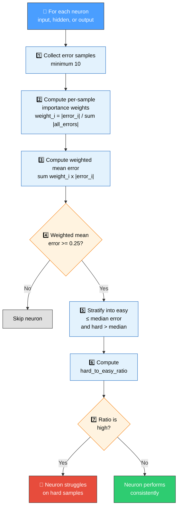
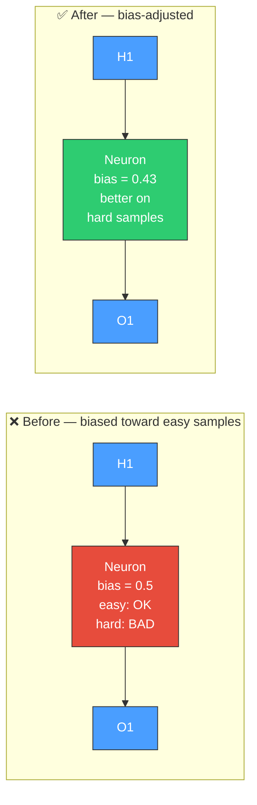

# ⚖️ Sample-Weighted Discovery

[Back to Discovery Index](README.md) | **Source:** [`src/analysis/recommendation/sample_weighted.rs`](../../src/analysis/recommendation/sample_weighted.rs) | **Issue:** [#423](https://github.com/stSoftwareAU/NEAT-AI-Discovery/issues/423)

---

## 🔍 The Problem

Standard discovery treats all training samples equally when evaluating
neurons. But in many real-world problems, a small number of **hard samples**
dominate the creature's total error. Neurons that are mediocre on average
may be terrible on the hardest samples — and fixing those hard-sample
contributions would have the biggest impact on overall score.

**Sample-weighted discovery** re-weights the analysis so neurons contributing
disproportionately to high-error samples receive priority attention.

> [!IMPORTANT]
> Neurons that appear fine under uniform weighting can be the **primary drivers** of poor performance on the hardest samples. Sample-weighted discovery surfaces these hidden contributors.



### ⚠️ Why It Hurts the Creature's Score

- **Hidden contributors**: Neurons may look fine on average but fail badly
  on the samples that matter most.
- **Missed optimisation**: Equal weighting dilutes the signal from
  high-error samples, making it harder to identify the real problems.
- **Robustness gap**: The creature handles easy cases well but collapses
  on difficult inputs.

---

## 🔬 How We Detect It

> [!NOTE]
> A minimum of **10 error samples** is required before sample-weighted analysis is performed. The weighted mean error threshold is **0.25**.



---

## 🛠️ How We Fix It

The fix adjusts the neuron's bias to shift its operating point toward
better performance on high-error samples:



| Candidate | Operation | Detail |
|-----------|-----------|--------|
| **Bias adjustment** | `setBias` | bias += -(weighted_mean_error × 0.1) |

> [!TIP]
> The adjustment is deliberately small (10% of weighted mean error) because NEAT-AI validates through ablation — conservative changes are more likely to pass validation.

Estimated improvement
(`sample_weighted.rs::detect_high_error_neurons`):

```text
min(weighted_mean_error × min(hard_to_easy_ratio, 10) × 0.01, 0.1)
```

> [!IMPORTANT]
> The ratio is clamped at **10** *before* scaling, so a neuron with a ratio of
> 18 contributes no more than one with a ratio of 10. Only the outer `0.1` cap
> was documented previously.

---

## 📝 Example

> **Neuron H12** across 200 samples:
>
> | Metric | Value |
> |--------|-------|
> | Weighted mean error | 0.38 (>= 0.25 threshold) |
> | Easy samples (100) | mean error = 0.04 |
> | Hard samples (100) | mean error = 0.72 |
> | Hard-to-easy ratio | 18.0 |
>
> **Candidate fix:**
>
> | Parameter | Value |
> |-----------|-------|
> | Current bias | 1.2 |
> | Adjustment | -(0.38 × 0.1) = -0.038 |
> | New bias | 1.162 |
> | Estimated improvement | min(0.38 × min(18.0, 10) × 0.01, 0.1) = 0.038 |
>
> **After fix:** The bias shift nudges the neuron's operating point toward
> better handling of hard samples, where most of the creature's error is
> concentrated.

---

## 📚 References

- **Source module**: [`src/analysis/recommendation/sample_weighted.rs`](../../src/analysis/recommendation/sample_weighted.rs)
- **DISCOVERY_TYPES.md**: [Technical reference](../DISCOVERY_TYPES.md)
- **Related**: [Output Bias Drift](output-bias-drift.md) — corrects
  systematic bias in output predictions
- **Related**: [Error Plateau](error-plateau.md) — detects uniformly high
  error at outputs
