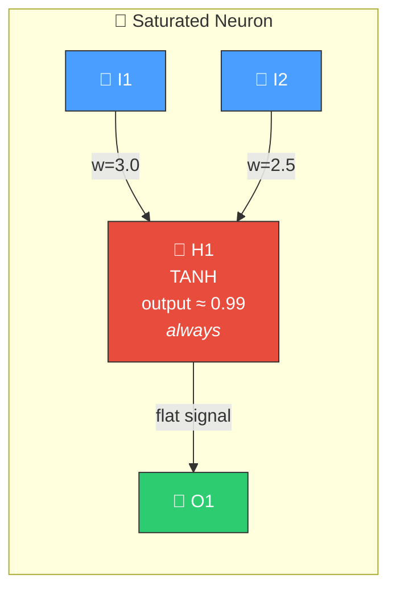
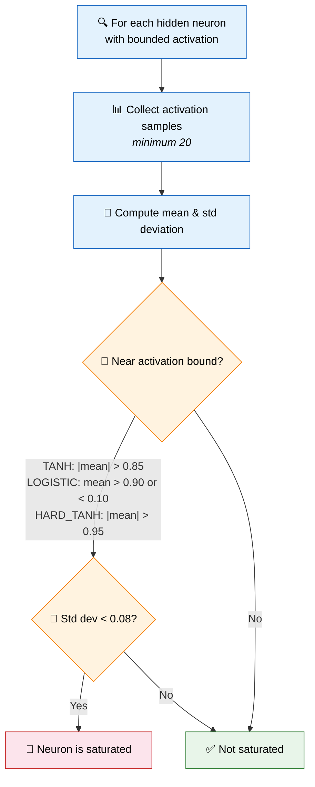
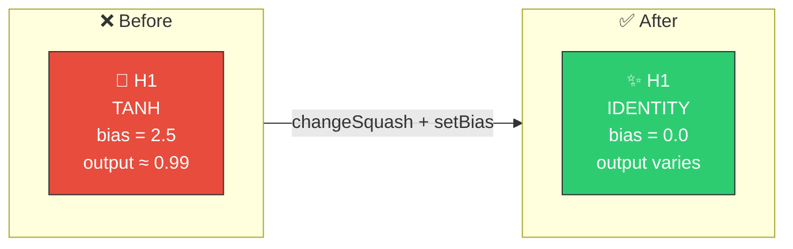
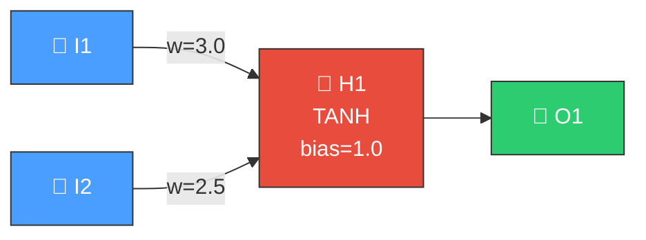

# 🫠 Saturated Neuron Detection

[Back to Discovery Index](README.md) | **Source:** [`src/analysis/detection/saturation.rs`](../../src/analysis/detection/saturation.rs) | **Issue:** [#342](https://github.com/stSoftwareAU/NEAT-AI-Discovery/issues/342)

---

## 🔍 The Problem

A **saturated neuron** is a hidden neuron whose activation is stuck at the
extreme end of its activation function's range. The neuron outputs nearly the
same value for every input, so it cannot transmit useful information to
downstream neurons.

> 🫠 **Stuck at the ceiling!** The neuron is pinned near +1.0 — it outputs the same value regardless of input.

Bounded activation functions like **TANH**, **LOGISTIC**, and **HARD_TANH** have
natural ceilings and floors. When a neuron's weighted input sum pushes it
permanently past the inflection point, the gradient approaches zero and learning
stalls — the classic **vanishing gradient** problem.

### ⚠️ Why It Hurts the Creature's Score

- The neuron becomes effectively **constant**, contributing no input-dependent
  signal.
- Downstream neurons that depend on it receive no useful variation.
- The creature wastes parameters (weights, bias) on a neuron that adds nothing.

---

## 🔬 How We Detect It

A **saturation severity score** (0.0 to 1.0) measures how far past the
threshold the neuron is operating. Higher severity means the neuron is more
firmly stuck.

### 🧊 Special Case: RELU Dead Zone

RELU neurons with both mean and standard deviation near zero are also detected
as a form of saturation — the neuron is stuck at zero.

---

## 🛠️ How We Fix It

The library proposes **coordinated structural candidates** — multiple operations
applied together atomically:

| Candidate | Operation | Purpose |
|-----------|-----------|---------|
| **Primary** | `changeSquash` → IDENTITY + `setBias` → shifted | Replace bounded function with unbounded; reset operating point |
| **Alternative** | `setBias` only | Shift the operating point away from the bound (lower confidence) |
| **RELU dead** | `changeSquash` → IDENTITY + `setBias` → 0.1 | Revive a zero-stuck RELU neuron |

---

## 📝 Example

> H1 receives weighted sum ≈ 6.5 on average.
> TANH(6.5) ≈ 0.9999 → **saturated!**
>
> **Fix:** Change H1 to IDENTITY, shift bias.
> Now H1 passes a linearly scaled signal → output can differentiate inputs ✅

---

## 📚 References

- **Vanishing gradient problem** —
  [Wikipedia](https://en.wikipedia.org/wiki/Vanishing_gradient_problem):
  Classic explanation of why bounded activations lose gradient at extremes.
- **Glorot & Bengio (2010)** —
  *Understanding the difficulty of training deep feedforward neural networks*:
  Demonstrates how activation saturation impedes learning in deep networks.
- **NEAT (NeuroEvolution of Augmenting Topologies)** —
  [Wikipedia](https://en.wikipedia.org/wiki/Neuroevolution_of_augmenting_topologies):
  The evolutionary algorithm framework this library extends.
