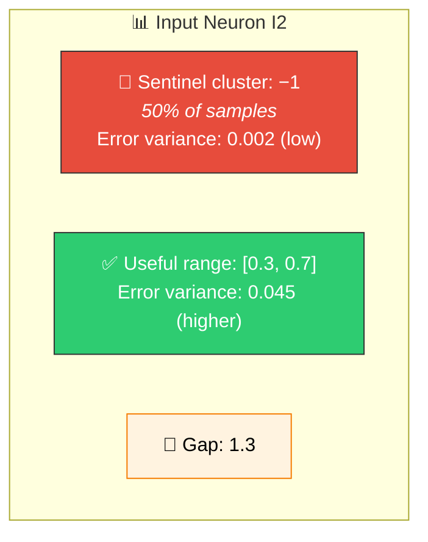
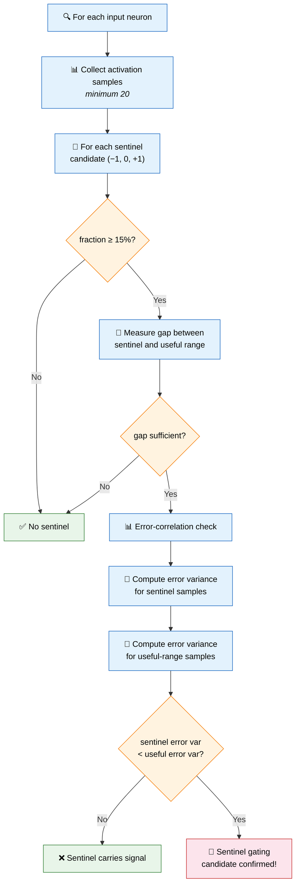
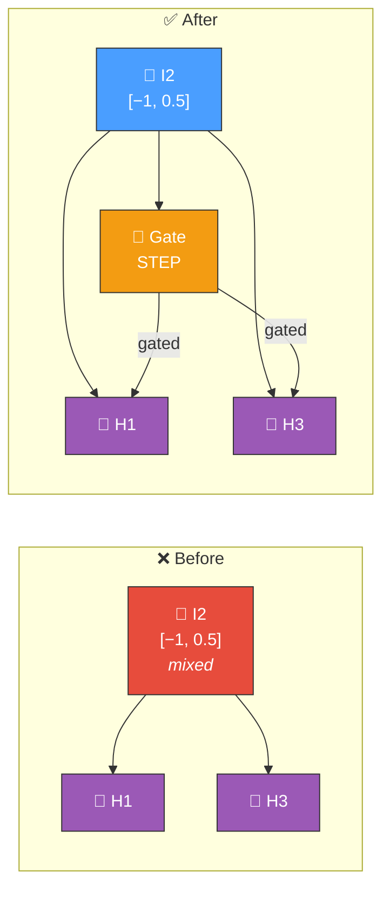

# 🚪 Sentinel Value Gating

[Back to Discovery Index](README.md) | **Source:** [`src/analysis/detection/sentinel_gating.rs`](../../src/analysis/detection/sentinel_gating.rs) | **Issue:** [#400](https://github.com/stSoftwareAU/NEAT-AI-Discovery/issues/400)

---

## 🔍 The Problem

**Sentinel values** are special marker values in input data (typically −1, 0,
or +1) that indicate "missing", "not applicable", or a boundary condition.
When an input neuron's sentinel cluster has lower error variance than the
useful data range, it confirms the sentinel carries no meaningful signal — the
network should learn to **gate it out** rather than treating it as real data.

> 🚪 Sentinel is confirmed noise (low error variance); useful range has real
> information (higher error variance).

### ⚠️ Why It Hurts the Creature's Score

- **Signal pollution**: Sentinel values are treated as real data points,
  confusing the neuron's contribution to downstream computations.
- **Averaged weights**: The network learns weights that compromise between
  handling sentinels and handling real values, doing neither optimally.
- **False correlations**: Sentinel values can create spurious statistical
  patterns that mislead other discovery modules.

---

## 🔬 How We Detect It

### 🔑 Key Difference from Bounded Range

[Bounded range detection](bounded-range.md) works on both input and hidden
neurons but does not verify error correlation. Sentinel gating is restricted
to input neurons and adds the error-variance check, providing higher
confidence that the sentinel truly carries no signal.

---

## 🛠️ How We Fix It

The fix adds a **STEP gating neuron** that produces binary output — 0 for
sentinel values, 1 for useful values — and wires it to all downstream
targets of the input:

> Gate outputs **0** for sentinel, **1** for useful data. 🚪

| Candidate | Operations | Detail |
|-----------|-----------|--------|
| **Add gating neuron** | `addNeuron` + `addSynapse` (input → gate) + `addSynapse` (gate → each target) | STEP gate that separates sentinel from useful data |

The gate neuron's synapses to downstream targets preserve the original
synapse weights.

---

## 📝 Example

> Input neuron I7 has 1000 samples:
> - 280 samples (28%) at value = 0.0 (sentinel for "off")
> - 720 samples in range [0.2, 0.9] (useful data)
>
> | Cluster | Error Variance | Interpretation |
> |---------|---------------|----------------|
> | Sentinel (0.0) | 0.003 | Low — no signal ❌ |
> | Useful [0.2, 0.9] | 0.042 | Higher — real signal ✅ |
>
> → Sentinel error variance < useful → confirmed no-signal sentinel
>
> I7 feeds: H2 (w=0.6), H5 (w=−0.4)
>
> **Fix:** Add STEP gate neuron
> - Gate receives I7
> - Gate outputs: 0 when I7 ≈ 0 (sentinel), 1 when I7 in [0.2, 0.9]
> - Gate → H2 (w=0.6), Gate → H5 (w=−0.4)
>
> **Result:** Downstream neurons can now distinguish "input is off"
> from "input has a specific value". 🎯

---

## 📚 References

- **Source module**: [`src/analysis/detection/sentinel_gating.rs`](../../src/analysis/detection/sentinel_gating.rs)
- **DISCOVERY_TYPES.md**: [Technical reference](../DISCOVERY_TYPES.md)
- **Related**: [Bounded Range](bounded-range.md) — sentinel detection for
  input and hidden neurons (without error-correlation check)
- **Related**: [Observation Utilisation](observation-utilisation.md) — bias
  compensation for sentinel-dominated inputs
