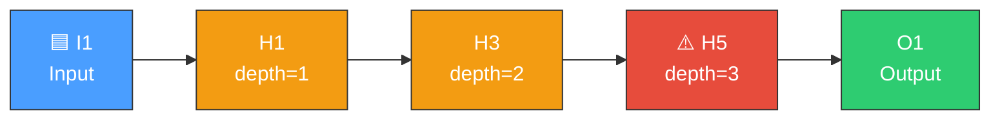
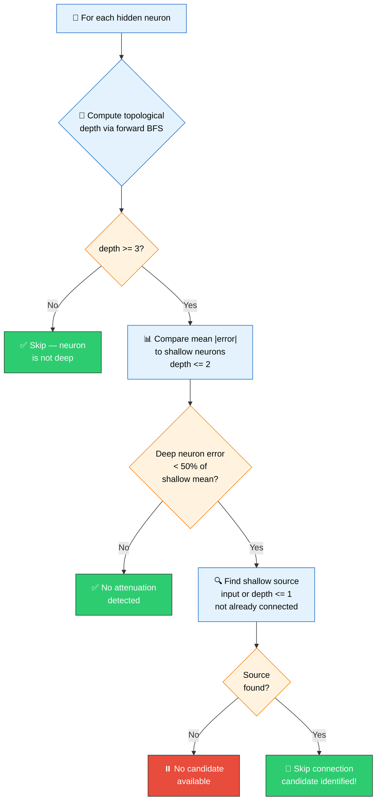
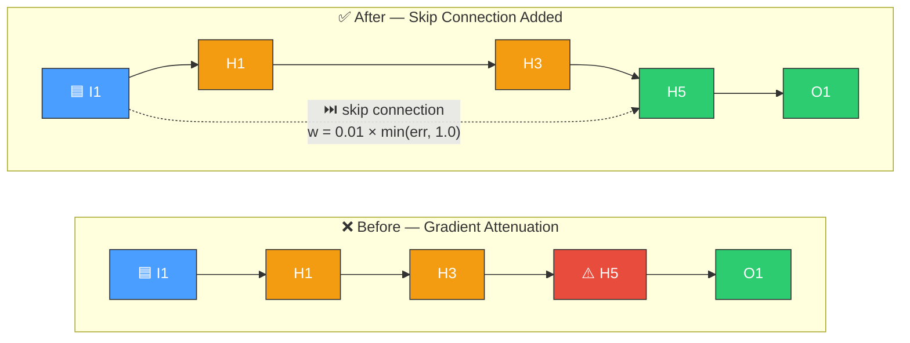

# ⏭️ Skip Connection Discovery

[Back to Discovery Index](README.md) | **Source:** [`src/analysis/detection/skip_connection.rs`](../../src/analysis/detection/skip_connection.rs) | **Issue:** [#570](https://github.com/stSoftwareAU/NEAT-AI-Discovery/issues/570)

---

## 🔍 The Problem

In deep networks, neurons far from the input layer suffer from **gradient
attenuation** — the error signal weakens as it passes back through multiple
layers, leaving deep neurons with little guidance for improvement. A **skip
connection** (also known as a residual connection) adds a direct shortcut
from a shallow neuron to a deep one, restoring the error signal.

> [!WARNING]
> 📉 **Gradient Attenuation Detected!** Neuron H5 at depth >= 3 has a mean |error| of only 30% compared to shallow neurons. The error signal has weakened significantly through the chain.

### ⚠️ Why It Hurts the Creature's Score

- **Weak learning signal**: Deep neurons receive attenuated error gradients,
  slowing their adaptation.
- **Wasted depth**: The creature has evolved a deep topology but cannot
  effectively utilise neurons far from the output.
- **Vanishing gradients**: A well-known problem in deep neural networks
  that skip connections directly address.

> [!NOTE]
> 🧠 Skip connections are inspired by **residual connections (ResNets)** from deep learning, where shortcut paths allow gradients to flow directly to earlier layers.

---

## 🔬 How We Detect It

> [!TIP]
> 🎯 **Detection Summary:** A neuron qualifies for a skip connection when it sits at depth >= 3 **and** its mean |error| is less than 50% of the shallow neuron average — confirming that gradient attenuation is occurring.

### 🔎 Source Selection

The best shallow source is chosen by maximising the depth gap (difference
in topological depth) while ensuring no existing connection exists.

---

## 🛠️ How We Fix It

| Candidate | Operation | Detail |
|-----------|-----------|--------|
| **Add skip connection** | `addSynapse` | Connect shallow source directly to deep neuron |

> [!IMPORTANT]
> ⚖️ The skip connection weight is deliberately conservative:
> `weight = 0.01 × min(target_mean_error, 1.0)` — this avoids destabilising the existing network while still restoring gradient flow.

**Estimated improvement:** `depth_gap × (1 - attenuation_ratio) × 0.005`

---

## 📝 Example

> **Scenario:** A creature has a chain: `I1 → H1 → H2 → H3 → H4 → O1`
>
> | Measurement | Value |
> |---|---|
> | Shallow neurons (depth <= 2) mean \|error\| | **0.15** |
> | Deep neuron H4 (depth = 4) mean \|error\| | **0.04** |
> | Attenuation ratio | 0.04 / 0.15 = **0.27** (< 0.50 threshold) |
>
> ✅ **Gradient attenuation confirmed**
>
> | Parameter | Value |
> |---|---|
> | Best shallow source | **I1** (depth = 0, not connected to H4) |
> | Depth gap | **4** |
>
> 🔧 **Candidate:** Add synapse `I1 → H4`
> - Weight: `0.01 × min(0.04, 1.0)` = **0.0004**
> - Estimated improvement: `4 × (1 - 0.27) × 0.005` = **0.015**
>
> 🎯 **Result:** H4 receives a direct signal from I1, bypassing the attenuating chain of hidden neurons.

---

## 📚 References

- **Source module**: [`src/analysis/detection/skip_connection.rs`](../../src/analysis/detection/skip_connection.rs)
- **DISCOVERY_TYPES.md**: [Technical reference](../DISCOVERY_TYPES.md)
- **Related**: [Topology Diversification](topology-diversification.md) —
  adds hidden neurons to flat (depth-0) paths
- **Related**: [Multi-Hop](multi-hop.md) — builds indirect connection paths
- **Residual connections (ResNets)** —
  [Wikipedia](https://en.wikipedia.org/wiki/Residual_neural_network):
  The skip connection concept from deep learning that inspired this module.
