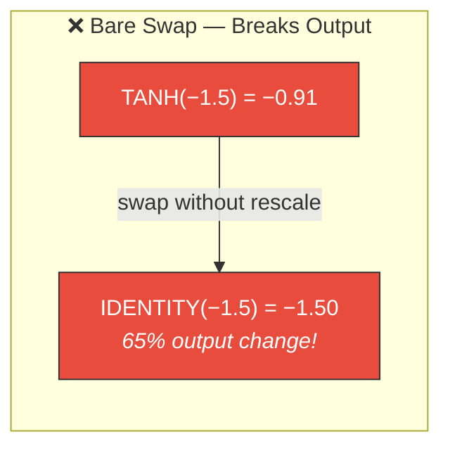
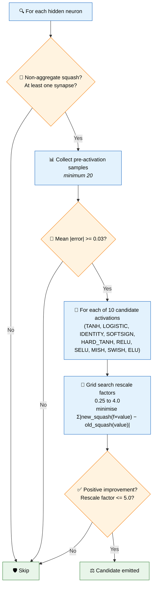
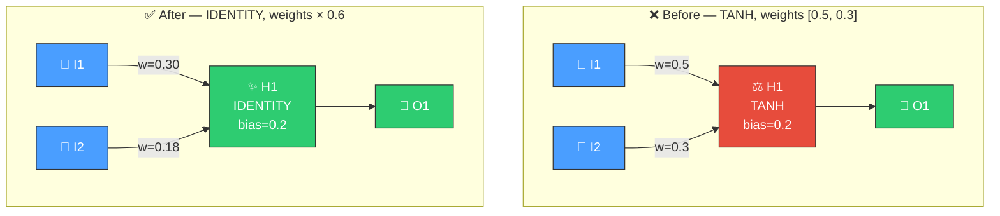

# ⚖️ Squash + Weight Rescale

[Back to Discovery Index](README.md) | **Source:** [`src/analysis/detection/squash_weight_rescale.rs`](../../src/analysis/detection/squash_weight_rescale.rs) | **Issue:** [#548](https://github.com/stSoftwareAU/NEAT-AI-Discovery/issues/548)

---

## 🔍 The Problem

When a neuron needs a different activation function, simply swapping the
squash can be destructive — the new function may interpret the same
pre-activation values completely differently, breaking downstream
expectations. A **coordinated squash change with weight rescaling** finds
the optimal rescale factor so the new activation best approximates the old
one's output, then bundles both changes atomically.

> ⚖️ **Bare squash swap = breakage!** Downstream neurons expect ≈ −0.91 but now receive −1.50. Coordinated rescaling keeps the output stable.

### ⚠️ Why It Hurts Without Rescaling

- **Output discontinuity**: A bare squash swap changes the neuron's output
  distribution instantly, invalidating all downstream weight calibrations.
- **Cascade disruption**: Every neuron downstream of the changed neuron
  receives unexpected input magnitudes.
- **Wasted mutation**: The squash change might be beneficial, but the
  disruption masks the improvement — NEAT-AI's ablation test fails.

---

## 🔬 How We Detect It

### 🚀 Why Coordinated Is Better

The improvement estimate for a coordinated squash+rescale candidate is
boosted by **1.5×** compared to a standalone squash change, because the weight
adjustment preserves output compatibility.

---

## 🛠️ How We Fix It

> Output stays approximately the same, but now IDENTITY provides unbounded range for learning.

| Candidate | Operations | Detail |
|-----------|-----------|--------|
| **Squash + rescale** | `changeSquash` + `setWeight` (per synapse) | Atomic group: change activation and rescale all incoming weights |

The weight rescaling is only applied when the rescale factor deviates from
1.0 by at least 0.05 (to avoid trivial adjustments).

---

## 📝 Example

> **Neuron H9:** LOGISTIC, bias=1.2, mean |error|=0.08
> Incoming synapses: 3 (weights: 0.8, −0.4, 0.6)
>
> **Grid search results:**
>
> | Candidate | Rescale Factor | Error Reduction |
> |-----------|---------------|----------------|
> | TANH | 0.45 | 0.012 |
> | **IDENTITY** | **0.35** | **0.018** ← best |
> | RELU | 0.50 | 0.009 |
>
> **Candidate:** Change to IDENTITY, rescale weights by 0.35
> New weights: 0.28, −0.14, 0.21
> Estimated improvement: 0.018 × 1.5 = **0.027** (coordinated boost)
>
> The new IDENTITY activation provides the same approximate output
> as LOGISTIC on the observed data, but with room to grow beyond
> the [0, 1] bound ✅

---

## 📚 References

- **Source module**: [`src/analysis/detection/squash_weight_rescale.rs`](../../src/analysis/detection/squash_weight_rescale.rs)
- **DISCOVERY_TYPES.md**: [Technical reference](../DISCOVERY_TYPES.md)
- **Related**: [Activation Recommendation](activation-recommendation.md) —
  proactive squash suggestions based on input distribution
- **Related**: [Saturated Neuron](saturated-neuron.md) — detects neurons
  stuck at activation bounds
