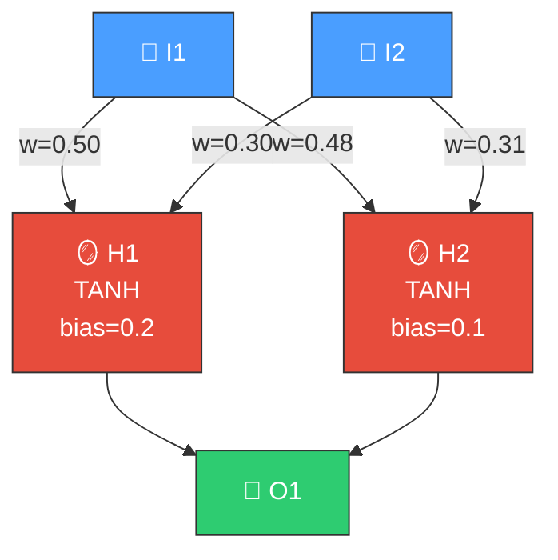
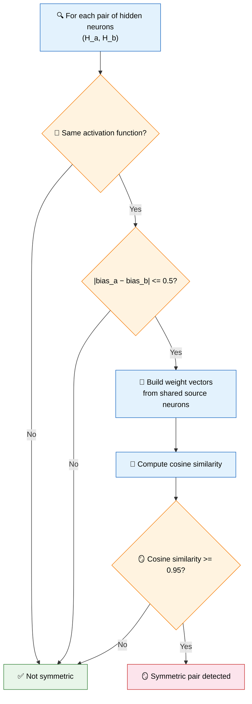
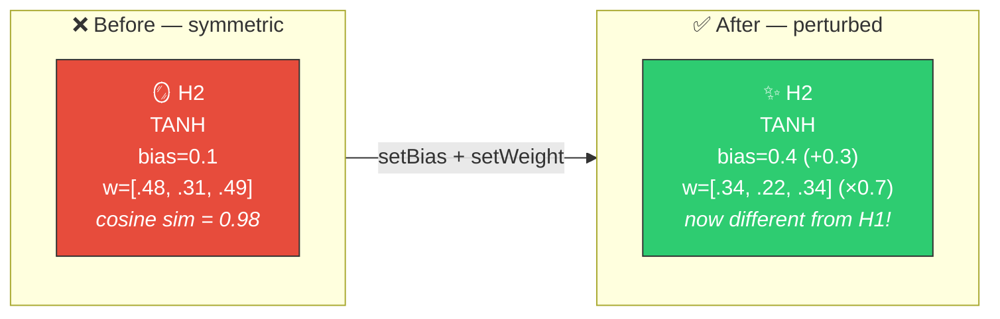

# 🪞 Symmetry Breaking Detection

[Back to Discovery Index](README.md) | **Source:** [`src/analysis/detection/symmetry_breaking.rs`](../../src/analysis/detection/symmetry_breaking.rs) | **Issue:** [#569](https://github.com/stSoftwareAU/NEAT-AI-Discovery/issues/569)

---

## 🔍 The Problem

**Symmetry** in a neural network occurs when two hidden neurons have converged
to near-identical weight configurations — the same activation function, similar
biases, and highly similar incoming weight vectors. These neurons compute
essentially the same function, wasting representational capacity.

Unlike [co-adaptation](co-adaptation.md) (which detects correlated
*activations*), symmetry breaking detects structural similarity in *weights*
— the neurons are configured identically regardless of whether correlations
show up in the current training data.

> 🪞 **Mirror neurons!** Cosine similarity ≥ 0.95 — H1 and H2 compute essentially the same function, wasting a neuron slot.

### ⚠️ Why It Hurts the Creature's Score

- **Redundant computation**: Two neurons computing the same transformation.
- **Blocked learning**: Gradient updates affect both neurons similarly,
  preventing them from diverging through normal training.
- **Complexity cost**: NEAT's cost of growth penalises the extra neuron
  and its synapses without any benefit.

---

## 🔬 How We Detect It

Requires at least 2 hidden neurons in the network.

---

## 🛠️ How We Fix It

Rather than removing one neuron (which would be destructive), the fix
**perturbs** one neuron's weights and bias to break the symmetry, giving
it a chance to specialise on a different function:

| Candidate | Operations | Detail |
|-----------|-----------|--------|
| **Perturb neuron B** | `setBias` + `setWeight` (per synapse) | Shift bias by +0.3, scale all incoming weights by 0.7 |

The perturbation is deliberately conservative — enough to break the symmetry
but not so large as to destroy the neuron's learned contribution.

---

## 📝 Example

> A creature has 20 hidden neurons. Discovery finds:
>
> | Neuron | Activation | Bias | Weights from I1, I2, I3 |
> |--------|-----------|------|------------------------|
> | H4 | TANH | 0.15 | [0.6, −0.2, 0.8] |
> | H12 | TANH | 0.10 | [0.58, −0.19, 0.81] |
>
> |bias difference| = 0.05 (< 0.5 threshold)
> Cosine similarity = 0.998 (>= 0.95 threshold)
>
> **Candidate:** Perturb H12
> New bias: 0.10 + 0.30 = **0.40**
> New weights: [0.41, −0.13, 0.57] (×0.7)
>
> **After fix:** H12 now computes a different function,
> freeing up capacity to learn new patterns ✅

---

## 📚 References

- **Source module**: [`src/analysis/detection/symmetry_breaking.rs`](../../src/analysis/detection/symmetry_breaking.rs)
- **DISCOVERY_TYPES.md**: [Technical reference](../DISCOVERY_TYPES.md)
- **Related**: [Co-Adaptation](co-adaptation.md) — detects correlated
  activations (behavioural similarity)
- **Related**: [Redundant Path](redundant-path.md) — detects duplicate
  signal paths feeding the same target
